# Athena

Adding and configuring an Amazon Athena connection within Qualytics empowers the platform to build a symbolic link with your schema to perform operations like data discovery, visualization, reporting, syncing, profiling, scanning, anomaly surveillance, and more.

This documentation provides a step-by-step guide on adding Athena as a source datastore in Qualytics. It covers the entire process, from initial connection setup to testing and finalizing the configuration.

By following these instructions, enterprises can ensure their Athena environment is properly connected with Qualytics, unlocking the platform's potential to help you proactively manage your full data quality lifecycle.

Let's get started 🚀

## Athena Setup Guide

Qualytics connects to Athena through the **Simba Athena JDBC driver** — it makes no direct AWS SDK calls of its own. All AWS API interactions (Athena, Glue, S3) happen inside the driver using the credentials you provide in the connection form.

### Minimum Athena Permissions

| Permission                      | Purpose                                                                                          |
|---------------------------------|--------------------------------------------------------------------------------------------------|
| `athena:StartQueryExecution`    | Submit queries                                                                                   |
| `athena:StopQueryExecution`     | Cancel running queries                                                                           |
| `athena:GetQueryExecution`      | Poll query status                                                                                |
| `athena:GetQueryResults`        | Fetch result rows (used directly by the JDBC driver via `ResultFetcher=GetQueryResults`)         |
| `athena:ListDatabases`          | Discover schemas                                                                                 |
| `athena:ListTableMetadata`      | Discover tables and columns                                                                      |
| `athena:GetTableMetadata`       | Read column definitions                                                                          |
| `athena:GetWorkGroup`           | Validate the workgroup configuration                                                             |

### Minimum Glue Permissions (Read-Only)

Athena delegates all catalog and schema metadata to AWS Glue. Only read permissions are needed — Qualytics never creates, modifies, or deletes catalog objects.

| Permission                                                          | Purpose                                      |
|---------------------------------------------------------------------|----------------------------------------------|
| `glue:GetDatabase` / `glue:GetDatabases`                           | Read database metadata                       |
| `glue:GetCatalog` / `glue:GetCatalogs`                             | Read catalog metadata                        |
| `glue:GetTable` / `glue:GetTables`                                 | Read table and column definitions             |
| `glue:GetPartition` / `glue:GetPartitions` / `glue:BatchGetPartition` | Read partition metadata for query planning |

### Minimum S3 Permissions (Query Result Output Location)

The **S3 Output Location** field in the connection form (`s3://<bucket>/<prefix>/`) requires read and write access on that bucket path. The bucket must already exist — Qualytics does not create buckets.

| Permission                       | Resource                                | Purpose                                                                      |
|----------------------------------|-----------------------------------------|------------------------------------------------------------------------------|
| `s3:PutObject`                   | `arn:aws:s3:::<bucket>/<prefix>/*`      | Write query result files                                                     |
| `s3:GetObject`                   | `arn:aws:s3:::<bucket>/<prefix>/*`      | Read result files back                                                       |
| `s3:ListBucket`                  | `arn:aws:s3:::<bucket>`                 | List result files                                                            |
| `s3:GetBucketLocation`           | `arn:aws:s3:::<bucket>`                 | Validate bucket region                                                       |
| `s3:ListBucketMultipartUploads`  | `arn:aws:s3:::<bucket>`                 | Track in-progress multipart uploads (used by JDBC driver for large result sets) |
| `s3:ListMultipartUploadParts`    | `arn:aws:s3:::<bucket>/<prefix>/*`      | List parts of an in-progress upload                                          |
| `s3:AbortMultipartUpload`        | `arn:aws:s3:::<bucket>/<prefix>/*`      | Clean up incomplete multipart uploads                                        |

!!! note
    If your Glue catalog is governed by **AWS Lake Formation**, also add `lakeformation:GetDataAccess` on `"*"`. Athena requests this permission transparently on every query against Lake Formation–managed tables.

### Example IAM Policy

Replace `<YOUR_BUCKET>` and `<YOUR_PREFIX>` with the bucket name and path prefix configured in the **S3 Output Location** field.

```json
{
  "Version": "2012-10-17",
  "Statement": [
    {
      "Sid": "AthenaQueryAccess",
      "Effect": "Allow",
      "Action": [
        "athena:StartQueryExecution",
        "athena:StopQueryExecution",
        "athena:GetQueryExecution",
        "athena:GetQueryResults",
        "athena:ListDatabases",
        "athena:ListTableMetadata",
        "athena:GetTableMetadata",
        "athena:GetWorkGroup"
      ],
      "Resource": "*"
    },
    {
      "Sid": "GlueCatalogReadOnly",
      "Effect": "Allow",
      "Action": [
        "glue:GetDatabase",
        "glue:GetDatabases",
        "glue:GetCatalog",
        "glue:GetCatalogs",
        "glue:GetTable",
        "glue:GetTables",
        "glue:GetPartition",
        "glue:GetPartitions",
        "glue:BatchGetPartition"
      ],
      "Resource": "*"
    },
    {
      "Sid": "S3QueryResultsBucket",
      "Effect": "Allow",
      "Action": [
        "s3:PutObject",
        "s3:GetObject",
        "s3:ListBucket",
        "s3:GetBucketLocation",
        "s3:ListBucketMultipartUploads",
        "s3:ListMultipartUploadParts",
        "s3:AbortMultipartUpload"
      ],
      "Resource": [
        "arn:aws:s3:::<YOUR_BUCKET>",
        "arn:aws:s3:::<YOUR_BUCKET>/<YOUR_PREFIX>/*"
      ]
    }
  ]
}
```

!!! tip
    If you use a named Athena workgroup, scope the Athena actions to `arn:aws:athena:<region>:<account-id>:workgroup/<workgroup-name>` instead of `"*"` for tighter least-privilege access.

### Troubleshooting Common Errors

| Error                            | Likely Cause                          | Fix                                    |
|----------------------------------|---------------------------------------|----------------------------------------|
| `AccessDenied`                   | The IAM identity is missing one or more of the permissions listed above | Add the missing permission to the policy and re-test the connection |
| `Output location is not valid`   | The S3 bucket does not exist, the path is malformed, or the bucket is in a different region than your Athena workgroup | Verify the bucket name, prefix format (`s3://bucket/prefix/`), and that the bucket region matches the Athena region |
| `The request signature we calculated does not match the signature you provided` | AWS credentials are invalid or incomplete — mismatched access key / secret key pair, or a temporary credential is missing its session token | Double-check the Access Key ID and Secret Access Key; if using temporary credentials (STS / assumed role), ensure the session token field is also provided |

### Detailed Troubleshooting Notes

#### Signature Mismatch Errors

The error `The request signature we calculated does not match the signature you provided` is an **AWS authentication/signing failure** — it is not a permissions or S3 configuration issue. AWS rejects the request before any permission checks are evaluated because the cryptographic signature computed from your credentials does not match what AWS expects.

Common causes:

- **Mismatched access key / secret key pair** — the Access Key ID and Secret Access Key do not belong to the same IAM identity.
- **Incorrectly copied secret key** — an extra space, trailing newline, or truncated character was introduced when pasting the secret key into the connection form.
- **Rotated or expired credentials** — the access key has been deactivated or replaced since the connection was originally configured.
- **Temporary credentials (STS / SSO) without a session token** — if the IAM identity uses assumed-role or SSO credentials, a session token is required alongside the access key and secret key. Omitting it produces a signature mismatch, not an explicit "missing token" error.

!!! note
    This error occurs at the AWS request-signing layer, **before** any IAM permission policies are evaluated. If you see this error, focus on validating the credentials themselves rather than adjusting IAM policies.

#### S3 Output Location Issues

The error `Output location is not valid` indicates a problem with the S3 bucket configured in the **S3 Output Location** field, not with Athena or Glue permissions.

Common causes:

- **Incorrect bucket name** — a typo, missing hyphen, or wrong account bucket name.
- **Invalid path format** — the value must follow the format `s3://bucket/prefix/`. A missing `s3://` scheme or trailing slash can cause validation to fail.
- **Bucket does not exist** — the specified bucket has not been created or was deleted.
- **Region mismatch** — the S3 bucket is in a different AWS region than the Athena workgroup. Athena requires the output bucket to be in the same region.

!!! tip
    You can verify the bucket exists and check its region by running `aws s3api get-bucket-location --bucket <YOUR_BUCKET>` in the AWS CLI.

#### Permission-Related Errors

The error `AccessDenied` means the IAM identity authenticated successfully but lacks one or more of the required permissions listed in the [Minimum Athena Permissions](#minimum-athena-permissions), [Minimum Glue Permissions](#minimum-glue-permissions-read-only), or [Minimum S3 Permissions](#minimum-s3-permissions-query-result-output-location) tables above.

To resolve:

- Review the IAM policy attached to the user or role and compare it against the [Example IAM Policy](#example-iam-policy).
- Use **AWS CloudTrail** to identify the exact API call that was denied — the CloudTrail event will show the specific action and resource that triggered the `AccessDenied` response.
- If using **AWS Lake Formation**, ensure `lakeformation:GetDataAccess` is also granted.

#### General Debugging Guidance

When diagnosing connection failures, the error message itself indicates which category of issue to investigate:

| Error Pattern | Category | Where to Look |
|---------------|----------|---------------|
| `The request signature we calculated does not match...` | Credentials | Verify the Access Key ID, Secret Access Key, and session token (if applicable) are correct and active |
| `AccessDenied` | IAM Permissions | Compare the attached IAM policy against the minimum permissions tables and use CloudTrail to identify the denied action |
| `Output location is not valid` | S3 Configuration | Confirm the bucket name, path format (`s3://bucket/prefix/`), existence, and region alignment with Athena |

!!! tip
    Start by confirming credentials are valid (signature errors), then verify IAM permissions (access denied errors), and finally check S3 configuration (output location errors). This order mirrors the sequence AWS evaluates requests: authenticate first, authorize second, then execute.

## Add the Source Datastore

A source datastore is a storage location used to connect to and access data from external sources. Athena is an example of such a datastore, specifically a type of JDBC datastore that supports connectivity through the JDBC API. Configuring the Athena datastore allows the Qualytics platform to access and perform operations on the data, thereby generating valuable insights.

**Step 1**: Log in to your Qualytics account and click on the **Add Source Datastore** button located at the top-right corner of the interface.


**Step 2**: A modal window - **Add Datastore** will appear, providing you with the options to connect a datastore.

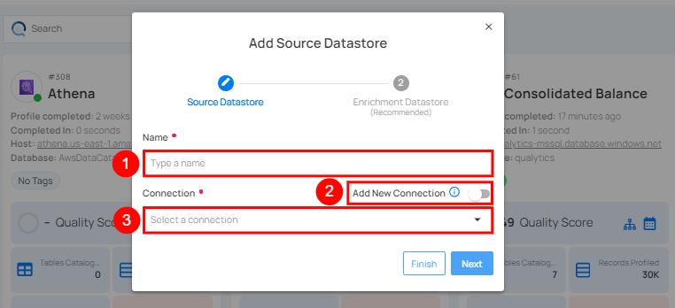

| REF.              | FIELDS       | ACTIONS                                    |
|-------------------|--------------|--------------------------------------------|
| 1.                | Name         | Specify the name of the datastore (e.g., The specified name will appear on the datastore cards). |
| 2.                | Toggle Button    | Toggle **ON** to create a new source datastore from scratch, or toggle **OFF** to reuse credentials from an existing connection. |
| 3.                | Connector        | Select **Athena** from the dropdown list. |

### Option I: Create a Datastore with a new Connection

If the toggle for **Add New Connection** is turned on, then this will prompt you to add and configure the source datastore from scratch without using existing connection details.

**Step 1**: Select the **Athena** connector from the dropdown list and add connection properties such as Secrets Management, host, port, username, and password, along with datastore properties like catalog, database, etc.

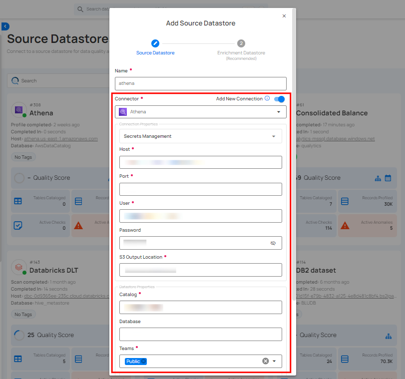

**Secrets Management**: This is an optional connection property that allows you to securely store and manage credentials by integrating with HashiCorp Vault and other secret management systems. Toggle it **ON** to enable Vault integration for managing secrets.

!!! note
    After configuring **HashiCorp Vault** integration, you can use ${key} in any Connection property to reference a key from the configured Vault secret. Each time the Connection is initiated, the corresponding secret value will be retrieved dynamically.

| REF. | FIELDS               | ACTIONS                                                                 |
|------|----------------------|-------------------------------------------------------------------------|
| 1.  | Login URL            | Enter the URL used to authenticate with HashiCorp Vault.                |
| 2.  | Credentials Payload  | Input a valid JSON containing credentials for Vault authentication.     |
| 3.  | Token JSONPath       | Specify the JSONPath to retrieve the client authentication token from the response (e.g., $.auth.client_token). |
| 4.  | Secret URL           | Enter the URL where the secret is stored in Vault.                      |
| 5.  | Token Header Name    | Set the header name used for the authentication token (e.g., X-Vault-Token). |
| 6.  | Data JSONPath        | Specify the JSONPath to retrieve the secret data (e.g., $.data).        |

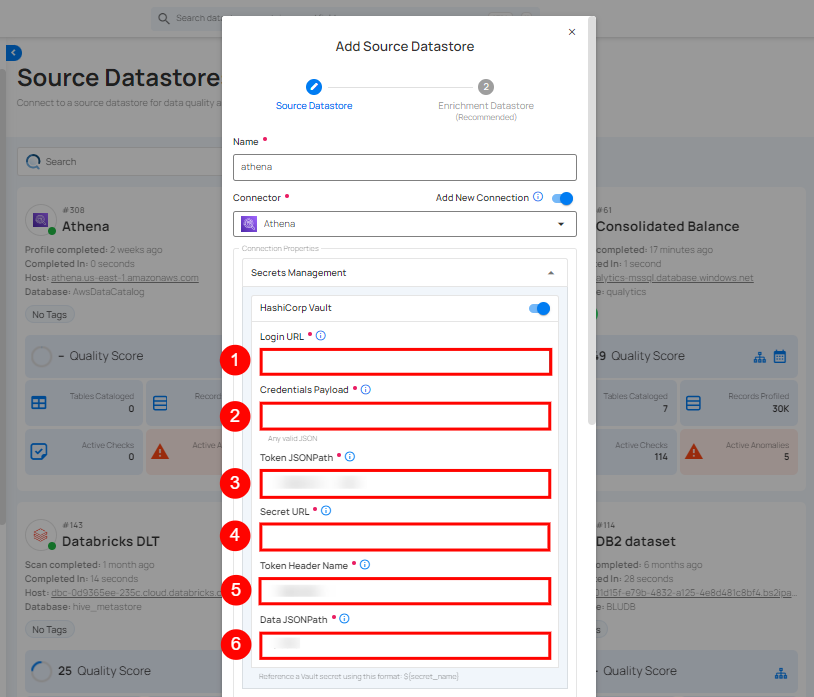

**Step 2**: The configuration form, requesting credential details before establishing the connection.

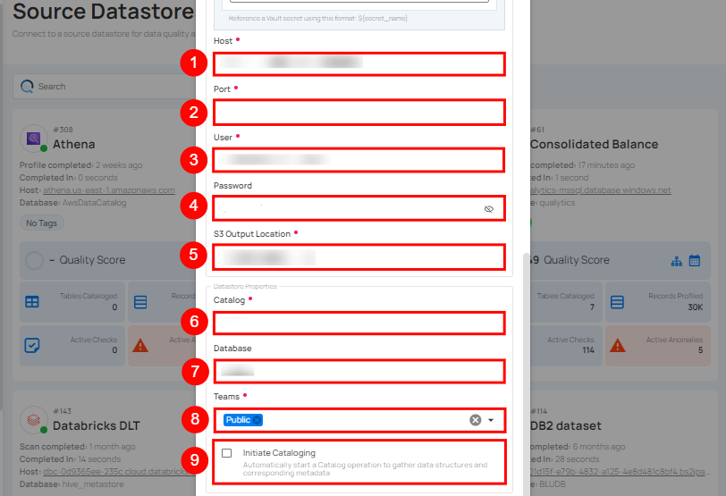

| REF.              | FIELDS       | ACTIONS                                    |
|-------------------|--------------|--------------------------------------------|
| 1.                | Host         | Get **Hostname** from your Athena account and add it to this field. |
| 2.                | Port         | Specify the **Port** number. |
| 3.                | User         | Enter the **User ID** to connect. |
| 4.                | Password     | Enter the **password** to connect to the database. |
| 5.                | S3 Output Location   | Define the S3 bucket location where the output will be stored. This is specific to AWS Athena and specifies where query results are saved. |
| 6.                | Catalog      | Enter the catalog name. In AWS Athena, this refers to the data catalog that contains database and table metadata. |
| 7.                | Database     | Specify the database name. |
| 8.                | Teams        | Select one or more teams from the dropdown to associate with this source datastore. |
| 9.                | Initiate Sync  | Tick the checkbox to automatically perform sync operation on the configured source datastore to detect new, changed, or removed containers and fields. |

**Step 3**: After adding the source datastore details, click on the **Test Connection** button to check and verify its connection.

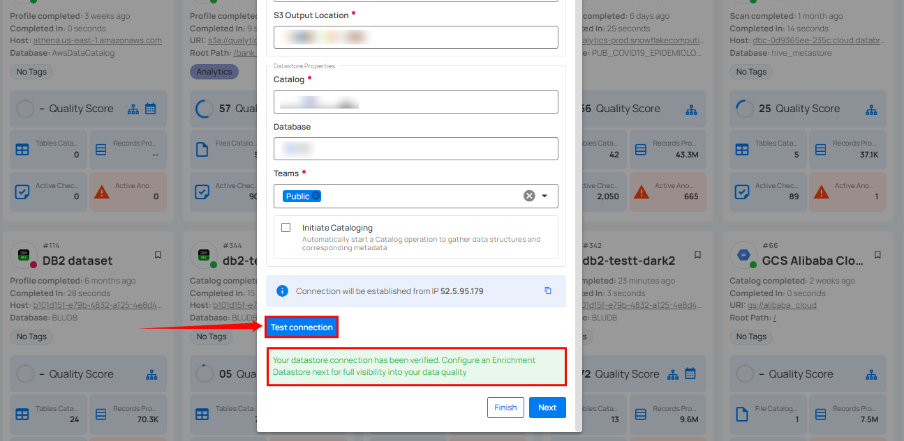

If the credentials and provided details are verified, a success message will be displayed indicating that the connection has been verified.

### Option II: Use an Existing Connection

If the toggle for **Add New connection** is turned off, then this will prompt you to configure the source datastore using the existing connection details.

**Step 1**: Select a **connection** to reuse existing credentials.

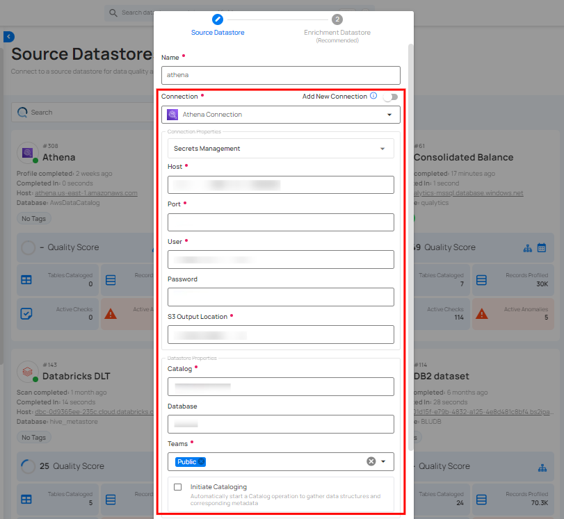

!!! note
    If you are using existing credentials, you can only edit the details such as **Catalog**, **Database**, **Teams**, and **Initiate Sync**.

**Step 2**: Click on the **Test Connection** button to check and verify the source data connection. If connection details are verified, a success message will be displayed.


!!! note
    Clicking on the **Finish** button will create the source datastore and bypass the **enrichment datastore** configuration step.

!!! tip
    Click on the **Next** button, which will take you to the **enrichment datastore** configuration page.

## Add Enrichment Datastore

After successfully testing and verifying your source datastore connection, you have the option to add an enrichment datastore (recommended). This datastore is used to store analyzed results, including any anomalies and additional metadata in tables. This setup provides comprehensive visibility into your data quality, enabling you to manage and improve it effectively.

!!! warning
    Qualytics does not support the Athena connector as an enrichment datastore, but you can point to a different enrichment datastore.

**Step 1**: Whether you have added a source datastore by creating a new datastore connection or using an existing connection, click on the **Next** button to start adding the **Enrichment Datastore**.

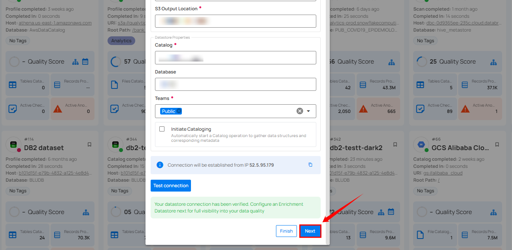

**Step 2**: A modal window - **Link Enrichment Datastore** will appear, providing you with the options to configure an **enrichment datastore**.

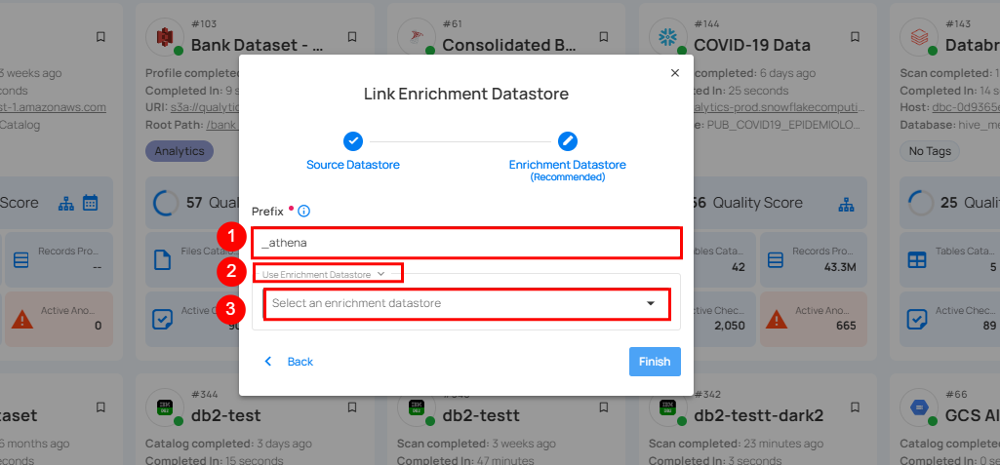

| REF.              | FIELDS       | ACTIONS                                    |
|-------------------|--------------|--------------------------------------------|
| 1.                | Prefix       | Add a prefix name to uniquely identify tables/files when Qualytics writes metadata from the source datastore to your enrichment datastore. |
| 2.                | Caret Down Button   | Click the caret down to select either **Use Enrichment Datastore** or **Add Enrichment Datastore**.|
| 3.                | Enrichment Datastore         | Select an enrichment datastore from the dropdown list. |

### Option I: Create an Enrichment Datastore with a new Connection

If the toggle for **Add New Connection** is turned on, then this will prompt you to add and configure the enrichment datastore from scratch without using an existing enrichment datastore and its connection details.

**Step 1**: Click on the caret button and select **Add Enrichment Datastore**.

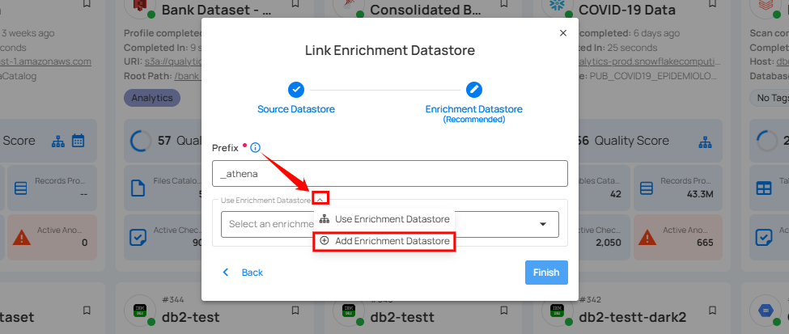

A modal window **Link Enrichment Datastore** will appear. Enter the following details to create an enrichment datastore with a new connection.

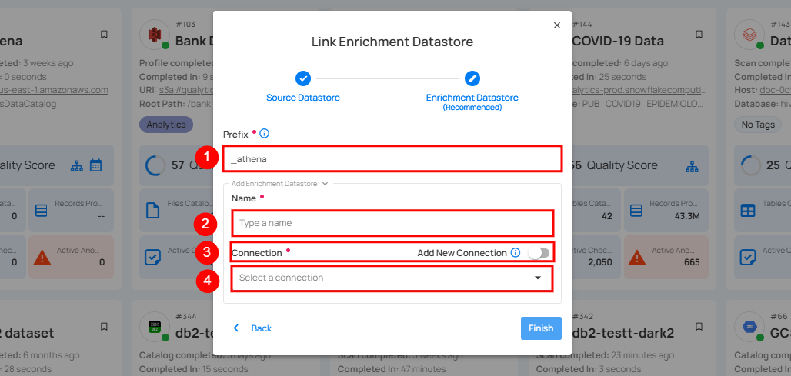

| REF.              | FIELDS       | ACTIONS                                    |
|-------------------|--------------|--------------------------------------------|
| 1.                | Prefix       | Add a prefix name to uniquely identify tables/files when Qualytics writes metadata from the source datastore to your enrichment datastore. |
| 2.                | Name   | Give a name for the enrichment datastore.|
| 3.                | Toggle Button for Add New Connection | Toggle ON to create a new enrichment from scratch or toggle OFF to reuse credentials from an existing connection. |
| 4.                | Connector | Select a datastore connector from the dropdown list.|

**Step 2**: Add connection details for your selected **enrichment datastore** connector.

!!! note
    Qualytics does not support Athena as an enrichment datastore. Instead, you can select a different enrichment datastore for this purpose. For demonstration purposes, we are using BigQuery as the enrichment datastore. You can use any other JDBC or DFS datastore of your choice for the enrichment datastore configuration.

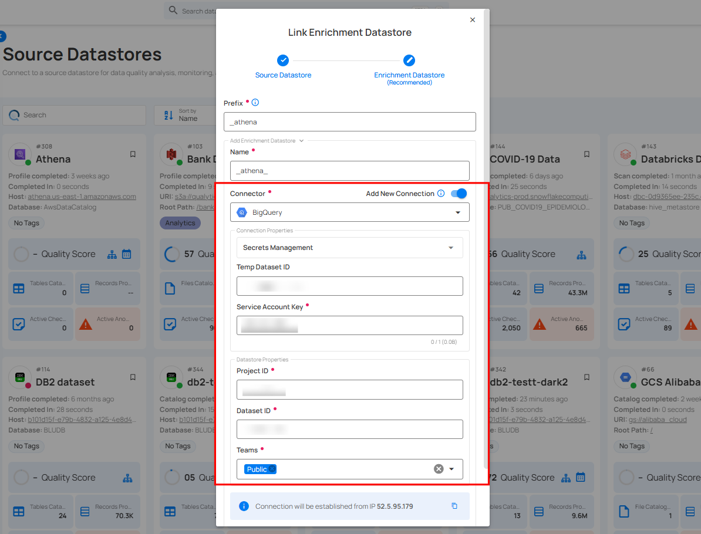

**Step 3**: Click on the **Test Connection** button to verify the selected enrichment datastore connection.

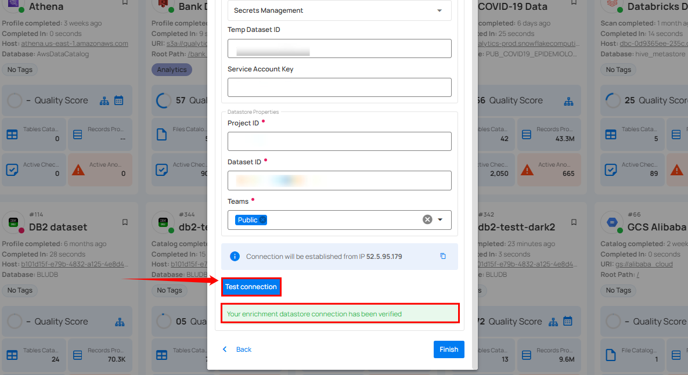

If the connection is verified, a flash message will indicate that the connection with the datastore has been successfully verified.

**Step 4**: Click on the **Finish** button to complete the configuration process.

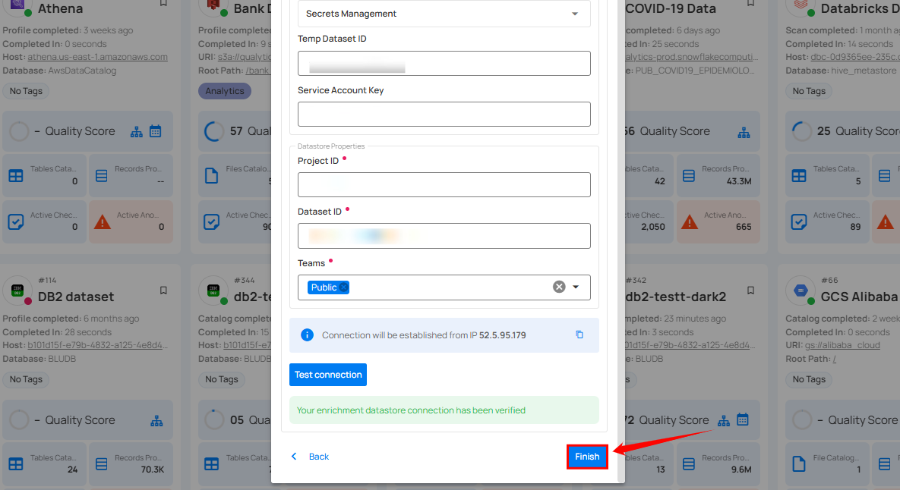

When the configuration process is finished, a success notification appears on the screen indicating that the datastore was added successfully.

**Step 5**: Close the success dialog and the page will automatically redirect you to the **Source Datastore Details** page where you can perform data operations on your configured **source datastore**.


### Option II: Use an Existing Connection

If the toggle for **Use an existing enrichment datastore** is turned on, you will be prompted to configure the enrichment datastore using existing connection details.

**Step 1**: Click on the caret button and select **Use Enrichment Datastore**.

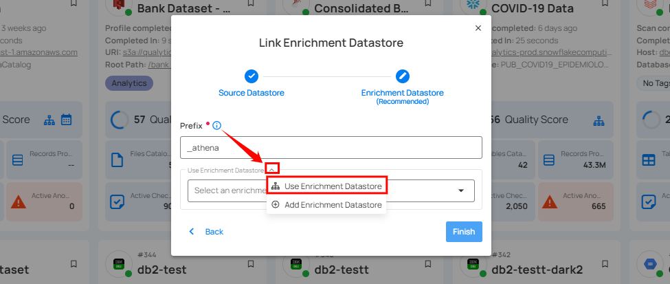

**Step 2**: A modal window **Link Enrichment Datastore** will appear. Add a prefix name and select an existing enrichment datastore from the dropdown list.

!!! note
    Qualytics does not support Athena as an enrichment datastore. Instead, you can select a different enrichment datastore for this purpose. For demonstration purposes, we are using BigQuery as the enrichment datastore. You can use any other JDBC or DFS datastore of your choice for the enrichment datastore configuration.

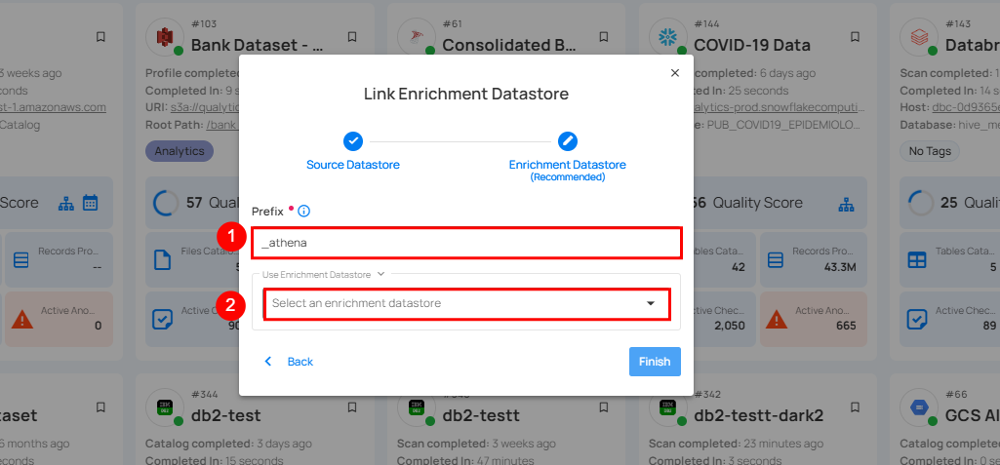

| REF.              | FIELDS       | ACTIONS                                    |
|-------------------|--------------|--------------------------------------------|
| 1.                | Prefix       | Add a prefix name to uniquely identify tables/files when Qualytics writes metadata from the source datastore to your enrichment datastore. |
| 2.                | Enrichment Datastore  | Select an enrichment datastore from the dropdown list. |

**Step 3**: After selecting an existing **enrichment datastore** connection, you will view the following details related to the selected enrichment:

- **Teams**: The team associated with managing the enrichment datastore is based on the role of public or private. Example- Marked as **Public** means that this datastore is accessible to all the users.

- **Host**: This is the server address where the enrichment datastore instance is hosted. It is the endpoint used to connect to the enrichment datastore environment.

- **Database**:  Refers to the specific database within the enrichment datastore environment where the data is stored.

- **Schema**: The schema used in the enrichment datastore. The schema is a logical grouping of database objects (tables, views, etc.). Each schema belongs to a single database.

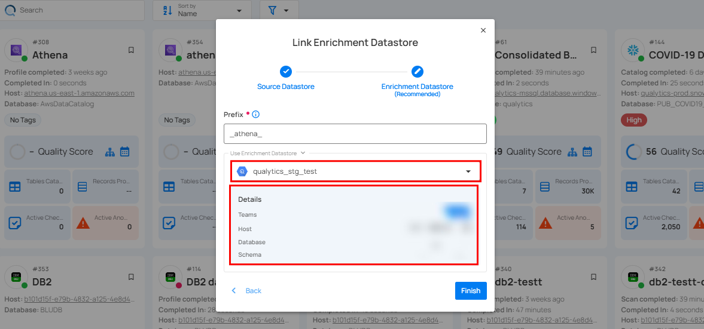

**Step 4**: Click on the **Finish** button to complete the configuration process for the existing **enrichment datastore**.

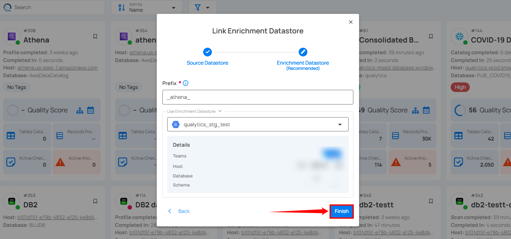

When the configuration process is finished, a success notification appears on the screen indicating that the datastore was added successfully.

Close the success message and you will be automatically redirected to the **Source Datastore Details** page where you can perform data operations on your configured **source datastore**.


## API Payload Examples

### Creating a Source Datastore

This section provides a sample payload for creating an Athena datastore. Replace the placeholder values with actual data relevant to your setup.

**Endpoint (Post)**: ```/api/datastores (post)```

=== "Create a Source Datastore with a new Connection"
    ```json
    {
        "name": "your_datastore_name",
        "teams": ["Public"],
        "database": "athena_catalog",
        "schema": "athena_database",
        "enrich_only": false,
        "trigger_catalog": true,
        "connection": {
            "host": "athena_host",
            "port": 443,
            "username": "athena_user",
            "password": "athena_password",
            "parameters": { "output": "s3://<bucket_name>" },
            "type": "athena"
        }
    }
    ```
=== "Create a Source Datastore with an existing Connection"
    ```json
    {
        "name": "your_datastore_name",
        "teams": ["Public"],
        "database": "athena_catalog",
        "schema": "athena_database",
        "enrich_only": false,
        "trigger_catalog": true,
        "connection": connection_id
    }
    ```

### Link an Enrichment Datastore to a Source Datastore

**Endpoint Details:** ```/api/datastores/{datastore-id}/enrichment/{enrichment-id} (patch)```
