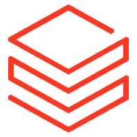
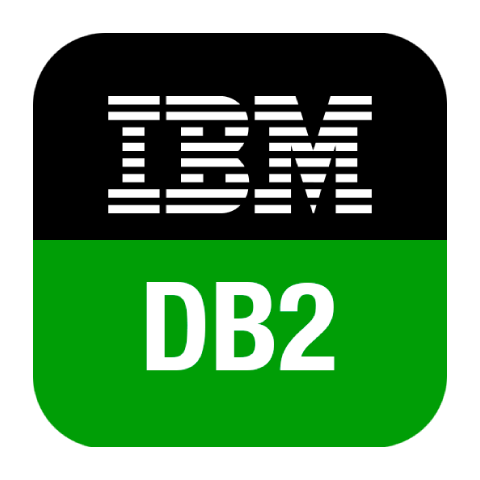
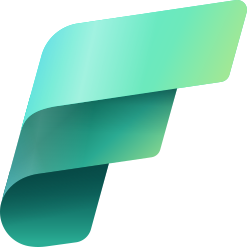
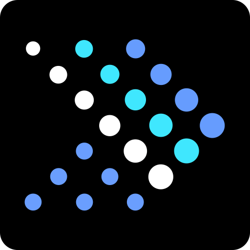
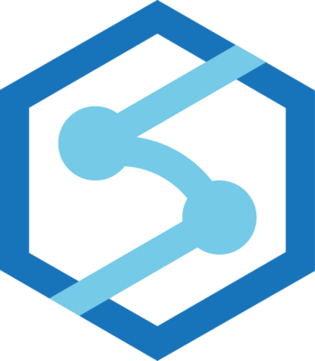
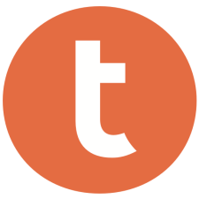
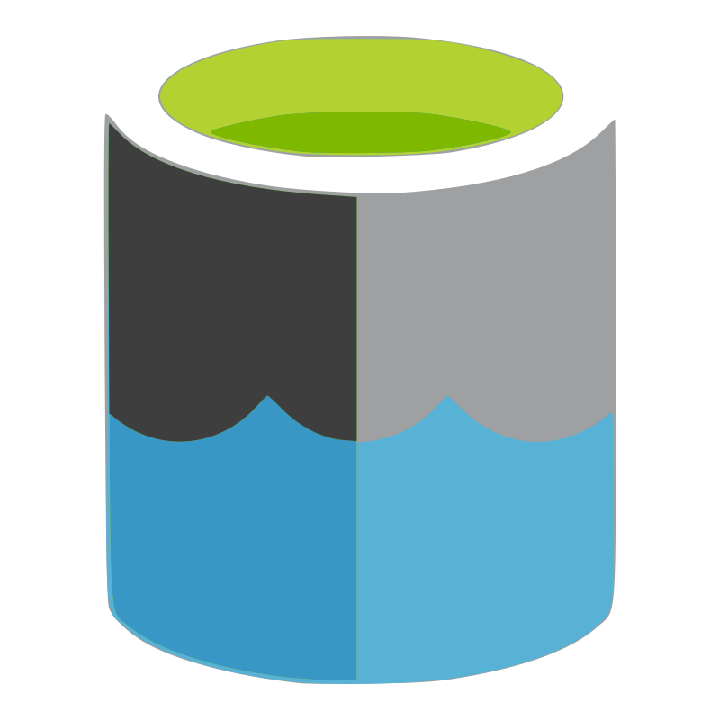

# Available Datastore Connectors

Qualytics provides **22 verified connectors** to integrate with your data platforms — 19 JDBC connectors for relational databases and 3 DFS connectors for distributed file systems and cloud object storage.

Each connector page contains step-by-step instructions for adding a source datastore, configuring connection properties, and linking an enrichment datastore.

!!! info "Enrichment Support"
    Want to check which connectors can be used as enrichment datastores? See the [Supported Enrichment Datastores](../../enrichment-support/supported-enrichment-datastores.md){:target="_blank"} page.

## JDBC Connectors

JDBC (Java Database Connectivity) connectors allow Qualytics to connect to relational databases. Data is organized as **Tables in a Schema** and accessed using standard SQL.

| No. | Connector | Logo | Multi-Schema Discovery |
| :--- | :--- | :---: | :---: |
| 1. | [Amazon Redshift](redshift.md) | { width="24" } | :material-check-circle:{ .lg title="Supported" } |
| 2. | [Athena](athena.md) | { width="24" } | :material-check-circle:{ .lg title="Supported" } |
| 3. | [BigQuery](bigquery.md) | { width="24" } | :material-check-circle:{ .lg title="Supported" } |
| 4. | [Databricks](databricks.md) | { width="24" } | :material-check-circle:{ .lg title="Supported" } |
| 5. | [DB2](db2.md) | { width="24" } | :material-check-circle:{ .lg title="Supported" } |
| 6. | [Dremio](dremio.md) | { width="24" } | :material-check-circle:{ .lg title="Supported" } |
| 7. | [Fabric Analytics](fabric-analytics.md) | { width="24" } | :material-close-circle-outline:{ .lg title="Not supported" } |
| 8. | [Hive](hive.md) | { width="24" } | :material-check-circle:{ .lg title="Supported" } |
| 9. | [MariaDB](maria-db.md) | { width="24" } | :material-check-circle:{ .lg title="Supported" } |
| 10. | [Microsoft SQL Server](microsoft-sql-server.md) | { width="24" } | :material-check-circle:{ .lg title="Supported" } |
| 11. | [MySQL](mysql.md) | { width="24" } | :material-check-circle:{ .lg title="Supported" } |
| 12. | [Oracle](oracle.md) | { width="24" } | :material-check-circle:{ .lg title="Supported" } |
| 13. | [PostgreSQL](postgresql.md) | { width="24" } | :material-check-circle:{ .lg title="Supported" } |
| 14. | [Presto](presto.md) | { width="24" } | :material-close-circle-outline:{ .lg title="Not supported" } |
| 15. | [Snowflake](snowflake.md) | { width="24" } | :material-check-circle:{ .lg title="Supported" } |
| 16. | [Synapse](synapse.md) | { width="24" } | :material-check-circle:{ .lg title="Supported" } |
| 17. | [Teradata](teradata.md) | { width="24" } | :material-close-circle-outline:{ .lg title="Not supported" } |
| 18. | [Timescale DB](timescale-db.md) | { width="24" } | :material-check-circle:{ .lg title="Supported" } |
| 19. | [Trino](trino.md) | { width="24" } | :material-check-circle:{ .lg title="Supported" } |

## DFS Connectors

DFS (Distributed File System) connectors allow Qualytics to connect to cloud object storage and distributed file systems. Data is organized as **Files in a Folder** and supports formats like AVRO, Parquet, CSV, and JSON.

| No. | Connector | Logo | Multi-Schema Discovery |
| :--- | :--- | :---: | :---: |
| 1. | [Amazon S3](amazon-s3.md) | { width="24" } | :material-close-circle-outline:{ .lg title="Not supported" } |
| 2. | [Azure Datalake Storage (ABFS)](azure-datalake-storage.md) | { width="24" } | :material-close-circle-outline:{ .lg title="Not supported" } |
| 3. | [Google Cloud Storage](google-cloud-storage.md) | { width="24" } | :material-close-circle-outline:{ .lg title="Not supported" } |

