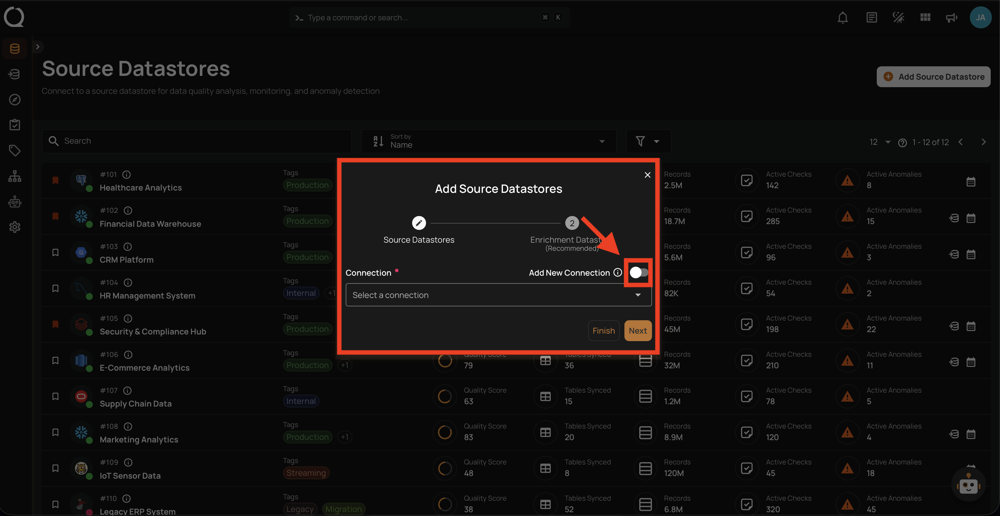
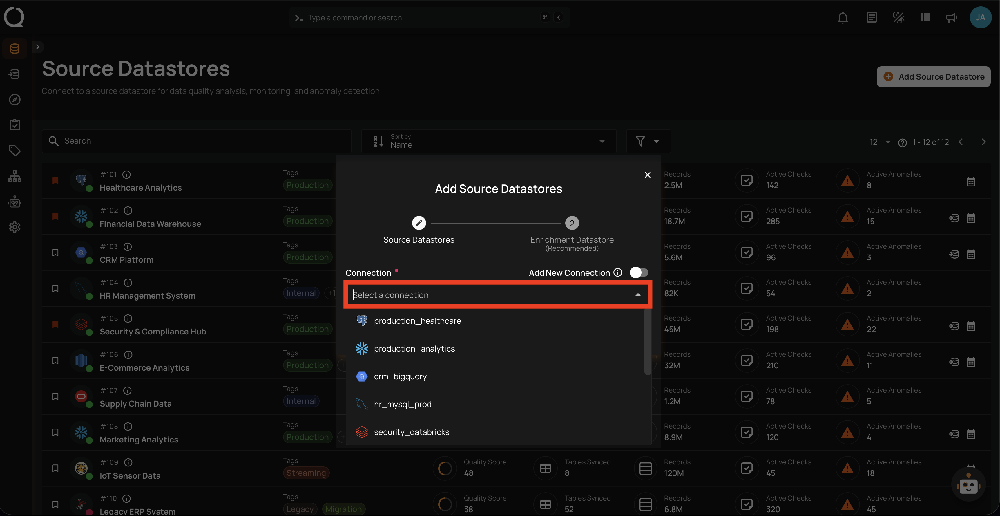
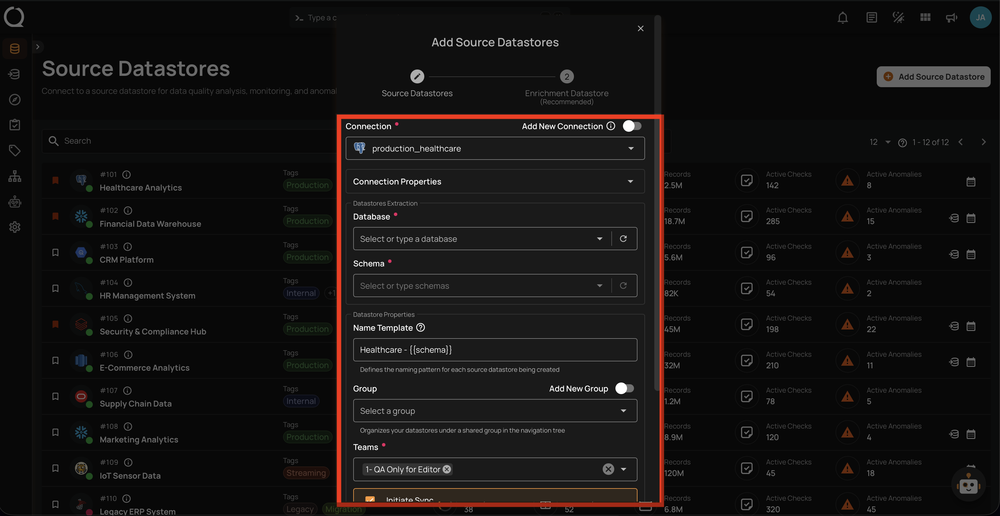
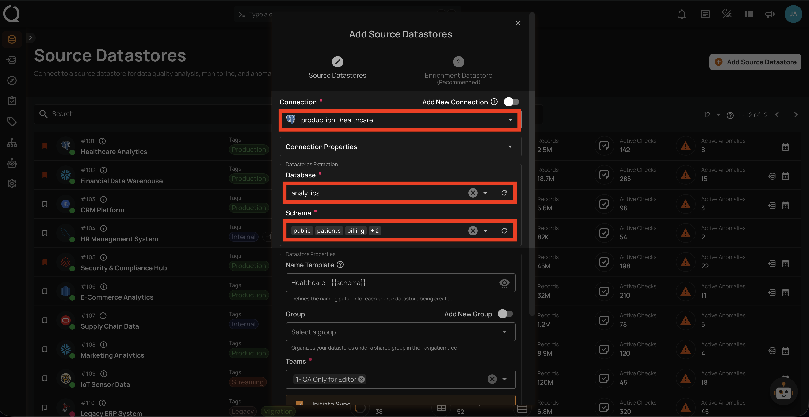
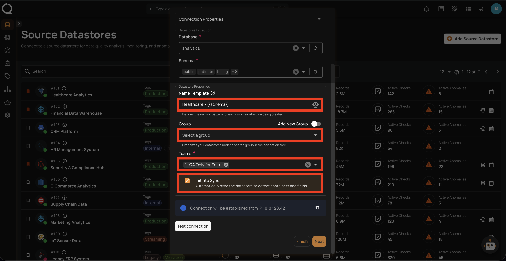
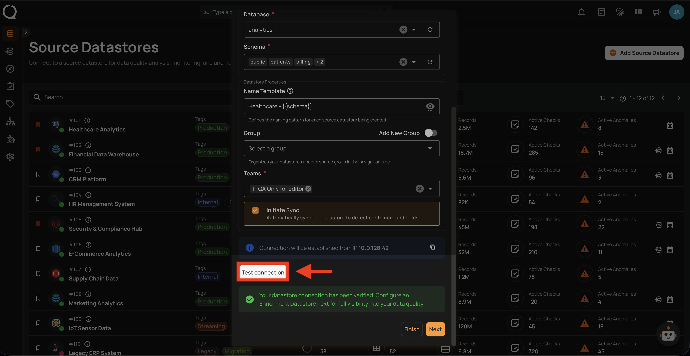
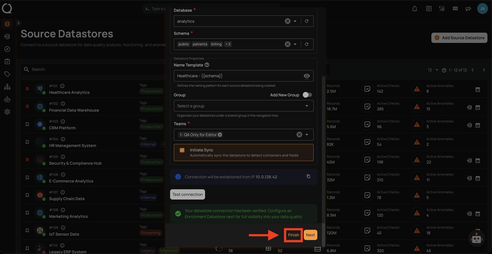

# Adding a New Datastore Using an Existing Connection

This guide walks you through creating a new source datastore by reusing credentials from a connection that already exists, saving time and ensuring consistency.

!!! info "Connector-Specific Fields"
    The connection fields vary depending on the connector you select. This page covers the general flow that applies to all connectors. For connector-specific field details, refer to the individual connector page (e.g., [PostgreSQL](../postgresql.md), [Snowflake](../snowflake.md), [BigQuery](../bigquery.md)).

!!! note "Connection Properties"
    When reusing an existing connection, the **Connection Properties** section is collapsed by default. The connection details are **read-only** and cannot be modified — you only need to configure the **Datastore Extraction** fields (Database, Schema) and the **Datastore Properties** (Name Template, Group, Teams, Initiate Sync).

## Steps

**Step 1**: Log in to your Qualytics account and click on the **Add Source Datastore :material-plus:** button located at the top-right corner of the interface.

**Step 2**: A modal window — **Add Source Datastores** — will appear. Toggle **off** the **Add New Connection** option to reuse an existing connection.

**Step 3**: Select an existing connection from the dropdown list.

**Step 4**: After selecting a connection, the form will expand showing the **Connection Properties** (collapsed), **Datastore Extraction** fields, and **Datastore Properties**.

!!! note
    The fields displayed may vary depending on whether the connection is **JDBC** or **DFS**. For a detailed breakdown of each field, see the [Datastore Properties](new-connection.md#datastore-properties){:target="_blank"} section.

**Step 5**: Configure the **Datastore Extraction** fields (Database and Schema) and the **Datastore Properties** (Name Template, Group, Teams, Initiate Sync) as described in the [Datastore Properties](new-connection.md#datastore-properties){:target="_blank"} section.

**Step 6**: Click the **Test Connection** button to verify the connection. If the credentials are verified, a success message will be displayed.

**Step 7**: Once the connection is verified, click the **Finish** button to complete the process.

!!! tip "Link an Enrichment Datastore"
    Before clicking **Finish**, you can optionally link an enrichment datastore to persist scan results and anomalies from the very first operation. See the [Link Enrichment on Datastore Creation](../../enrichment-datastore/link-during-creation.md){:target="_blank"} documentation.

**Step 8**: A success message will appear indicating that your datastore has been successfully added.

