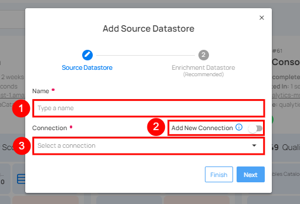
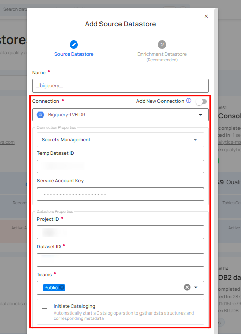

# Adding a New Datastore Using an Existing Connection

This guide walks you through creating a new source datastore by reusing credentials from a connection that already exists, saving time and ensuring consistency.

## Steps

**Step 1**: Log in to your Qualytics account and click on the **Add Source Datastore** button located at the top-right corner of the interface.

**Step 2**: A modal window — **Add Datastore** — will appear. Toggle **off** the **Add New Connection** option and select a connector from the dropdown list.

| REF. | FIELDS | REQUIRED | ACTIONS |
|------|--------|----------|---------|
| 1 | Name | Required | Specify the name of the datastore (e.g., the specified name will appear on the datastore cards). |
| 2 | Toggle Button | Required | Toggle **OFF** to reuse credentials from an existing connection. |
| 3 | Connector | Required | Select a connector from the dropdown list. |

**Step 3**: Select an existing connection from the dropdown and configure the datastore-specific properties.

!!! note
    The **Connection Properties** section will appear collapsed. You can expand it to review the connection details, but the fields are **read-only** and cannot be modified.

**Step 4**: Click the **Test Connection** button to verify the existing connection details. If the connection details are verified, a success message will be displayed.

**Step 5**: Once the connection is verified, click the **Finish** button to complete the process. A message will appear indicating that your datastore has been successfully added.

