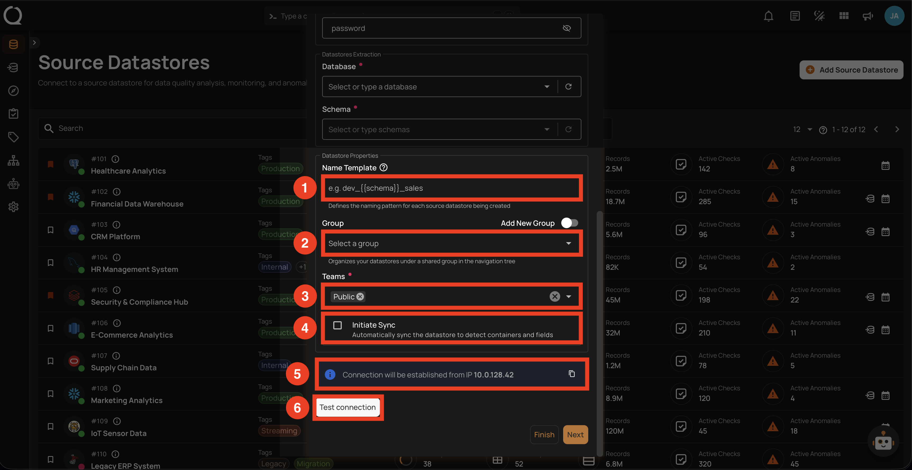
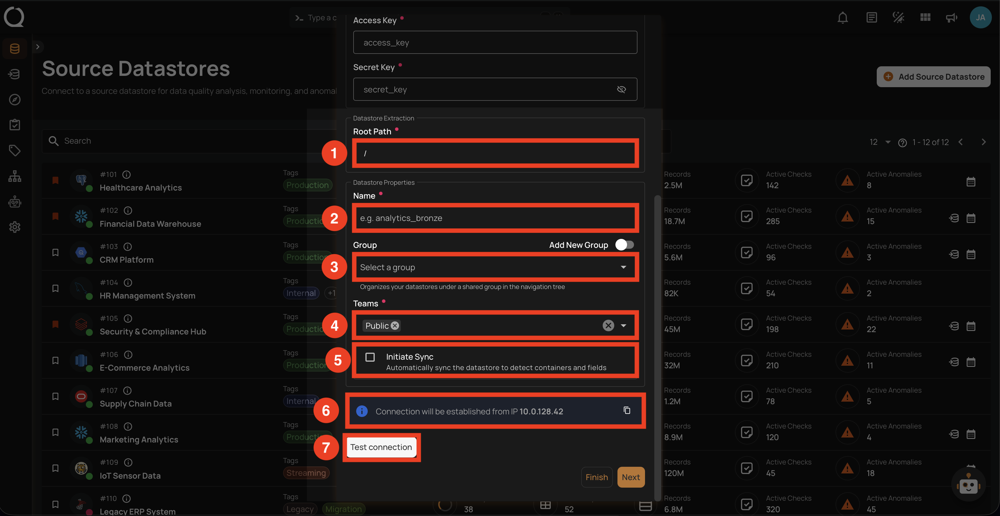
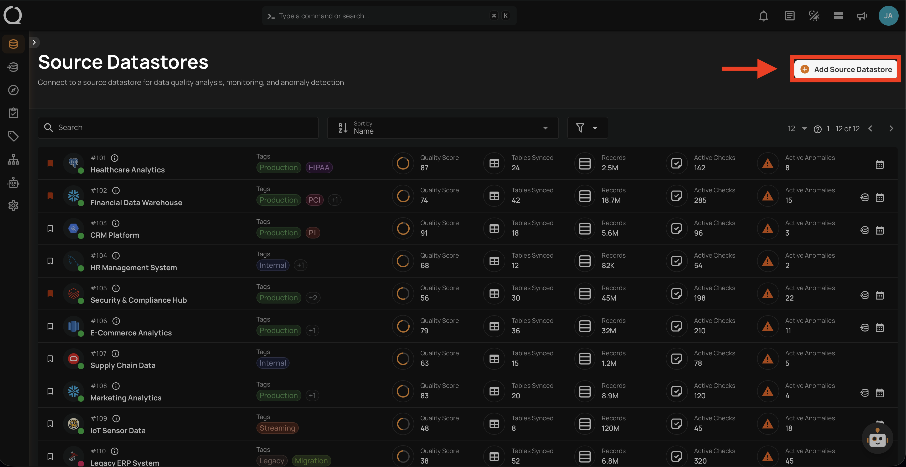
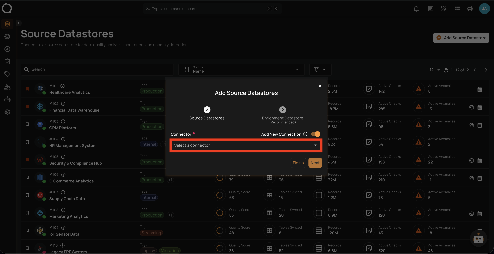
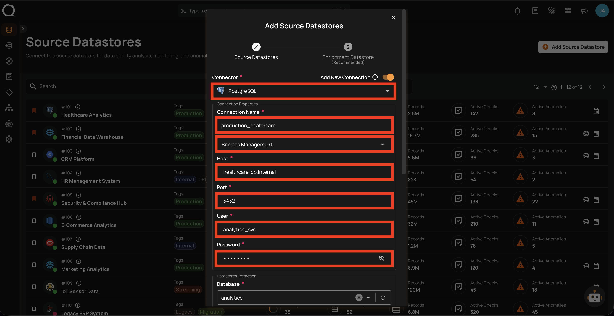
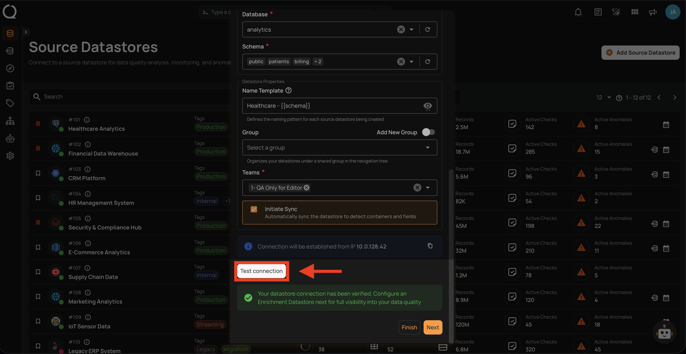
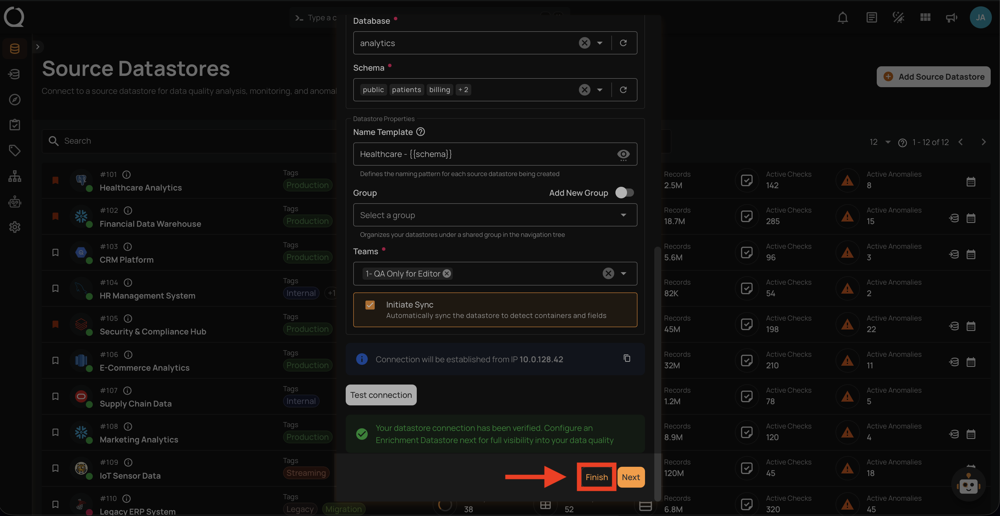
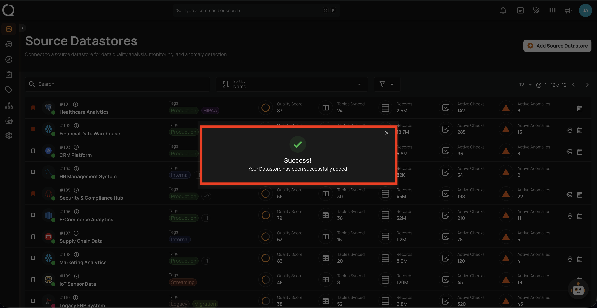

# Adding a New Datastore with a New Connection

This guide walks you through creating a new source datastore by setting up a new connection from scratch with your own credentials.

!!! info "Connector-Specific Fields"
    The connection fields vary depending on the connector you select. This page covers the general flow that applies to all connectors. For connector-specific field details, refer to the individual connector page (e.g., [PostgreSQL](../postgresql.md), [Snowflake](../snowflake.md), [BigQuery](../bigquery.md)).

## Datastore Properties

The lower section of the **Add Source Datastores** modal contains fields common to all datastores. The fields vary slightly depending on whether you are adding a **JDBC** or **DFS** datastore.

=== "JDBC"

    

    | REF. | FIELD | REQUIRED | DESCRIPTION |
    |:---:|:---|:---:|:---|
    | 1 | Name Template | No | Defines the naming pattern for each source datastore being created. Use `{{schema}}` as a placeholder that gets replaced with the actual schema name (e.g., `prod_{{schema}}` produces `prod_public`, `prod_sales`). |
    | 2 | Group | No | Organizes your datastores under a shared group in the navigation tree. Select an existing group or create a new one with the **Add New Group** toggle. |
    | 3 | Teams | Yes | Select one or more teams to associate with this source datastore. |
    | 4 | Initiate Sync | No | Automatically sync the datastore to detect containers and fields after creation. |
    | 5 | Connection Info | — | Displays the resolved connection host and IP for verification. |
    | 6 | Test Connection | — | Click to verify the connection credentials before proceeding. |

=== "DFS"

    

    | REF. | FIELD | REQUIRED | DESCRIPTION |
    |:---:|:---|:---:|:---|
    | 1 | Root Path | Yes | The base directory path in the file system where the datastore data resides. |
    | 2 | Name | Yes | The display name for the datastore (e.g., `analytics_bronze`). |
    | 3 | Group | No | Organizes your datastores under a shared group in the navigation tree. Select an existing group or create a new one with the **Add New Group** toggle. |
    | 4 | Teams | Yes | Select one or more teams to associate with this source datastore. |
    | 5 | Initiate Sync | No | Automatically sync the datastore to detect containers and fields after creation. |
    | 6 | Connection Info | — | Displays the resolved connection host and IP for verification. |
    | 7 | Test Connection | — | Click to verify the connection credentials before proceeding. |

## Steps

**Step 1**: Log in to your Qualytics account and click on the **Add Source Datastore :material-plus:** button located at the top-right corner of the interface.

**Step 2**: A modal window — **Add Source Datastores** — will appear. Ensure the **Add New Connection** toggle is turned **on** and select a connector from the dropdown list.

**Step 3**: Fill in the connection details for your selected connector and configure the datastore properties as described in the [Datastore Properties](#datastore-properties) section above.

**Step 4**: Click the **Test Connection** button to verify the connection. If the credentials and provided details are verified, a success message will be displayed.

**Step 5**: Once the connection is verified, click the **Finish** button to complete the process.

!!! tip "Link an Enrichment Datastore"
    Before clicking **Finish**, you can optionally link an enrichment datastore to persist scan results and anomalies from the very first operation. See the [Link Enrichment on Datastore Creation](../../enrichment-datastore/link-during-creation.md){:target="_blank"} documentation.

**Step 6**: A success message will appear indicating that your datastore has been successfully added.

