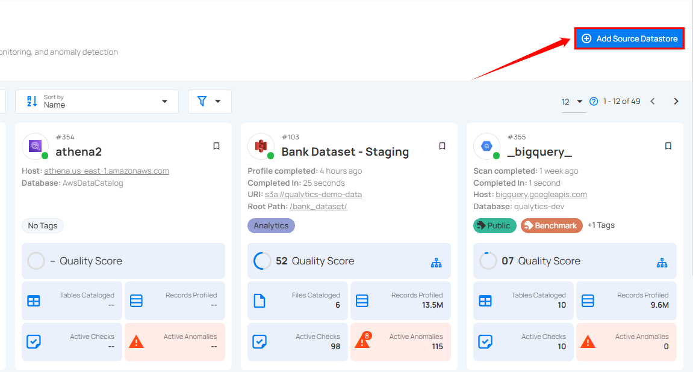
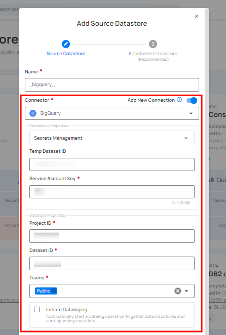
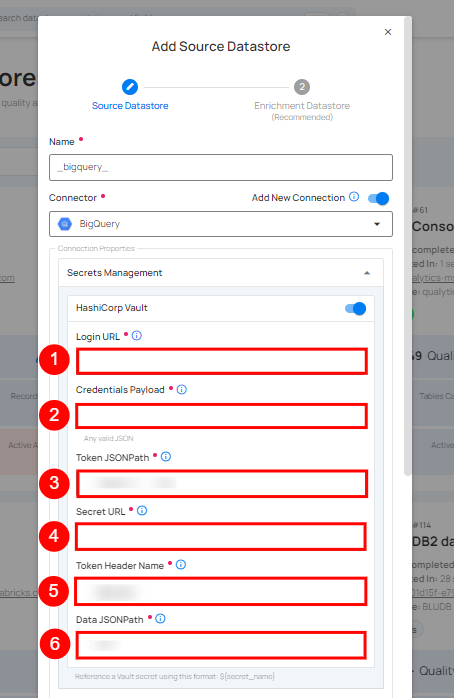
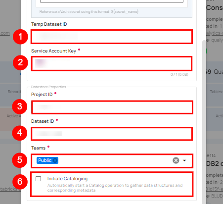
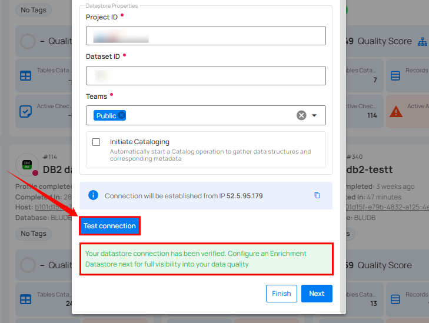
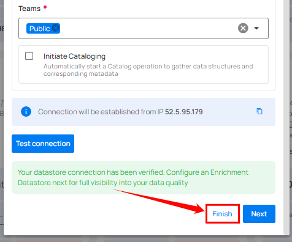

# Adding a New Datastore with a New Connection

This guide walks you through creating a new source datastore by setting up a new connection from scratch with your own credentials.

## Steps

**Step 1**: Log in to your Qualytics account and click on the **Add Source Datastore** button located at the top-right corner of the interface.

**Step 2**: A modal window — **Add Datastore** — will appear. Ensure the **Add New Connection** toggle is turned **on** and select a connector from the dropdown list.

| REF. | FIELDS | REQUIRED | ACTIONS |
|------|--------|----------|---------|
| 1 | Name | Required | Specify the name of the datastore (e.g., the specified name will appear on the datastore cards). |
| 2 | Toggle Button | Required | Toggle **ON** to create a new source datastore from scratch. |
| 3 | Connector | Required | Select a connector from the dropdown list. |

**Step 3**: Add connection details specific to your selected connector.

!!! note
    Different connectors have unique fields and parameters. The fields displayed are specific to the connector you selected. For connector-specific details, refer to the individual connector page (e.g., [PostgreSQL](../postgresql.md), [Snowflake](../snowflake.md), [BigQuery](../bigquery.md)).

**Secrets Management**: This is an optional connection property that allows you to securely store and manage credentials by integrating with HashiCorp Vault and other secret management systems. Toggle it **ON** to enable Vault integration for managing secrets.

!!! note
    After configuring **HashiCorp Vault** integration, you can use ${key} in any connection property to reference a key from the configured Vault secret. Each time the connection is initiated, the corresponding secret value will be retrieved dynamically.

| REF. | FIELDS | REQUIRED | ACTIONS |
|------|--------|----------|---------|
| 1 | Login URL | Required | Enter the URL used to authenticate with HashiCorp Vault. |
| 2 | Credentials Payload | Required | Input a valid JSON containing credentials for Vault authentication. |
| 3 | Token JSONPath | Required | Specify the JSONPath to retrieve the client authentication token from the response (e.g., `$.auth.client_token`). |
| 4 | Secret URL | Required | Enter the URL where the secret is stored in Vault. |
| 5 | Token Header Name | Required | Set the header name used for the authentication token (e.g., `X-Vault-Token`). |
| 6 | Data JSONPath | Required | Specify the JSONPath to retrieve the secret data (e.g., `$.data`). |

**Step 4**: Configure the datastore properties.

| REF. | FIELDS | REQUIRED | ACTIONS |
|------|--------|----------|---------|
| 1 | Teams | Required | Select one or more teams from the dropdown to associate with this source datastore. |
| 2 | Initiate Sync | Optional | Tick the checkbox to automatically perform a sync operation on the configured source datastore to detect new, changed, or removed containers and fields. |

**Step 5**: Click the **Test Connection** button to verify the connection. If the credentials and provided details are verified, a success message will be displayed.

**Step 6**: Once the connection is verified, click the **Finish** button to complete the process. A message will appear indicating that your datastore has been successfully added.

