# MariaDB

Adding and configuring a MariaDB connection within Qualytics empowers the platform to build a symbolic link with your schema to perform operations like data discovery, visualization, reporting, syncing, profiling, scanning, anomaly surveillance, and more.

This documentation provides a step-by-step guide on how to add MariaDB as both a source and enrichment datastore in Qualytics. It covers the entire process, from initial connection setup to testing and finalizing the configuration.

By following these instructions, enterprises can ensure their MariaDB environment is properly connected with Qualytics, unlocking the platform's potential to help you proactively manage your full data quality lifecycle.

Let’s get started 🚀

## MariaDB Setup Guide

Qualytics connects to MariaDB through the **MariaDB JDBC driver**. It uses standard JDBC metadata APIs to discover databases, tables, columns, and primary keys. MariaDB uses the same permission model as MySQL — the database name you provide in the connection form is the scope for all operations.

### Minimum MariaDB Permissions (Source Datastore)

| Permission    | Purpose                                                                     |
|---------------|-----------------------------------------------------------------------------|
| `SELECT`      | Read data from all tables for profiling and scanning                        |
| `SHOW VIEW`   | Read view definitions for metadata discovery                                |
| `PROCESS`     | View active queries (used by the JDBC driver for connection metadata)       |

### Additional Permissions for Enrichment Datastore

When using MariaDB as an enrichment datastore, the following additional permissions are required for Qualytics to write metadata tables (e.g., `_qualytics_*`):

| Permission    | Purpose                                                                     |
|---------------|-----------------------------------------------------------------------------|
| `CREATE`      | Create enrichment tables (`_qualytics_*`)                                   |
| `ALTER`       | Modify enrichment table schemas during version migrations                   |
| `INSERT`      | Write anomaly records, scan results, and check metrics                      |
| `UPDATE`      | Update enrichment records during rescans                                    |
| `DELETE`      | Remove stale enrichment records                                             |
| `DROP`        | Remove enrichment tables if the datastore is unlinked                       |

### Example: Source Datastore User (Read-Only)

Replace `<database_name>` and `<password>` with your actual values.

```sql
-- Create a dedicated read-only user
CREATE USER ‘qualytics_read’@’%’ IDENTIFIED BY ‘<password>’;

-- Grant read access to all tables and views
GRANT SELECT, SHOW VIEW ON <database_name>.* TO ‘qualytics_read’@’%’;

-- Apply the changes
FLUSH PRIVILEGES;
```

### Example: Enrichment Datastore User (Read-Write)

```sql
-- Create a dedicated read-write user
CREATE USER ‘qualytics_readwrite’@’%’ IDENTIFIED BY ‘<password>’;

-- Grant full data manipulation and table management
GRANT SELECT, INSERT, UPDATE, DELETE, CREATE, ALTER, DROP, SHOW VIEW ON <database_name>.* TO ‘qualytics_readwrite’@’%’;

-- Apply the changes
FLUSH PRIVILEGES;
```

!!! note
    Qualytics automatically filters out system databases (`information_schema`, `mysql`, `performance_schema`, `sys`) during catalog discovery. You do not need to restrict access to these databases manually.

### Troubleshooting Common Errors

| Error                                          | Likely Cause                                                                 | Fix                                                                                     |
|------------------------------------------------|------------------------------------------------------------------------------|-----------------------------------------------------------------------------------------|
| `Access denied for user`                       | Incorrect username, password, or the user does not have access from the connecting host | Verify credentials and ensure the user is created with `’%’` or the specific Qualytics host IP |
| `Host is not allowed to connect`               | The MariaDB server rejects connections from the Qualytics host IP            | Create the user with `’qualytics_read’@’<qualytics_ip>’` or use `’%’` for any host     |
| `SELECT command denied to user`                | The user lacks `SELECT` on the target database                               | Run `GRANT SELECT ON <database_name>.* TO ‘<user>’@’%’`                                 |
| `CREATE command denied to user`                | The enrichment user lacks `CREATE` on the database                           | Run `GRANT CREATE ON <database_name>.* TO ‘<user>’@’%’`                                 |
| `SSL connection is required`                   | The MariaDB server enforces SSL but the connection is not configured for it  | Enable SSL in the connection parameters or configure the MariaDB user to not require SSL |

### Detailed Troubleshooting Notes

#### Authentication Errors

The error `Access denied for user` indicates that the credentials are incorrect or the user does not have access from the connecting host.

Common causes:

- **Incorrect password** — the password does not match the one set for the user.
- **Host restriction** — the user was created with a specific host (e.g., `'user'@'localhost'`) but Qualytics connects from a different IP.
- **User does not exist** — the username was misspelled or was never created.

!!! note
    MariaDB differentiates users by both username and host. `'qualytics'@'localhost'` and `'qualytics'@'%'` are treated as two separate users with potentially different passwords and permissions.

#### Permission Errors

The error `SELECT command denied to user` means the user authenticated successfully but lacks the necessary grants on the target database.

Common causes:

- **Missing `SELECT` grant** — the user does not have `SELECT` on the target database.
- **Wrong database** — the user has permissions on a different database than the one specified in the connection form.
- **Grant not flushed** — after running `GRANT` statements, `FLUSH PRIVILEGES` was not executed.

#### Connection Errors

The error `Host is not allowed to connect` means the MariaDB server rejects the connection from the Qualytics host IP.

Common causes:

- **User host restriction** — the user was created with `'user'@'localhost'` instead of `'user'@'%'`.
- **Firewall or network** — a firewall is blocking connections on port 3306.
- **Bind address** — MariaDB is configured to listen only on `127.0.0.1` (`bind-address` in `my.cnf`).

!!! tip
    Start by confirming credentials are valid (authentication errors), then verify database permissions (permission errors), and finally check network connectivity (connection errors).

## Add a Source Datastore

A source datastore is a storage location used to connect to and access data from external sources. MariaDB is an example of a source datastore, specifically a type of JDBC datastore that supports connectivity through the JDBC API. Configuring the JDBC datastore enables the Qualytics platform to access and perform operations on the data, thereby generating valuable insights.

**Step 1:** Log in to your Qualytics account and click on the **Add Source Datastore** button located at the top-right corner of the interface.

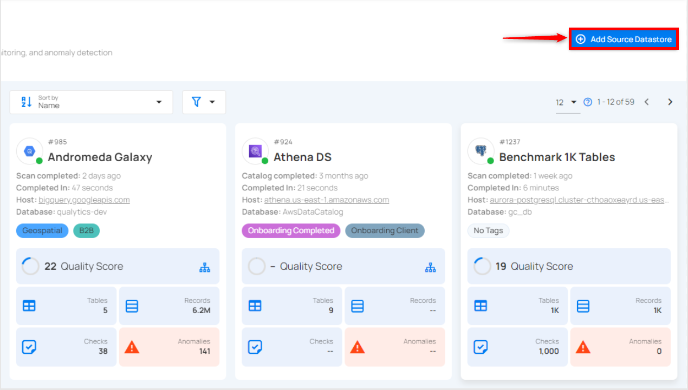

**Step 2:** A modal window - **Add Datastore** will appear, providing you with the options to connect a datastore.

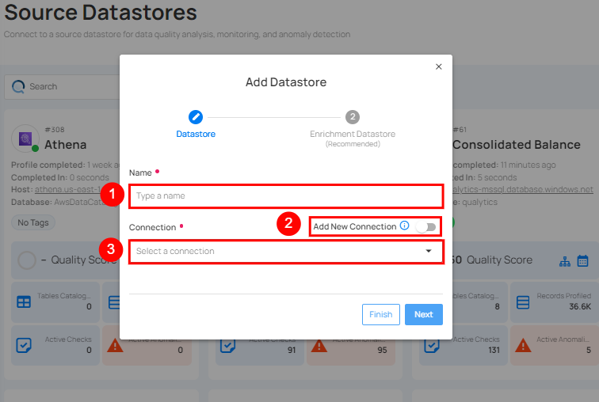

| REF. | FIELDS | ACTIONS |
| :---- | :---- | :---- |
| 1. | Name (Required) | Specify the datastore name (e.g., this name will appear on the datastore cards) |
| 2. | Toggle Button | Toggle ON to create a new source datastore from scratch, or toggle OFF to reuse credentials from an existing connection. |
| 3. | Connector (Required) | Select **MariaDB** from the dropdown list. |

### Option I: Create a Source Datastore with a new Connection

If the toggle for **Add New connection** is turned on, then this will prompt you to add and configure the source datastore from scratch without using existing connection details.

**Step 1:** Select the **MariaDB** connector from the dropdown list and add connection details such as Secrets Management, host, port, user, password, SSL connection, database, and schema.

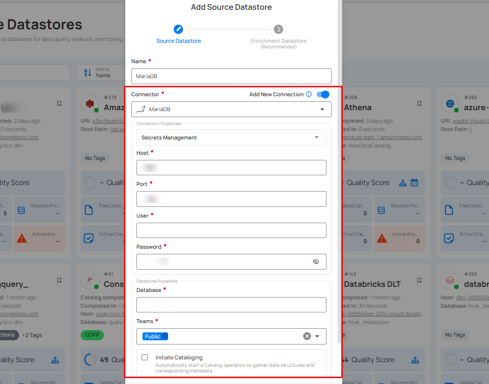

**Secrets Management**: This is an optional connection property that allows you to securely store and manage credentials by integrating with HashiCorp Vault and other secret management systems. Toggle it **ON** to enable Vault integration for managing secrets.

!!! note
    After configuring HashiCorp Vault integration, you can use ${key} in any Connection property to reference a key from the configured Vault secret. Each time the Connection is initiated, the corresponding secret value will be retrieved dynamically.

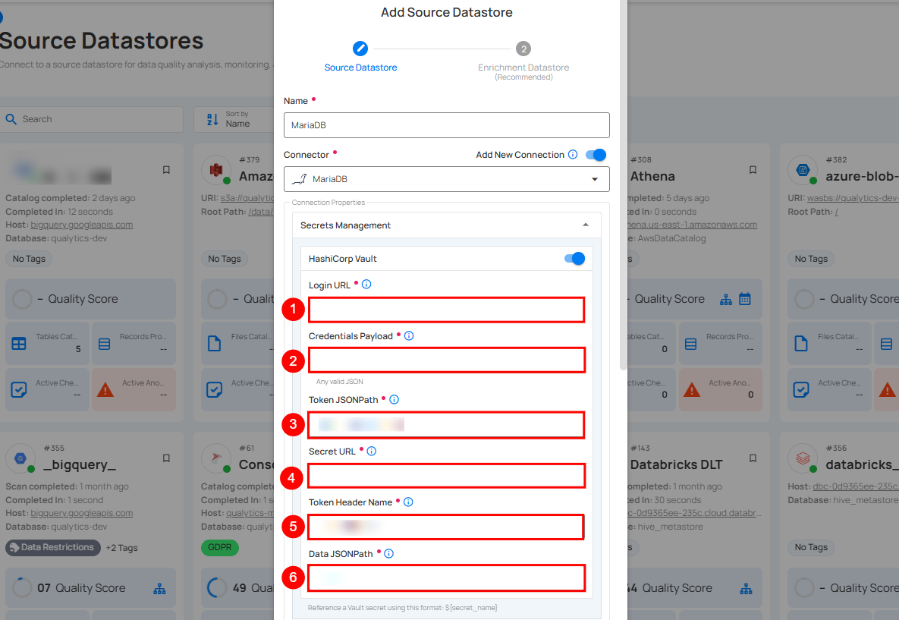

| REF | FIELDS | ACTIONS |
| :---- | :---- | :---- |
| 1. | Login URL | Enter the URL used to authenticate with HashiCorp Vault. |
| 2. | Credentials Payload | Input a valid JSON containing credentials for Vault authentication. |
| 3. | Token JSONPath | Specify the JSONPath to retrieve the client authentication token from the response (e.g., $.auth.client_token). |
| 4. | Secret URL | Enter the URL where the secret is stored in Vault. |
| 5. | Token Header Name | Set the header name used for the authentication token (e.g., X-Vault-Token). |
| 6. | Data JSONPath  | Specify the JSONPath to retrieve the secret data (e.g., $.data). |

**Step 2:** The configuration form will expand, requesting credential details before establishing the connection.

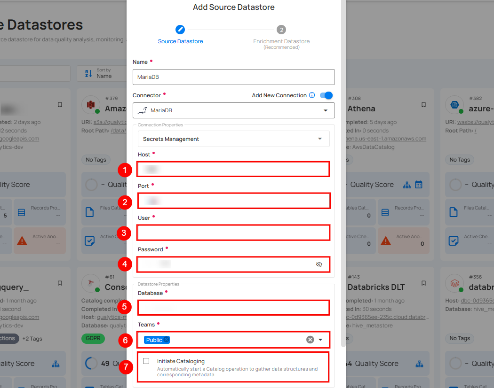

| REF. | FIELDS |     ACTIONS |
| :---- | :---- | :---- |
| 1. | Host | Get **Hostname** from your MariaDB account and add it to this field. |
| 2. | Port | Specify the **Port** number. |
| 3. | User | Enter the **User ID** to connect. |
| 4. | Password | Enter the **password** to connect to the database. |
| 5. | Database | Specify the database name. |
| 6. | Teams | Select one or more teams from the dropdown to associate with this source datastore. |
| 7. | Initiate Sync | Check the checkbox to automatically perform a sync operation on the configured source to detect new, changed, or removed containers and fields. |

**Step 3:** After adding the source datastore details, click on the **Test Connection** button to check and verify its connection.


If the credentials and provided details are verified, a success message will be displayed indicating that the connection has been verified.

### Option II: Use an Existing Connection

If the toggle for **Add New connection** is turned off, then this will prompt you to configure the source datastore using the existing connection details.

**Step 1:** Select a **connection** to reuse existing credentials.

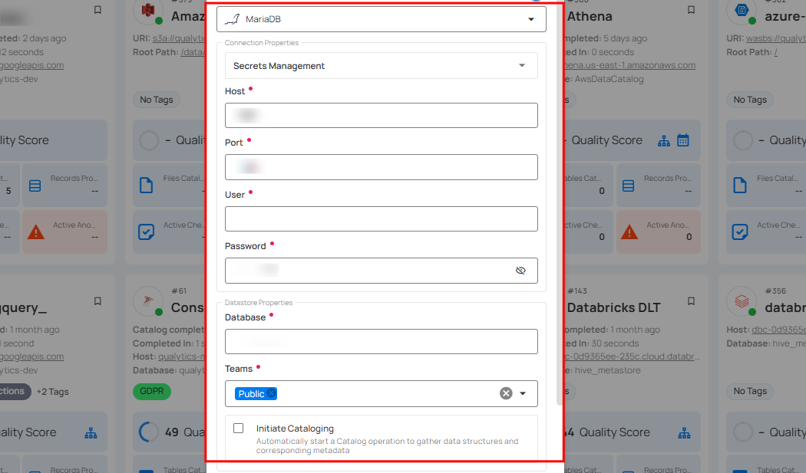

!!! note
    If you are using existing credentials, you can only edit the details such as Database, Schema, Teams, and Initiate Sync.

**Step 2:** Click on the **Test Connection** button to verify the existing connection details. If connection details are verified, a success message will be displayed.

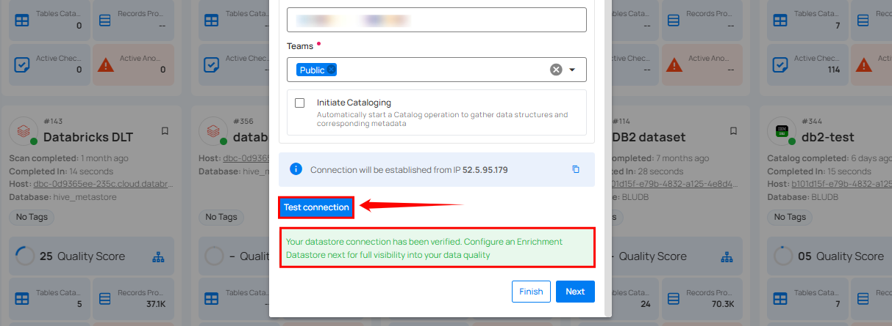

!!! note
    Clicking on the Finish button will create the source datastore and bypass the enrichment datastore configuration step.

!!! tip
    It is recommended to click on the Next button, which will take you to the enrichment datastore configuration page.

## Add Enrichment Datastore

Once you have successfully tested and verified your source datastore connection, you have the option to add the enrichment datastore (recommended). This datastore is used to store the analyzed results, including any anomalies and additional metadata in tables. This setup provides full visibility into your data quality, helping you manage and improve it effectively.

**Step 1:** Whether you have added a source datastore by creating a new datastore connection or using an existing connection, click on the **Next** button to start adding the **Enrichment Datastore**.

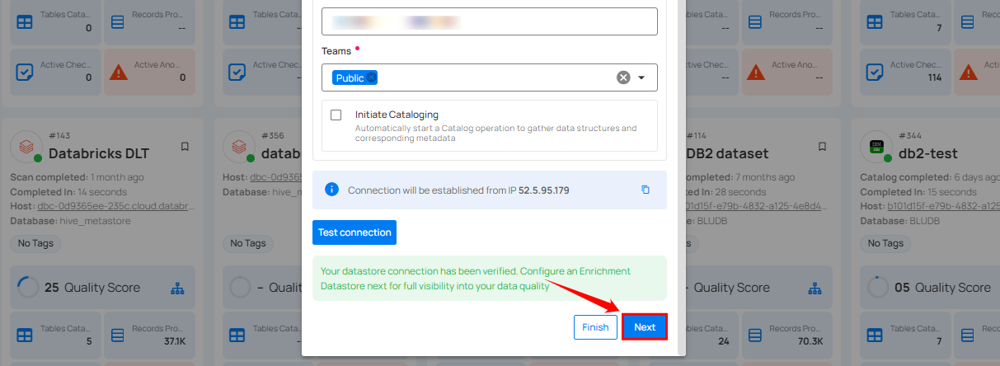

**Step 2:** A modal window - **Link Enrichment Datastore** will appear, providing you with the options to configure an **enrichment datastore**.

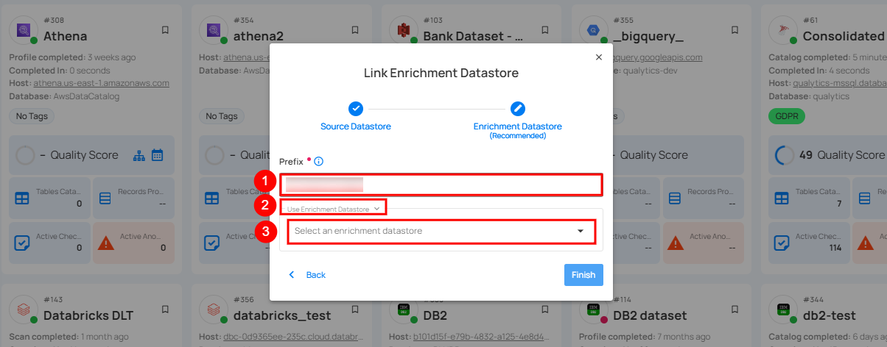

| REF. | FIELDS | ACTIONS |
| :---- | :---- | :---- |
| 1. | Prefix (Required) | Add a prefix name to uniquely identify tables/files when Qualytics writes metadata from the source datastore to your enrichment datastore. |
| 2. | Caret Down Button | Click the caret down to select either **Use Enrichment Datastore** or **Add Enrichment Datastore**. |
| 3. | Enrichment Datastore | Select an enrichment datastore from the dropdown list. |

### Option I: Create an Enrichment Datastore with a new Connection

If the toggle **Add new connection** is turned on, then this will prompt you to add and configure the enrichment datastore from scratch without using an existing enrichment datastore and its connection details.

**Step 1**: Click on the caret button and select Add Enrichment Datastore.

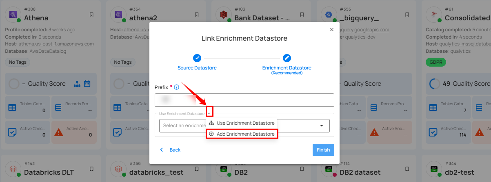

A modal window **Link Enrichment Datastore** will appear. Enter the following details to create an enrichment datastore with a new connection.

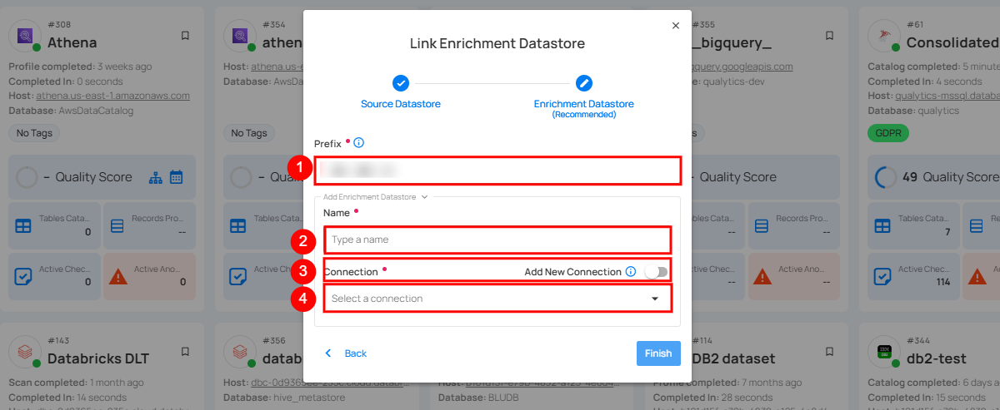

| REF. |          FIELDS | ACTIONS |
| :---- | :---- | :---- |
| 1. | Prefix | Add a prefix name to uniquely identify tables/files when Qualytics writes metadata from the source datastore to your enrichment datastore. |
| 2. | Name | Enter a name for the enrichment datastore. |
| 3. | Toggle Button For Add New Connection | Toggle ON to create a new enrichment datastore from scratch or toggle OFF to reuse credentials from an existing connection. |
| 4. | Connector | Select a datastore connector from the dropdown list. |

**Step 2:** Add connection details for your selected **enrichment datastore** connector.

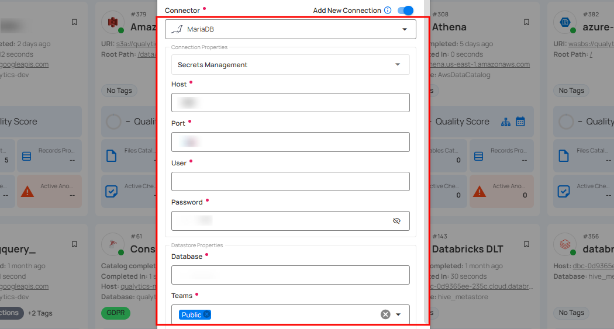

**Step 3:** Click on the **Test Connection** button to verify the selected enrichment datastore connection. If the connection is verified, a flash message will indicate that the connection with the datastore has been successfully verified.

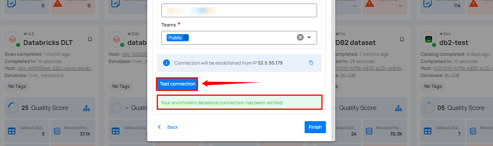

**Step 4:** Click on the **Finish** button to complete the configuration process.

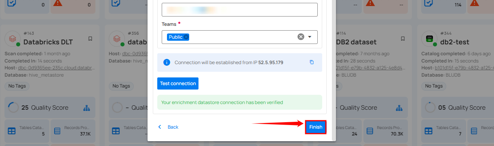

When the configuration process is finished, a modal will display a success message indicating that your datastore has been successfully added.

**Step 5:** Close the success dialog and the page will automatically redirect you to the **Source Datastore Details** page where you can perform data operations on your configured source datastore.


### Option II: Use an Existing Connection

If the **Use enrichment datastore** option is selected from the caret button, you will be prompted to configure the datastore using existing connection details.

**Step 1**: Click on the caret button and select **Use Enrichment Datastore**.

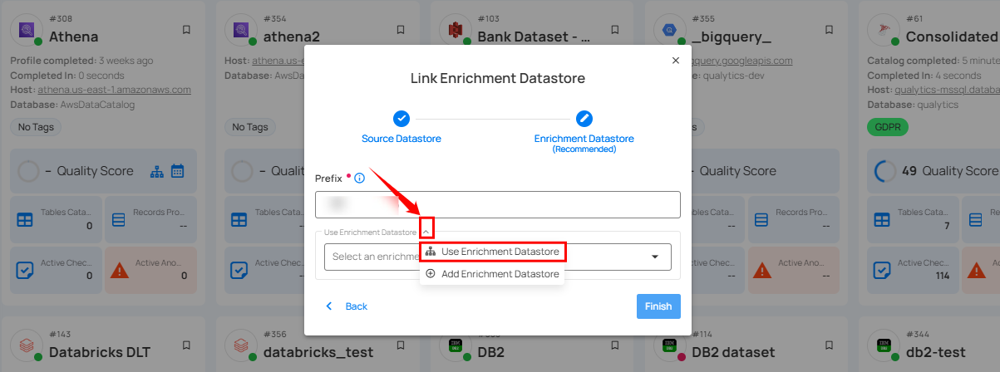

**Step 2:** A modal window **Link Enrichment Datastore** will appear. Add a prefix name and select an existing enrichment datastore from the dropdown list.

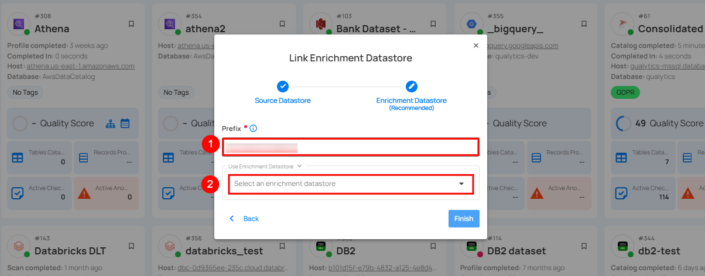

| REF. | FIELDS | ACTIONS |
| :---- | :---- | :---- |
| 1. | Prefix | Add a prefix name to uniquely identify tables/files when Qualytics writes metadata from the source datastore to your enrichment datastore. |
| 2. | Enrichment Datastore | Select an enrichment datastore from the dropdown list. |

**Step 3:** After selecting an existing **enrichment datastore** connection, you will view the following details related to the selected enrichment:

* **Teams:** The team associated with managing the enrichment datastore is based on the role of public or private. For example, marked as **Public** means that this datastore is accessible to all the users.  
* **Host:** This is the server address where the **MariaDB** instance is hosted. It is the endpoint used to connect to the MariaDB environment.  
* **Database:** Refers to the specific database within the MariaDB environment where the data is stored.  
* **Schema:** The schema used in the enrichment datastore. The schema is a logical grouping of database objects (tables, views, etc.). Each schema belongs to a single database.

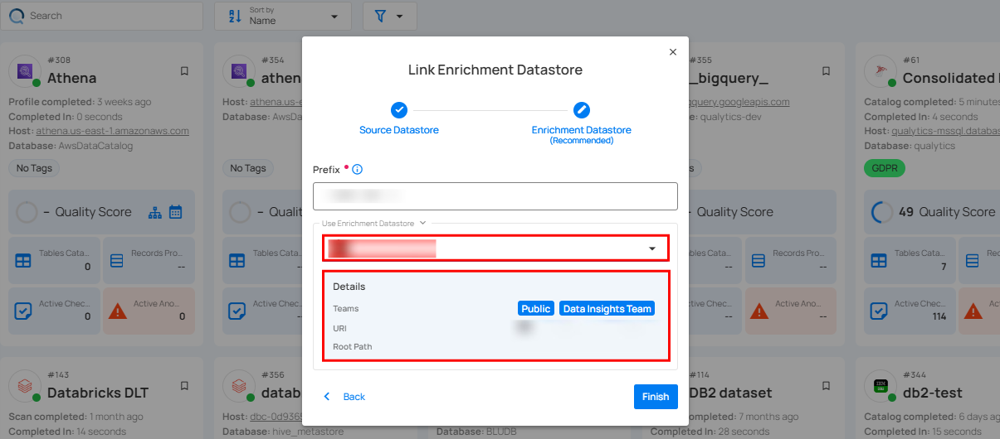

**Step 4:** Click on the **Finish** button to complete the configuration process for the existing **enrichment datastore**.

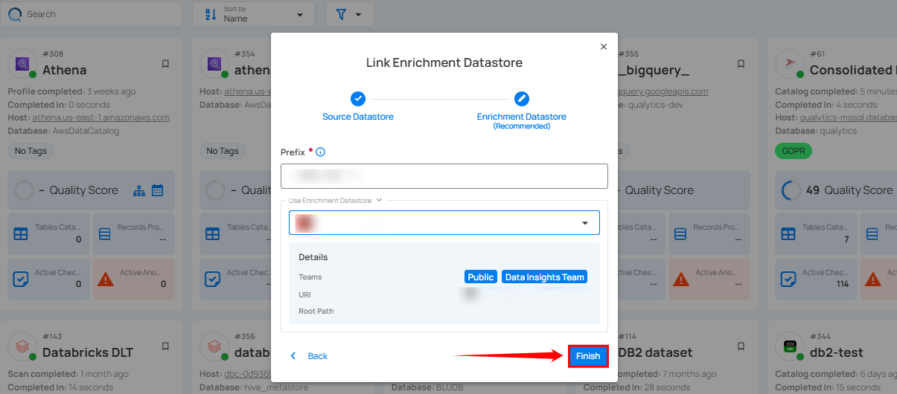

When the configuration process is finished, a modal window will display and a success flash message stating that your data has been successfully added.

Close the success message and you will be automatically redirected to the **Source Datastore Details** page where you can perform data operations on your configured source datastore.


## API Payload Examples

### Creating a Datastore

This section provides a sample payload for creating a datastore. Replace the placeholder values with actual data relevant to your setup.

#### Endpoint (Post)

`/api/datastores` _(post)_

=== "Creating a datastore with a new connection"
    ```json
        {
            "name": "your_datastore_name",
            "teams": ["Public"],
            "database": "mariadb_database",
            "enrich_only": false,
            "trigger_catalog": true,
            "connection": {
                "name": "your_connection_name",
                "type": "mariadb",
                "host": "mariadb_host",
                "port": "mariadb_port",
                "username": "mariadb_username",
                "password": "mariadb_password"
            }
        }
    ```
=== "Creating a datastore with an existing connection"
    ```json
        {
            "name": "your_datastore_name",
            "teams": ["Public"],
            "database": "mariadb_database",
            "enrich_only": false,
            "trigger_catalog": true,
            "connection_id": connection-id
        }
    ```

### Creating an Enrichment Datastore

#### Endpoint (Post)

`/api/datastores` _(post)_

This section provides a sample payload for creating an enrichment datastore. Replace the placeholder values with actual data relevant to your setup.

=== "Creating an enrichment datastore with a new connection"
    ```json
        {
            "name": "your_datastore_name",
            "teams": ["Public"],
            "database": "mariadb_database",
            "enrich_only": true,
            "connection": {
                "name": "your_connection_name",
                "type": "mariadb",
                "host": "mariadb_host",
                "port": "mariadb_port",
                "username": "mariadb_username",
                "password": "mariadb_password"
            }
        }
    ```
=== "Creating an enrichment datastore with an existing connection"
    ```json
        {
            "name": "your_datastore_name",
            "teams": ["Public"],
            "database": "mariadb_database",
            "enrich_only": true,
            "connection_id": connection-id
        }
    ```

### Linking Datastore to an Enrichment Datastore through API

#### Endpoint (Patch)

`/api/datastores/{datastore-id}/enrichment/{enrichment-id}` _(patch)_
