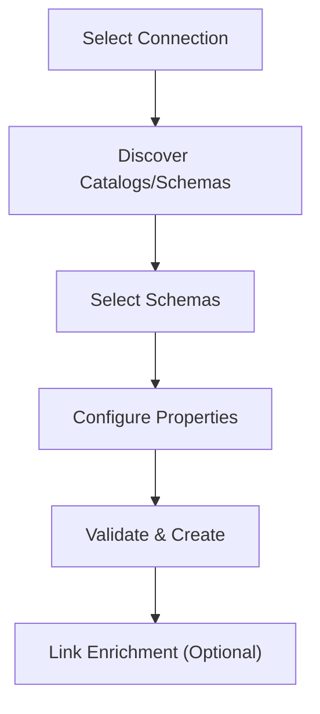

# How Multi-Schema Creation Works

## Overview

The multi-schema creation flow is a two-step wizard that guides you through discovering schemas from a connection and creating multiple source datastores at once.

## Step 1: Source Datastore Configuration

In the first step, you configure the connection and select which schemas to onboard.

### Connection Selection

You can either:

- **Create a new connection**: Provide all connection details (host, port, credentials, etc.) from scratch.
- **Use an existing connection**: Select a previously saved connection to reuse its credentials.

For more information about connections, refer to the [Connection Overview](../connections/introduction.md) documentation.

### Catalog Discovery

For connectors that support a catalog hierarchy (e.g., databases in PostgreSQL, databases in Snowflake, projects in BigQuery), the first discovery step retrieves the list of available catalogs from the connection. You select which catalog to browse for schemas.

!!! tip
    Click the **refresh** button next to the catalog dropdown to reload the available catalogs from your connection.

Not all connectors have a catalog level. For connectors like Oracle or DB2, schemas are discovered directly without a catalog selection step.

### Schema Discovery and Selection

Once a catalog is selected (or for connectors without a catalog level), the system discovers all available schemas and presents them in a multi-select dropdown.

Key behaviors:

- **Warning icons**: Schemas that already have an existing datastore display a warning icon with a tooltip showing which datastores are associated.
- **Search filtering**: You can filter schemas by name using the search field in the dropdown.
- **Selection count**: The dropdown shows how many schemas are selected (e.g., "3 selected").

!!! warning
    You can select schemas that already have datastores, but this will create duplicate datastores for those schemas.

### Name Template

The **Name Template** field lets you define a naming pattern for the datastores that will be created. Use the `{{schema}}` placeholder, which will be replaced with each schema name.

For example, with the template `production_{{schema}}` and schemas `public`, `staging`, and `analytics`:

| Schema | Generated Datastore Name |
| :--- | :--- |
| `public` | `production_public` |
| `staging` | `production_staging` |
| `analytics` | `production_analytics` |

!!! tip
    A preview of the generated names is displayed below the name template field, showing how the first few datastores will be named.

### Additional Properties

| Field | Required | Description |
| :--- | :--- | :--- |
| **Teams** | Yes | One or more teams to associate with all newly created datastores. |
| **Group** | No | Assign all datastores to a [datastore group](../../../managing-datastores/grouping/overview.md). |
| **Initiate Sync** | No | Automatically run a sync operation on each newly created datastore after creation. |

### Validation

Before creating the datastores, click **Test Connection** to validate connectivity for all selected schemas. The validation runs per-schema and reports individual results, so you can identify which schemas have issues before proceeding.

## Step 2: Enrichment Datastore Linking (Optional)

After configuring the source datastores, an optional second step lets you link all newly created datastores to a single enrichment datastore. The enrichment datastore stores analyzed results, anomalies, and additional metadata.

You can:

- **Use an existing enrichment datastore**: Select a previously created enrichment datastore.
- **Create a new enrichment datastore**: Configure a new enrichment datastore during the same flow.

!!! info
    All source datastores created in the batch will be linked to the same enrichment datastore. The enrichment prefix is shared across all of them.

For step-by-step instructions on adding a datastore, refer to the [Add Source Datastore](../../overview-of-a-jdbc-datastore.md) documentation.

## What Happens After Creation

Once the creation process completes, Qualytics returns a summary showing:

- **Created datastores**: The list of successfully created datastore IDs.
- **Errors**: Any schemas that failed to create, with the corresponding error message.

If **Initiate Sync** was enabled, a sync operation will automatically start on each successfully created datastore, detecting containers and fields within each schema.
