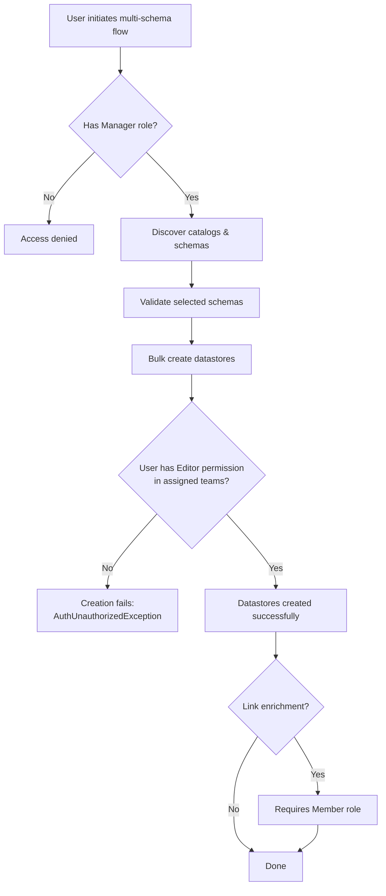

# Multiple-Schema Permissions

This page describes the permissions required for each step of the multi-schema source datastore creation flow.

## Role Requirements

All steps in the multi-schema workflow require the **Manager** role (or higher: Admin). This is enforced at the endpoint level — users with Member or Editor roles cannot access the multi-schema flow.

| Step | Minimum Role | Description |
| :--- | :--- | :--- |
| Discover Catalogs | Manager | List available databases/projects from a connection. |
| Discover Schemas | Manager | List available schemas within a catalog. |
| Validate Schemas | Manager | Test connectivity for selected schemas before creation. |
| Bulk Create Datastores | Manager | Create multiple datastores from selected schemas. |
| Create Group (inline) | Manager | Create a new datastore group during the bulk creation flow. |
| Link Enrichment (after creation) | Member | Link an enrichment datastore to each created datastore individually. |
| Unlink Enrichment | Admin | Remove the enrichment link from a datastore. |

## Team Permissions

In addition to the role requirement, team-level permissions are enforced when datastores are created:

- The user must have **Editor** permission in at least one of the teams assigned to the new datastores.
- If the bulk create request specifies teams the user is not a member of, the creation will fail with an authorization error.
- If no teams are specified, the datastore is assigned to the **public team** — the user must have Editor permission on the public team for the creation to succeed.

!!! note
    Teams specified in the bulk create request that do not exist yet are **automatically created**. However, the user must still have Editor permission in at least one of the resulting teams.

## Connection Permissions

There are no connection-level permissions for schema discovery. Any user with the **Manager** role can discover catalogs and schemas from any connection in the workspace — the only gate is the role requirement.

!!! info
    This differs from datastore access, which is gated by team membership. A user can discover schemas from a connection even if they do not have access to existing datastores using that connection.

## Permission Flow Summary

