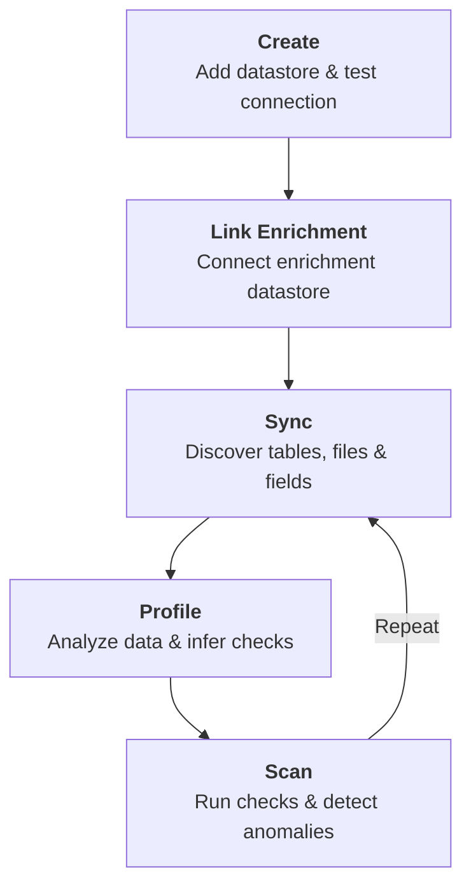
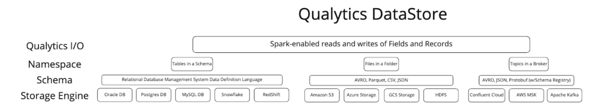
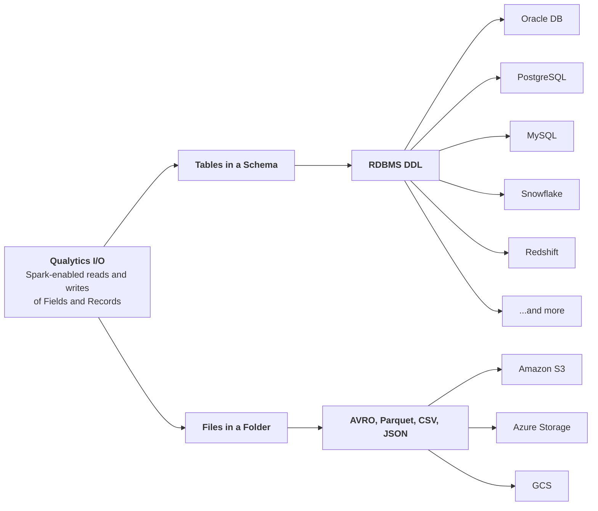
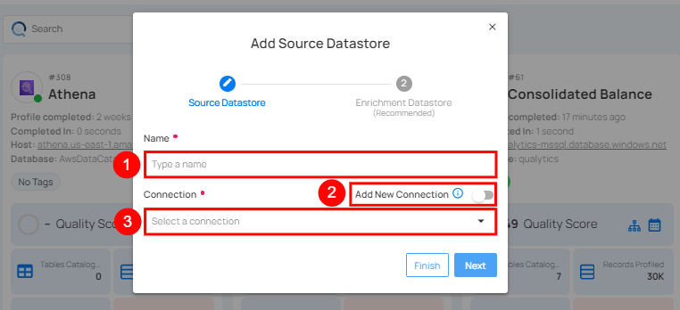
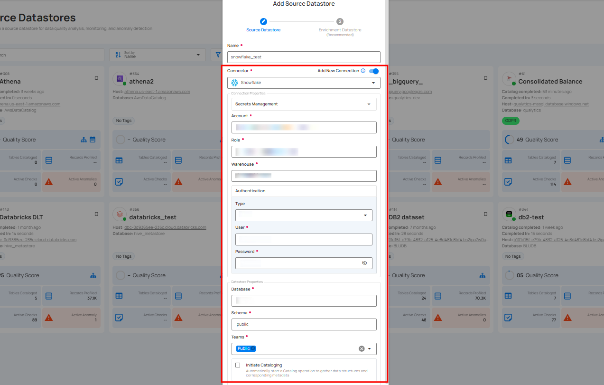
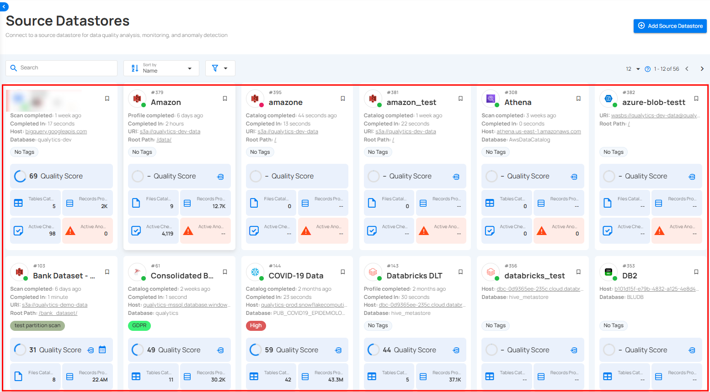
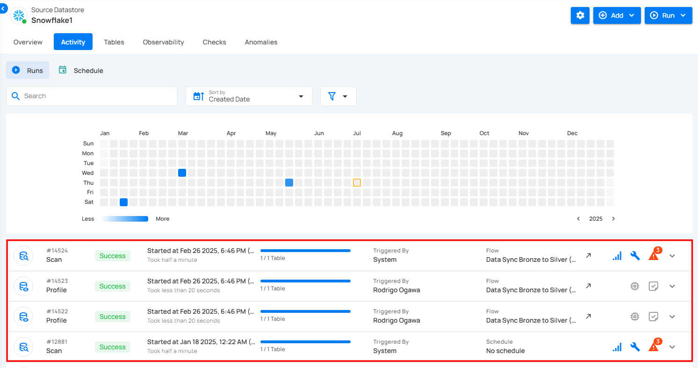

# Getting Started with Datastores

## What is a Datastore?

A **datastore** is a general term for any system or service that persists data — whether it's a relational database, a distributed file system, a data warehouse, or a cloud object storage bucket. The concept has evolved alongside the data landscape: from traditional on-premise databases in the 1970s–90s, through the rise of data warehouses and data lakes in the 2000s, to today's modern cloud-native platforms that span multiple engines and formats.

!!! info "Learn more"
    For a broader understanding of datastores and how they fit into the modern data stack, see [What is a Data Store?](https://aws.amazon.com/what-is/data-store/){:target="_blank"} by AWS.

## Datastores in Qualytics

In Qualytics, a **Source Datastore** is a unified abstraction that represents any structured data source — regardless of the underlying storage engine. Rather than building separate integrations for each platform, Qualytics uses [Apache Spark](https://spark.apache.org/){:target="_blank"} to read and write **Fields** and **Records** across all supported connectors, providing a consistent data quality experience whether your data lives in a relational database, a distributed file system, or a cloud storage service.

This abstraction enables organizations to:

* **Connect** with a wide range of source datastores through verified connectors.
* **Support** both traditional databases and modern object storage.
* **Profile** and monitor structured data across systems.
* **Secure** fast and reliable access to data.
* **Scale** data quality operations across platforms.
* **Manage** data quality centrally across all sources.

These source datastore integrations ensure comprehensive quality management across your entire data landscape, regardless of where your data resides.

### Datastore Lifecycle

Every datastore in Qualytics follows a structured lifecycle — from initial creation through ongoing data quality operations.

| Stage | Description |
| :--- | :--- |
| **Create** | Add a new source datastore by selecting a connector, providing connection credentials, and testing the connection. |
| **Link Enrichment** | Optionally link an enrichment datastore to persist scan results, anomalies, and remediation data. |
| **Sync** | Discover the schema — tables, files, views, and fields — from your source datastore. This is the first operation after creation. |
| **Profile** | Analyze field patterns across records, detect data types, compute statistics, and automatically infer quality checks. |
| **Scan** | Execute quality checks against the data, measure data quality metrics, and detect anomalies from failed checks. |

!!! tip
    The **Sync → Profile → Scan** cycle is repeatable. As your data evolves, re-running these operations keeps your quality checks and anomaly detection up to date.

### Architecture

The Qualytics Datastore framework is organized in four layers:

| Layer | Description |
| :--- | :--- |
| **Qualytics I/O** | Spark-enabled reads and writes of Fields and Records — the common interface for all datastores. |
| **Namespace** | How data is organized within the storage engine: **Tables in a Schema** (JDBC), **Files in a Folder** (DFS), or **Topics in a Broker** (Streaming). |
| **Schema** | The data definition layer: **RDBMS DDL** for relational databases, **AVRO/Parquet/CSV/JSON** for file systems, or **AVRO/JSON/Protobuf** for streaming platforms. |
| **Storage Engine** | The actual platform where data resides (see supported engines below). |

### Supported Storage Engines

!!! info "Supported Storage Engines"
    For the full list of supported JDBC and DFS connectors, see the [Available Datastore Connectors](available-datastore-connectors.md){:target="_blank"} page.

<!-- COMMENTED OUT: Original architecture image preserved for reference

END COMMENTED OUT -->

### How It All Connects

The key insight is that **Qualytics treats all datastores uniformly at the I/O layer**. Whether you connect a PostgreSQL database or an S3 bucket, Qualytics reads and writes Fields and Records the same way — enabling consistent profiling, scanning, and anomaly detection across your entire data landscape.

## Available Connectors

Qualytics supports 19 JDBC relational database connectors and 3 DFS cloud storage connectors out of the box.

-   :material-view-list:{ .lg .middle } **All Connectors**

    ---

    See the complete list of supported connectors with links to their individual setup guides.

    [:octicons-arrow-right-24: View Connectors](available-datastore-connectors.md)

## Deep Dive

Explore the details of each datastore type — how JDBC and DFS connectors work, their configuration, and supported features.

-   :material-database-marker-outline:{ .lg .middle } **JDBC**

    ---

    Learn how to connect relational databases using JDBC connectors like PostgreSQL, Snowflake, Oracle, and more.

    [:octicons-arrow-right-24: Understanding JDBC](overview-of-a-jdbc-datastore.md)

-   :material-file-marker-outline:{ .lg .middle } **DFS**

    ---

    Learn how to connect distributed file systems like Amazon S3, Azure Data Lake Storage, and Google Cloud Storage.

    [:octicons-arrow-right-24: Understanding DFS](overview-of-a-dfs-datastore.md)

## Connection

Learn how to set up and manage connections to your datastores — create new connections from scratch or reuse existing credentials.

-   :material-connection:{ .lg .middle } **Connections Overview**

    ---

    Set up new connections or reuse existing credentials to connect your datastores.

    [:octicons-arrow-right-24: Connections Overview](connections/introduction.md)

## Multiple-Schema

Discover and onboard multiple schemas from a single connection at once — including schema discovery, name templates, supported connectors, and API reference.

-   :material-vector-combine:{ .lg .middle } **Introduction**

    ---

    Discover and onboard multiple schemas from a single connection in one step.

    [:octicons-arrow-right-24: Getting Started](multi-schema/overview.md)

-   :material-cog-outline:{ .lg .middle } **How It Works**

    ---

    Understand the multi-schema creation flow, schema discovery, and name templates.

    [:octicons-arrow-right-24: How It Works](multi-schema/how-it-works.md)

-   :material-database-outline:{ .lg .middle } **Supported Connectors**

    ---

    See which connectors support multi-schema discovery and their catalog/schema mappings.

    [:octicons-arrow-right-24: Supported Connectors](multi-schema/supported-connectors.md)

-   :material-shield-lock-outline:{ .lg .middle } **Permissions**

    ---

    Understand the roles and permissions required for multi-schema creation.

    [:octicons-arrow-right-24: Permissions](multi-schema/permissions.md)

-   :material-api:{ .lg .middle } **API**

    ---

    API endpoints for bulk datastore creation, schema discovery, and validation.

    [:octicons-arrow-right-24: API](api.md#multi-schema-creation)

-   :material-help-circle-outline:{ .lg .middle } **FAQ**

    ---

    Answers to common questions about multi-schema source datastore creation.

    [:octicons-arrow-right-24: FAQ](multi-schema/faq.md)

## Managing

Add, edit, and delete datastores — whether creating from scratch with a new connection or reusing an existing one.

-   :material-plus-circle:{ .lg .middle } **Add Datastore with new connection**

    ---

    Create a new source datastore by setting up a new connection from scratch.

    [:octicons-arrow-right-24: New Connection](connections/new-connection.md)

-   :material-link-variant:{ .lg .middle } **Add Datastore with existing connection**

    ---

    Create a new source datastore by reusing credentials from an existing connection.

    [:octicons-arrow-right-24: Existing Connection](connections/existing-connection.md)

-   :material-pencil-outline:{ .lg .middle } **Edit Datastore**

    ---

    Modify the settings and connection details of an existing datastore.

    [:octicons-arrow-right-24: Edit Datastore](../managing-datastores/edit-datastore.md)

-   :material-trash-can-outline:{ .lg .middle } **Delete Datastore**

    ---

    Remove a datastore and its associated configuration from Qualytics.

    [:octicons-arrow-right-24: Delete Datastore](../managing-datastores/delete-datastore.md)

<!-- COMMENTED OUT: Content below is preserved but hidden pending restructuring

## Configuring Source Datastores

Configure your source datastores in Qualytics by connecting them through a new datastore.

**Step 1**: Log in to your Qualytics account and click on the **Add Source Datastore** button located at the top-right corner of the interface.

**Step 2**: A modal window, **Add Datastore**, will appear, providing you with the options to connect a datastore.

| REF. | FIELDS | ACTIONS |
| :---- | :---- | :---- |
| 1. | Name | Specify the name of the datastore (e.g., the specified name will appear on the datastore cards). |
| 2. | Toggle Button | Toggle **on** to create a new source datastore from scratch, or toggle **off** to reuse credentials from an existing connection. |
| 3. | Connector | Select **Any source datastore** from the dropdown list. |

## Multi-Schema Source Datastore Creation

For JDBC-based connectors, Qualytics supports creating multiple source datastores from a single connection in one step. This is useful when your database has multiple schemas that need to be onboarded simultaneously.

With multi-schema creation, you can:

* Automatically discover available catalogs and schemas from a connection.
* Select multiple schemas and create all corresponding datastores in a single operation.
* Optionally link all newly created datastores to an enrichment datastore.

For detailed instructions, refer to the [**Multi-Schema Source Datastore Creation**](../add-datastores/multi-schema/overview.md) documentation.

## Connection Management

To connect to a datastore, users must provide the required connection details, such as Host/Port or URI. These fields may vary depending on the datastore and are essential for establishing a secure and reliable connection to the target database.

For demonstration purposes, we have selected the **Snowflake** connector.

### Option I: Create a Datastore with a New Connection

If the toggle for **Add New Connection** is turned on, this will prompt you to add and configure the source datastore from scratch without using existing connection details.

**Step 1**: Select any connector (as we are selecting the **Snowflake** connector) from the dropdown list and add connection properties such as Secrets Management, host, port, username, and password, along with datastore properties like catalog, database, etc.

For the next steps, refer to the "[**Add Source Datastore**](../add-datastores/snowflake.md#add-a-source-datastore)" section in the **Snowflake** Datastore documentation.

Once a datastore is verified and created, it appears in your source datastores.

## Datastore Operations

Once a datastore is added in Qualytics, you can perform three key operations to manage and ensure data quality effectively:

**1. Sync Operation**

   This operation detects new, changed, or removed containers and fields in the source datastore. It works incrementally, comparing the current state against what Qualytics already knows and only processing the differences. It identifies incremental fields for scans and allows you to recreate or delete containers, streamlining data organization and enhancing discovery.

   For more details about the sync operation, refer to the "[**Sync Operation**](../../source-datastore/operations/sync.md)" document.

**2. Profile Operation**

   After syncing, the Profile Operation analyzes each record within the collections to assess and improve data quality. By generating detailed metadata and interacting with the Qualytics Inference Engine, it identifies quality issues and refines checks for maintaining data integrity.

   For more details about the profile operation, refer to the "[**Profile Operation**](../../source-datastore/operations/profile.md)" document.

**3. Scan Operation**

   Finally, the Scan Operation enforces data quality checks on the collections. It identifies anomalies at the record and schema levels, highlights structural issues, and records all findings for further analysis. Flexible options allow for incremental scans, specific table/file scans, and scheduling future scans.

   For more details about the scan operation, refer to the "[**Scan Operation**](../../source-datastore/operations/scan.md)" document.

By performing these operations sequentially, you can efficiently manage and ensure the quality of your data in Qualytics.

## View Operation

Once the datastores are connected, you can run operations on the selected datastore. To track the progress, simply navigate to the **Activity** tab, where you can view the running operation.

**Step 1:** Simply click to open the datastore on which you ran the operation.

**Step 2:** After clicking on the datastore, select the "Activity" tab to view the ongoing operation.

END COMMENTED OUT -->
