# Presto

Adding and configuring a Presto connection within Qualytics empowers the platform to build a symbolic link with your schema to perform operations like data discovery, visualization, reporting, syncing, profiling, scanning, anomaly surveillance, and more.

This documentation provides a step-by-step guide on how to add Presto as both a source and enrichment datastore in Qualytics. It covers the entire process, from initial connection setup to testing and finalizing the configuration.

By following these instructions, enterprises can ensure their Presto environment is properly connected with Qualytics, unlocking the platform's potential to help you proactively manage your full data quality lifecycle.

Let’s get started 🚀

## Presto Setup Guide

Qualytics connects to Presto through the **Presto JDBC driver**. It uses standard SQL queries for data profiling and scanning. Since Presto is a distributed query engine, permissions are determined by the underlying data source (connector) configured in the Presto catalog (e.g., Hive, MySQL, PostgreSQL).

### Minimum Presto Permissions (Source Datastore)

| Permission                                    | Purpose                                                                 |
|-----------------------------------------------|-------------------------------------------------------------------------|
| `SELECT` on target tables                     | Read data from tables for profiling and scanning                        |
| Access to the Presto catalog                  | Browse available schemas and tables                                     |
| Access to the Presto schema                   | Browse available tables and columns                                     |

The actual permissions depend on the Presto security model configured for your deployment:

| Security Model              | How Permissions Are Managed                                                  |
|-----------------------------|------------------------------------------------------------------------------|
| **No security (default)**   | All users have full read access to all catalogs and schemas                  |
| **File-based access control** | Permissions are defined in `rules.json` — ensure the Qualytics user has `SELECT` on the target catalog and schema |
| **Connector-level security** | Permissions are delegated to the underlying data source (e.g., Hive Metastore, RDBMS grants) — ensure the Qualytics user has read access at the source level |

!!! note
    Qualytics does not support Presto as an enrichment datastore. You can point to a different enrichment datastore instead.

### Example: File-Based Access Control Configuration

If your Presto deployment uses file-based access control (`rules.json`), ensure the Qualytics user has `SELECT` access to the target catalog and schema:

```json
{
  "catalogs": [
    {
      "user": "qualytics_read",
      "catalog": "<catalog_name>",
      "allow": "read-only"
    }
  ]
}
```

!!! tip
    If your Presto deployment uses connector-level security (e.g., Hive Metastore), grant the equivalent `SELECT` permissions directly in the underlying data source instead of using `rules.json`.

### Troubleshooting Common Errors

| Error                                          | Likely Cause                                                                 | Fix                                                                                     |
|------------------------------------------------|------------------------------------------------------------------------------|-----------------------------------------------------------------------------------------|
| `Access Denied: Cannot select from table`      | The user lacks `SELECT` on the target table in the Presto access control rules or the underlying connector | Add `SELECT` permission for the user in `rules.json` or grant access in the underlying data source |
| `Catalog does not exist`                       | The catalog name in the connection form does not match a configured Presto catalog | Verify available catalogs with `SHOW CATALOGS` in Presto                               |
| `Schema does not exist`                        | The schema name does not exist in the specified catalog                       | Verify available schemas with `SHOW SCHEMAS FROM <catalog>`                             |
| `Connection refused`                           | The Presto coordinator is not reachable or the port (default 8080) is incorrect | Verify the host, port, and that the Presto coordinator is running                      |
| `Authentication failed`                        | Incorrect username or password, or the Presto server requires a different authentication method | Verify credentials and check if the Presto server uses LDAP, Kerberos, or password file authentication |

### Detailed Troubleshooting Notes

#### Authentication Errors

The error `Authentication failed` indicates that the credentials are incorrect or the authentication method does not match the server configuration.

Common causes:

- **Incorrect password** — the password does not match the one configured in the Presto server.
- **Wrong authentication method** — the Presto server uses LDAP or Kerberos, but the connection form provides basic username/password.
- **HTTPS required** — the Presto coordinator requires HTTPS connections, but the connection is using HTTP.

!!! note
    Presto authentication is configured at the coordinator level. Check the `password-authenticator.properties` file for the configured authentication method.

#### Permission Errors

The error `Access Denied: Cannot select from table` means the user authenticated successfully but lacks access to the target table.

Common causes:

- **File-based access control** — the `rules.json` file does not grant `SELECT` access to the Qualytics user on the target catalog or schema.
- **Connector-level security** — the underlying data source (e.g., Hive Metastore) does not grant read access to the user.
- **Catalog-level restriction** — the user has access to the schema but the catalog itself is restricted.

#### Connection Errors

The error `Connection refused` or `Catalog does not exist` indicates a connectivity or configuration issue.

Common causes:

- **Coordinator not reachable** — the Presto coordinator host or port (default 8080) is incorrect.
- **Wrong catalog name** — the catalog name in the connection form does not match a configured Presto catalog.
- **Coordinator not running** — the Presto coordinator process is not started.

!!! tip
    Start by confirming credentials are valid (authentication errors), then verify access control rules (permission errors), and finally check coordinator connectivity (connection errors).

## Add a Source Datastore

A source datastore is a storage location used to connect to and access data from external sources. Presto is an example of a source datastore, specifically a type of JDBC datastore that supports connectivity through the JDBC API. Configuring the JDBC datastore enables the Qualytics platform to access and perform operations on the data, thereby generating valuable insights.

**Step 1**: Log in to your Qualytics account and click on the **Add Source Datastore** button located at the top-right corner of the interface.

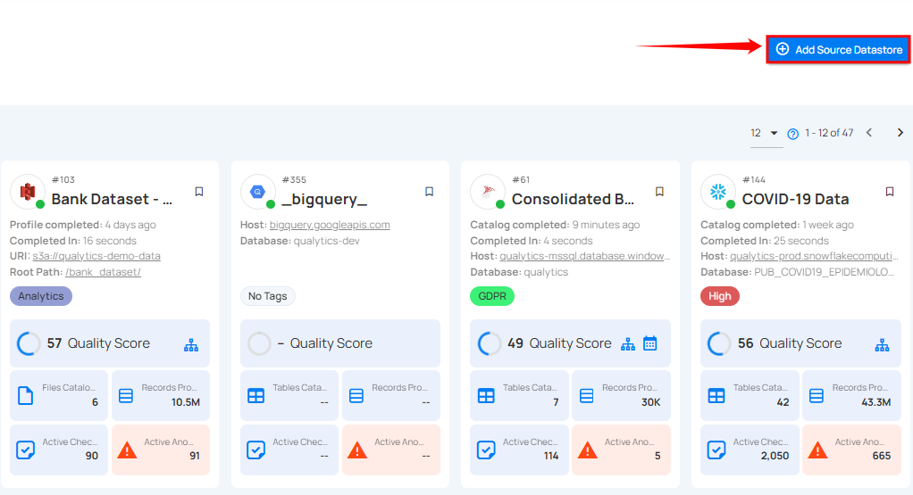

**Step 2**: A modal window- **Add Datastore** will appear, providing you with the options to connect a datastore.


| REF. | FIELDS | ACTIONS |
| :---- | :---- | :---- |
| 1. | Name (Required) | Specify the name of the datastore. (e.g., The specified name will appear on the datastore cards.) |
| 2. | Toggle Button | Toggle ON to create a new source datastore from scratch, or toggle OFF to reuse credentials from an existing connection. |
| 3. | Connector (Required) | Select **Presto** from the dropdown list. |

### Option I: Create a Source Datastore with a new Connection

If the toggle for **Add New existing connection** is turned on, then this will prompt you to add and configure the source datastore from scratch without using existing connection details.

**Step 1**: Select the **Presto** connector from the dropdown list and add connection details such as **Secrets Management**, host, port, username, database, and schema.

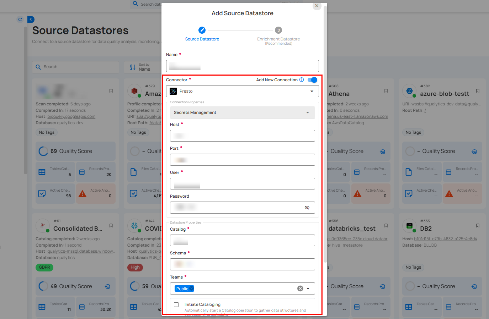

**Secrets Management**: This is an optional connection property that allows you to securely store and manage credentials by integrating with HashiCorp Vault and other secret management systems. Toggle it **ON** to enable Vault integration for managing secrets.

!!! note
    After configuring HashiCorp Vault integration, you can use ${key} in any Connection property to reference a key from the configured Vault secret. Each time the Connection is initiated, the corresponding secret value will be retrieved dynamically. 

| REF. | FIELDS | ACTION |
| :---- | :---- | :---- |
| 1. | Login URL | Enter the URL used to authenticate with HashiCorp Vault. |
| 2. | Credentials Payload | Input a valid JSON containing credentials for Vault authentication. |
| 3. | Token JSONPath | Specify the JSONPath to retrieve the client authentication token from the response (e.g., $.auth.client_token). |
| 4. | Secret URL | Enter the URL where the secret is stored in Vault. |
| 5. | Token Header Name | Set the header name used for the authentication token (e.g., X-Vault-Token). |
| 6. | Data JSONPath | Specify the JSONPath to retrieve the secret data (e.g., $.data). |

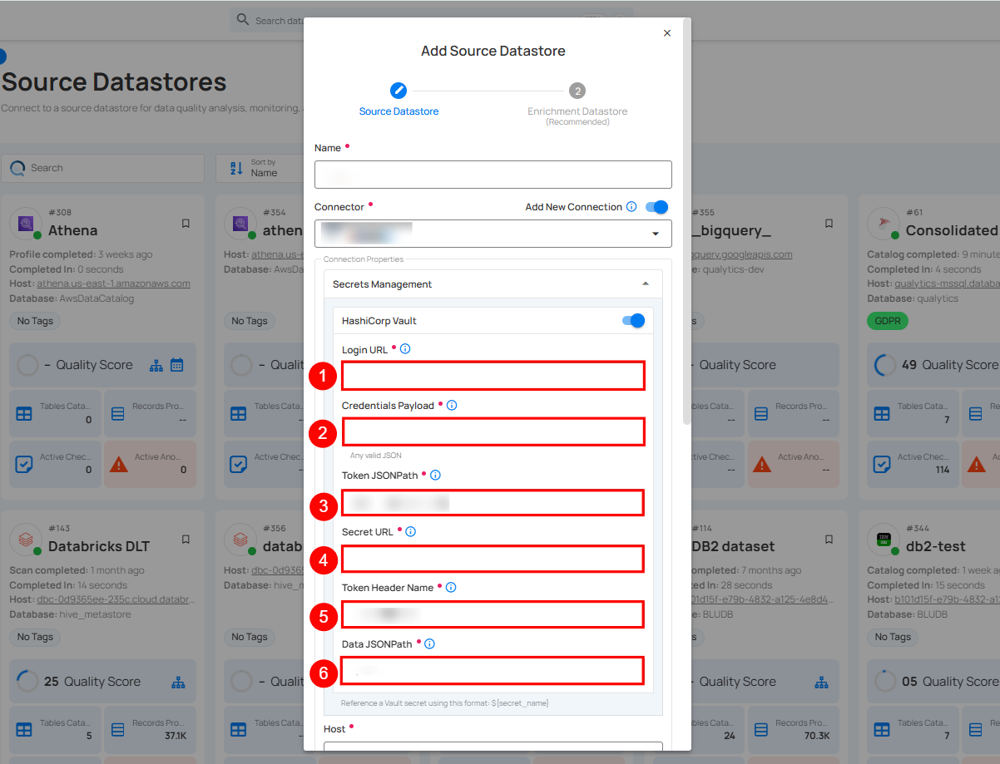

**Step 2**: The configuration form will expand, requesting credential details before establishing the connection.

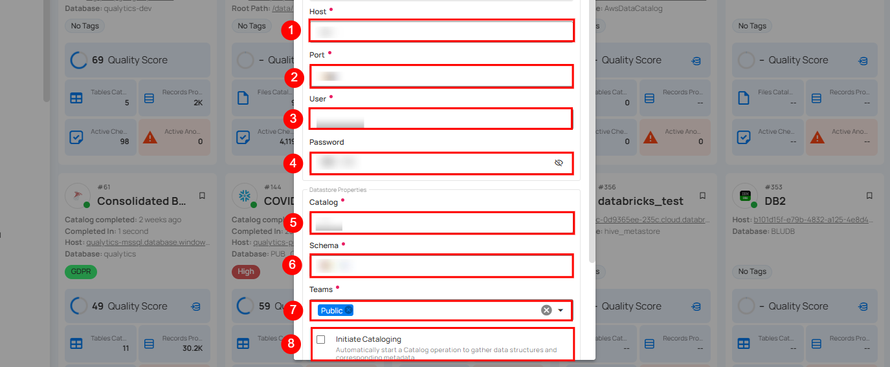

| REF. | FIELDS | ACTIONS |
| :---- | :---- | :---- |
| 1. | Host (Required) | Get **Hostname** from your Presto account and add it to this field. |
| 2. | Port (Required) | Specify the **Port** number. |
| 3. | User (Required) | Enter the **User** to connect. |
| 4. | Password (Required) | Enter the **Password** to connect to the database. |
| 5. | Catalog (Required) | Add a **Catalog** to fetch data structures and metadata from Presto. |
| 6. | Schema (Required) | Define the schema within the database that should be used. |
| 7. | Teams (Required) | Select one or more teams from the dropdown to associate with this source datastore. |
| 8. | Initiate Sync (Optional) | Tick the checkbox to automatically perform sync operation on the configured source datastore. |

**Step 3**: After adding the source datastore details, click on the **Test Connection** button to check and verify its connection.  


If the credentials and provided details are verified, a success message will be displayed indicating that the connection has been verified.

### Option II: Use an Existing Connection

If the toggle for **Add new connection** is turned off, then this will prompt you to configure the source datastore using the existing connection details.

**Step 1**: Select a **connection** to reuse existing credentials.

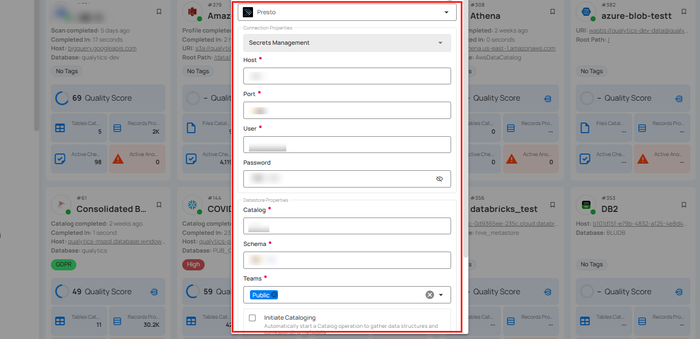

!!! note 
    If you are using existing credentials, you can only edit the details such as Database, Schema, Teams, and Initiate Sync. 

**Step 2**: Click on the **Test Connection** button to verify the existing connection details. If connection details are verified, a success message will be displayed.  

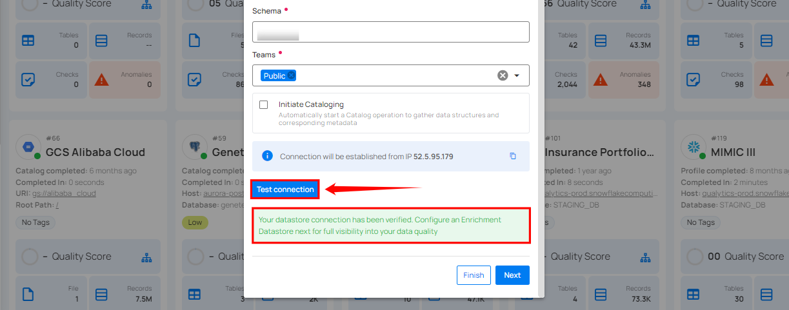

!!! note 
    Clicking on the Finish button will create the source datastore and bypass the enrichment datastore configuration step. 

!!! info 
    It is recommended to click on the Next button, which will take you to the enrichment datastore configuration page. 

## Add Enrichment Datastore

Once you have successfully tested and verified your source datastore connection, you have the option to add the enrichment datastore (recommended). The enrichment datastore is used to store the analyzed results, including any anomalies and additional metadata in tables. This setup provides full visibility into your data quality, helping you manage and improve it effectively.

!!! warning 
    Qualytics does not support the Presto connector as an enrichment datastore, but you can point to a different enrichment datastore. 

**Step 1:** Whether you have added a source datastore by creating a new datastore connection or using an existing connection, click on the **Next** button to start adding the **Enrichment Datastore**.

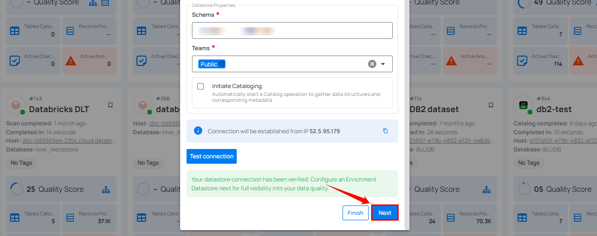

**Step 2:** A modal window **Link Enrichment Datastore** will appear, providing you with the options to configure an **enrichment datastore**.

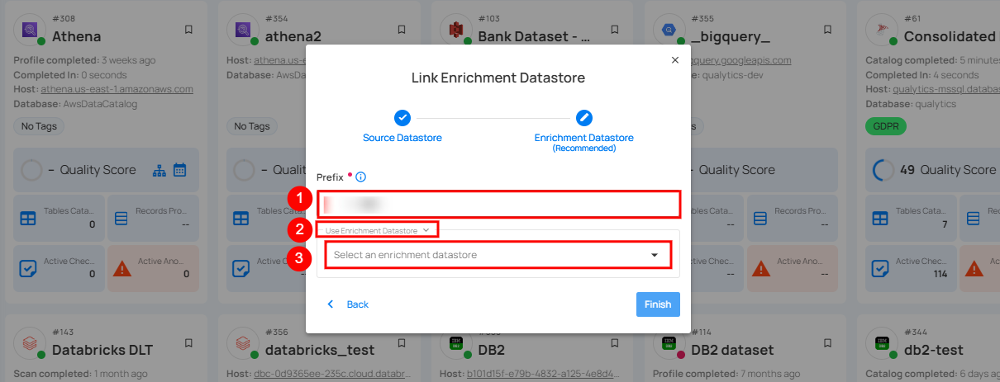

| REF. | FIELDS | ACTIONS |
| :---- | :---- | :---- |
| 1. | Prefix (Required) | Add a prefix name to uniquely identify tables/files when Qualytics writes metadata from the source datastore to your enrichment datastore. |
| 2. | Caret Down Button | Click the caret down to select either **Use Enrichment Datastore** or **Add Enrichment Datastore**. |
| 3. | Enrichment Datastore | Select an enrichment datastore from the dropdown list. |

### Option I: Create an Enrichment Datastore with a new Connection

If the toggle **Add new connection** is turned on, then this will prompt you to add and configure the enrichment datastore from scratch without using an existing enrichment datastore and its connection details.

**Step 1**: Click on the caret button and select Add Enrichment Datastore.

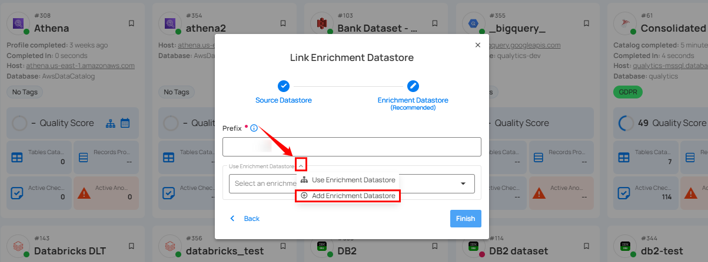

A modal window **Link Enrichment Datastore** will appear. Enter the following details to create an enrichment datastore with a new connection.

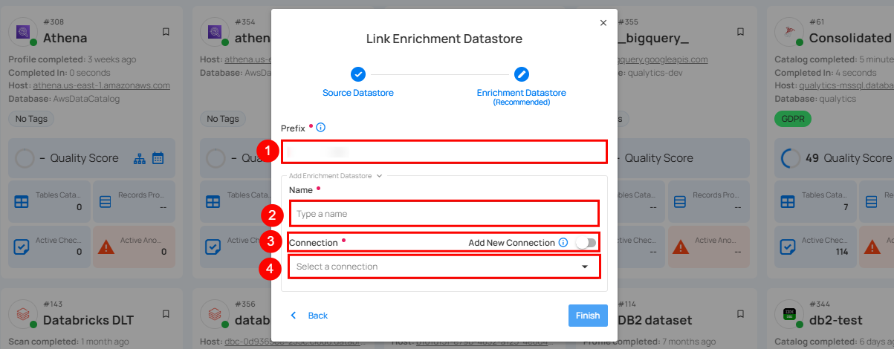

| REF. | FIELDS | ACTIONS |
| :---- | :---- | :---- |
| 1. | Prefix | Add a prefix name to uniquely identify tables/files when Qualytics writes metadata from the source datastore to your enrichment datastore. |
| 2. | Name | Give a name for the enrichment datastore. |
| 3. | Toggle Button for add new connection | Toggle ON to create a new enrichment datastore from scratch or toggle OFF to reuse credentials from an existing connection. |
| 4. | Connector | Select a datastore connector from the dropdown list. |

**Step 2:** Add connection details for your selected **enrichment datastore** connector.

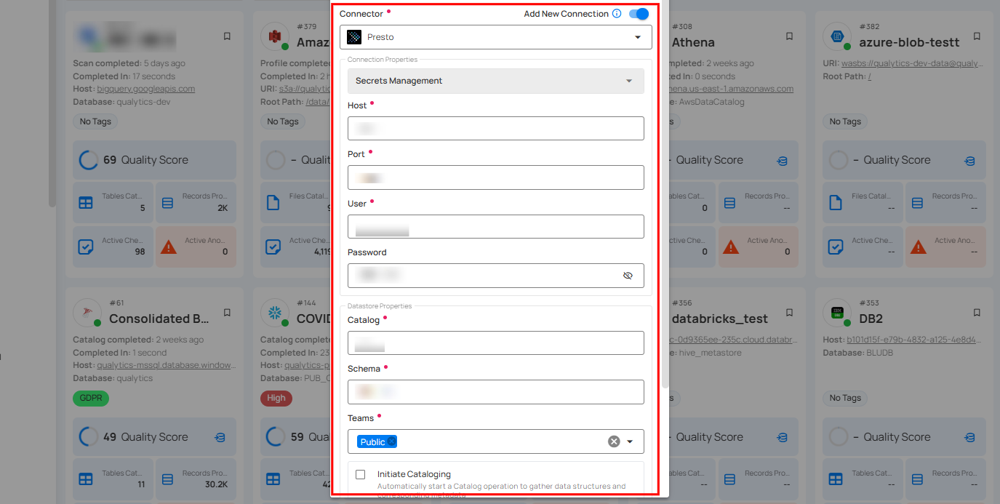

!!! note 
    Qualytics does not support Presto as an enrichment datastore. Instead, you can select a different enrichment datastore for this purpose. For demonstration purposes, we are using Microsoft SQL Server as the enrichment datastore. You can use any other JDBC or DFS datastore of your choice for the enrichment datastore configuration. 

**Step 3:** Click on the **Test Connection** button to verify the selected enrichment datastore connection. If the connection is verified, a flash message will indicate that the connection with the datastore has been successfully verified.

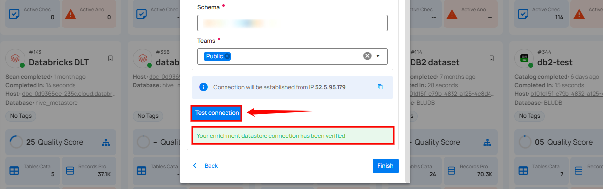

**Step 4:** Click on the **Finish** button to complete the configuration process.

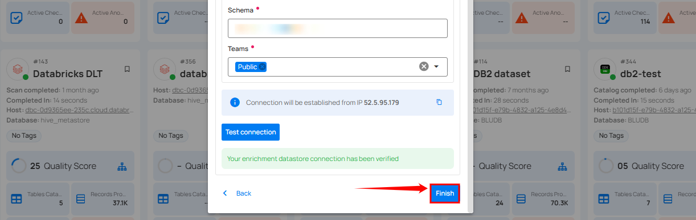

When the configuration process is finished, a modal will display a success message indicating that your datastore has been successfully added.

**Step 5:** Close the Success dialog and the page will automatically redirect you to the **Source Datastore Details** page where you can perform data operations on your configured **source datastore**.


### Option II: Use an Existing Connection

If the **Use enrichment datastore** option is selected from the caret button, you will be prompted to configure the datastore using existing connection details.

**Step 1**: Click on the caret button and select **Use Enrichment Datastore**.

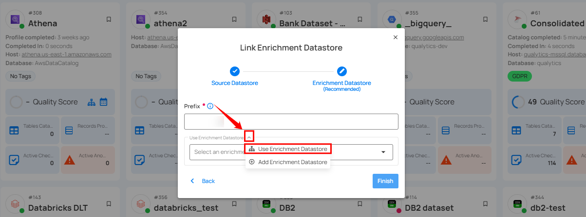

**Step 2**: A modal window **Link Enrichment Datastore** will appear. Add a prefix name and select an existing enrichment datastore from the dropdown list.

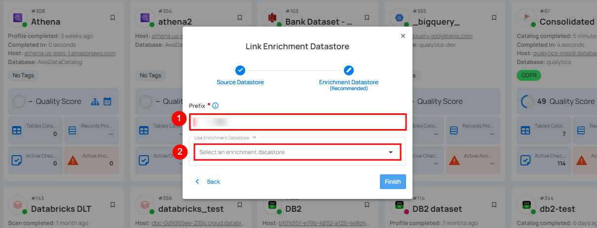

!!! note 
    Qualytics does not support Presto as an enrichment datastore. Instead, you can select a different enrichment datastore for this purpose. For demonstration purposes, we are using Microsoft SQL Server as the enrichment datastore. You can use any other JDBC or DFS datastore of your choice for the enrichment datastore configuration. 

| REF. | FIELDS | ACTIONS |
| :---- | :---- | :---- |
| 1. | Prefix | Add a prefix name to uniquely identify tables/files when Qualytics writes metadata from the source datastore to your enrichment datastore. |
| 2. | Enrichment Datastore | Select an enrichment datastore from the dropdown list. |

**Step 3:** After selecting an existing **enrichment datastore** connection, you will view the following details related to the selected enrichment:

* **Teams:** The team associated with managing the enrichment datastore is based on the role of public or private. For example, marked as **Public** means that this datastore is accessible to all users.  
* **Host:** This is the server address where the enrichment datastore instance is hosted. It is the endpoint used to connect to the enrichment datastore environment.  
* **Database:** Refers to the specific database within the enrichment datastore environment where the data is stored.  
* **Schema:** The schema used in the enrichment datastore. The schema is a logical grouping of database objects (tables, views, etc.). Each schema belongs to a single database.

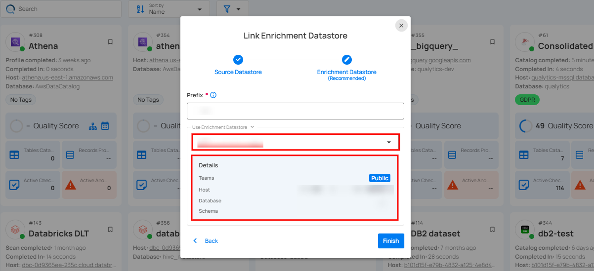

**Step 4:** Click on the **Finish** button to complete the configuration process for the existing **enrichment datastore**.

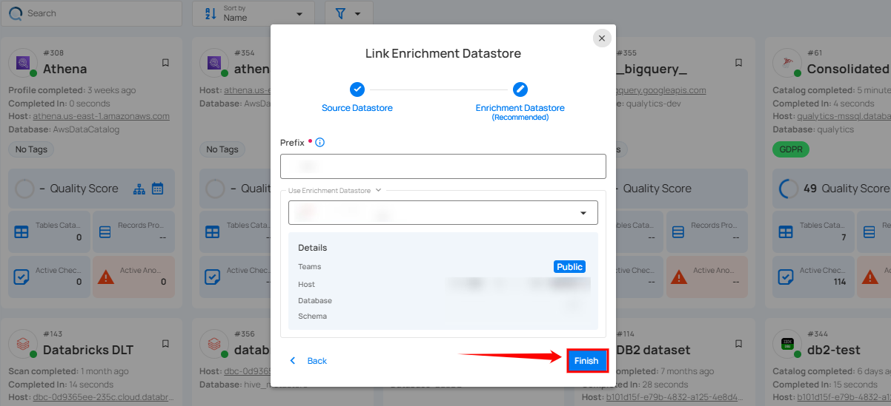

When the configuration process is finished, a modal will display a success message indicating that your data has been successfully added.  

Close the success message and you will be automatically redirected to the **Source Datastore Details** page where you can perform data operations on your configured **source datastore**.  


## API Payload Examples

This section provides detailed examples of API payloads to guide you through the process of creating and managing datastores using Qualytics API.

Each example includes endpoint details, sample payloads, and instructions on how to replace placeholder values with actual data relevant to your setup.

### Creating a Datastore

This section provides a sample payload for creating a datastore. Replace the placeholder values with actual data relevant to your setup.

#### Endpoint (Post)

`/api/datastores` _(post)_

=== "Creating a datastore with a new connection"
    ```json
        {
            "name": "your_datastore_name",
            "teams": ["Public"],
            "database": "presto_database",
            "schema": "presto_schema",
            "enrich_only": false,
            "trigger_catalog": true,
            "connection": {
                "name": "your_connection_name",
                "type": "presto",
                "host": "presto_host",
                "port": "presto_port",
                "username": "presto_username",
                "password": "presto_password",
                "parameters":{
                    "ssl_truststore":"truststore.jks"
                }
            }
        }
    ```
=== "Creating a datastore with an existing connection"
    ```json
        {
            "name": "your_datastore_name",
            "teams": ["Public"],
            "database": "presto_database",
            "schema": "presto_schema",
            "enrich_only": false,
            "trigger_catalog": true,
            "connection_id": connection-id
        }
    ```

### Linking Datastore to an Enrichment Datastore through API

#### Endpoint (Patch)

`/api/datastores/{datastore-id}/enrichment/{enrichment-id}` _(patch)_
