# Synapse

Adding and configuring a Synapse connection within Qualytics empowers the platform to build a symbolic link with your schema to perform operations like data discovery, visualization, reporting, syncing, profiling, scanning, anomaly surveillance, and more.

This documentation provides a step-by-step guide on adding Synapse as a source datastore in Qualytics. It covers the entire process, from initial connection setup to testing and finalizing the configuration.

By following these instructions, enterprises can ensure their Synapse environment is properly connected with Qualytics, unlocking the platform's potential to help you proactively manage your full data quality lifecycle.

Let’s get started 🚀

## Synapse Setup Guide

Qualytics connects to Azure Synapse Analytics through the **Microsoft JDBC driver for SQL Server**. Synapse follows the same permission model as Microsoft SQL Server. It queries system views (`sys.schemas`, `sys.database_principals`) to discover schemas and uses standard JDBC metadata APIs for tables, columns, and primary keys.

### Minimum Synapse Permissions (Source Datastore)

| Permission                              | Purpose                                                                 |
|-----------------------------------------|-------------------------------------------------------------------------|
| `CONNECT`                               | Allow the user to connect to the database                               |
| `SELECT ON SCHEMA::<schema_name>`       | Read data from all tables and views for profiling and scanning          |
| `VIEW DEFINITION ON SCHEMA::<schema_name>` | Read object definitions for metadata discovery                       |
| `SELECT ON sys.schemas`                 | Discover available schemas in the database                              |
| `SELECT ON sys.database_principals`     | Resolve schema ownership for catalog discovery                          |

### Additional Permissions for Enrichment Datastore

When using Synapse as an enrichment datastore, the following additional permissions are required for Qualytics to write metadata tables (e.g., `_qualytics_*`):

| Permission                                   | Purpose                                                            |
|----------------------------------------------|--------------------------------------------------------------------|
| `CREATE TABLE`                               | Create enrichment tables (`_qualytics_*`)                          |
| `INSERT ON SCHEMA::<schema_name>`            | Write anomaly records, scan results, and check metrics             |
| `UPDATE ON SCHEMA::<schema_name>`            | Update enrichment records during rescans                           |
| `DELETE ON SCHEMA::<schema_name>`            | Remove stale enrichment records                                    |
| `ALTER ON SCHEMA::<schema_name>`             | Modify enrichment table schemas during version migrations          |
| `DROP TABLE`                                         | Remove enrichment tables during cleanup or when the datastore is unlinked |

### Example: Source Datastore User (Read-Only)

Replace `<database_name>`, `<schema_name>`, and `<password>` with your actual values.

```sql
-- Create a login at the server level
CREATE LOGIN qualytics_read WITH PASSWORD = ‘<password>’;

-- Switch to the target database
USE <database_name>;

-- Create a user mapped to the login
CREATE USER qualytics_read FOR LOGIN qualytics_read;

-- Grant connection and read-only access
GRANT CONNECT TO qualytics_read;
GRANT SELECT ON SCHEMA::<schema_name> TO qualytics_read;
GRANT VIEW DEFINITION ON SCHEMA::<schema_name> TO qualytics_read;
```

### Example: Enrichment Datastore User (Read-Write)

```sql
-- Create a login at the server level
CREATE LOGIN qualytics_readwrite WITH PASSWORD = ‘<password>’;

-- Switch to the target database
USE <database_name>;

-- Create a user mapped to the login
CREATE USER qualytics_readwrite FOR LOGIN qualytics_readwrite;

-- Grant connection, read-write, and table management access
GRANT CONNECT TO qualytics_readwrite;
GRANT SELECT, INSERT, UPDATE, DELETE ON SCHEMA::<schema_name> TO qualytics_readwrite;
GRANT CREATE TABLE TO qualytics_readwrite;
GRANT ALTER ON SCHEMA::<schema_name> TO qualytics_readwrite;
GRANT VIEW DEFINITION ON SCHEMA::<schema_name> TO qualytics_readwrite;
```

!!! note
    Qualytics automatically filters out system schemas (`INFORMATION_SCHEMA`, `sys`, and schemas starting with `db_`) during catalog discovery. You do not need to restrict access to these schemas manually.

### Troubleshooting Common Errors

| Error                                          | Likely Cause                                                                 | Fix                                                                                     |
|------------------------------------------------|------------------------------------------------------------------------------|-----------------------------------------------------------------------------------------|
| `Login failed for user`                        | Incorrect username or password, or the login does not exist                  | Verify the login exists at the server level with `SELECT name FROM sys.sql_logins`      |
| `Cannot open database requested by the login`  | The user does not have access to the specified database                       | Ensure a user is mapped to the login in the target database with `CREATE USER ... FOR LOGIN` |
| `The SELECT permission was denied on object`   | The user lacks `SELECT` on one or more tables in the schema                  | Run `GRANT SELECT ON SCHEMA::<schema_name> TO <user>`                                   |
| `CREATE TABLE permission denied in database`   | The enrichment user lacks `CREATE TABLE` permission                          | Run `GRANT CREATE TABLE TO <user>`                                                      |
| `Cannot find the object because it does not exist or you do not have permissions` | The user lacks `VIEW DEFINITION` on the schema | Run `GRANT VIEW DEFINITION ON SCHEMA::<schema_name> TO <user>`                          |

### Detailed Troubleshooting Notes

#### Authentication Errors

The error `Login failed for user` indicates that the credentials are incorrect or the login does not exist at the server level.

Common causes:

- **Incorrect password** — the password does not match the one set for the login.
- **Login does not exist** — the login was never created at the server level with `CREATE LOGIN`.
- **User not mapped** — the login exists but no user is mapped to it in the target database.

!!! note
    Synapse uses the same authentication model as SQL Server. A login must exist at the server level, and a corresponding user must be created in each target database.

#### Permission Errors

The error `The SELECT permission was denied on object` means the user authenticated successfully but lacks the necessary grants on the target schema.

Common causes:

- **Missing `SELECT ON SCHEMA`** — the user does not have `SELECT` on the target schema.
- **Wrong schema** — the user has permissions on `dbo` but the target tables are in a different schema.
- **Missing `VIEW DEFINITION`** — the user cannot see object metadata needed for catalog discovery.

#### Connection Errors

The error `Cannot open database requested by the login` means the user does not have access to the specified database.

Common causes:

- **No user in database** — the login exists but `CREATE USER ... FOR LOGIN` was not run in the target database.
- **Database does not exist** — the database name in the connection form is incorrect.
- **Synapse pool paused** — the dedicated SQL pool is paused and needs to be resumed.

!!! tip
    Start by confirming credentials are valid (authentication errors), then verify schema/table permissions (permission errors), and finally check database access (connection errors).

## Add the Source Datastore

A source datastore is a storage location used to connect to and access data from external sources. Synapse is an example of such a datastore, specifically a type of JDBC datastore that supports connectivity through the JDBC API. Configuring the Synapse datastore allows the Qualytics platform to access and perform operations on the data, thereby generating valuable insights.

**Step 1**: Log in to your Qualytics account and click on the **Add Source Datastore** button located at the top-right corner of the interface.

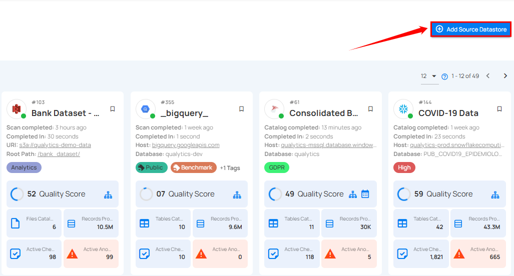

**Step 2**: A modal window - **Add Datastore** will appear, providing you with the options to connect a datastore.


| REF. | FIELDS  | ACTIONS |
| :---- | :---- | :---- |
| 1. | Name | Specify the name of the datastore (e.g., The specified name will appear on the datastore cards) |
| 2. | Toggle Button | Toggle **ON** to create a new source datastore from scratch, or toggle **OFF** to reuse credentials from an existing connection |
| 3. | Connector | Select **Synapse** from the dropdown list. |

### Option I: Create a Datastore with a new Connection

If the toggle for **Add New Connection** is turned on, then this will prompt you to add and configure the source datastore from scratch without using existing connection details.

**Step 1**: Select the **Synapse** connector from the dropdown list and add connection details such as Secret Management, host, port, username, etc.

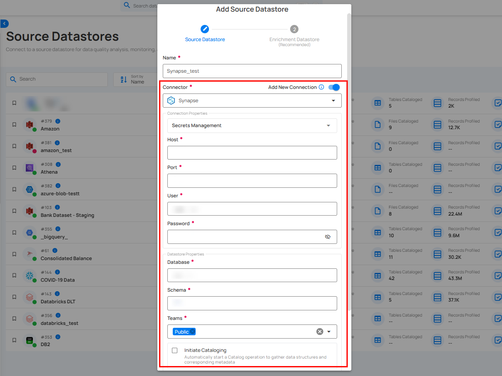

**Secrets Management**: This is an optional connection property that allows you to securely store and manage credentials by integrating with HashiCorp Vault and other secret management systems. Toggle it **ON** to enable Vault integration for managing secrets.

!!! note
    After configuring HashiCorp Vault integration, you can use ${key} in any Connection property to reference a key from the configured Vault secret. Each time the Connection is initiated, the corresponding secret value will be retrieved dynamically.

| REF. | FIELDS | ACTIONS |
| :---- | :---- | :---- |
| 1. | Login URL | Enter the URL used to authenticate with HashiCorp Vault. |
| 2. | Credentials Payload | Input a valid JSON containing credentials for Vault authentication. |
| 3. | Token JSONPath | Specify the JSONPath to retrieve the client authentication token from the response (e.g., $.auth.client_token). |
| 4. | Secret URL | Enter the URL where the secret is stored in Vault. |
| 5. | Token Header Name | Set the header name used for the authentication token (e.g., X-Vault-Token). |
| 6. | Data JSONPath | Specify the JSONPath to retrieve the secret data (e.g., $data). |

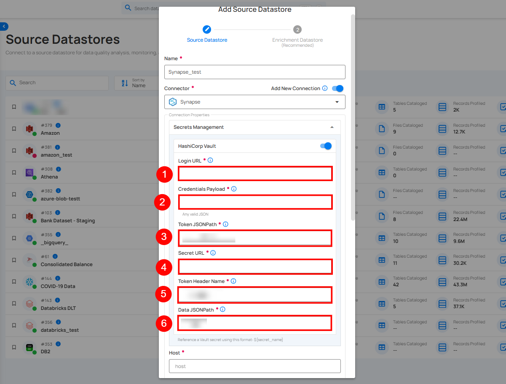

**Step 2**: The configuration form will expand, requesting credential details before establishing the connection.

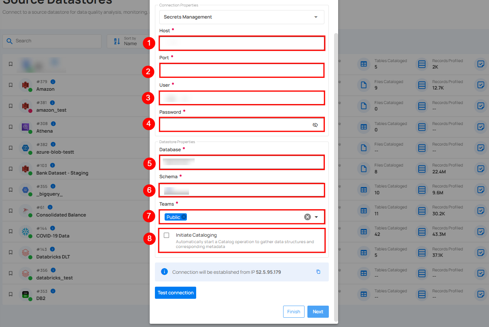

| REF. | FIELDS | ACTIONS |
| :---- | :---- | :---- |
| 1. | Host | Get **Hostname** from your Synapse account and add it to this field. |
| 2. | Port | Specify the **Port** number. |
| 3. | User | Enter the **User ID** to connect. |
| 4. | Password | Enter the **Password** to connect to the database. |
| 5. | Database | Specify the database name. |
| 6. | Schema | Define the schema within the database that should be used. |
| 7. | Teams | Select one or more teams from the dropdown to associate with the source datastore. |
| 8. | Initiate Sync | Tick the checkbox to automatically perform sync operation on the configured source datastore to detect new, changed, or removed containers and fields. |

**Step 3**: After adding the source datastore details, click on the **Test Connection** button to check and verify its connection.

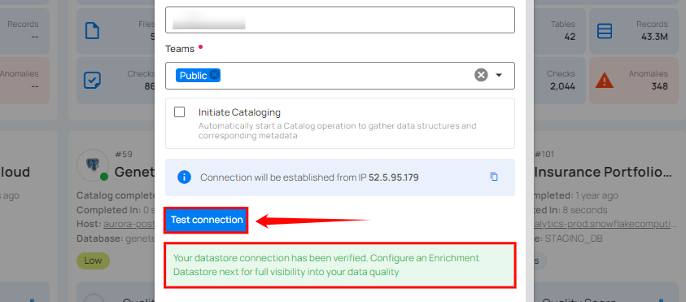

If the credentials and provided details are verified, a success message will be displayed indicating that the connection has been verified.

### Option II: Use an Existing Connection

If the toggle for **Use an existing connection** is turned off, then this will prompt you to configure the source datastore using the existing connection details.

**Step 1**: Select a **connection** to reuse existing credentials.

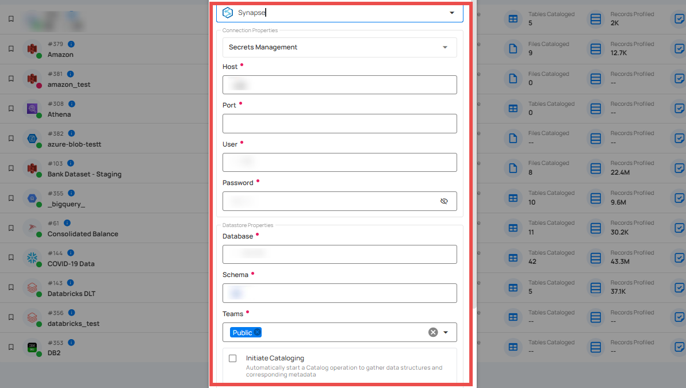

!!! note
    If you are using existing credentials, you can only edit the details such as Database, Teams, and Initiate Sync.

**Step 2**: Click on the **Test Connection** button to check and verify the source data connection. If connection details are verified, a success message will be displayed.


!!! note
    Clicking on the Finish button will create the source datastore and bypass the enrichment datastore configuration step.  

!!! tip
    It is recommended to click on the Next button, which will take you to the enrichment datastore configuration page.

## Add Enrichment Datastore

After successfully testing and verifying your source datastore connection, you have the option to add an enrichment datastore (recommended). This datastore is used to store analyzed results, including any anomalies and additional metadata in tables. This setup provides comprehensive visibility into your data quality, enabling you to manage and improve it effectively.

!!! warning
    Qualytics does not support the Synapse connector as an enrichment datastore, but you can point to a different enrichment datastore.

**Step 1**: Whether you have added a source datastore by creating a new datastore connection or using an existing connection, click on the **Next** button to start adding the **Enrichment Datastore**.

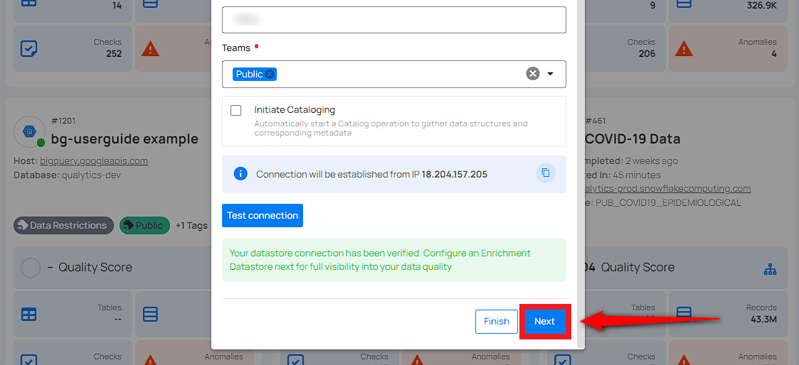

**Step 2**: A modal window - **Link Enrichment Datastore** will appear, providing you with the options to configure an **enrichment datastore**.

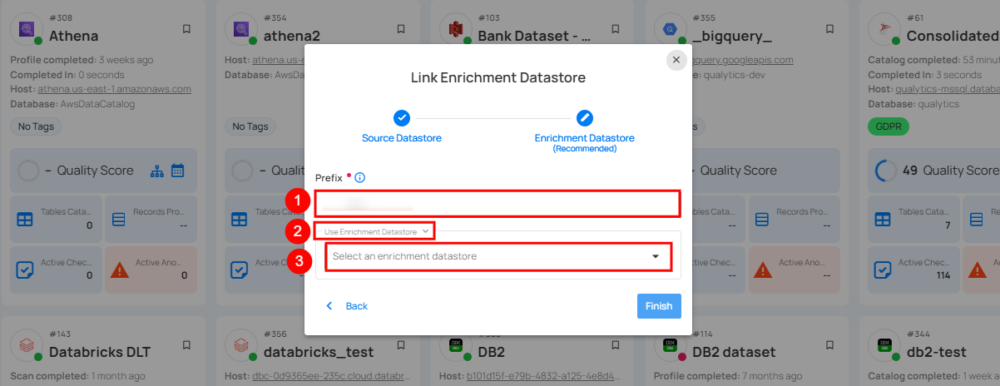

| REF. | FIELDS | ACTIONS |
| :---- | :---- | :---- |
| 1. | Prefix (Required) | Add a prefix name to uniquely identify tables/files when Qualytics writes metadata from the source datastore to your enrichment datastore. |
| 2. | Caret Down Button | Click the caret down to select either **Use Enrichment Datastore** or **Add Enrichment Datastore**. |
| 3. | Enrichment Datastore | Select an enrichment datastore from the dropdown list. |

### Option I: Create an Enrichment Datastore with a new Connection

If the toggle **Add new connection** is turned on, then this will prompt you to add and configure the enrichment datastore from scratch without using an existing enrichment datastore and its connection details.

**Step 1**: Click on the caret button and select Add Enrichment Datastore.

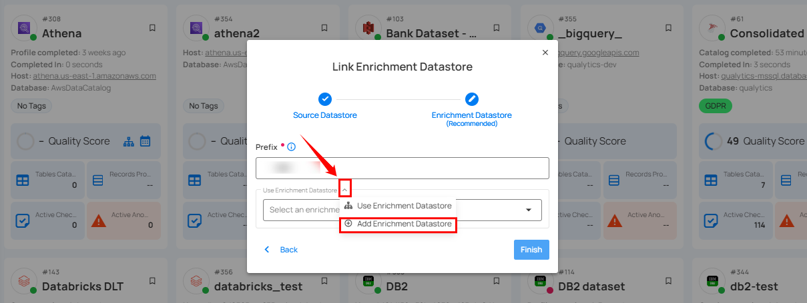

A modal window **Link Enrichment Datastore** will appear. Enter the following details to create an enrichment datastore with a new connection.

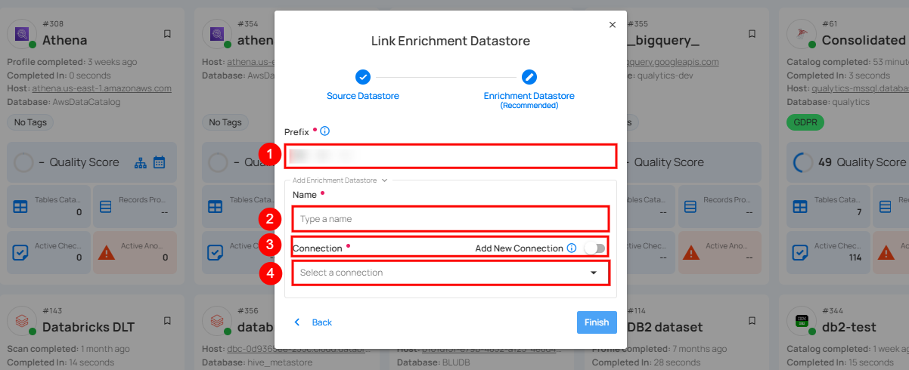

| REF. | FIELDS | ACTIONS |
| :---- | :---- | :---- |
| 1. | Prefix | Add a prefix name to uniquely identify tables/files when Qualytics writes metadata from the source datastore to your enrichment datastore. |
| 2. | Name | Give a name for the enrichment datastore. |
| 3. | Toggle Button for Add New Connection  | Toggle ON to create a new enrichment datastore from scratch or toggle OFF to reuse credentials from an existing connection. |
| 4. | Connector | Select a datastore connector from the dropdown list. |

**Step 2**: Add connection details for your selected **enrichment datastore** connector.

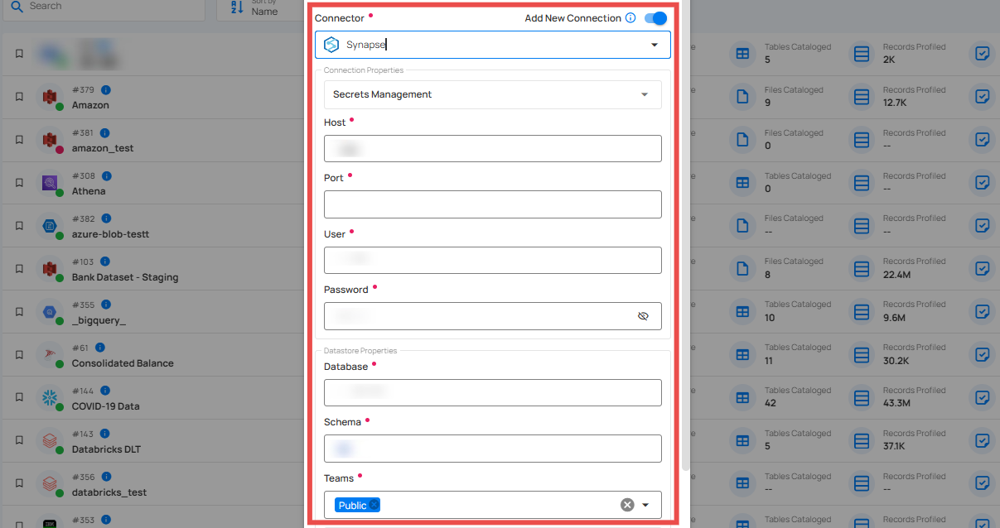

**Step 3**: Click on the **Test Connection** button to verify the selected enrichment datastore connection. If the connection is verified, a flash message will indicate that the connection with the datastore has been successfully verified.

If the connection is verified, a flash message will indicate that the connection with the datastore has been successfully verified.

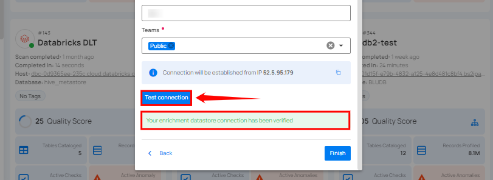

**Step 4**: Click on the **Finish** button to complete the configuration process.

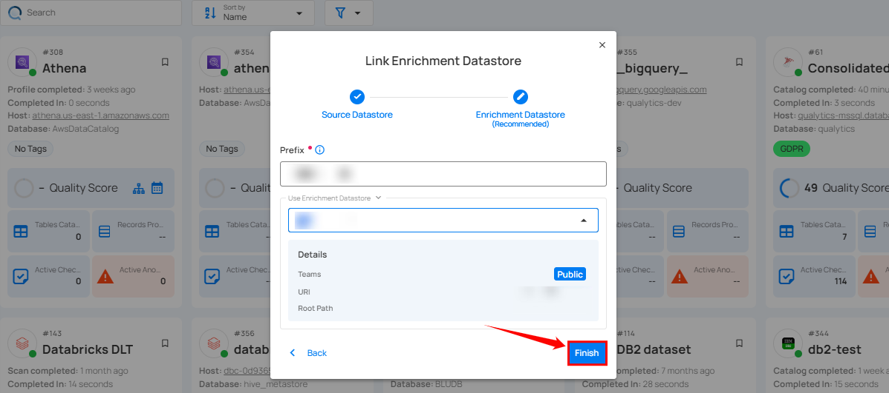

When the configuration process is finished, a modal will display a success message indicating that your datastore has been successfully added.

**Step 5**: Close the Success dialogue and the page will automatically redirect you to the **Source Datastore Details** page where you can perform data operations on your configured **source datastore**.


### Option II: Use an Existing Connection

If the **Use enrichment datastore** option is selected from the caret button, you will be prompted to configure the datastore using existing connection details.

**Step 1**: Click on the caret button and select **Use Enrichment Datastore**.

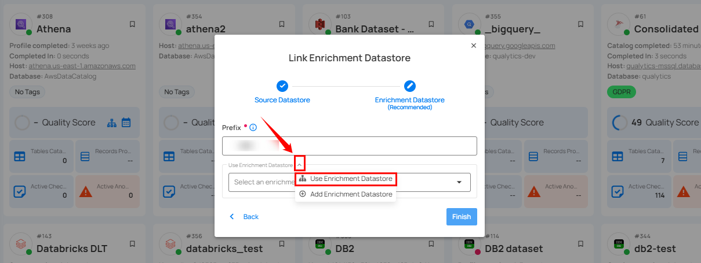

**Step 2**: A modal window **Link Enrichment Datastore** will appear. Add a prefix name and select an existing enrichment datastore from the dropdown list.

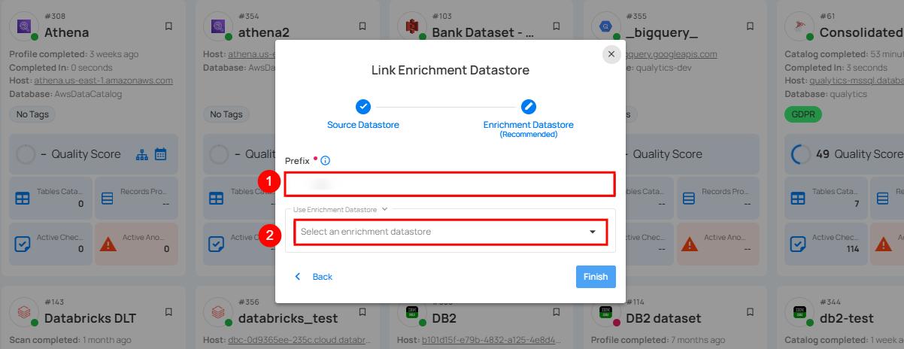

| REF. | FIELDS | ACTIONS |
| :---- | :---- | :---- |
| 1. | Prefix | Add a prefix name to uniquely identify tables/files when Qualytics writes metadata from the source datastore to your enrichment datastore. |
| 2. | Enrichment Datastore | Select an enrichment datastore from the dropdown list. |

**Step 3**: After selecting an existing **enrichment datastore** connection, you will view the following details related to the selected enrichment:

* **Teams**: The team associated with managing the enrichment datastore is based on the role of public or private. Example - Marked as **Public** means that this datastore is accessible to all the users.  
* **Host**: This is the server address where the enrichment datastore instance is hosted. It is the endpoint used to connect to the enrichment datastore environment.  
* **Database**: Refers to the specific database within the enrichment datastore environment where the data is stored.  
* **Schema**: The schema used in the enrichment datastore. The schema is a logical grouping of database objects (tables, views, etc.). Each schema belongs to a single database.

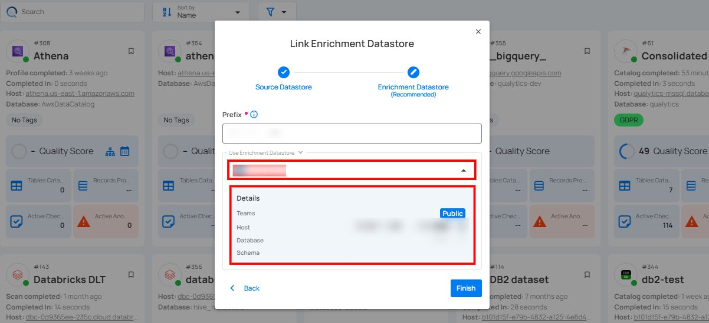

**Step 4**: Click on the **Finish** button to complete the configuration process for the existing **enrichment datastore**.


When the configuration process is finished, a modal will display a success message indicating that your data has been successfully added.

Close the success message and you will be automatically redirected to the **Source Datastore Details** page where you can perform data operations on your configured **source datastore**.


## API Payload Examples

### Creating a Datastore

This section provides a sample payload for creating a datastore. Replace the placeholder values with actual data relevant to your setup.

#### Endpoint (Post)

`/api/datastores` _(post)_

=== "Creating a datastore with a new connection"
    ```json
        {
            "name": "your_datastore_name",
            "teams": ["Public"],
            "database": "synapse_database",
            "schema": "synapse_schema",
            "enrich_only": false,
            "trigger_catalog": true,
            "connection": {
                "name": "your_connection_name",
                "type": "synapse",
                "host": "synapse_host",
                "port": "synapse_port",
                "username": "synapse_username",
                "password": "synapse_password"
            }
        }
    ```
=== "Creating a datastore with an existing connection"
    ```json
        {
            "name": "your_datastore_name",
            "teams": ["Public"],
            "database": "synapse_database",
            "schema": "synapse_schema",
            "enrich_only": false,
            "trigger_catalog": true,
            "connection_id": connection-id
        }
    ```
=== "Create a Source Datastore using the CLI"
    ```bash
    # Step 1: Create a Connection
    qualytics connections create \
        --type synapse \
        --name "your_connection_name" \
        --host ${SYNAPSE_HOST} \
        --port 1433 \
        --username ${SYNAPSE_USER} \
        --password ${SYNAPSE_PASSWORD}

    # Step 2: Create a Source Datastore
    qualytics datastores create \
        --name "your_datastore_name" \
        --connection-name "your_connection_name" \
        --database your_database \
        --schema dbo
    ```

### Creating an Enrichment Datastore

#### Endpoint (Post)

`/api/datastores` _(post)_

This section provides a sample payload for creating an enrichment datastore. Replace the placeholder values with actual data relevant to your setup.

=== "Creating an enrichment datastore with a new connection"
    ```json
        {
            "name": "your_datastore_name",
            "teams": ["Public"],
            "database": "synapse_database",
            "schema": "synapse_schema",
            "enrich_only": true,
            "connection": {
                "name": "your_connection_name",
                "type": "synapse",
                "host": "synapse_host",
                "port": "synapse_port",
                "username": "synapse_username",
                "password": "synapse_password"
            }
        }
    ```
=== "Creating an enrichment datastore with an existing connection"
    ```json
        {
            "name": "your_datastore_name",
            "teams": ["Public"],
            "database": "synapse_database",
            "schema": "synapse_schema",
            "enrich_only": true,
            "connection_id": connection-id
        }
    ```
=== "Create an Enrichment Datastore using the CLI"
    ```bash
    # Step 1: Create a Connection
    qualytics connections create \
        --type synapse \
        --name "your_connection_name" \
        --host ${SYNAPSE_HOST} \
        --port 1433 \
        --username ${SYNAPSE_USER} \
        --password ${SYNAPSE_PASSWORD}

    # Step 2: Create an Enrichment Datastore
    qualytics datastores create \
        --name "your_datastore_name" \
        --connection-name "your_connection_name" \
        --database your_database \
        --schema your_enrichment_schema \
        --enrichment-only
    ```

### Linking Datastore to an Enrichment Datastore through API

#### Endpoint (Patch)

`/api/datastores/{datastore-id}/enrichment/{enrichment-id}` _(patch)_
