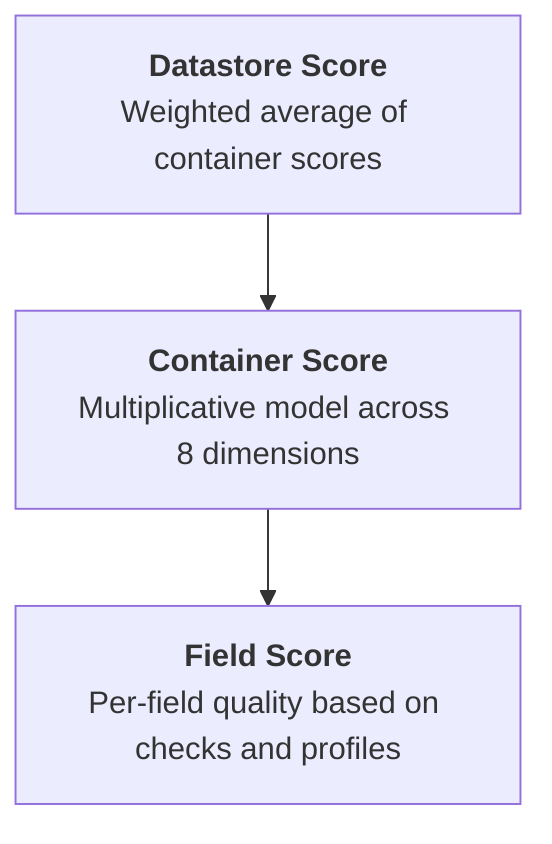

# Datastore Quality Score Introduction

## What is a Data Quality Score?

A Data Quality Score is a quantified measure (0–100) that reflects the health of your data at every level — fields, containers, and the datastore itself. Higher scores indicate superior quality. Qualytics calculates these scores continuously as you run Profile and Scan operations, recording them as time series so you can track how data quality evolves over time.

## How Scores Influence Your Datastore

The quality score gives you a single, at-a-glance metric for every datastore in your workspace. This is critical for:

- **Prioritizing remediation** — Datastores with low scores need attention first. Within a datastore, you can drill down to identify which containers and fields are dragging the score down.
- **Tracking improvement** — After fixing data issues and re-scanning, the score reflects the improvement over time.
- **Governance reporting** — Export quality scores across datastores to demonstrate compliance and data health to stakeholders.
- **Operational awareness** — Quality scores update automatically after every Scan and Profile, giving real-time feedback on data quality.

## Score Hierarchy

Quality scores are calculated at three levels, each building on the one below:

| Level | How It's Calculated |
| :--- | :--- |
| **Field** | Each field receives a score based on its accuracy, consistency, conformity, precision, coverage, and completeness — derived from Profile metadata and Scan anomalies. |
| **Container** | Each container (table/file) aggregates its field scores using a multiplicative baseline model across 8 quality dimensions. |
| **Datastore** | The datastore score is the **weighted average** of all container scores. Only containers that have been scanned are included. Container weights can be influenced by tag weight modifiers. |

## The 8 Quality Dimensions

Every container score is composed of 8 dimensions, each measuring a different aspect of data quality:

| Dimension | Description |
| :--- | :--- |
| **Completeness** | Percentage of fields with non-null values across all profiles. |
| **Coverage** | Count and frequency of quality checks asserted for each field. More checks = higher coverage. |
| **Conformity** | Adherence to specified formats and business rules defined by quality checks. |
| **Consistency** | Uniformity of data types and representation over time — detects drift in field distributions. |
| **Precision** | Resolution of field values against defined quality checks. |
| **Timeliness** | Data availability according to expected schedules. |
| **Volumetrics** | Consistency in data volume and shape over time. |
| **Accuracy** | How well field values match their real-world counterparts. |

Each dimension produces a score from 0–100. These are combined using a **multiplicative baseline model** (starting from a baseline of 70) where each dimension's impact is proportional to its configured weight.

## Decay Period

The **decay period** controls how far back in time Qualytics looks when calculating scores. By default, only anomalies, profiles, and scans from the last **180 days** are included.

This means:

- **Old issues naturally age out** — If an anomaly was detected 6 months ago and hasn't recurred, it no longer impacts the score.
- **Recent issues weigh fully** — Any anomaly within the decay window is fully counted.
- **You control the window** — Shorten the decay period for a more real-time view, or extend it for a longer historical perspective.

## Dimension Weights

Each of the 8 dimensions has a configurable **weight** that controls its impact on the total container score:

- A weight of **1.0** (default) gives the dimension its full impact.
- A weight of **0** effectively disables the dimension — it won't negatively impact the score.
- Weights between 0 and 1 proportionally reduce the dimension's influence.

This allows you to align the scoring system with your organization's data governance priorities. For example, if timeliness is critical for your use case, increase its weight; if volumetrics is less relevant, reduce it.

## What Triggers a Recalculation?

Quality scores are automatically recalculated when:

- A **Scan operation** completes (anomalies detected or clean scan).
- A **Profile operation** completes (new field statistics available).
- An **anomaly status changes** (acknowledged, resolved, etc.).
- A **quality check is deleted**.
- An **anomaly is deleted**.

Recalculations are debounced (5-second window) to prevent redundant calculations during rapid state changes.

## Tag Weight Modifiers

Tags assigned to datastores can include a **weight modifier** (-10 to 10) that influences how individual containers contribute to the overall datastore score. Containers with higher tag weights have more impact on the datastore-level quality score.

!!! info "Tags"
    For more on how tags influence quality scores, see the [Tags Introduction](../tags/introduction.md#quality-score-impact) page.
