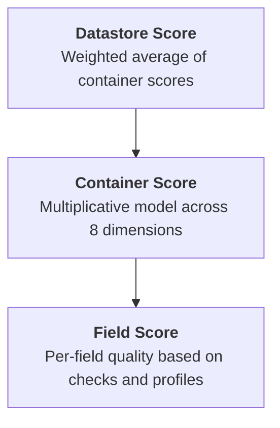
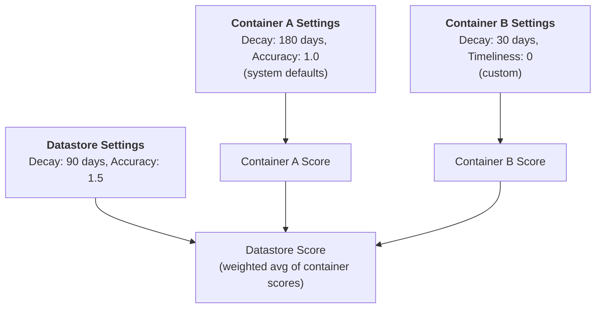

# Datastore Quality Score Introduction

## What is a Data Quality Score?

A Data Quality Score is a quantified measure (0–100) that reflects the health of your data at every level — fields, containers, and the datastore itself. Higher scores indicate superior quality. Qualytics calculates these scores continuously as you run Profile and Scan operations, recording them as time series so you can track how data quality evolves over time.

## Where to See the Score

The quality score is visible across the platform without needing to navigate to a dedicated page:

- **Source Datastores listing page** — Each datastore row displays its current quality score.
- **Datastore detail page** — The score appears in the Totals panel at the top of the Overview tab.
- **Tree view** — Quality score indicators are shown next to each datastore in the sidebar.
- **Container detail page** — Each table or file displays its own container-level score.

## How Scores Influence Your Datastore

The quality score gives you a single, at-a-glance metric for every datastore in your workspace. This is critical for:

- **Prioritizing remediation** — Datastores with low scores need attention first. Within a datastore, you can drill down to identify which containers and fields are dragging the score down.
- **Tracking improvement** — After fixing data issues and re-scanning, the score reflects the improvement over time.
- **Governance reporting** — Export quality scores across datastores to demonstrate compliance and data health to stakeholders.
- **Operational awareness** — Quality scores update automatically after every Scan and Profile, giving real-time feedback on data quality.

## Score Hierarchy

Quality scores are calculated at three levels, each building on the one below:

| Level | How It's Calculated |
| :--- | :--- |
| **Field** | Each field receives a score based on its accuracy, consistency, conformity, precision, coverage, and completeness — derived from Profile metadata and Scan anomalies. |
| **Container** | Each container (table/file) aggregates its field scores using a multiplicative baseline model across 8 quality dimensions. |
| **Datastore** | The datastore score is the **weighted average** of all container scores. Container weights can be influenced by tag weight modifiers. |

!!! warning "Only Scanned Containers Count"
    The datastore score only includes containers that have been **scanned at least once**. Containers that have been synced and profiled but never scanned are excluded from the datastore-level score. This means a newly synced datastore will not have a quality score until you run your first Scan operation.

## Independent Settings per Level

Quality score settings (decay period and dimension weights) are configured **independently** at each level. The datastore has its own settings, and each container (table, file, computed table, computed file, computed join) has its own settings.

This means:

- **Datastore settings do not cascade to containers** — changing the decay period or dimension weights on a datastore does not affect any of its containers.
- **Container settings do not affect the datastore** — changing a container's weights does not change the datastore-level settings or other containers.
- **Each starts with system defaults** — until explicitly configured, both datastores and containers use the system defaults (180-day decay, all dimensions at weight 1.0).
- **Configure each level separately** — if you want the same configuration everywhere, you need to set it on the datastore and on each container individually.

In this example, the datastore uses a 90-day decay with higher Accuracy weight, Container A uses system defaults (never configured), and Container B uses a 30-day decay with Timeliness disabled. Each level calculates its score independently based on its own settings.

## The 8 Quality Dimensions

Every container score is composed of 8 dimensions, each measuring a different aspect of data quality:

| Icon | Dimension | Description | Example |
| :---: | :--- | :--- | :--- |
| :material-format-list-bulleted: | **Completeness** | Percentage of fields with non-null values across all profiles. | A field with 5% null values has lower completeness than a field with 0%. |
| :material-account-group: | **Coverage** | Count and frequency of quality checks asserted for each field. More checks = higher coverage. | A field with 10 active checks has higher coverage than a field with 2. |
| :material-checkbox-marked: | **Conformity** | Adherence to specified formats and business rules defined by quality checks. | An email field where 3% of values fail a regex check has reduced conformity. |
| :material-sync: | **Consistency** | Uniformity of data types and representation over time — detects drift in field distributions. | A field that changes from 95% integers to 80% integers between scans shows consistency drift. |
| :material-target: | **Precision** | Resolution and granularity of field values against expected patterns. | A timestamp field truncated to day-level when hour-level is expected has lower precision. |
| :material-timer: | **Timeliness** | Data availability according to expected schedules and freshness. | A table expected to update daily but last updated 3 days ago has reduced timeliness. |
| :material-shape: | **Volumetrics** | Consistency in data volume and shape over time. | A table that normally has 1M rows but suddenly has 100K indicates a volumetric anomaly. |
| :material-bullseye: | **Accuracy** | How well field values match their real-world counterparts based on check assertions. | A price field where 2% of values fail a "greater than zero" check has reduced accuracy. |

Each dimension produces a score from 0–100. These are combined using a **multiplicative baseline model** (starting from a baseline of 70) where each dimension's impact is proportional to its configured weight.

??? example "How Dimensions Combine into a Container Score"

    Suppose a container has the following dimension scores (all weights at default 1.0):

    | Dimension | Score |
    | :--- | :---: |
    | Completeness | 98 |
    | Coverage | 85 |
    | Conformity | 92 |
    | Consistency | 95 |
    | Precision | 100 |
    | Timeliness | 100 |
    | Volumetrics | 100 |
    | Accuracy | 88 |

    The multiplicative model starts from a **baseline of 70** and adjusts up or down based on each dimension. Dimensions scoring 100 have no negative impact; dimensions below 100 pull the score down proportionally to their weight. In this case, Coverage (85) and Accuracy (88) are the main detractors, producing a container score around **82**.

    At the datastore level, if this container has a weight of 3 and another container has a weight of 1 with a score of 95, the datastore score would be: `(82 × 3 + 95 × 1) / (3 + 1) = 85.25`.

## Decay Period

The **decay period** controls how far back in time Qualytics looks when calculating scores. By default, only anomalies, profiles, and scans from the last **180 days** are included.

The decay period can be set from **7 to 180 days** (in 7-day increments), with a default of **180 days**.

This means:

- **Old issues naturally age out** — If an anomaly was detected 6 months ago and hasn't recurred, it no longer impacts the score.
- **Recent issues weigh fully** — Any anomaly within the decay window is fully counted.
- **Shorter window (e.g., 7 days)** — Gives a real-time snapshot of current data quality. Useful for fast-moving pipelines.
- **Longer window (e.g., 180 days)** — Provides a broader historical perspective. Useful for governance and trend analysis.

!!! info
    To configure the decay period for your datastore, see the [Quality Score Settings](../managing-datastores/quality-score-settings.md){:target="_blank"} page.

## Dimension Weights

Each of the 8 dimensions has a configurable **weight** that controls its impact on the total container score:

- A weight of **1.0** (default) gives the dimension its full impact.
- A weight of **0** effectively disables the dimension — it won't negatively impact the score.
- Weights between 0 and 1 proportionally reduce the dimension's influence.

Weights can be set from **0 to 2.0** (in 0.1 increments), with a default of **1.0**.

This allows you to align the scoring system with your organization's data governance priorities. For example, if timeliness is critical for your use case, increase its weight; if volumetrics is less relevant, reduce it.

!!! note "Disabling a Dimension"
    Setting a dimension weight to **0** effectively disables it — the dimension turns grey in the settings UI and no longer affects the container or datastore score. This is useful when a dimension is not relevant to your data (e.g., Timeliness for a static reference table).

!!! info
    To configure dimension weights for your datastore, see the [Quality Score Settings](../managing-datastores/quality-score-settings.md){:target="_blank"} page.

## What Triggers a Recalculation?

Quality scores are automatically recalculated when:

- A [**Scan operation**](../operations/scan.md){:target="_blank"} completes (anomalies detected or clean scan).
- A [**Profile operation**](../operations/profile.md){:target="_blank"} completes (new field statistics available).
- An **anomaly status changes** (acknowledged, resolved, etc.).
- A **quality check is deleted**.
- An **anomaly is deleted**.

Recalculations are debounced (5-second window) to prevent redundant calculations during rapid state changes.

## Tag Weight Modifiers

Tags assigned to datastores can include a **weight modifier** (-10 to 10) that influences how individual containers contribute to the overall datastore score. Containers with higher tag weights have more impact on the datastore-level quality score.

!!! info "Tags and Weighting"
    For more on how tags influence quality scores, see the [Tags Introduction](../tags/introduction.md#quality-score-impact){:target="_blank"} page. For details on the weight calculation formula, see the [Weighting](../../weight/weighting.md){:target="_blank"} documentation.

## Next Steps

-   :material-tune:{ .lg .middle } **Quality Score Settings**

    ---

    Configure decay period, dimension weights, and scoring thresholds for your datastore.

    [:octicons-arrow-right-24: Settings](../managing-datastores/quality-score-settings.md)

-   :material-scale-balance:{ .lg .middle } **Weighting**

    ---

    Understand how rule type, anomaly, and tag weights combine to determine check importance.

    [:octicons-arrow-right-24: Weighting](../../weight/weighting.md)

