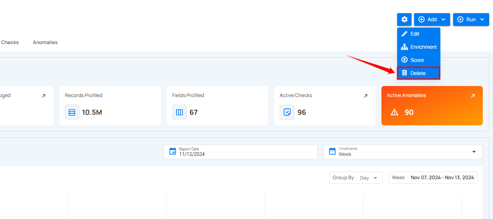
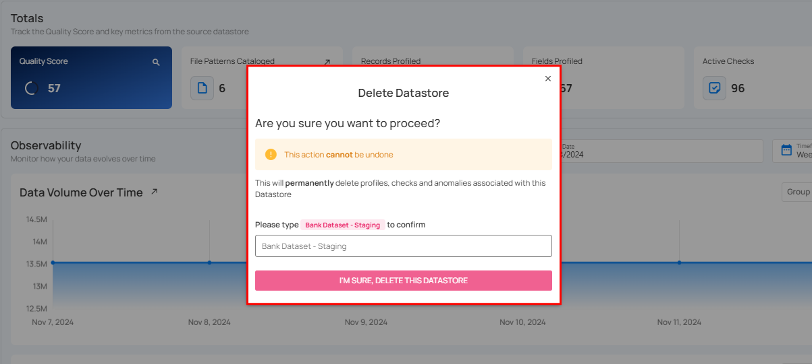
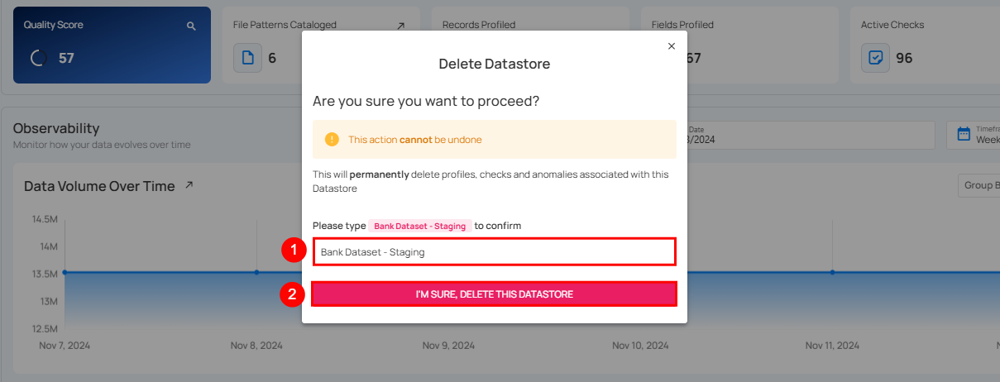

# Delete Datastore

**Step 1**: Click on the **Delete** option in the settings icon.

**Step 2**: A modal window titled **Delete Datastore** will appear.

**Step 3**: Enter the name of the datastore in the given field (confirmation check) and then click on the **I’M SURE, DELETE THIS DATASTORE** button to delete the datastore.

After clicking the **I’M SURE, DELETE THIS DATASTORE** button, a success notification appears confirming the deletion.