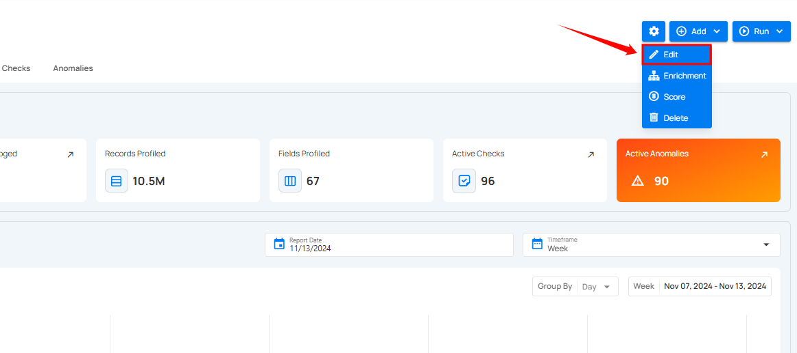
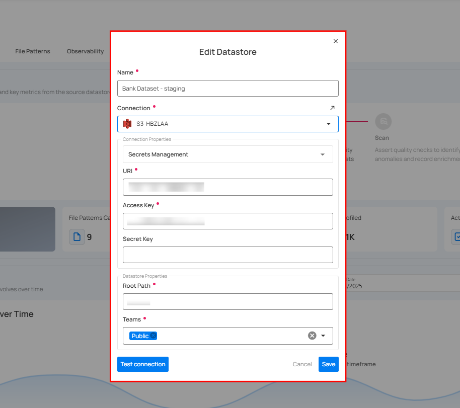
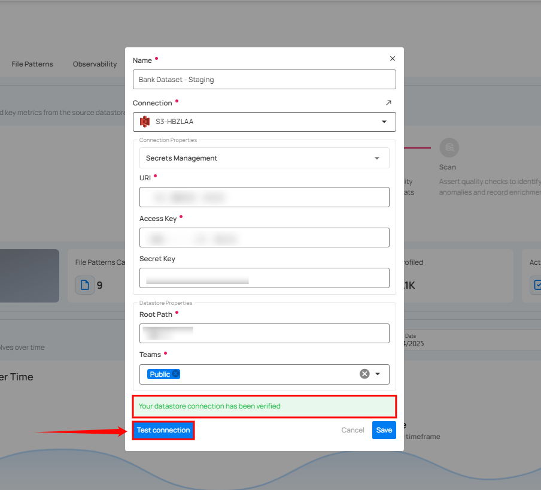
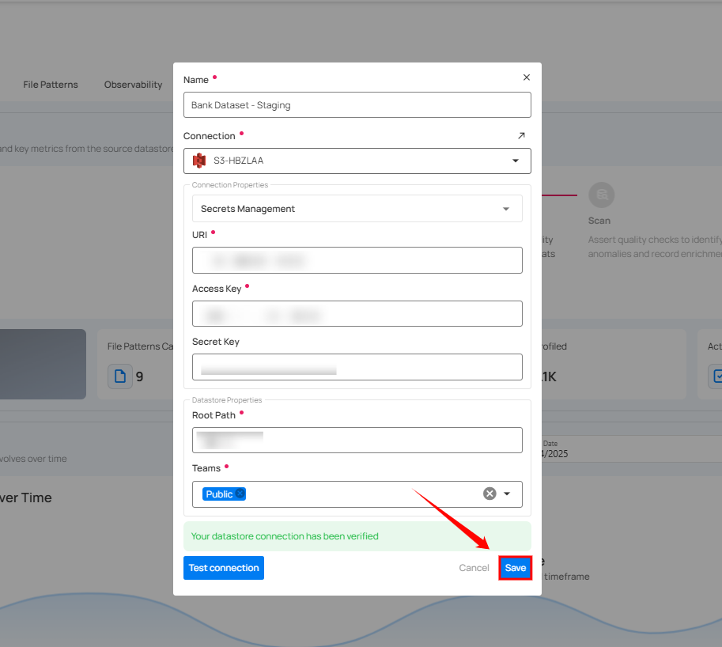

# Edit Datastore

**Step 1:** Click on the **Edit** option.

**Step 2:** After selecting the **Edit** option, a modal window will appear, displaying the connection details. This window allows you to modify any specific connection details.

**Step 3:** After editing the connection details, click on the **Test Connection** button to check and verify its connection.

If the credentials and provided connection details are verified, a success message will be displayed indicating that the connection has been verified.

**Step 4:** Click on the **Save** button.

After clicking on the **Save** button, a success notification appears on the screen showing the action was completed successfully.