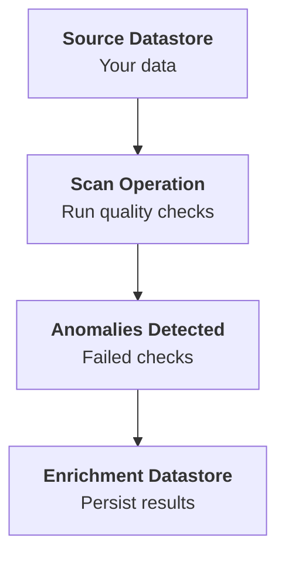

# Datastore Enrichment Introduction

## What is an Enrichment Datastore?

When you link an enrichment datastore to a source datastore, you are giving Qualytics a dedicated place to **write back** the results of your data quality operations. Without an enrichment datastore, scan results and anomalies exist only within the Qualytics platform. With one linked, all findings are persisted directly in your own infrastructure — making them queryable, auditable, and available for downstream workflows.

!!! info "Enrichment Datastore Concepts"
    This page focuses on how enrichment datastores work **in the context of source datastores**. For a comprehensive overview of enrichment datastore concepts, supported connectors, table types, and schema details, see the [Enrichment Datastores](../../enrichment/overview-of-an-enrichment-datastore.md){:target="_blank"} documentation.

!!! note "Permissions"
    Linking an enrichment datastore requires the **Member** user role. Unlinking requires the **Admin** role. Configuring enrichment settings (prefix, source record limit, remediation strategy) requires the **Editor** team permission. See the [Permissions](permissions.md){:target="_blank"} page for details.

## Why Should I Link an Enrichment Datastore?

Linking an enrichment datastore to your source datastore unlocks several capabilities:

- **Persist scan results** — Source record examples that triggered anomalies are written to the enrichment datastore, so you can inspect the actual data that failed quality checks.
- **Build an audit trail** — With the Append remediation strategy, every scan builds a historical record of anomalous data — useful for compliance and governance.
- **Enable downstream workflows** — Enrichment tables can be queried by BI tools, data pipelines, or alerting systems to trigger automated actions based on data quality findings.
- **Cross-datastore analysis** — When multiple source datastores share the same enrichment datastore, you can query anomalies across all of them with a single SQL query.
- **Enable Export and Materialize operations** — These operations require an enrichment datastore to be linked.

## What Happens If I Don't Link an Enrichment Datastore?

Your datastore will still work — you can run **Sync**, **Profile**, and **Scan** operations normally. However:

- **Anomalies are tracked only within Qualytics** — You can view them in the UI and API, but they are not persisted in your own infrastructure.
- **No source record examples** — You won't be able to see the actual data rows that triggered anomalies.
- **No remediation tables** — The Append and Overwrite remediation strategies are not available.
- **No Export or Materialize operations** — These require an enrichment datastore and will return an error if one is not linked.

!!! tip
    You can link an enrichment datastore **at any time** — during datastore creation or afterward. There is no deadline or penalty for linking later. See [Link Enrichment Datastore](../managing-datastores/link-enrichment.md){:target="_blank"} or [Link on Datastore Creation](link-during-creation.md){:target="_blank"}.

## How It Works

When an enrichment datastore is linked to a source datastore, the following happens during **Scan operations** (not Profile):

1. **Quality checks are executed** against the source datastore containers (tables/files).
2. **Anomalies are detected** from failed checks at the record and schema levels.
3. **Source record examples** are written to the enrichment datastore — up to the configured limit per anomaly — so you can inspect the actual data that triggered each anomaly.
4. **Remediation data** is optionally replicated based on your chosen strategy.

!!! note "Scan Only"
    The enrichment datastore is used **only during Scan operations**. Profile and Sync operations do not write to the enrichment datastore. This means you can Profile without an enrichment datastore linked — only Scan results need it.

## Side Effects of Linking

Once an enrichment datastore is linked, be aware of the following:

- **Every Scan writes to the enrichment datastore** — Source record examples, check metrics, failed checks, and scan operation metadata are written automatically. This happens on every Scan, not just the first one.
- **Append strategy accumulates data** — If you use the **Append** remediation strategy, anomalous source records are added to enrichment tables after each Scan without removing previous data. Over time, this can lead to significant storage growth — especially for large tables with recurring anomalies.
- **Overwrite strategy replaces data** — The **Overwrite** strategy replaces enrichment table contents on each Scan, keeping storage bounded but losing historical data.
- **Prefix must be unique** — Each source datastore sharing the same enrichment datastore must use a **unique prefix**. If two source datastores use the same prefix, their enrichment tables will collide and data will be mixed or overwritten.
- **Unlinking requires Admin** — While linking requires only Member + Editor, unlinking requires the **Admin** role due to its destructive nature (stops all future enrichment writes).

## Enrichment Settings

When linking an enrichment datastore, you configure the following settings on the source datastore:

| Setting | Default | Range | Description |
| :--- | :---: | :---: | :--- |
| **Prefix** | Auto-generated | Max 60 chars | A prefix added to all enrichment table names. See [Enrichment Prefix](#enrichment-prefix) below. |
| **Maximum Source Examples per Anomaly** | `10` | 1–1,000,000,000 | How many source records are stored per anomaly. |
| **Maximum Record Anomalies per Check** | `10` | 1–1,000 | How many individual anomalies per check before rollup. |
| **Remediation Strategy** | `None` | — | Controls source table replication. See [Remediation Strategies](#remediation-strategies) below. |

### Source Examples: Practical Recommendations

The **Maximum Source Examples per Anomaly** setting controls how many source data rows are written to the enrichment datastore for each detected anomaly. Consider these trade-offs:

| Value | Use Case | Storage Impact |
| :---: | :--- | :--- |
| `10` (default) | Quick investigation — enough to identify the pattern. | Minimal |
| `100` | Root cause analysis — enough to see distribution of the issue. | Low |
| `1,000` | Detailed audit — comprehensive sample for compliance reviews. | Moderate |
| `1,000,000,000` (All) | Full replication — every anomalous record is stored. | High — can significantly increase enrichment storage usage. |

!!! warning "Storage Impact"
    Higher values mean more data written to your enrichment datastore on every Scan. For large tables with many anomalies, setting this to a high value can produce substantial storage growth. Start with the default (`10`) and increase as needed.

### Remediation Strategies

The remediation strategy determines what happens to anomalous source data during a Scan:

| Strategy | Behavior |
| :--- | :--- |
| **None** | No source records are written to the enrichment datastore. Only anomaly metadata is tracked within Qualytics. This is the default. |
| **Append** | Anomalous source records are appended to enrichment tables after each scan. Builds a historical audit trail of all anomalous data over time. |
| **Overwrite** | Enrichment tables are replaced with anomalous records from the latest scan. Only the most recent anomalous data is kept. |

!!! warning
    You cannot run a Scan with a remediation strategy other than `None` if no enrichment datastore is linked. Qualytics will return an error.

### Enrichment Prefix

The prefix is used to name the enrichment tables created in the enrichment datastore. It is automatically normalized to snake_case with a leading underscore (e.g., `Analytics Bronze` becomes `_analytics_bronze`).

Each source datastore linked to the same enrichment datastore **must have a unique prefix** to avoid table name conflicts.

??? example "Enrichment Table Names"

    For a source datastore with prefix `_healthcare_analytics` and a source table called `patients`, the enrichment datastore will contain:

    | Enrichment Table | Description |
    | :--- | :--- |
    | `_healthcare_analytics_check_metrics` | Metrics for every quality check execution. |
    | `_healthcare_analytics_failed_checks` | Details of each failed quality check. |
    | `_healthcare_analytics_source_records` | Source record examples that triggered anomalies. |
    | `_healthcare_analytics_scan_operations` | Metadata about each scan operation. |

    For details on the columns in each table, see the [Enrichment Tables](../../enrichment/enrichment-tables.md){:target="_blank"} documentation.

## Sharing an Enrichment Datastore

Multiple source datastores can share the **same enrichment datastore**. Each source datastore maintains its own enrichment settings (prefix, source record limit, remediation strategy), so there is no conflict — even when writing to the same enrichment target.

This is useful when:

- You want to centralize all quality results in a single database or storage bucket.
- Your organization uses a shared data warehouse for observability and auditing.
- You want to query anomalies across multiple source datastores with a single SQL query.

## Changing or Unlinking

### Changing Settings

You can modify the enrichment settings (prefix, source record limit, remediation strategy, rollup threshold) at any time through the datastore settings — changes take effect on the next Scan operation.

### Switching Enrichment Datastores

To switch to a different enrichment datastore, you must first **unlink** the current one and then **link** the new one. You cannot directly swap enrichment datastores.

### Unlinking

When you unlink an enrichment datastore:

- The remediation strategy is automatically reset to **None**.
- No new enrichment data will be written during future Scans.
- **Historical enrichment data is preserved** — existing tables in the enrichment datastore are **not** deleted. They remain in your infrastructure and can still be queried.

!!! note "Unlinking is Reversible"
    Unlinking itself is **not** a destructive data operation — it only breaks the connection. You can **re-link** the same (or a different) enrichment datastore at any time. If you re-link the **same** enrichment datastore with the **same prefix**, future Scans will continue writing to the existing enrichment tables as if nothing changed.

!!! note "Cleaning Up Enrichment Tables"
    Qualytics does not automatically delete enrichment tables when you unlink. If you want to remove the historical data, you must **manually drop** the enrichment tables (e.g., `_healthcare_analytics_check_metrics`, `_healthcare_analytics_failed_checks`, etc.) directly in the enrichment datastore using your database tools.

!!! warning
    You cannot unlink an enrichment datastore if the source datastore has active **Export** or **Materialize** operations in flows or scheduled operations. Remove those operations first.

For the step-by-step unlink procedure, see the [Unlink Enrichment Datastore](../managing-datastores/unlink-enrichment.md){:target="_blank"} page.

## Next Steps

-   :material-link-variant:{ .lg .middle } **Link Enrichment Datastore**

    ---

    Link an enrichment datastore to a source datastore through the Settings menu or tree footer.

    [:octicons-arrow-right-24: Link](../managing-datastores/link-enrichment.md)

-   :material-link-plus:{ .lg .middle } **Link on Datastore Creation**

    ---

    Link an enrichment datastore during the datastore creation wizard.

    [:octicons-arrow-right-24: Link on Creation](link-during-creation.md)

