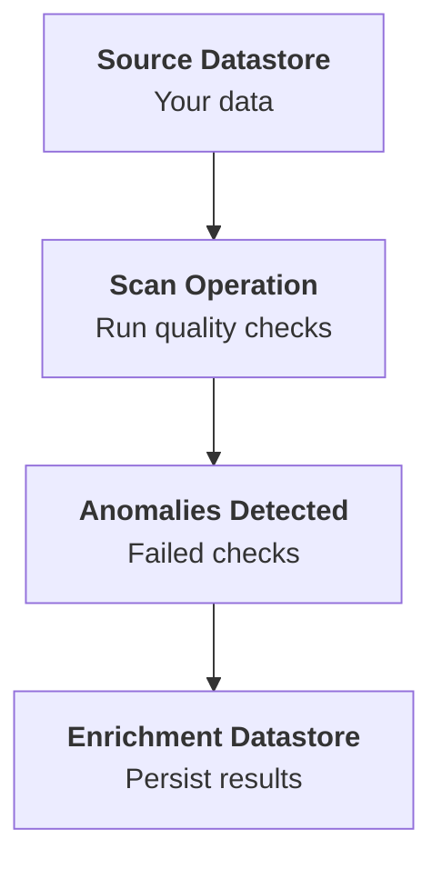

# Datastore Enrichment Introduction

## What is an Enrichment Datastore?

When you link an enrichment datastore to a source datastore, you are giving Qualytics a dedicated place to **write back** the results of your data quality operations. Without an enrichment datastore, scan results and anomalies exist only within the Qualytics platform. With one linked, all findings are persisted directly in your own infrastructure — making them queryable, auditable, and available for downstream workflows.

!!! info "Enrichment Datastore Concepts"
    This page focuses on how enrichment datastores work **in the context of source datastores**. For a comprehensive overview of enrichment datastore concepts, supported connectors, table types, and schema details, see the [Enrichment Datastores](../../enrichment/overview-of-an-enrichment-datastore.md){:target="_blank"} documentation.

## Why Should I Link an Enrichment Datastore?

Linking an enrichment datastore to your source datastore unlocks several capabilities:

- **Persist scan results** — Source record examples that triggered anomalies are written to the enrichment datastore, so you can inspect the actual data that failed quality checks.
- **Build an audit trail** — With the Append remediation strategy, every scan builds a historical record of anomalous data — useful for compliance and governance.
- **Enable downstream workflows** — Enrichment tables can be queried by BI tools, data pipelines, or alerting systems to trigger automated actions based on data quality findings.
- **Cross-datastore analysis** — When multiple source datastores share the same enrichment datastore, you can query anomalies across all of them with a single SQL query.
- **Enable Export and Materialize operations** — These operations require an enrichment datastore to be linked.

## What Happens If I Don't Link an Enrichment Datastore?

Your datastore will still work — you can run **Sync**, **Profile**, and **Scan** operations normally. However:

- **Anomalies are tracked only within Qualytics** — You can view them in the UI and API, but they are not persisted in your own infrastructure.
- **No source record examples** — You won't be able to see the actual data rows that triggered anomalies.
- **No remediation tables** — The Append and Overwrite remediation strategies are not available.
- **No Export or Materialize operations** — These require an enrichment datastore and will return an error if one is not linked.

!!! tip
    You can link an enrichment datastore **at any time** — during datastore creation or afterward. There is no deadline or penalty for linking later. See [Link Enrichment Datastore](../managing-datastores/link-enrichment.md) or [Link on Datastore Creation](link-during-creation.md).

## How It Works

When an enrichment datastore is linked to a source datastore, the following happens during Scan operations:

1. **Quality checks are executed** against the source datastore containers (tables/files).
2. **Anomalies are detected** from failed checks at the record and schema levels.
3. **Source record examples** are written to the enrichment datastore — up to the configured limit per anomaly — so you can inspect the actual data that triggered each anomaly.
4. **Remediation data** is optionally replicated based on your chosen strategy.

## Enrichment Settings

When linking an enrichment datastore, you configure the following settings on the source datastore:

| Setting | Default | Description |
| :--- | :---: | :--- |
| **Prefix** | `_qualytics` | A prefix added to all enrichment table/file names to distinguish them from source tables. Each source datastore linked to the same enrichment datastore should have a unique prefix. |
| **Maximum Source Examples per Anomaly** | `10` | How many source records are stored in the enrichment datastore as examples when a check fails. Range: 1–1,000,000,000. |
| **Maximum Record Anomalies per Check** | `10` | How many individual anomalies can be created per check before they are grouped into one rolled-up anomaly. Range: 1–1,000. |
| **Remediation Strategy** | `None` | Controls whether and how anomalous source tables are replicated to the enrichment datastore (see below). |

### Remediation Strategies

The remediation strategy determines what happens to anomalous source data during a Scan:

| Strategy | Behavior |
| :--- | :--- |
| **None** | No source records are written to the enrichment datastore. Only anomaly metadata is tracked within Qualytics. This is the default. |
| **Append** | Anomalous source records are appended to enrichment tables after each scan. Builds a historical audit trail of all anomalous data over time. |
| **Overwrite** | Enrichment tables are replaced with anomalous records from the latest scan. Only the most recent anomalous data is kept. |

!!! warning
    You cannot run a Scan with a remediation strategy other than `None` if no enrichment datastore is linked. Qualytics will return an error.

### Enrichment Prefix

The prefix is used to name the enrichment tables/files created in the enrichment datastore. It is automatically normalized to snake_case with a leading underscore (e.g., `Analytics Bronze` becomes `_analytics_bronze`).

Each source datastore linked to the same enrichment datastore **must have a unique prefix** to avoid table name conflicts.

## Sharing an Enrichment Datastore

Multiple source datastores can share the **same enrichment datastore**. Each source datastore maintains its own enrichment settings (prefix, source record limit, remediation strategy), so there is no conflict — even when writing to the same enrichment target.

This is useful when:

- You want to centralize all quality results in a single database or storage bucket.
- Your organization uses a shared data warehouse for observability and auditing.
- You want to query anomalies across multiple source datastores with a single SQL query.

## Changing or Unlinking

### Changing Settings

You can modify the enrichment settings (prefix, source record limit, remediation strategy, rollup threshold) at any time through the datastore settings — changes take effect on the next Scan operation.

### Switching Enrichment Datastores

To switch to a different enrichment datastore, you must first **unlink** the current one and then **link** the new one. You cannot directly swap enrichment datastores.

### Unlinking

When you unlink an enrichment datastore:

- The remediation strategy is automatically reset to **None**.
- No new enrichment data will be written during future Scans.
- **Historical enrichment data is preserved** — existing tables in the enrichment datastore are not deleted.

!!! warning
    You cannot unlink an enrichment datastore if the source datastore has active **Export** or **Materialize** operations in flows or scheduled operations. Remove those operations first.
