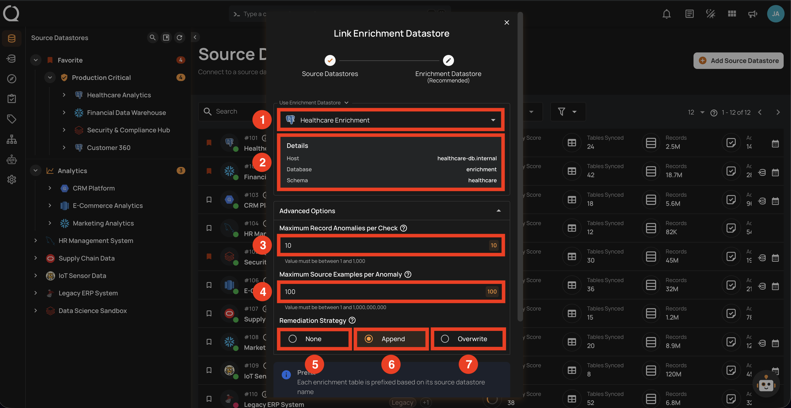
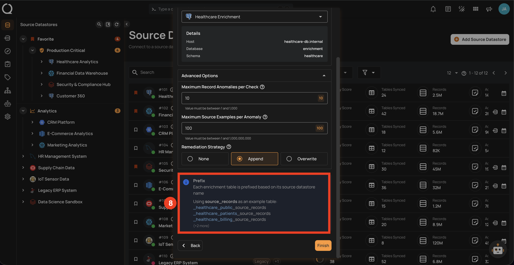
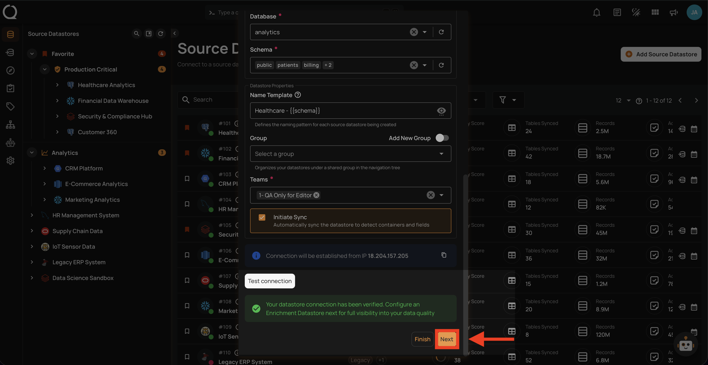
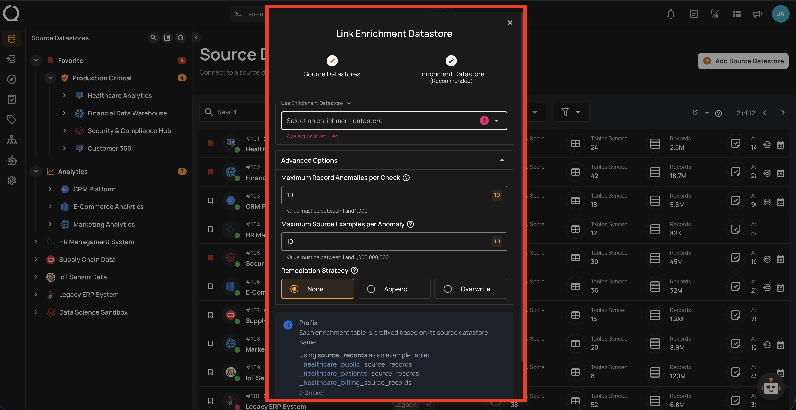
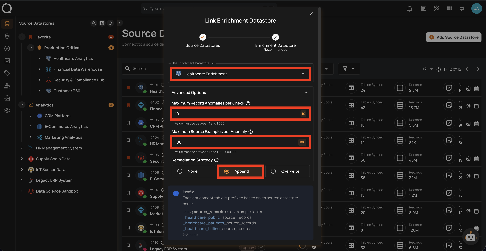
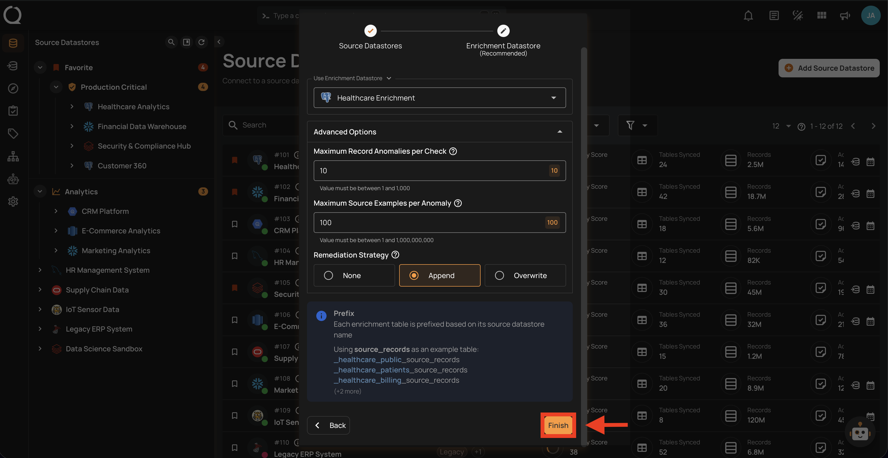

# Link Enrichment on Datastore Creation

When you create a new source datastore, you can optionally link an enrichment datastore during the same flow — without needing to configure it separately afterward. This is the recommended approach, as it ensures scan results and anomalies are persisted from the very first operation.

!!! warning "Prerequisites"
    You must have an enrichment datastore already added before linking it. If you haven't added one yet, see the [Add Enrichment Datastore](../../enrichment/enrichment-datastore-creation.md){:target="_blank"} documentation first.

!!! info "Link Later"
    If you prefer to skip the enrichment step during creation, you can link an enrichment datastore at any time afterward. See the [Link Enrichment Datastore](../managing-datastores/link-enrichment.md) documentation.

## Enrichment Settings

The **Link Enrichment Datastore** modal contains the following fields that you will configure during the linking process:

| REF. | FIELD | DEFAULT | RANGE | DESCRIPTION |
|:---:|:---|:---:|:---:|:---|
| 1 | Enrichment Datastore | — | — | Select an existing enrichment datastore from the dropdown. |
| 2 | Details | — | — | Displays the selected enrichment datastore connection details (host, database, schema). |
| 3 | Maximum Record Anomalies per Check | `10` | 1–1,000 | How many individual anomalies can be created per quality check before they are grouped into one rolled-up anomaly. |
| 4 | Maximum Source Examples per Anomaly | `10` | 1–1,000,000,000 | How many source data rows are stored in the enrichment datastore as examples when a quality check fails. |
| 5 | Remediation Strategy: None | — | — | Do not replicate anomalous source tables. Only anomaly metadata is tracked within Qualytics. This is the default. |
| 6 | Remediation Strategy: Append | — | — | Anomalous source records are appended to enrichment tables after each scan. Builds a historical audit trail of all anomalous data over time. |
| 7 | Remediation Strategy: Overwrite | — | — | Enrichment tables are replaced with anomalous records from the latest scan. Only the most recent anomalous data is kept. |

| REF. | FIELD | DEFAULT | DESCRIPTION |
|:---:|:---|:---:|:---|
| 8 | Prefix | Auto-generated | A prefix added to all enrichment table names. Auto-generated from the datastore name, normalized to lowercase with underscores (e.g., `_healthcare_analytics`). Maximum 60 characters. |

## Steps

**Step 1**: After configuring your source datastore and testing the connection successfully, you will see a banner recommending you to configure an enrichment datastore. Click **Next** to advance to the **Link Enrichment Datastore** wizard.

**Step 2**: The **Link Enrichment Datastore** modal will appear. Select an existing enrichment datastore from the dropdown.

**Step 3**: Configure the enrichment settings (enrichment datastore, anomaly thresholds, remediation strategy, and prefix) as described in the [Enrichment Settings](#enrichment-settings) section above. After configuring all fields, click **Finish** to create the source datastore and link it to the enrichment datastore.

**Step 4**: Click **Finish** to complete the process.

After clicking **Finish**, a success message will confirm that your datastores have been created and linked. You can then proceed with **Sync → Profile → Scan** operations.
