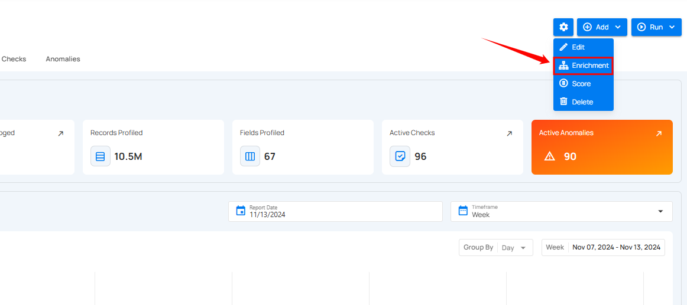
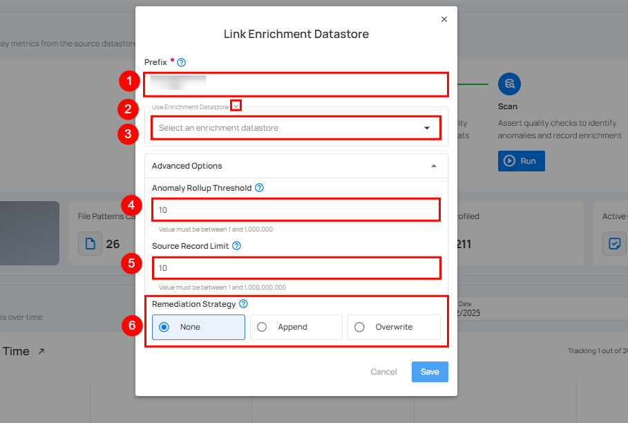
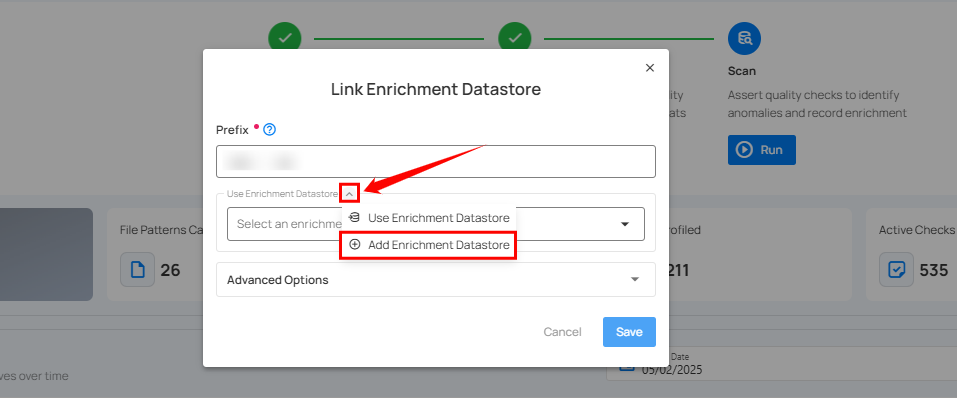
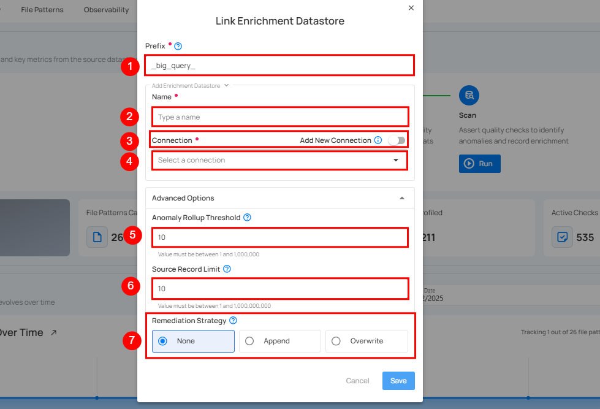
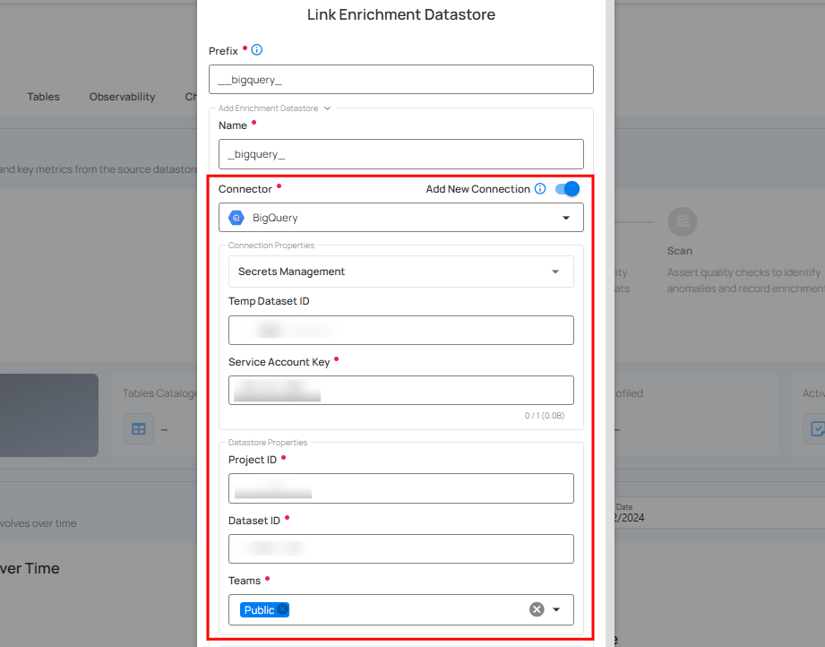
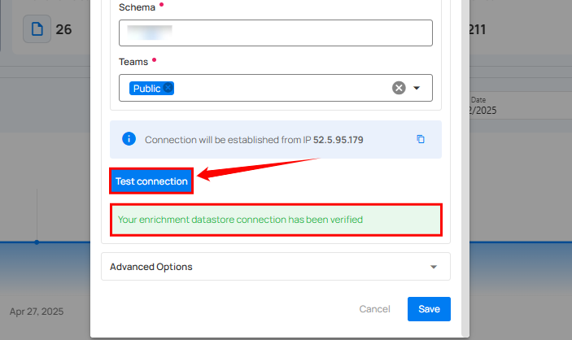
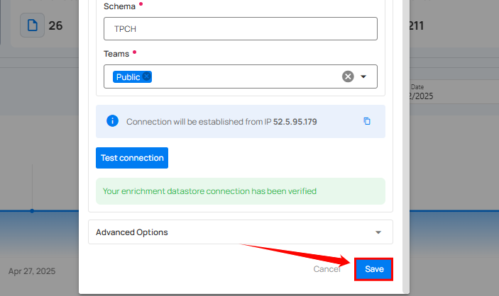
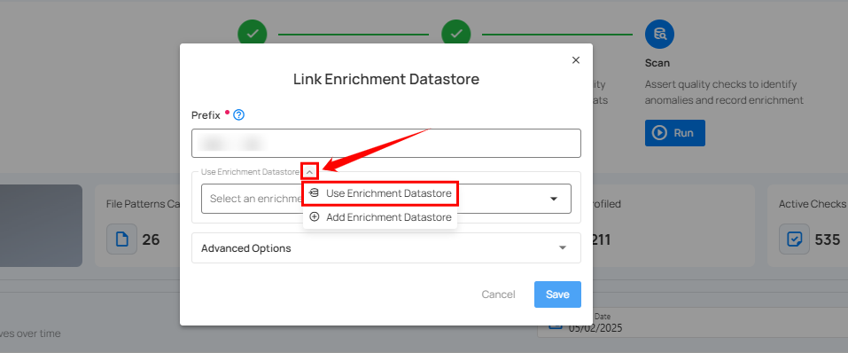
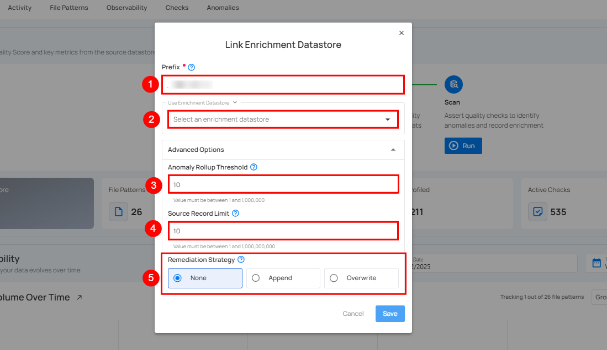
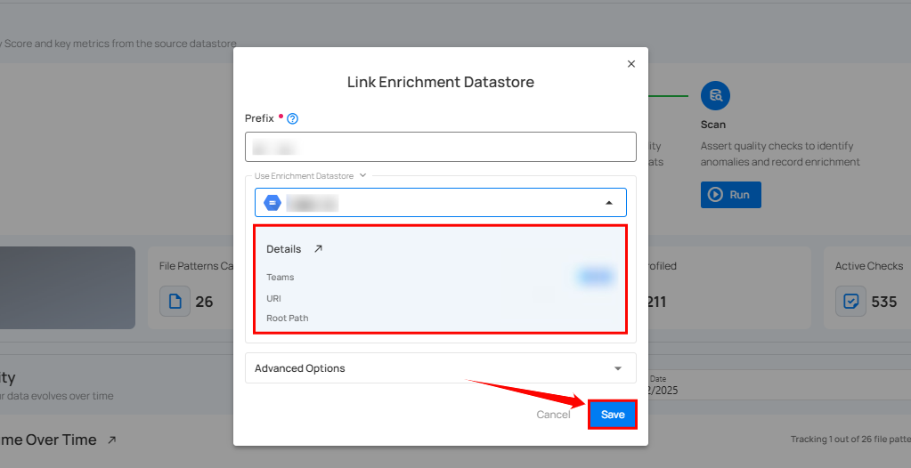

# Link Enrichment

**Step 1:** Click on the **Enrichment** from the dropdown list.

A modal window **Link Enrichment Datastore** will appear, providing you with two options to link an **enrichment datastore**.

| REF. | FIELDS | ACTIONS |
| :---- | :---- | :---- |
| 1. | Prefix | Add a prefix name to uniquely identify tables/files when Qualytics writes metadata from the source datastore to your enrichment datastore. |
| 2. | Caret Down Button | Click the caret down to select either **Use Enrichment Datastore** or **Add Enrichment Datastore**. |
| 3. | Enrichment Datastore | Select an enrichment datastore from the dropdown list. |
| 4. | Anomaly Rollup Threshold | Sets the maximum number of anomalies per check before they are merged into one anomaly. Value must be between 1 and 1,000. |
| 5. | Source Record Limit | Sets the maximum number of records written to the enrichment datastore for each detected anomaly. The value must be between 1 and 1,000,000,000. |
| 6. | Remediation Strategy | The Remediation Strategy defines how anomalous source tables are replicated in the enrichment datastore. You can choose **None** (no replication), **Append** (append new data), or **Overwrite** (replace existing data). |

### Option I: Link New Enrichment

If the toggle for **Add new connection** is turned on, then this will prompt you to link a new enrichment datastore from scratch without using existing connection details.

**Step 1:** Click on the caret button and select **Add Enrichment Datastore**.

A modal window **Link Enrichment Datastore** will appear. Enter the following details to create an enrichment datastore with a new connection.

| REF. | FIELDS | ACTIONS |
| :---- | :---- | :---- |
| 1. | Prefix | Add a prefix name to uniquely identify tables/files when Qualytics writes metadata from the source datastore to your enrichment datastore. |
| 2. | Name | Give a name for the enrichment datastore. |
| 3. | Toggle Button for adding new connection | Toggle ON to create a new enrichment from scratch or toggle OFF to reuse credentials from an existing connection. |
| 4. | Connector | Select a datastore connector from the dropdown list. |
| 5. | Anomaly Rollup Threshold | Sets the maximum number of anomalies per check before they are merged into one anomaly. Value must be between 1 and 1,000. |
| 6. | Source Record Limit | Sets the maximum number of records written to the enrichment datastore for each detected anomaly. The value must be between 1 and 1,000,000,000. |
| 7. | Remediation Strategy | The Remediation Strategy defines how anomalous source tables are replicated in the enrichment datastore. You can choose **None** (no replication), **Append** (append new data), or **Overwrite** (replace existing data). |

**Step 2:** Add connection details for your selected **enrichment datastore** connector.

!!! note
    Connection details can vary from datastore to datastore. For illustration, we have demonstrated linking BigQuery as a new enrichment datastore.

**Step 3:** After adding the source datastore details, click on the **Test Connection** button to check and verify its connection.

If the credentials and provided details are verified, a success message will be displayed indicating that the connection has been verified.

**Step 4:** Click on the **Save** button.

After clicking on the **Save** button, a success notification appears on the screen showing the action was completed successfully.

### Option II: Link Existing Connection

If the **Use an existing enrichment datastore** option is selected from the dropdown menu, you will be prompted to link the enrichment datastore using existing connection details.

**Step 1:** Click on the caret button and select **Use Enrichment Datastore**.

**Step 2:** A modal window **Link Enrichment Datastore** will appear. Add a prefix name and select an existing enrichment datastore from the dropdown list.

| REF. | FIELDS | ACTIONS |
| :---- | :---- | :---- |
| 1. | Prefix | Add a prefix name to uniquely identify tables/files when Qualytics writes metadata from the source datastore to your enrichment datastore. |
| 2. | Enrichment Datastore | Select an enrichment datastore from the dropdown list. |
| 3. | Anomaly Rollup Threshold | Sets the maximum number of anomalies per check before they are merged into one anomaly. Value must be between 1 and 1,000. |
| 4. | Source Record Limit | Sets the maximum number of records written to the enrichment datastore for each detected anomaly. The value must be between 1 and 1,000,000,000. |
| 5. | Remediation Strategy | The Remediation Strategy defines how anomalous source tables are replicated in the enrichment datastore. You can choose **None** (no replication), **Append** (append new data), or **Overwrite** (replace existing data). |

**Step 3:** View and check the connection details of the enrichment datastore and click on the **Save** button.

After clicking on the **Save** button, a success notification appears on the screen showing the action was completed successfully.

## Endpoint (Patch)

`/api/datastores/{datastore-id}/enrichment/{enrichment-id}` _(patch)_