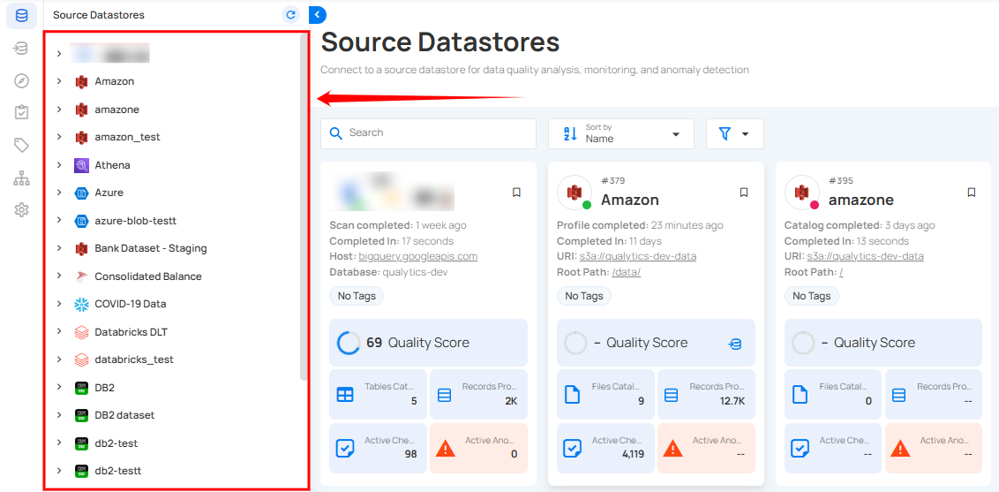
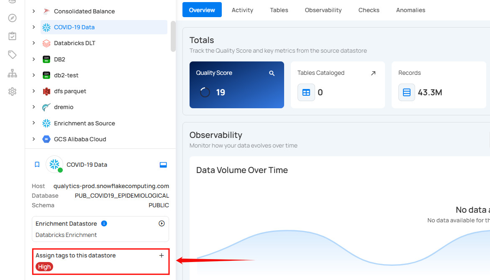
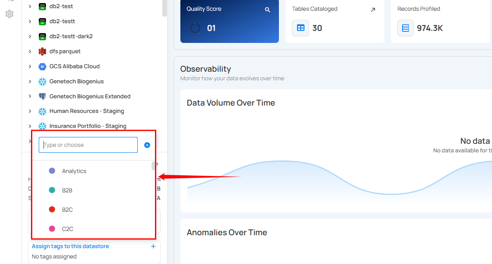
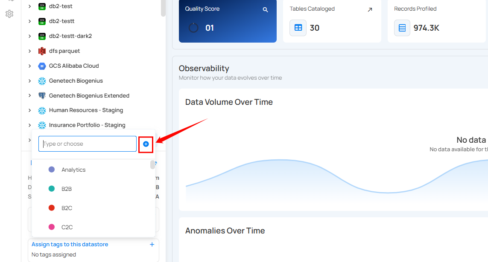
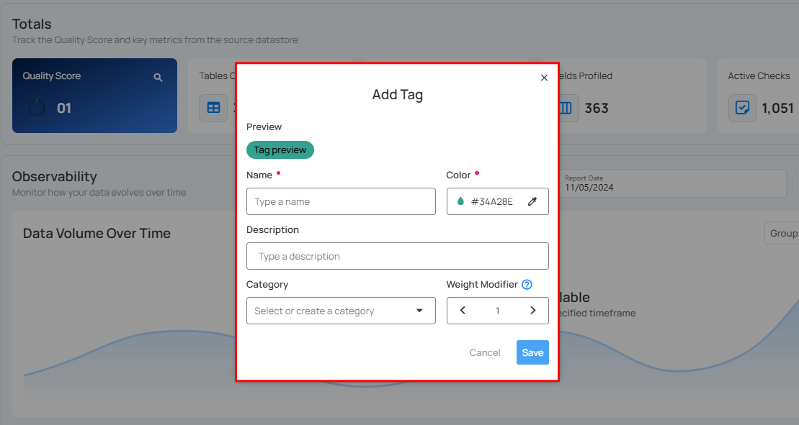
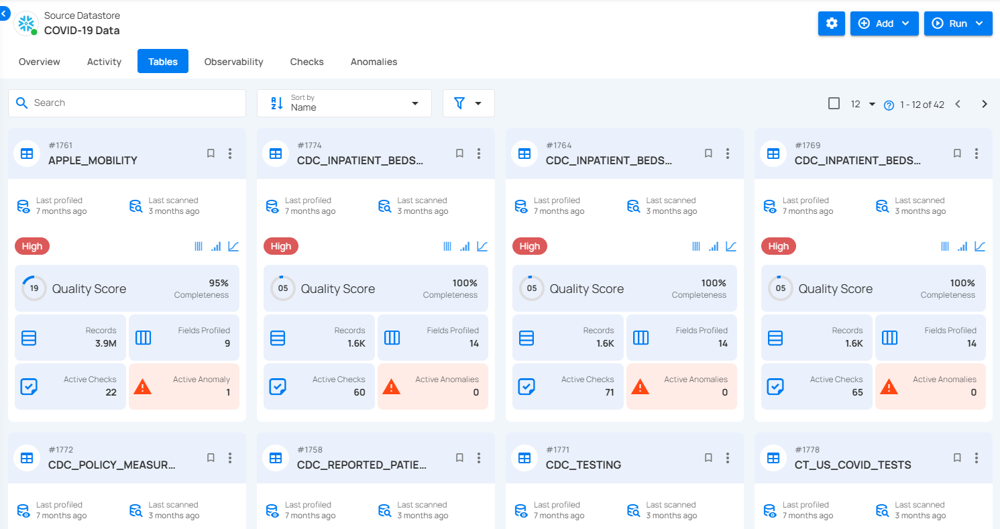

# Assign Tag

Assigning tags to your Datastore helps you to identify and categorize your datastore easily. Tags serve as labels that categorize and identify various data sets, enhancing efficiency and organization. By highlighting checks and anomalies, tags make it easier to monitor data quality. They also allow you to list file patterns and assign quality scores, enabling quick identification and resolution of issues.

In this documentation, we will explore the steps to assign a tag to the datastore.

**Step 1**: Login in to your Qualytics account and select the **datastore** from the left menu on which you want to assign a tag.

**Step 2**: Click on **Assign Tag to this Datastore** located at the bottom-left corner of the interface.

**Step 3**: A drop-up menu will appear, providing you with a list of tags. Assign an appropriate **tag** to your datastore to simplify sorting, accessing, and managing data.

 You can also create a new tag by clicking on the call to action (➕) button.

 A modal window will appear, providing the options to create the tag. Enter the required values to get started.

 For more information on creating tags, refer to the [Add Tag section](../../tags/add-tag.md).

**Step 4**: Once you have assigned a tag, the tag will be instantly labeled on your source Datastore, and all related records will be updated.

For demonstration, we have assigned the **High** tag for the Snowflake source datastore **Covid-19 Data**, so it will automatically be applied to all related tables and checks within the datastore.

