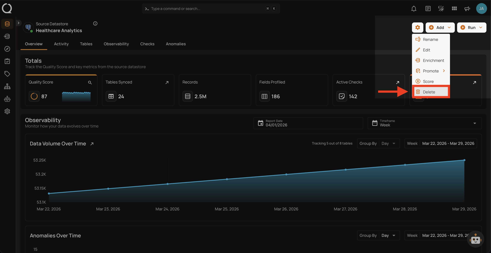
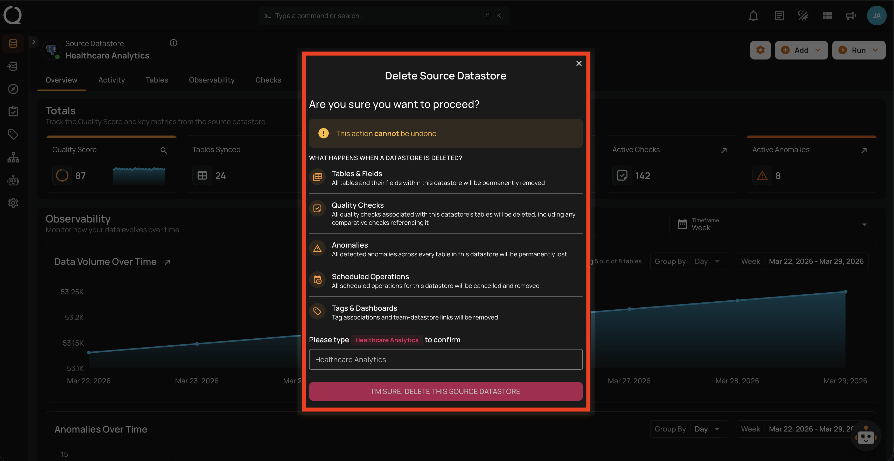
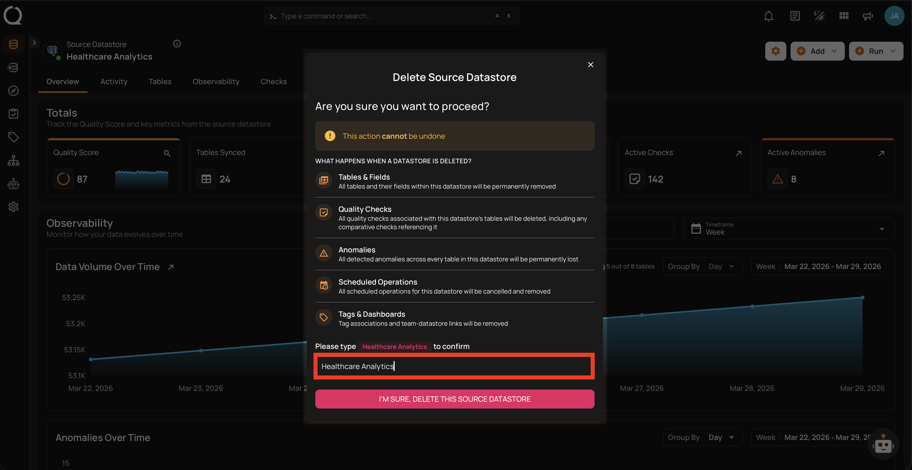
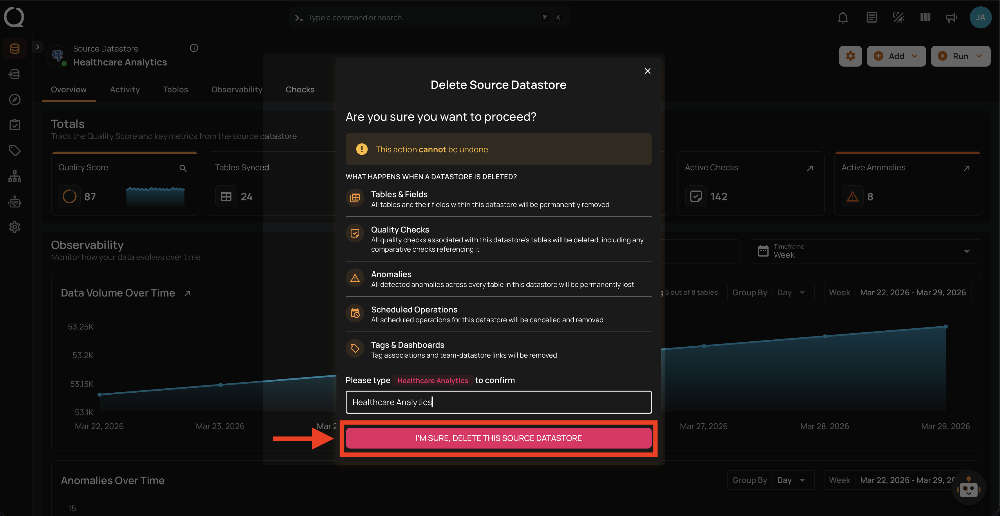
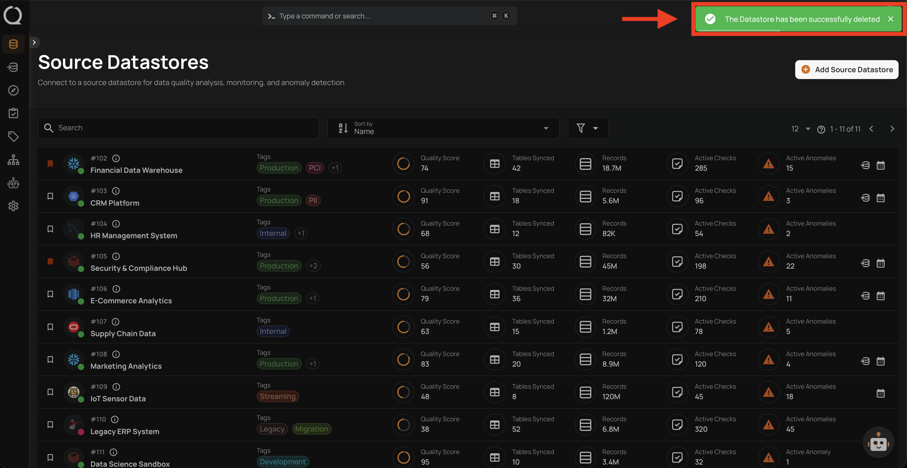

# Delete Datastore

Deleting a datastore permanently removes it along with all associated data.

!!! warning "Cascading Deletion"
    Deleting a datastore is **permanent and irreversible**. The following data will be removed:

    - All tables, views, and file patterns (containers and fields)
    - All quality checks associated with the datastore
    - All anomalies across every table in the datastore
    - All scheduled operations for the datastore
    - All tag associations and team-datastore links

## Steps

**Step 1**: Navigate to your datastore overview and click the **Settings :material-cog:** button located at the top-right corner of the interface.

**Step 2**: A dropdown menu will appear. Click on **Delete :material-trash-can-outline:** to initiate the deletion.

**Step 3**: A modal window — **Delete Source Datastore** — will appear, listing everything that will be permanently removed.

**Step 4**: Type the datastore name in the confirmation field to confirm the deletion.

**Step 5**: Click the **I'M SURE, DELETE THIS SOURCE DATASTORE** button to confirm.

**Step 6**: A success message will confirm that the datastore has been successfully deleted. You will be redirected to the Source Datastores listing.

