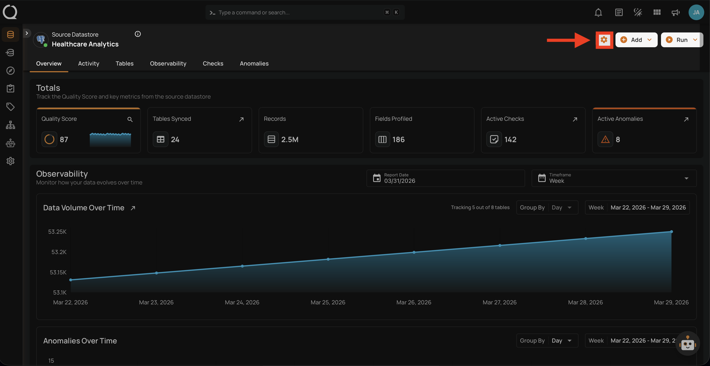
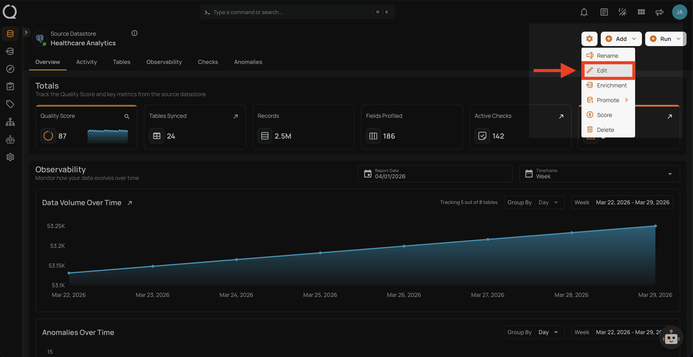
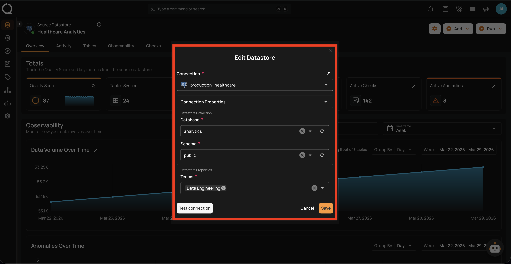
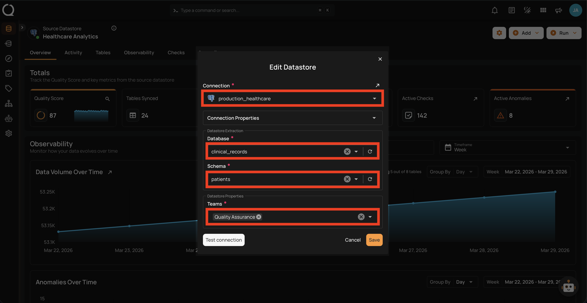
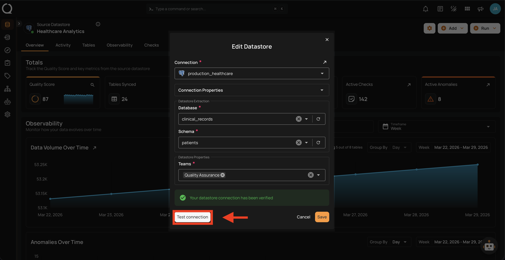
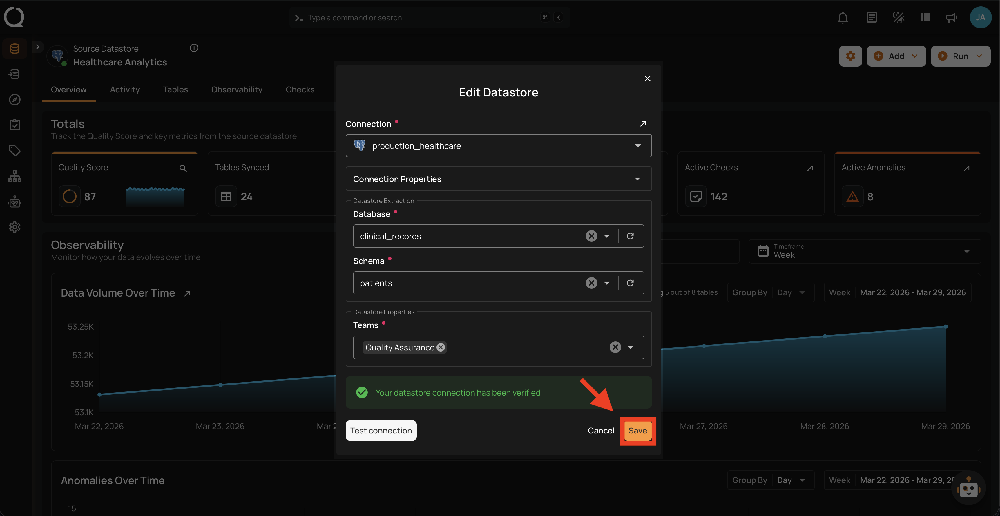
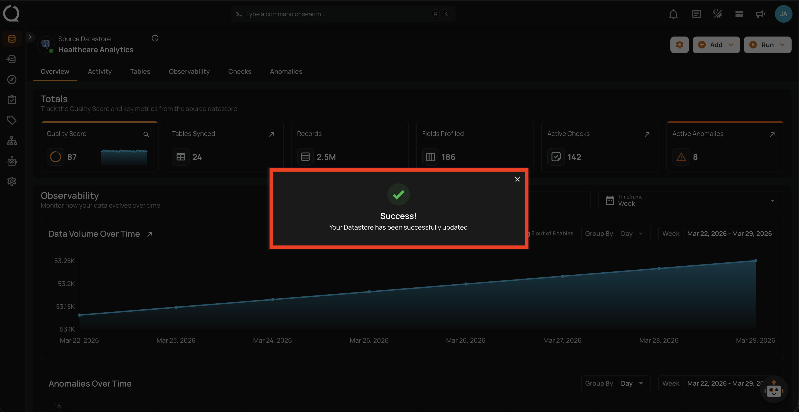

# Edit Datastore

Use the Edit Datastore option to modify your datastore's connection scope (database, schema), team assignments, or other properties.

!!! note "Connection Properties"
    The **Connection Properties** section is collapsed by default. Connection-level credentials (host, port, username, password) are managed at the connection level and are **read-only** in this modal. To update credentials, edit the connection directly through the [Manage Connections](../../settings/connections/manage-connections.md){:target="_blank"} page.

## Steps

**Step 1**: Navigate to your datastore overview and click the **Settings :material-cog:** button located at the top-right corner of the interface.

**Step 2**: A dropdown menu will appear. Click on **Edit :material-pencil-outline:** to open the Edit Datastore modal.

**Step 3**: The **Edit Datastore** modal will appear displaying the current datastore configuration.

**Step 4**: Modify the fields as needed (Database, Schema, Teams, etc.).

**Step 5**: Click the **Test Connection** button to verify the updated configuration. A success message will confirm the connection has been verified.

**Step 6**: Click the **Save** button to apply the changes.

**Step 7**: A success message will confirm that the datastore has been successfully updated.

