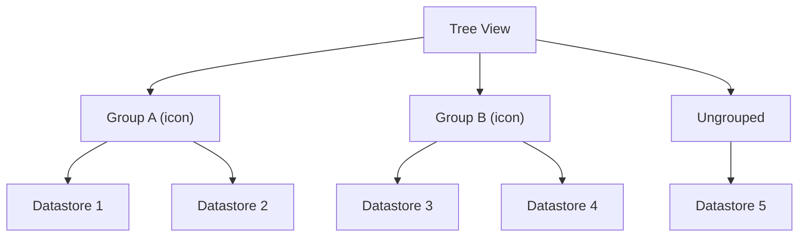
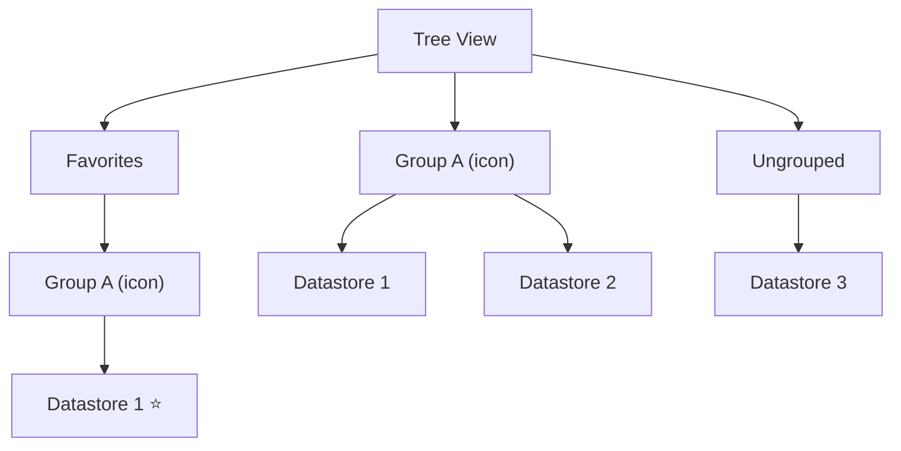

# Understanding Datastore Grouping

## What is Datastore Grouping?

Datastore Grouping allows you to organize datastores into named categories within the Qualytics tree view. Groups are shared across all users in the workspace — when a group is created or a datastore is assigned to a group, every user sees the same organization.

Each group has:

- A **name** (unique, up to 100 characters)
- An optional **icon** for visual identification

## How It Works

Datastores in Qualytics appear in the left-side tree view. Without grouping, all datastores are listed in a flat structure. With grouping enabled, the tree view organizes datastores under their assigned groups:

- **Grouped datastores** appear under their assigned group, with the group's icon displayed next to the group name.
- **Ungrouped datastores** appear in a separate section at the bottom.
- **Favorite datastores** within groups are also organized by their group.

## Key Characteristics

| Characteristic | Detail |
| :--- | :--- |
| **Scope** | Workspace-wide — all users see the same groups |
| **Membership** | A datastore can belong to zero or one group |
| **Deletion behavior** | Deleting a group does not delete its datastores — they become ungrouped |
| **Name uniqueness** | Group names must be unique (case-insensitive) |
| **Icon options** | Bookmark, Folder, Shape, Chart, Flask, Star, Texture, Bronze, Silver, Gold |

## Grouping and Favorites

When a datastore is marked as a **favorite** and also belongs to a **group**, the tree view organizes it in a special way:

1. **Favorites section** (top of the tree): All favorited datastores appear here first. If a favorited datastore belongs to a group, it is shown inside a sub-section with the group's name and icon.
2. **Regular groups section** (below favorites): The same datastore also appears under its regular group alongside non-favorited datastores.

This means a favorited and grouped datastore is visible in **both sections**, giving you quick access from the Favorites area while keeping the organizational structure intact.

!!! info
    Favorites are personal — each user has their own favorites. Groups are shared across the workspace.

## Practical Scenarios

### Organizing by Environment

Create groups like **Production**, **Staging**, and **Development** to quickly identify which datastores belong to each environment.

### Organizing by Team

Create groups like **Data Engineering**, **Analytics**, and **ML Team** so each team can quickly find their relevant datastores.

### Organizing by Data Domain

Create groups like **Finance**, **Customer Data**, and **Product** to categorize datastores by business domain.

## Best Practices

1. **Use descriptive group names**: Choose names that are immediately clear to all users in the workspace.
2. **Choose meaningful icons**: Pick icons that visually distinguish groups at a glance (e.g., Gold for production, Bronze for development).
3. **Keep the number of groups manageable**: Too many groups can be as hard to navigate as no groups at all.
4. **Coordinate with your team**: Since groups are shared, discuss the grouping strategy with your team before reorganizing.
