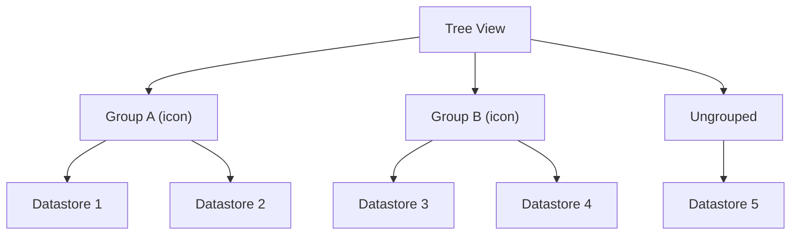
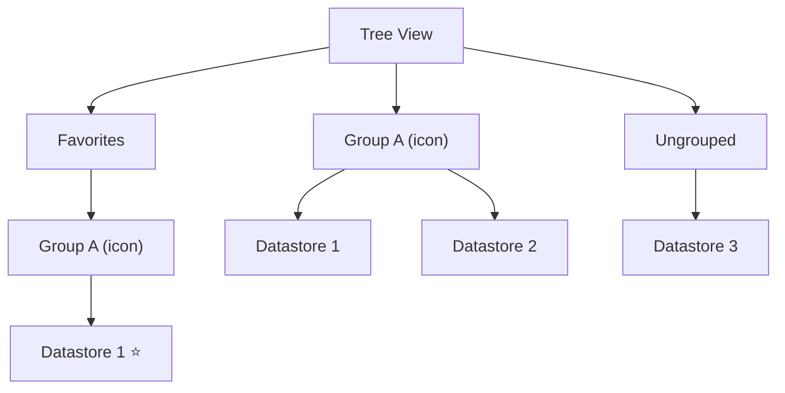

# Datastore Grouping Introduction

## What is Datastore Grouping?

Datastore Grouping allows you to organize datastores into named categories within the Qualytics tree view. Groups are shared across all users in the workspace — when a group is created or a datastore is assigned to a group, every user sees the same organization.

Each group has:

- A **name** (unique, up to 100 characters)
- An optional **icon** chosen from a set of predefined options for visual identification

!!! info "Groups vs. Tags"
    Groups and tags serve different purposes. A **group** organizes datastores visually in the tree view — each datastore can belong to only one group. A **tag** is a flexible label for categorization, filtering operations, and quality score weighting — a datastore can have multiple tags. Use groups for navigation structure and tags for classification. See the [Tags Getting Started](../../../tags/getting-started.md){:target="_blank"} documentation.

## How It Works

Datastores in Qualytics appear in the left-side tree view. Without grouping, all datastores are listed in a flat structure. With grouping enabled, the tree view organizes datastores under their assigned groups:

- **Grouped datastores** appear under their assigned group, with the group's icon displayed next to the group name.
- **Ungrouped datastores** appear in a separate section at the bottom.
- **Favorite datastores** within groups are also organized by their group.

## Key Characteristics

| Characteristic | Detail |
| :--- | :--- |
| **Scope** | Workspace-wide — all users see the same groups |
| **Membership** | A datastore can belong to **one group at a time**. Assigning a new group automatically removes the datastore from its previous group — no need to unassign first. |
| **Deletion behavior** | Deleting a group does not delete its datastores — they become ungrouped |
| **Name uniqueness** | Group names must be unique (case-insensitive) |
| **Icons** | Choose from a set of predefined icons (e.g., Bookmark, Folder, Star, Gold, Silver, Bronze). See the [Create a Group](../managing-groups/create-a-group.md){:target="_blank"} page for the full list. |

## Grouping and Favorites

When a datastore is marked as a **favorite** and also belongs to a **group**, the tree view shows it in **both sections**. This is by design — it gives you quick access from the Favorites area at the top of the tree while keeping the organizational structure intact in the regular groups section below.

1. **Favorites section** (top of the tree): All favorited datastores appear here first. If a favorited datastore belongs to a group, it is shown inside a sub-section with the group's name and icon.
2. **Regular groups section** (below favorites): The same datastore also appears under its regular group alongside non-favorited datastores.

!!! info
    Favorites are personal — each user has their own favorites. Groups are shared across the workspace.

## Practical Scenarios

### Organizing by Environment

Create groups like **Production** :material-podium-gold:, **Staging** :material-podium-silver:, and **Development** :material-podium-bronze: to quickly identify which datastores belong to each environment. Combine with tags like `critical` or `hipaa` to add classification within each environment.

### Organizing by Team

Create groups like **Data Engineering**, **Analytics**, and **ML Team** so each team can quickly find their relevant datastores. Use tag-based filtering in operations to scope Profile and Scan jobs to specific datasets within each team's group.

### Organizing by Data Domain

Create groups like **Finance** :material-chart-box-outline:, **Customer Data** :material-star-outline:, and **Product** :material-flask-outline: to categorize datastores by business domain. Choose icons that match each domain for instant visual identification.

## Best Practices

1. **Use descriptive group names**: Choose names that are immediately clear to all users in the workspace.
2. **Choose meaningful icons**: Pick icons that visually distinguish groups at a glance (e.g., Gold for production, Bronze for development).
3. **Keep the number of groups manageable**: Too many groups can be as hard to navigate as no groups at all.
4. **Coordinate with your team**: Since groups are shared, discuss the grouping strategy with your team before reorganizing.
5. **Combine with tags**: Use groups for navigation structure and tags for filtering operations — they complement each other.

## Next Steps

-   :material-plus-circle:{ .lg .middle } **Create a Group**

    ---

    Create a new datastore group with a custom name and icon.

    [:octicons-arrow-right-24: Create](../managing-groups/create-a-group.md)

-   :material-bookmark-check-outline:{ .lg .middle } **Assign a Datastore to a Group**

    ---

    Add an existing datastore to a group from the tree view.

    [:octicons-arrow-right-24: Assign to Group](../managing-groups/assign-a-datastore.md)

