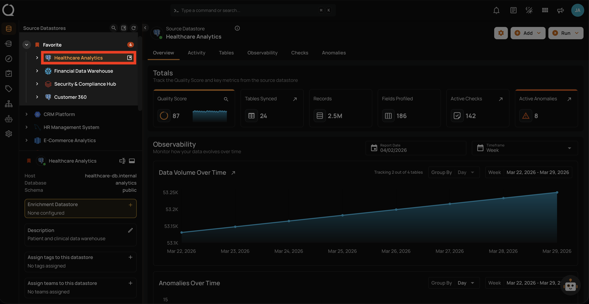
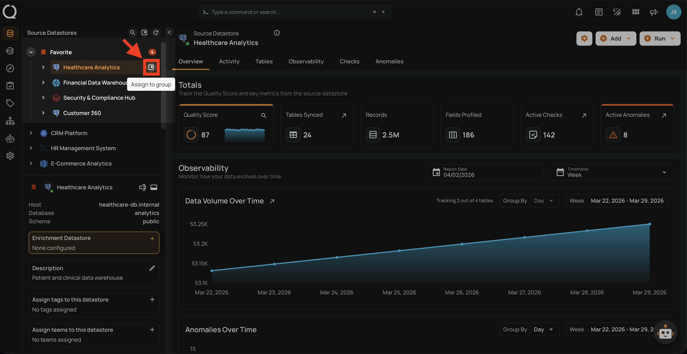
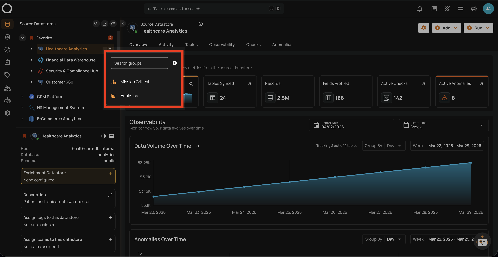
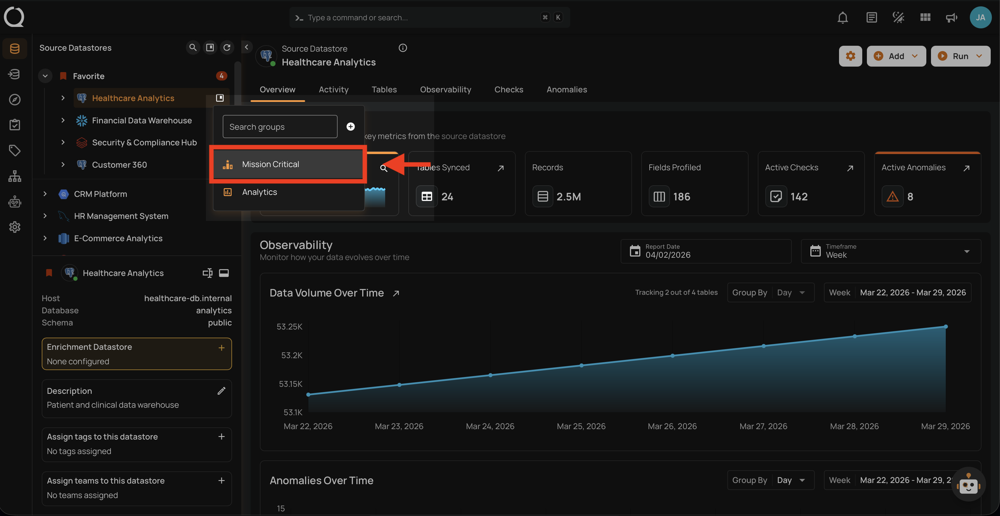
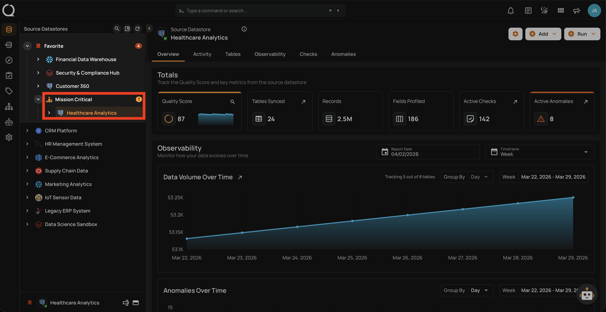
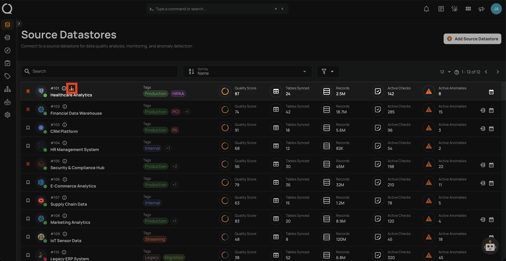

# Assign a Datastore to a Group

This guide walks you through the steps to assign a datastore to an existing group.

!!! note
    You need the **Member** user role and **Editor** team permission on the datastore to assign it to a group. See the [Permissions](../concepts/permissions.md){:target="_blank"} page for details.

## Steps

**Step 1**: In the tree view, hover over the datastore you want to assign. The **Assign to group :material-bookmark-box-outline:** button will appear on the right side of the datastore row.

**Step 2**: Click the **Assign to group :material-bookmark-box-outline:** button.

**Step 3**: A dropdown will appear with the list of available groups. Use the search field to find a group by name.

!!! note "No Groups Available?"
    If the dropdown is empty, no groups have been created yet. Creating groups requires the **Manager** role — see the [Permissions](../concepts/permissions.md){:target="_blank"} page for details.

**Step 4**: Select the group you want to assign the datastore to. The assignment is **immediate** — there is no confirmation dialog. In this example, the datastore **Healthcare Analytics** is being assigned to the **Mission Critical** group.

!!! info
    If the datastore already belongs to a different group, selecting a new group will **automatically move** it — no need to remove it from the previous group first.

**Step 5**: The datastore will immediately move under the selected group in the tree view, with the group icon displayed next to the group name.

**Step 6**: The group icon is also visible next to the datastore in the Source Datastores listing page.

!!! tip
    You can also **create a new group** directly from the dropdown by clicking the **Create group :material-plus-circle:** button, if you have the Manager role.

!!! info "Unassign a Datastore from a Group"
    To unassign a datastore from its current group, see the [Unassign a Datastore from a Group](unassign-a-datastore.md){:target="_blank"} documentation.
