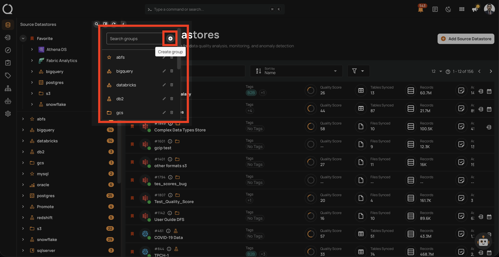
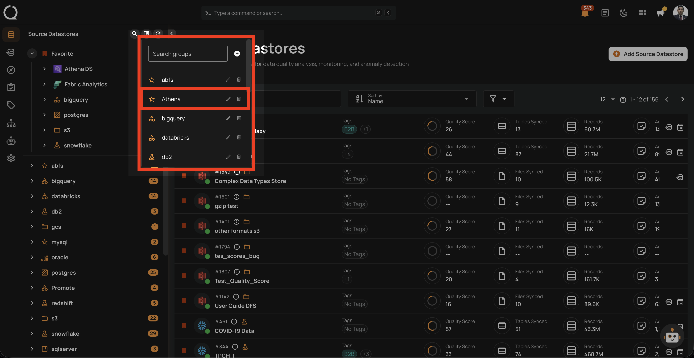

# Create a Datastore Group

This guide walks you through the steps to create a new datastore group in Qualytics.

!!! note
    You need the **Manager** role to create datastore groups.

## Steps

**Step 1**: Log in to your Qualytics account and click on the **Manage groups :material-bookmark-box-outline:** button in the tree view header.

**Step 2**: In the Manage Groups panel, click the **Create group :material-plus-circle:** button.

**Step 3**: A dialog will appear with the following fields. Fill in the details and click **Create** to create the group.

| Field | Description |
| :--- | :--- |
| **Name** | Enter a unique name for the group (required, max 100 characters). |
| **Icon** | Select an icon to visually identify the group. Available options: Bookmark, Folder, Shape, Chart, Flask, Star, Texture, Bronze, Silver, Gold. |

**Step 4**: The new group will appear in the Manage Groups panel.

!!! info
    The newly created group will only appear in the tree view once a datastore is assigned to it. Until then, it is only visible in the Manage Groups panel.
