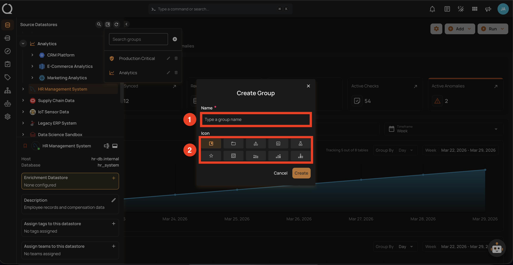
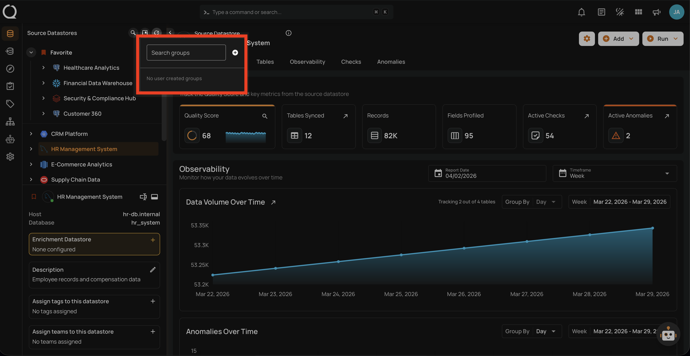
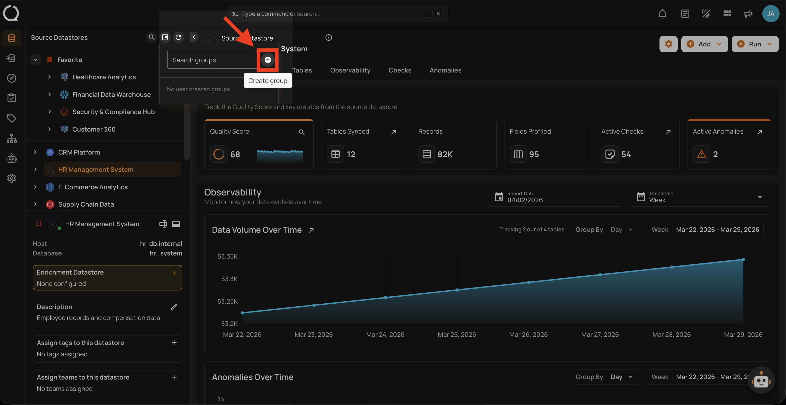
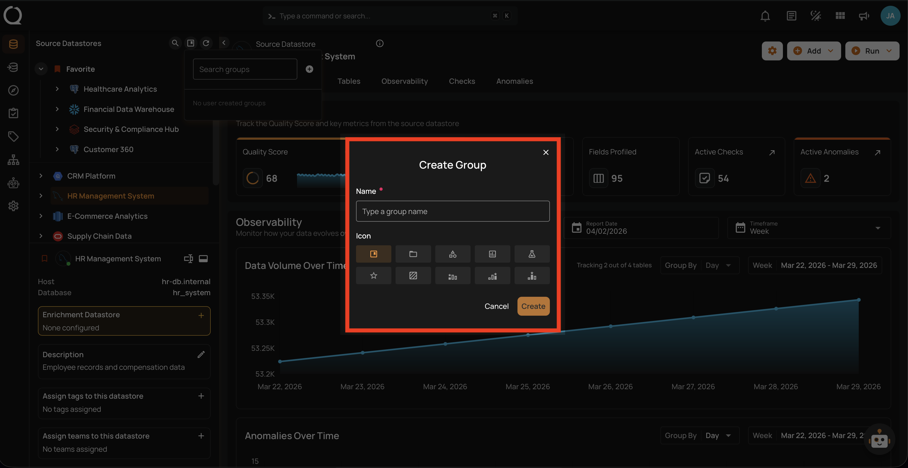
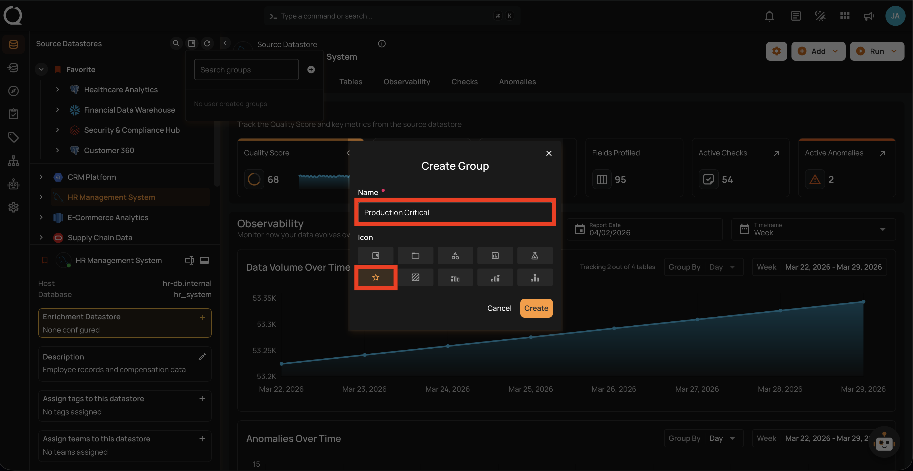
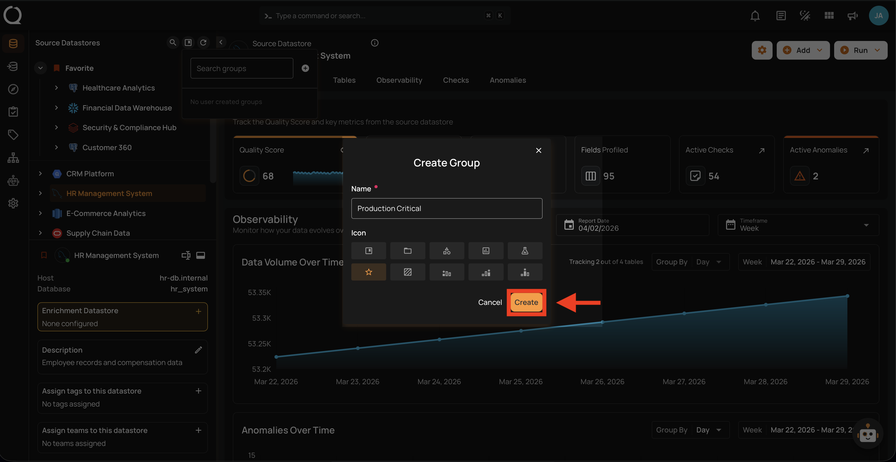
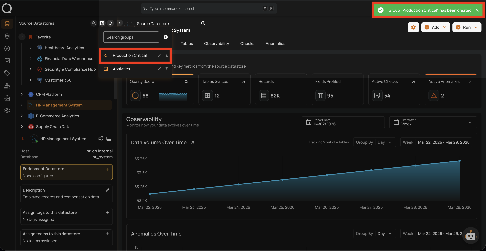

# Create a Datastore Group

This guide walks you through the steps to create a new datastore group in Qualytics.

!!! note
    You need the **Manager** role to create datastore groups. See the [Permissions](../concepts/permissions.md){:target="_blank"} page for details.

## Group Fields

The **Create Group** dialog contains the following fields:

| REF. | FIELD | REQUIRED | DESCRIPTION |
|:---:|:---|:---:|:---|
| 1 | Name | Yes | A unique name for the group. Must be between 1 and 100 characters. Group names are case-insensitive — `Production` and `production` are considered the same. If a group with the same name already exists, the creation will fail with an error. |
| 2 | Icon | No | Select one icon from the predefined options to visually identify the group. Only one icon can be selected per group. Defaults to **Bookmark** if not specified. |

### Available Icons

| No. | Icon | Label |
| :--- | :--- | :--- |
| 1. | :material-bookmark-box-outline:{ .lg } | Bookmark (default) |
| 2. | :material-folder-outline:{ .lg } | Folder |
| 3. | :material-shape-outline:{ .lg } | Shape |
| 4. | :material-chart-box-outline:{ .lg } | Chart |
| 5. | :material-flask-outline:{ .lg } | Flask |
| 6. | :material-star-outline:{ .lg } | Star |
| 7. | :material-texture-box:{ .lg } | Texture |
| 8. | :material-podium-bronze:{ .lg } | Bronze |
| 9. | :material-podium-silver:{ .lg } | Silver |
| 10. | :material-podium-gold:{ .lg } | Gold |

## Steps

**Step 1**: In the tree view header (top-left area of the sidebar), click the **Manage groups :material-bookmark-box-outline:** button.

**Step 2**: The Manage Groups panel will open, showing existing groups or an empty state if no groups have been created yet.

**Step 3**: Click the **Create group :material-plus-circle:** button at the top of the panel.

**Step 4**: The **Create Group** dialog will appear. Enter a group name and select an icon as described in the [Group Fields](#group-fields) section above.

**Step 5**: Fill in the group name and select an icon. In this example, the group is named **Production Critical** with the **Star** :material-star-outline: icon.

**Step 6**: Click the **Create** button to create the group.

**Step 7**: A success message will confirm that the group has been created. The new group will appear in the Manage Groups panel. Use the search field at the top of the panel to find groups quickly if you have many.

!!! info
    The newly created group will only appear in the tree view once a datastore is assigned to it. Until then, it is only visible in the Manage Groups panel. See the [Assign a Datastore to a Group](assign-a-datastore.md){:target="_blank"} guide.
