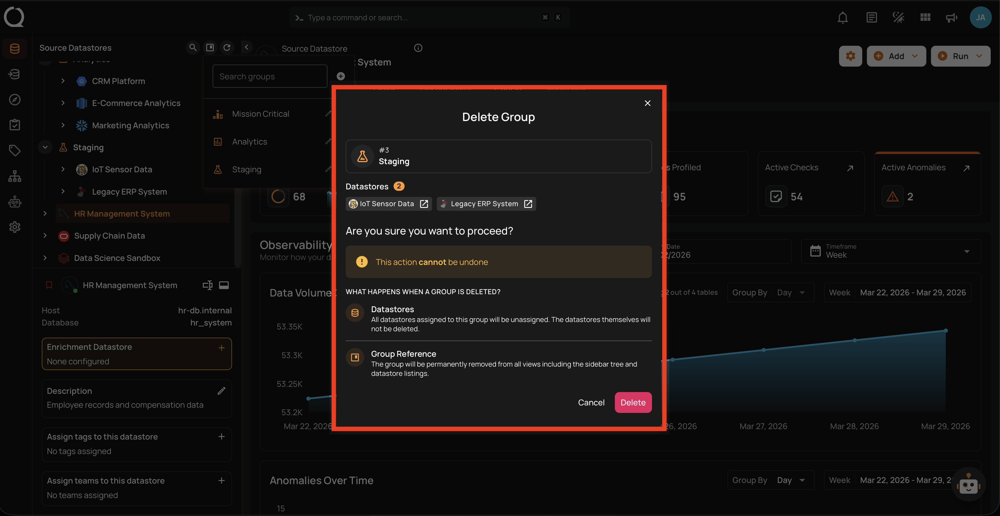
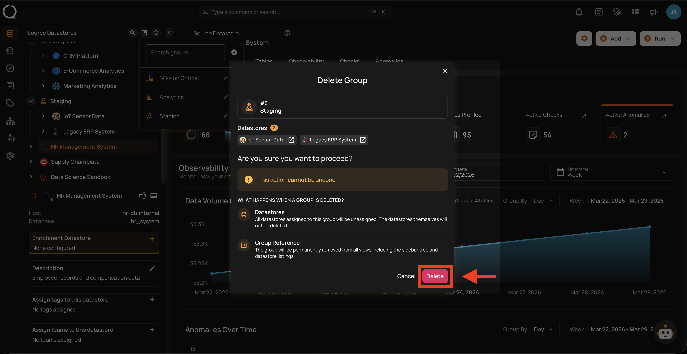
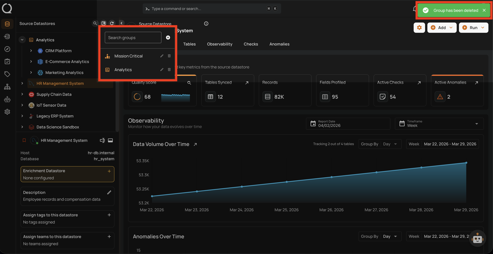

# Delete a Datastore Group

This guide walks you through the steps to delete a datastore group.

!!! note
    You need the **Manager** role to delete datastore groups. See the [Permissions](../concepts/permissions.md){:target="_blank"} page for details.

!!! warning
    Deleting a group is **permanent and cannot be undone**. However, the datastores within the group are **not** deleted — they will become ungrouped and move to the **Ungrouped** section of the tree view.

## Steps

**Step 1**: In the tree view header (top-left area of the sidebar), click the **Manage groups :material-bookmark-box-outline:** button.

**Step 2**: In the Manage Groups panel, use the search field to find the group you want to delete, then click the **Delete group :material-trash-can-outline:** button next to it.

**Step 3**: A confirmation dialog will appear showing the group name, the datastores currently assigned to it, and what will happen when the group is deleted.

**Step 4**: Click the **Delete** button to confirm the deletion.

!!! tip
    You can click **Cancel** or close the dialog at any time to keep the group unchanged.

**Step 5**: A success message will confirm that the group has been deleted. The datastores that were in the group now appear in the **Ungrouped** section of the tree view.

!!! warning "API and Automation Impact"
    If you delete a group, any scripts or API calls that reference the group by its **name** or **ID** will fail. Update your automations before or after deleting.

!!! info
    After deleting a group, you can recreate a new group with the **same name** — the name becomes available again immediately.
