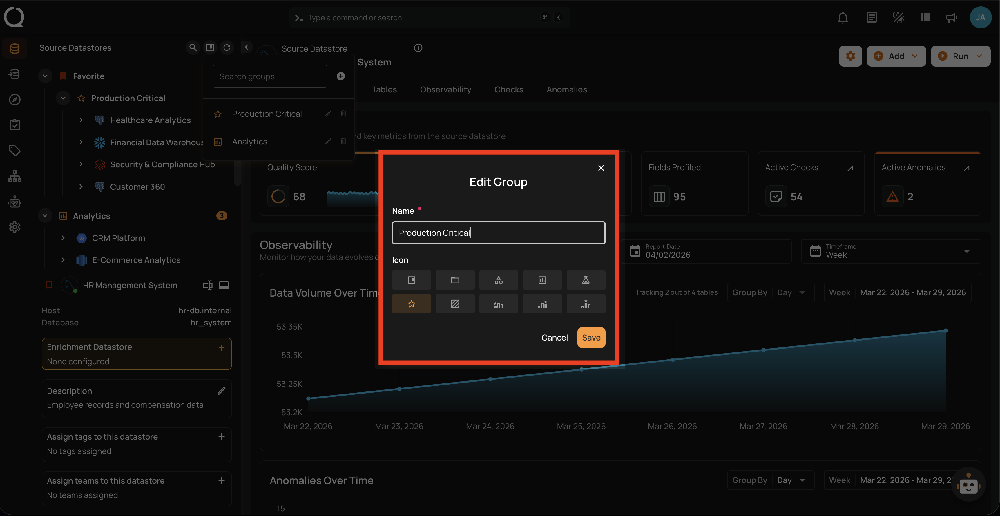
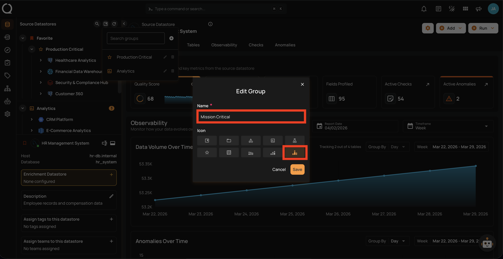
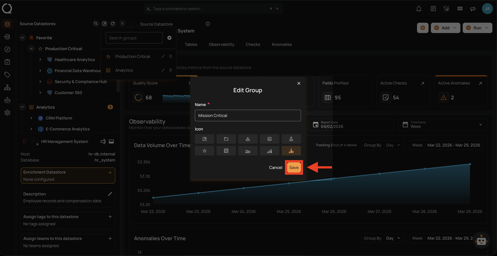
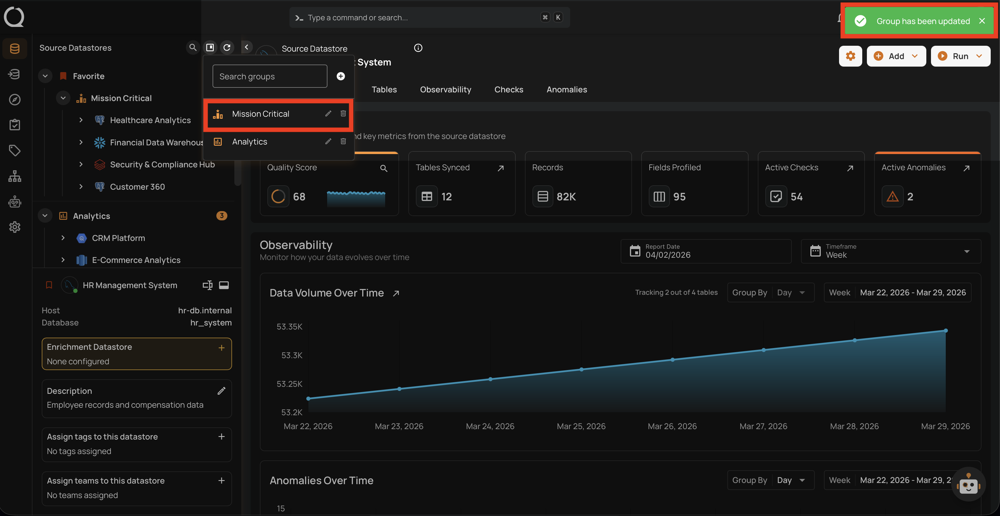

# Edit a Datastore Group

This guide walks you through the steps to edit an existing datastore group — including renaming it or changing its icon.

!!! note
    You need the **Manager** role to edit datastore groups. See the [Permissions](../concepts/permissions.md){:target="_blank"} page for details.

## Steps

**Step 1**: In the tree view header (top-left area of the sidebar), click the **Manage groups :material-bookmark-box-outline:** button.

**Step 2**: In the Manage Groups panel, use the search field to find the group you want to edit, then click the **Edit group :material-pencil-outline:** button next to it.

**Step 3**: The **Edit Group** dialog will appear with the group's current name and icon.

**Step 4**: Update the name, icon, or both as needed. In this example, the group is renamed from **Production Critical** to **Mission Critical** and the icon is changed to **Podium Bronze** :material-podium-bronze:.

!!! note
    Group names must be unique (case-insensitive) and between 1 and 100 characters. For the full list of available icons, see the [Create a Group](create-a-group.md#available-icons){:target="_blank"} page.

**Step 5**: Click the **Save** button to apply the changes.

**Step 6**: A success message will confirm that the group has been updated. The updated name and icon are immediately reflected in the Manage Groups panel, the tree view, and all datastores that belong to the group.

!!! warning "API and Automation Impact"
    If you rename a group, any scripts or API calls that reference the group by its **name** will need to be updated. The group **ID** remains unchanged after renaming.

!!! tip
    You can click **Cancel** or close the dialog at any time to discard your changes — no modifications will be saved.
