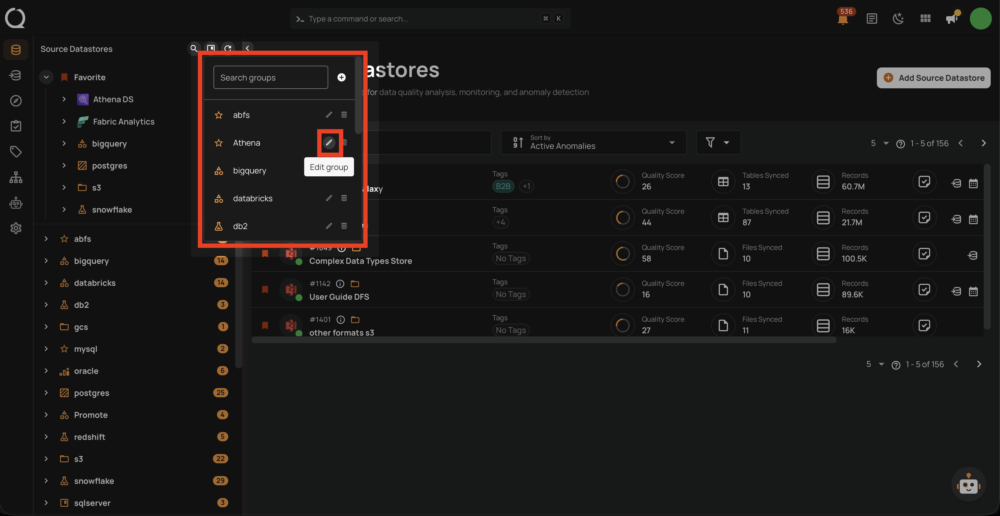
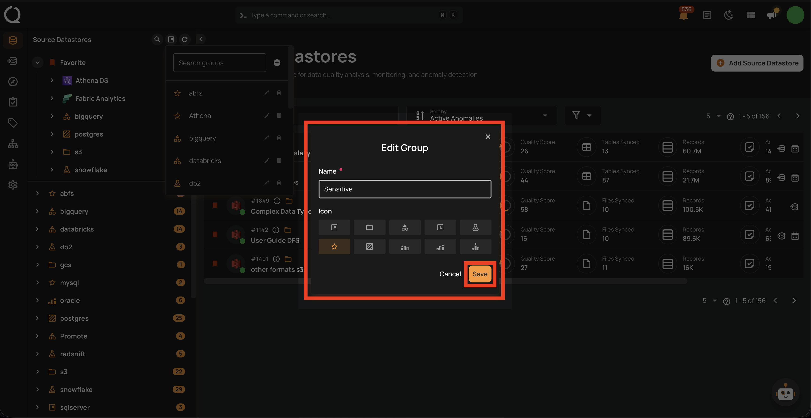

# Edit a Datastore Group

This guide walks you through the steps to edit an existing datastore group — including renaming it or changing its icon.

!!! note
    You need the **Manager** role to edit datastore groups.

## Steps

**Step 1**: Click on the **Manage groups :material-bookmark-box-outline:** button in the tree view header.

**Step 2**: In the Manage Groups panel, find the group you want to edit and click the **Edit group :material-pencil-outline:** button.

**Step 3**: A dialog will appear with the group's current name and icon. Update the fields as needed and click **Save** to apply the changes.

| Field | Description |
| :--- | :--- |
| **Name** | Change the group name (must remain unique, max 100 characters). |
| **Icon** | Select a different icon for the group. |

**Step 4**: The updated name and icon will be reflected in the tree view.
