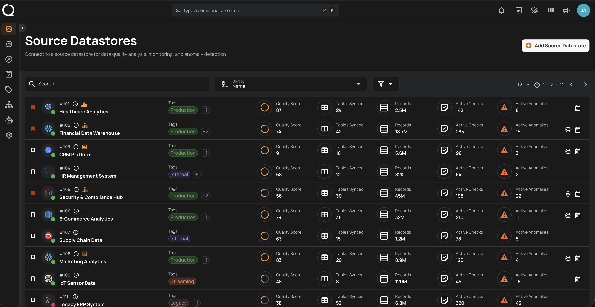
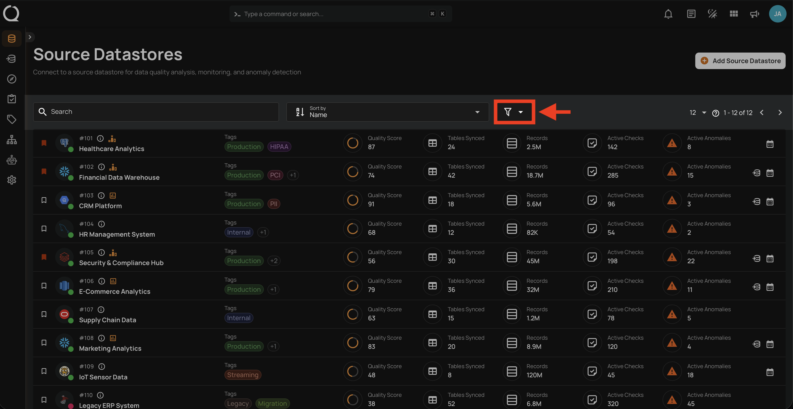
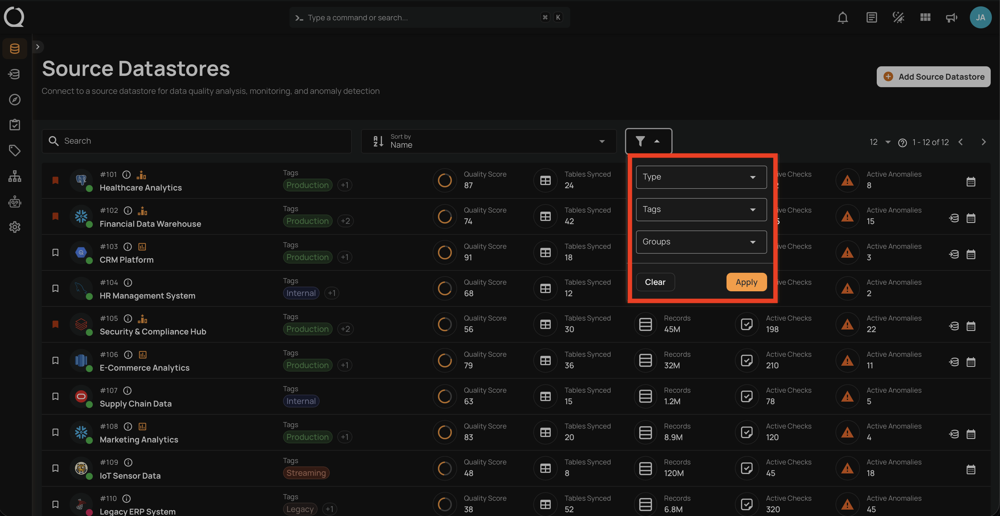
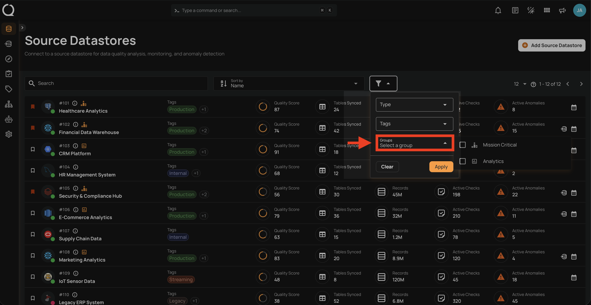
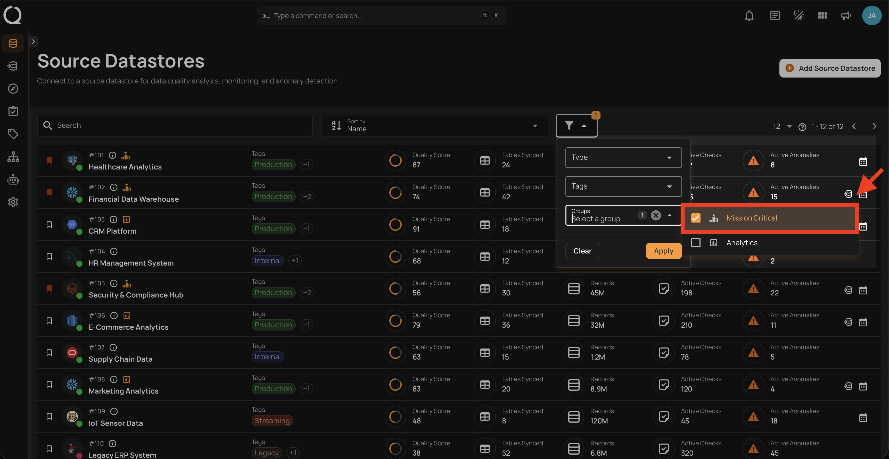
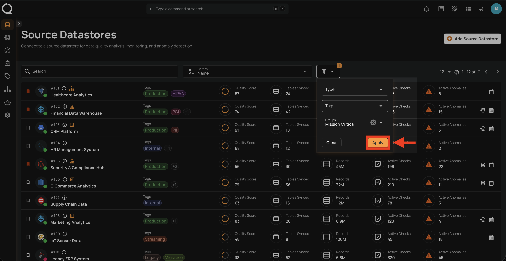
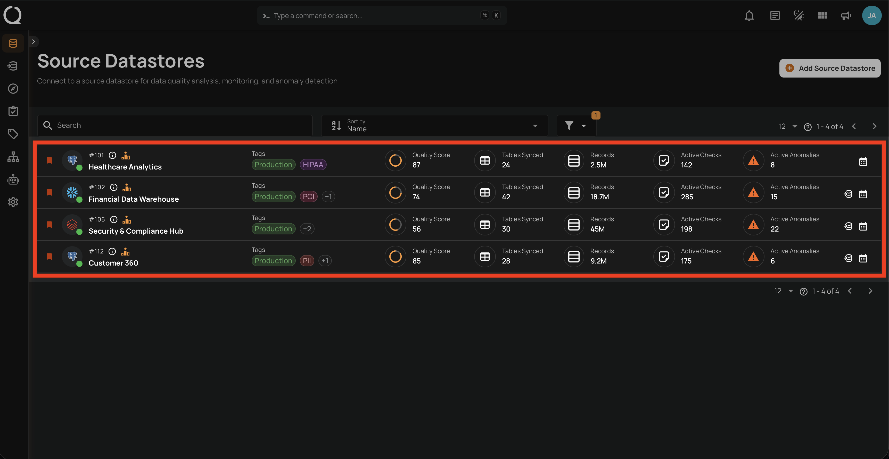

# Filter Datastores by Group

You can filter the Source Datastores listing page by group to narrow down results and focus on specific sets of datastores. Filtering is available to **all roles** — no special permissions are required.

!!! info "Filter Logic"
    When multiple groups are selected, the filter uses **OR** logic — datastores belonging to **any** of the selected groups are shown. When combined with other filters (Type, Tags), the filters use **AND** logic — only datastores matching **all** active filters are displayed.

## Steps

**Step 1**: Navigate to the **Source Datastores** listing page.

**Step 2**: Click the **Filter :material-filter-outline:** button in the toolbar to open the filter panel.

**Step 3**: The filter panel will open showing the available filter options (Type, Tags, Groups).

**Step 4**: Click the **Groups** dropdown to expand the list of available groups. Use the search field to find a group by name.

**Step 5**: Select one or more groups to filter by. Click on a group to select it — a checkbox will appear. Click additional groups to add them to the selection.

**Step 6**: Click the **Apply** button to apply the filter.

**Step 7**: The datastore listing updates to show only datastores that belong to the selected groups.

!!! tip
    To remove the filter, click the **Filter :material-filter:** button again and click **Clear**, or deselect the groups individually.
