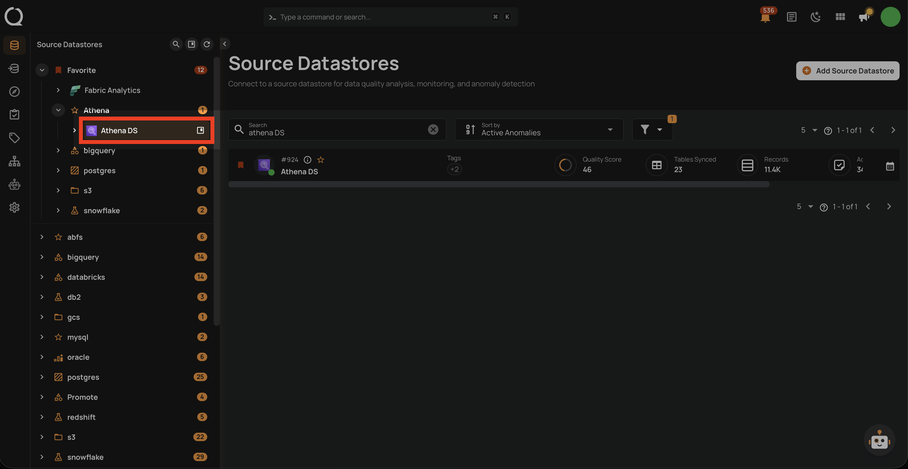
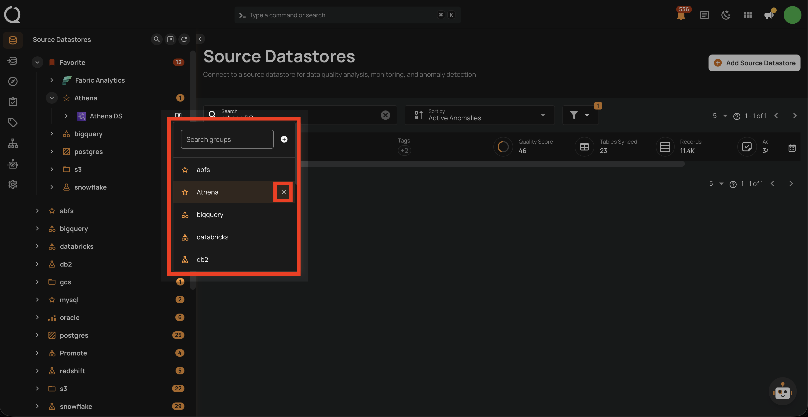
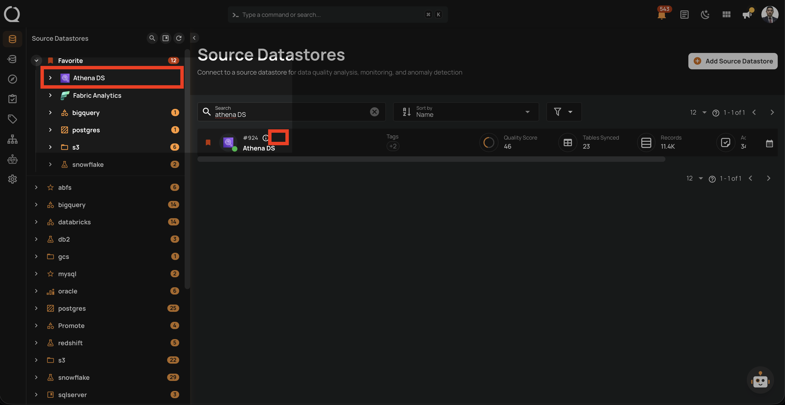

# Unassign a Datastore Group

This guide walks you through the steps to remove a datastore from its current group.

!!! note
    You need **Editor** permission on the datastore to remove it from a group.

## Steps

**Step 1**: In the tree view, hover over the datastore you want to remove from its group. The **Assign to group :material-bookmark-box-outline:** button will appear.

**Step 2**: Click the **Assign to group :material-bookmark-box-outline:** button. A dropdown will appear showing the currently assigned group.

**Step 3**: Click the **Close :material-close:** button next to the currently selected group.

**Step 4**: The datastore will move to the **Ungrouped** section of the tree view.

