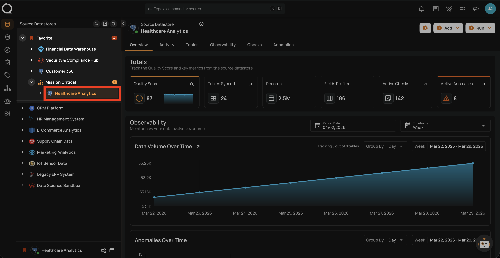
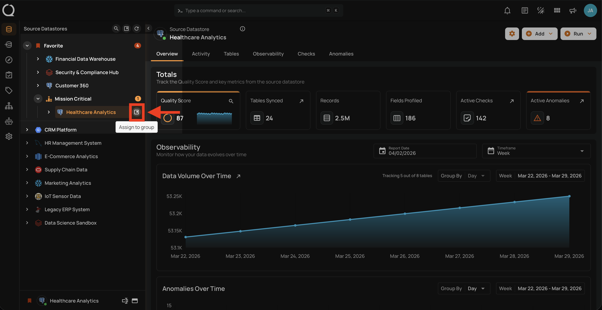
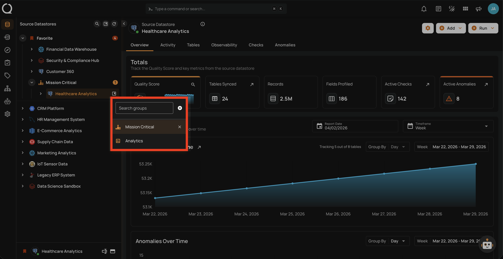
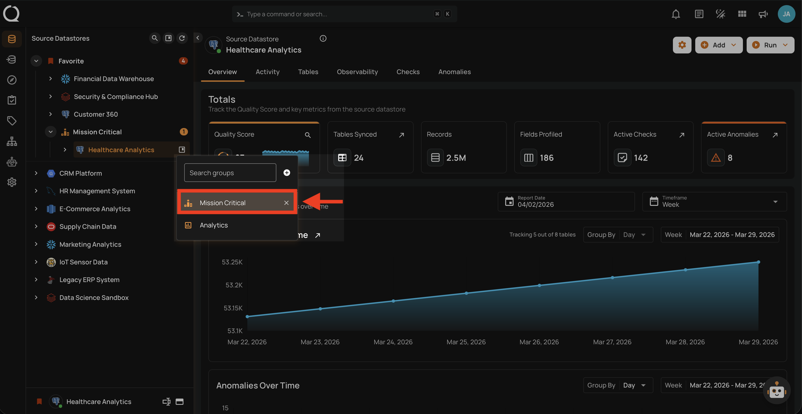
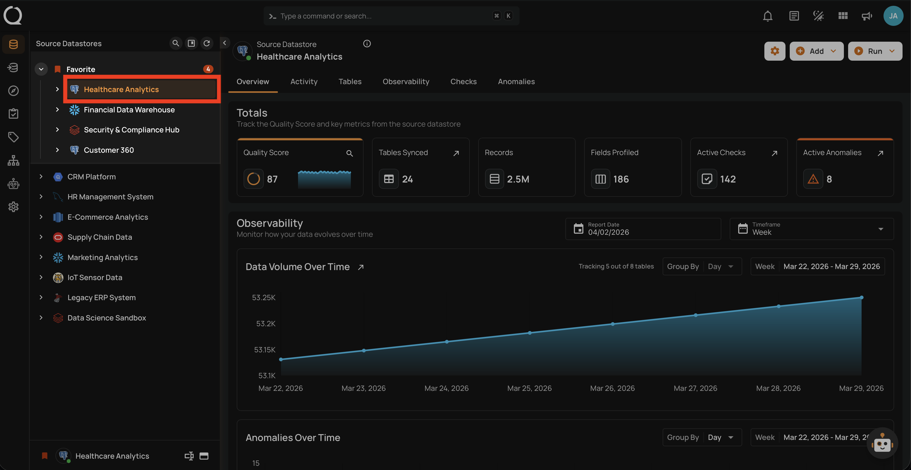
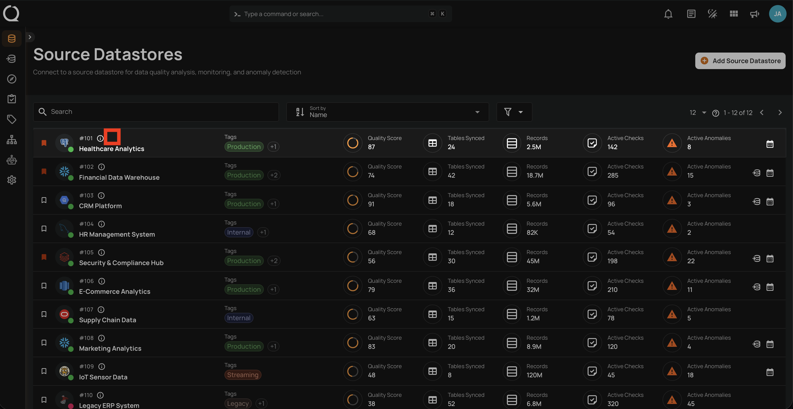

# Unassign a Datastore from a Group

This guide walks you through the steps to unassign a datastore from its current group. The datastore is not deleted — it simply moves to the **Ungrouped** section of the tree view.

!!! note
    You need the **Member** user role and **Editor** team permission on the datastore to unassign it from a group. See the [Permissions](../concepts/permissions.md){:target="_blank"} page for details.

!!! info "Shared Button"
    Assigning and unassigning use the same **Assign to group :material-bookmark-box-outline:** button and dropdown in the UI. To assign, you select a group; to unassign, you click the **Close :material-close:** button on the currently selected group.

## Steps

**Step 1**: In the tree view, hover over the datastore you want to unassign from its group. The **Assign to group :material-bookmark-box-outline:** button will appear on the right side of the datastore row.

**Step 2**: Click the **Assign to group :material-bookmark-box-outline:** button.

**Step 3**: A dropdown will appear showing the available groups. The currently assigned group is highlighted. Use the search field to find groups by name.

**Step 4**: Click the **Close :material-close:** button on the right side of the currently assigned group to unassign the datastore from it. The removal is immediate — no confirmation is required.

**Step 5**: The datastore moves to the **Ungrouped** section of the tree view (or to the **Favorites** section if it is favorited).

**Step 6**: The group icon is no longer displayed next to the datastore in the Source Datastores listing page.

!!! tip
    To move a datastore to a different group instead of ungrouping it, simply select the new group from the dropdown — no need to unassign from the current group first.

!!! info "Assign a Datastore to a Group"
    To assign a datastore to a group, see the [Assign a Datastore to a Group](assign-a-datastore.md){:target="_blank"} documentation.
