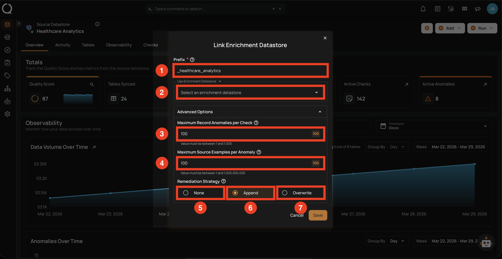
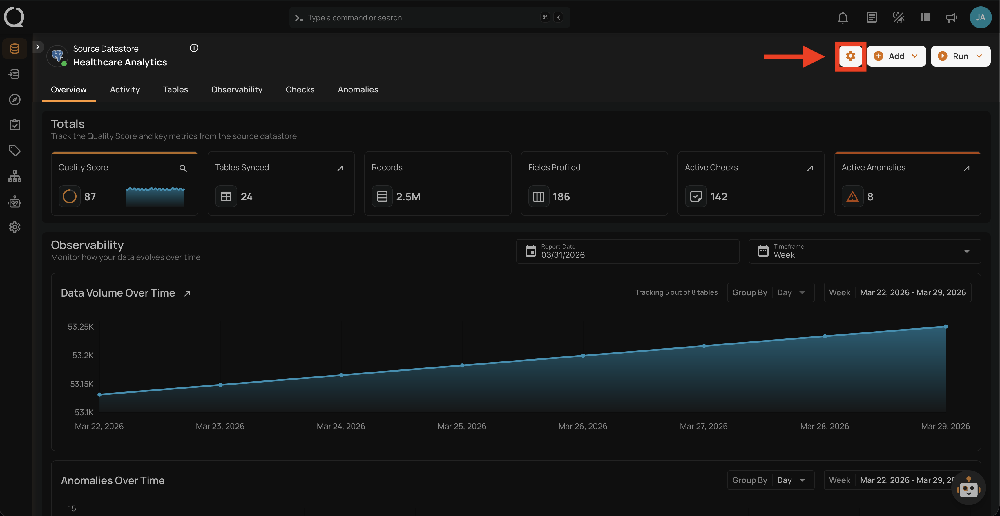
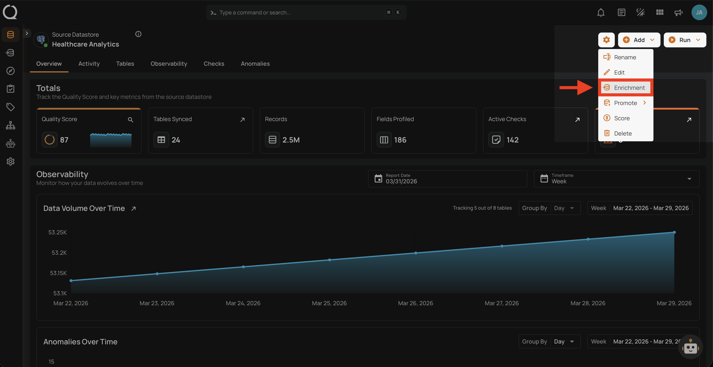
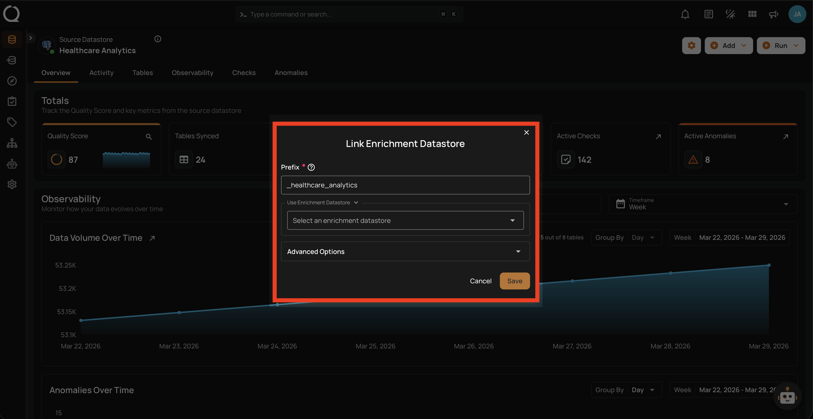
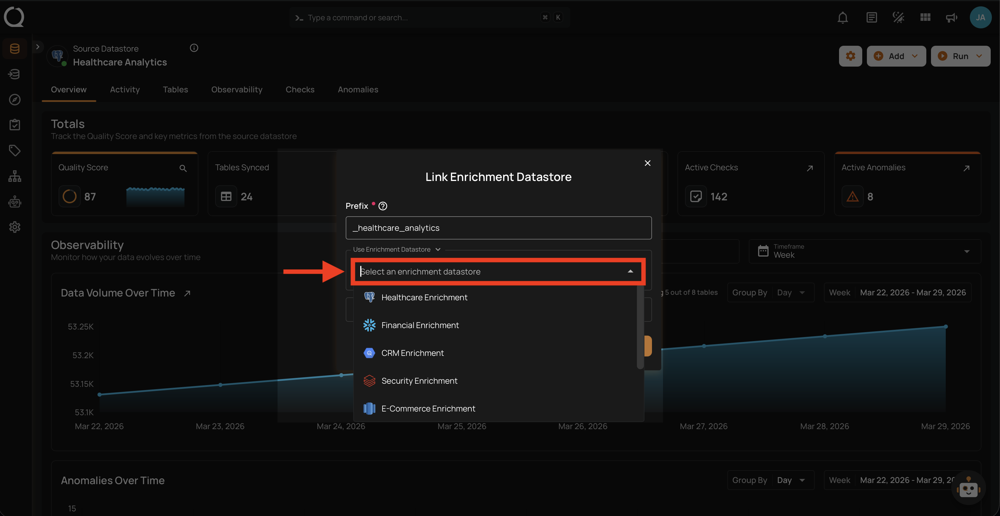
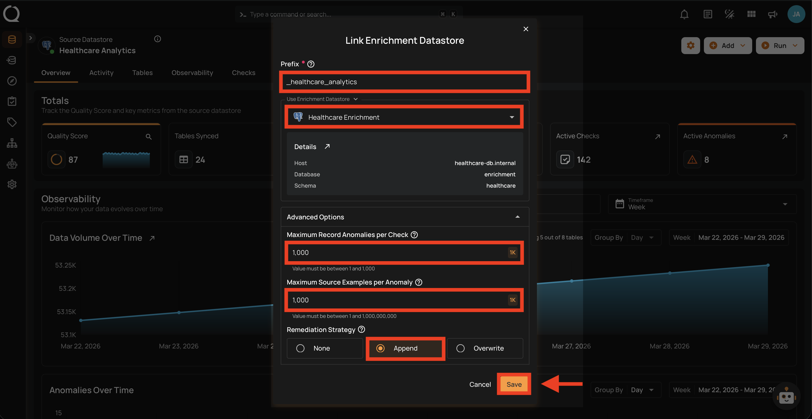
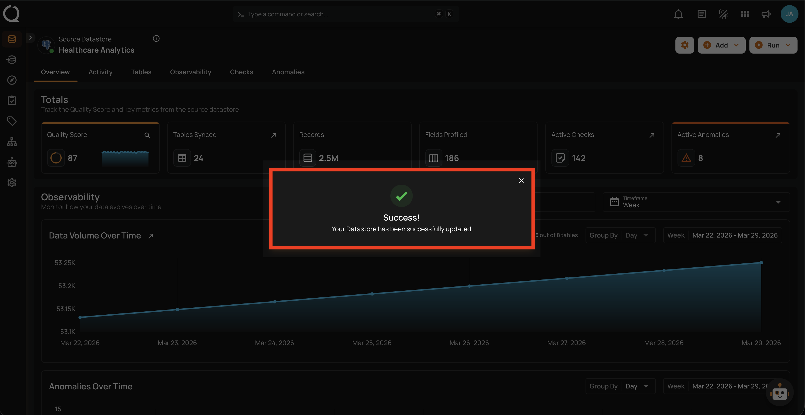
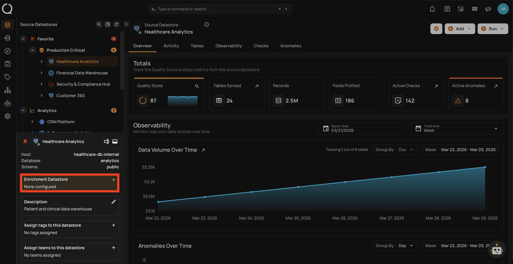
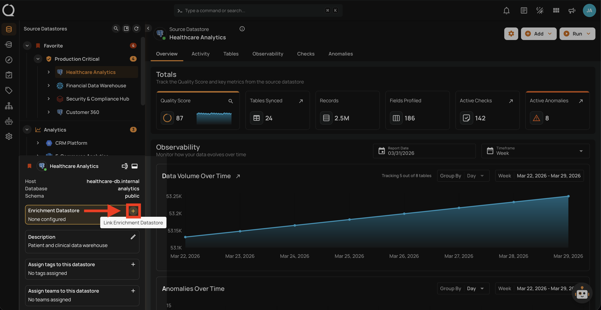

# Link Enrichment Datastore

Linking an enrichment datastore to a source datastore gives Qualytics a dedicated place to persist scan results, anomalies, source record examples, and remediation data directly in your own infrastructure.

!!! info "Link During Datastore Creation"
    You can also link an enrichment datastore during the datastore creation wizard. See the [Link on Datastore Creation](../enrichment-datastore/link-during-creation.md) documentation.

## Enrichment Settings

The **Link Enrichment Datastore** modal contains the following fields that you will configure during the linking process:

| REF. | FIELD | DEFAULT | RANGE | DESCRIPTION |
|:---:|:---|:---:|:---:|:---|
| 1 | Prefix | Auto-generated | — | A prefix added to all enrichment table names to distinguish them from source tables. Auto-generated from the datastore name, normalized to lowercase with underscores (e.g., `_healthcare_analytics`). Each source datastore linked to the same enrichment datastore **must have a unique prefix** to avoid table name conflicts. Maximum 60 characters. |
| 2 | Enrichment Datastore | — | — | Select an existing enrichment datastore from the dropdown. Only datastores created as enrichment-only with write capabilities are shown. See the [Supported Enrichment Datastores](../../enrichment-support/supported-enrichment-datastores.md){:target="_blank"} page for the full list of connectors that support enrichment. |
| 3 | Maximum Record Anomalies per Check | `10` | 1–1,000 | How many individual anomalies can be created per quality check before they are grouped into one rolled-up anomaly. |
| 4 | Maximum Source Examples per Anomaly | `10` | 1–1,000,000,000 | How many source data rows are stored in the enrichment datastore as examples when a quality check fails. |
| 5 | Remediation Strategy: None | — | — | Do not replicate anomalous source tables. Only anomaly metadata is tracked within Qualytics. This is the default. |
| 6 | Remediation Strategy: Append | — | — | Anomalous source records are appended to enrichment tables after each scan. Builds a historical audit trail of all anomalous data over time — useful for compliance and governance. |
| 7 | Remediation Strategy: Overwrite | — | — | Enrichment tables are replaced with anomalous records from the latest scan. Only the most recent anomalous data is kept — useful when you only need the current state. |

---

There are two ways to link an enrichment datastore:

- [**Option I**](#option-i-via-settings-menu): Through the Settings menu
- [**Option II**](#option-ii-via-tree-footer): Through the tree footer panel

---

## Option I: Via Settings Menu

**Step 1**: Navigate to your datastore overview and click the **Settings :material-cog-outline:** button located at the top-right corner of the interface.

**Step 2**: A dropdown menu will appear. Click on **Enrichment :material-database-import-outline:** to open the Link Enrichment Datastore modal.

**Step 3**: The **Link Enrichment Datastore** modal will appear.

**Step 4**: Select an existing enrichment datastore from the **Use Enrichment Datastore** dropdown.

**Step 5**: Configure the enrichment settings (prefix, anomaly thresholds, remediation strategy) as described in the [Enrichment Settings](#enrichment-settings) section above. After configuring all fields, click **Save** to link the enrichment datastore.

**Step 6**: A success message will confirm that the datastore has been updated successfully.

---

## Option II: Via Tree Footer

**Step 1**: Select the datastore from the tree view on the left side. In the footer panel, locate the **Enrichment Datastore** section showing "None configured".

**Step 2**: Click the **Link Enrichment Datastore :material-link-variant:** button to open the Link Enrichment Datastore modal.

**Step 3**: The **Link Enrichment Datastore** modal will appear.

**Step 4**: Select an existing enrichment datastore from the **Use Enrichment Datastore** dropdown.

**Step 5**: Configure the enrichment settings (prefix, anomaly thresholds, remediation strategy) as described in the [Enrichment Settings](#enrichment-settings) section above. After configuring all fields, click **Save** to link the enrichment datastore.

**Step 6**: A success message will confirm that the datastore has been updated successfully.

---

!!! info "Unlink Enrichment Datastore"
    To remove the enrichment link, see the [Unlink Enrichment Datastore](unlink-enrichment.md) documentation.
