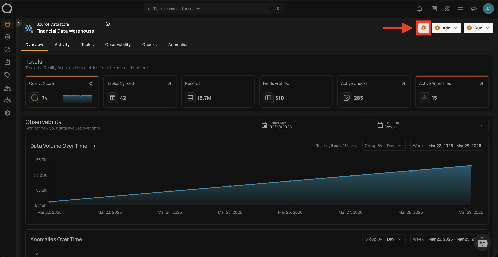
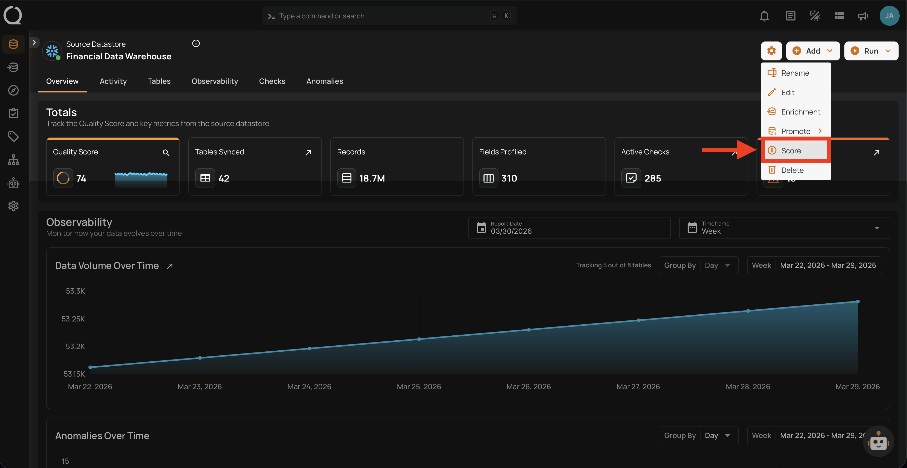
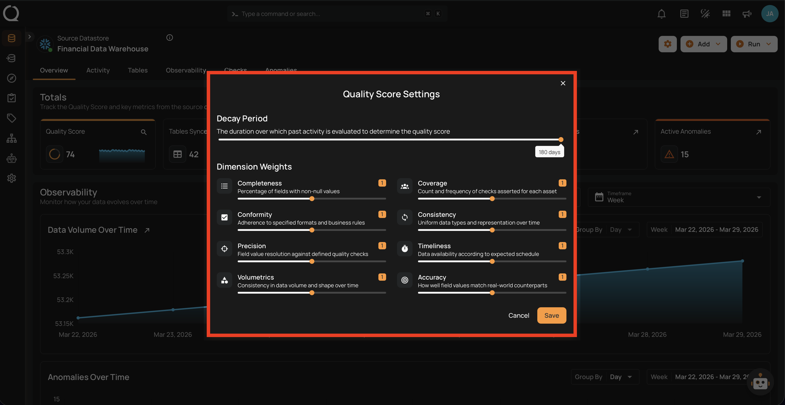
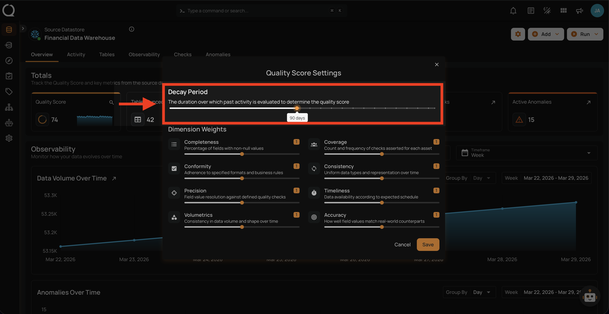
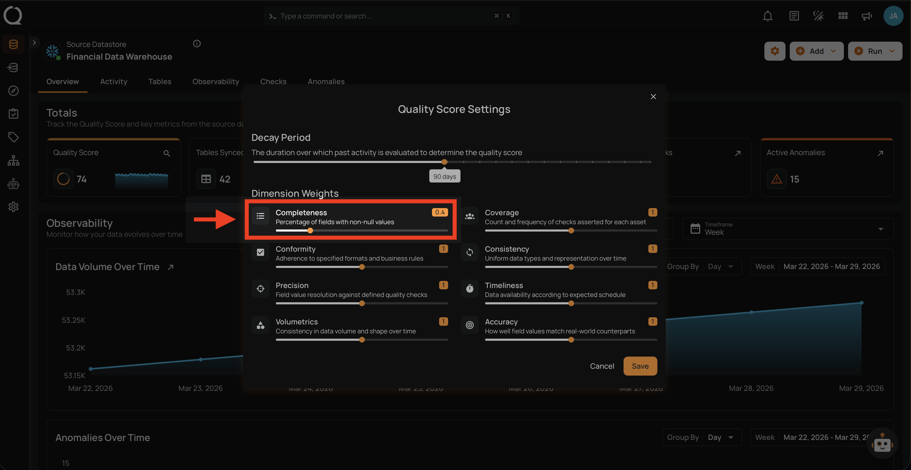
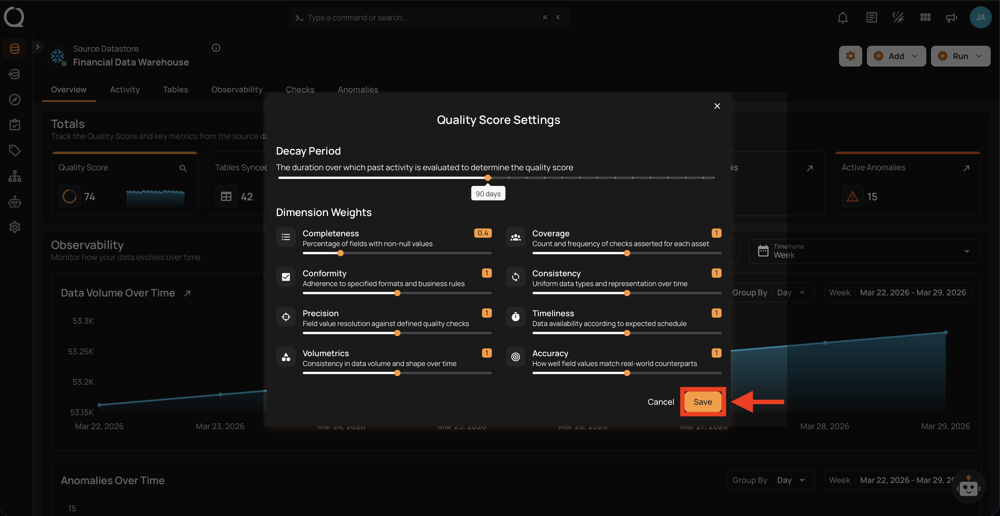

# Quality Score Settings

Quality Scores are quantified measures of data quality calculated at the field and container levels, recorded as time series to enable tracking of changes over time. Scores range from 0–100, with higher values indicating superior quality. These scores integrate eight distinct dimensions, providing a granular analysis of the attributes that impact the overall data quality.

## Steps

**Step 1**: Navigate to your datastore overview and click the **Settings :material-cog-outline:** button located at the top-right corner of the interface.

**Step 2**: A dropdown menu will appear. Click on **Score** to open the quality score settings.

**Step 3**: A modal window — **Quality Score Settings** — will appear with the decay period and dimension weights configuration.

**Step 4**: Configure the **Decay Period** — the time frame over which the system evaluates historical data to determine the quality score. The default is 180 days, but it can be customized to fit your operational needs.

**Step 5**: Adjust the **Dimension Weights** to control the importance of each quality factor in the total score. Each dimension can be enabled or disabled and its weight adjusted using the slider.

The eight quality dimensions are:

| Dimension | Description |
| :--- | :--- |
| **Completeness** | Measures the percentage of fields with non-null values. |
| **Coverage** | Assesses the count and frequency of checks asserted for each asset. |
| **Conformity** | Checks adherence to specified formats and business rules. |
| **Consistency** | Ensures uniform data types and representation over time. |
| **Precision** | Evaluates the resolution against defined quality checks. |
| **Timeliness** | Gauges data availability according to expected schedules. |
| **Volumetrics** | Analyzes consistency in data volume and shape over time. |
| **Accuracy** | Determines how well field values match real-world counterparts. |

**Step 6**: Click the **Save** button to apply the quality score settings.

After clicking **Save**, a success notification will confirm that the settings have been applied. The quality scores for all containers and fields in the datastore will be recalculated based on the new configuration.
