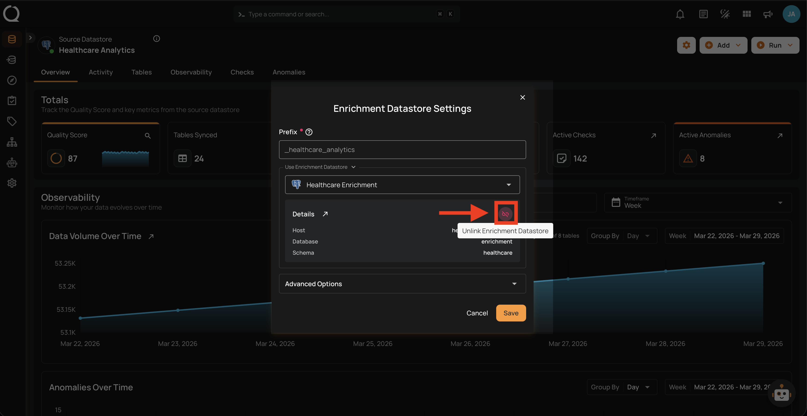
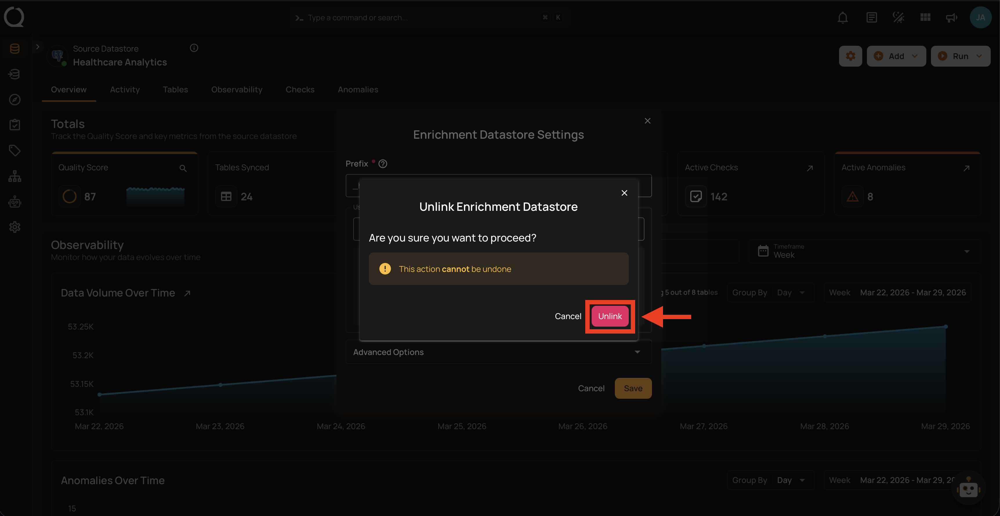
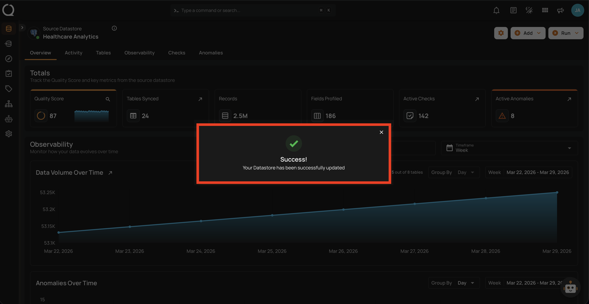

# Unlink Enrichment Datastore

Unlinking an enrichment datastore removes the connection between the source datastore and the enrichment target. After unlinking, no new enrichment data will be written during future Scan operations.

!!! note "Permission Required"
    You need the **Admin** user role to unlink an enrichment datastore. See the [Permissions](../enrichment-datastore/permissions.md){:target="_blank"} page for details.

!!! warning "Before Unlinking"
    You cannot unlink if the source datastore has active **Export** or **Materialize** operations in flows or scheduled operations. Remove those operations first through the [Flows](../../settings/integrations/ai-and-agents/managing/delete-a-conversation.md){:target="_blank"} settings.

!!! info "What Happens When You Unlink"
    For details on what happens to your data, whether you can re-link, and how to clean up enrichment tables, see the [Enrichment Introduction — Unlinking](../enrichment-datastore/introduction.md#unlinking){:target="_blank"} section.

## Steps

**Step 1**: Navigate to your datastore overview and click the **Settings :material-cog:** button located at the top-right corner of the interface.

**Step 2**: A dropdown menu will appear. Click on **Enrichment :material-database-import-outline:** to open the enrichment datastore settings.

**Step 3**: The enrichment settings modal will appear. Click the **Unlink Enrichment Datastore :material-link-off:** button located on the right side of the Details section.

**Step 4**: A confirmation dialog will appear. Click **Unlink** to confirm.

**Step 5**: A success message will confirm that the enrichment datastore has been unlinked.

!!! info "Link Enrichment Datastore"
    To link an enrichment datastore to a source datastore, see the [Link Enrichment Datastore](link-enrichment.md){:target="_blank"} documentation.
