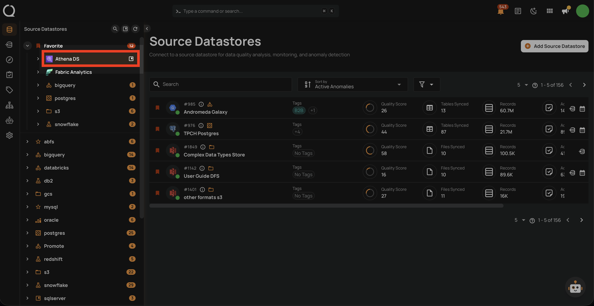
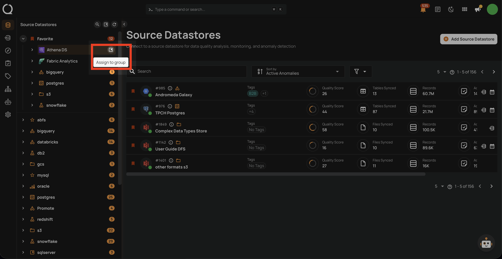
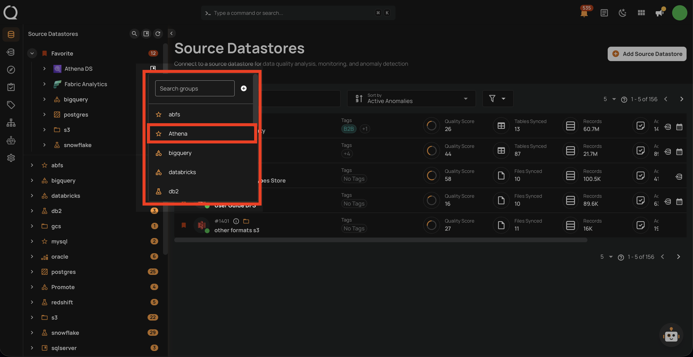
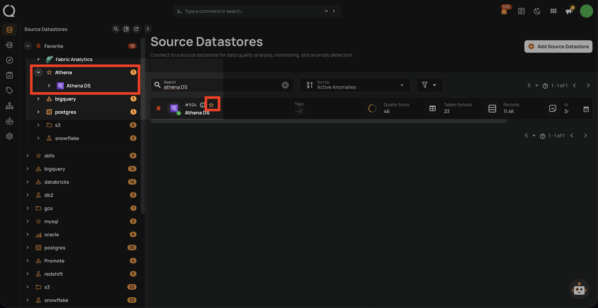

# Assign a Datastore to a Group

This guide walks you through the steps to assign a datastore to an existing group.

!!! note
    You need **Editor** permission on the datastore to assign it to a group.

## Steps

**Step 1**: In the tree view, hover over the datastore you want to assign. An **Assign to group** icon will appear.

**Step 2**: Click the **Assign to group** button. A dropdown will appear with the list of available groups.

**Step 3**: Select the group you want to assign the datastore to.

**Step 4**: The datastore will immediately move under the selected group in the tree view, and the group icon will be displayed next to the datastore.

!!! tip
    You can also **create a new group** directly from the assign menu by clicking the **Create** button, if you have the Manager role.
