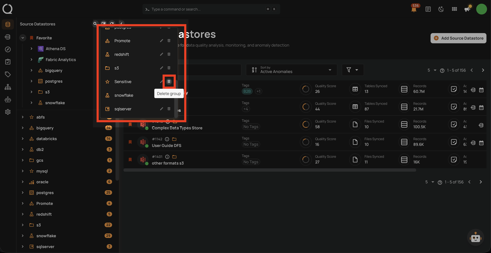

# Delete a Datastore Group

This guide walks you through the steps to delete a datastore group.

!!! note
    You need the **Manager** role to delete datastore groups.

!!! warning
    Deleting a group does **not** delete the datastores within it. All datastores in the group will become ungrouped.

## Steps

**Step 1**: Click on the **Manage groups** button (bookmark icon) in the tree view header.

**Step 2**: In the Manage Groups panel, find the group you want to delete and click the **Delete group** button (trash icon). The group will be deleted immediately.

!!! warning
    The deletion happens immediately — there is no confirmation dialog. Make sure you are deleting the correct group.

**Step 3**: The group is removed. All datastores that were in the group now appear in the **Ungrouped** section of the tree view.
