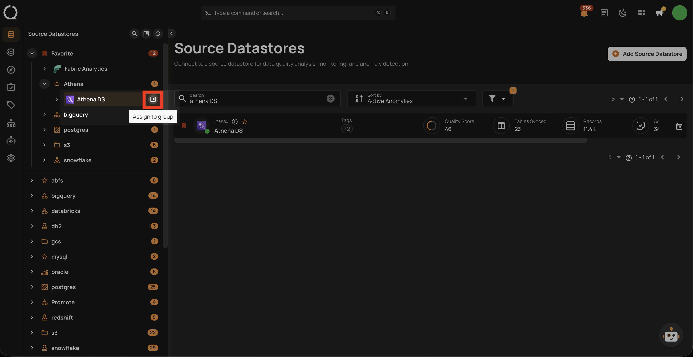

# Remove a Datastore from a Group

This guide walks you through the steps to remove a datastore from its current group.

!!! note
    You need **Editor** permission on the datastore to remove it from a group.

## Steps

**Step 1**: In the tree view, hover over the datastore you want to remove from its group. An **assign menu** icon will appear.

**Step 2**: Click the assign menu icon. A dropdown will appear showing the currently assigned group.

**Step 3**: Click the **close icon** (x) next to the currently selected group.

**Step 4**: The datastore will move to the **Ungrouped** section of the tree view.

