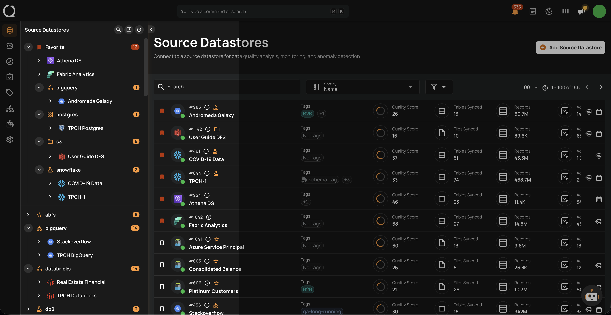

# Datastore Grouping Overview

Datastore Grouping is a feature in Qualytics that allows you to organize your datastores into custom groups within the tree view. Instead of browsing a flat list of datastores, you can create meaningful categories — such as by environment, team, domain, or priority — making it easier to locate and manage your data sources.

## Why Datastore Grouping Matters

As the number of datastores in your workspace grows, finding the right datastore becomes increasingly difficult. Datastore Grouping solves this by letting you:

- **Organize datastores visually**: Create groups that reflect your team's structure, data domains, or business units.
- **Navigate faster**: Collapse and expand groups in the tree view to focus on the datastores you need.
- **Customize with icons**: Assign distinct icons to each group for quick visual identification.
- **Filter by group**: Use group-based filtering on the datastore listing page to narrow down results.

## Deep Dive

| Topic | Description |
| :--- | :--- |
| [Introduction](concepts/understanding-grouping.md) | Learn how grouping works, its role in datastore organization, and best practices. |
| [Permissions](concepts/permissions.md) | Understand who can create, edit, delete groups and assign datastores. |

## Managing

| Task | Description |
| :--- | :--- |
| [Create a Group](managing-groups/create-a-group.md) | Create a new datastore group with a custom name and icon. |
| [Edit a Group](managing-groups/edit-a-group.md) | Rename a group or change its icon. |
| [Delete a Group](managing-groups/delete-a-group.md) | Remove a group — datastores in the group become ungrouped. |
| [Assign a Group](managing-groups/assign-a-datastore.md) | Add a datastore to an existing group. |
| [Unassign a Group](managing-groups/remove-a-datastore.md) | Remove a datastore from its current group. |

## API

| Topic | Description |
| :--- | :--- |
| [API](concepts/grouping-api.md) | API endpoints for managing datastore groups programmatically. |

## FAQ

| Topic | Description |
| :--- | :--- |
| [FAQ](concepts/grouping-faq.md) | Answers to common questions about datastore grouping. |
