# Sync Operation

!!! warning
    This operation was renamed from **Catalog** to **Sync** in release **2026.3.20**.

A Sync Operation detects new, changed, or removed containers and fields in a Source Datastore. It imports named data collections like tables, views, and files, identifies incremental fields for incremental scans, and offers options to recreate or delete these containers, streamlining data management and enhancing data discovery.

The Sync operation works incrementally — it compares the current state of your datastore against what Qualytics already knows and only processes the differences (deltas), making it significantly faster for datastores that have already been synced.

Let's get started 🚀

## Key Components

### Incremental Identifier

An [incremental identifier](https://userguide.qualytics.io/glossary/#incremental-identifier) is essential for supporting incremental scan operations, as it allows the system to detect changes since the last operation.

### Partition Identifier

For large data containers or partitions, a [partition identifier](https://userguide.qualytics.io/glossary/#partition-identifier) is necessary to process data efficiently. In DFS datastores, the default fields for both incremental and partition identifiers are set to the last-modified timestamp. If a partition identifier is missing, the system uses repeatable ordering candidates (order-by fields) to process containers, although this method is less efficient for handling large datasets with many rows.

!!! info
    Attribute Overrides: After the profile operation, the qualytics engine might automatically update the containers to have partition fields and incremental fields. Those "attributes" can be manually overridden.

!!! note
    Advanced users should be able to override these auto-detected selections and overridden options should persist through subsequent Sync Operations.

<!--
## Container Statuses

After a Sync operation, each container in your datastore is assigned one of the following statuses based on its current state:

| Status         | Description                                                                                                                                                   |
|----------------|---------------------------------------------------------------------------------------------------------------------------------------------------------------|
| **Available**  | The container was found in the datastore and successfully analyzed. No changes were detected in its fields since the last sync.                                |
| **Changed**    | The container was found in the datastore and its fields have changed since the last sync. A re-profile is recommended to update metadata and quality checks.   |
| **Inaccessible** | The container exists in Qualytics but was not found in the datastore listing. It may have been removed, renamed, or the connection credentials may lack permission to access it. |
| **Unloadable** | The container appears in the datastore listing but could not be analyzed (e.g., due to permission issues, corrupt data, or unsupported format).                |

!!! info
    Containers that were previously **Inaccessible** or **Unloadable** are automatically restored to **Available** or **Changed** when they are successfully analyzed in a subsequent Sync operation.
-->

## Initialization & Operation Options

### Automatic Sync Operation

While adding the datastore, tick the Initiate Sync checkbox to automatically perform a sync operation on the configured source datastore.

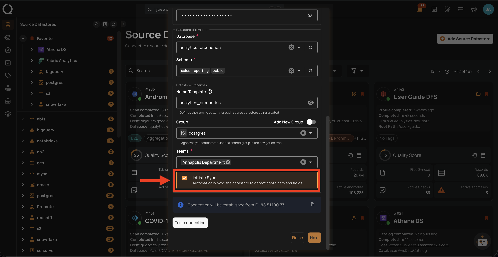

With the automatic sync option turned on, you will be redirected to the datastore details page once the datastore (whether JDBC or DFS) is successfully added. You will observe the sync operation running automatically with the following default options:

-   Prune: Disabled ❌

-   Recreate: Disabled ❌

-   Include: Tables and views ✔️

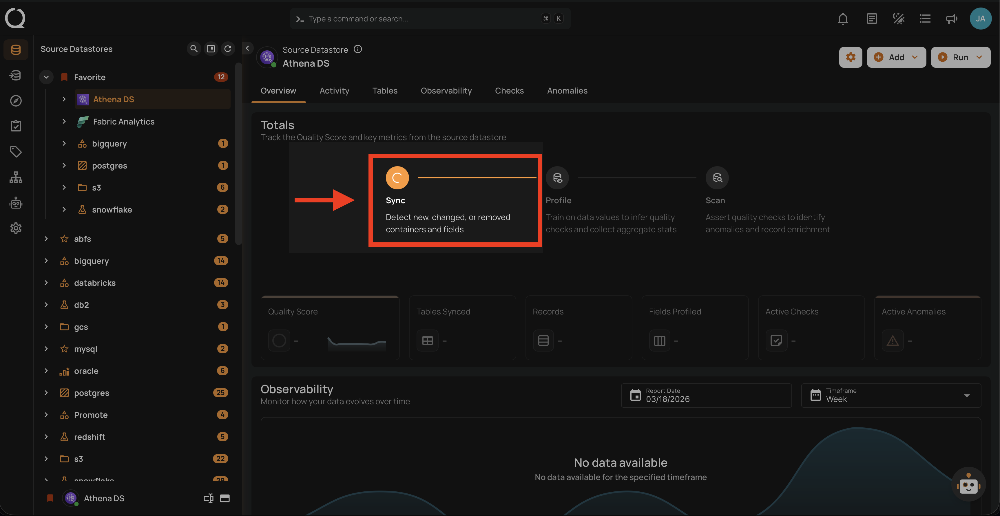

### Manual Sync Operation

If automatic sync is disabled while adding the datastore, users can initiate the sync operation manually by selecting preferred options. Manual sync operation offers users the flexibility to set up custom sync configurations like syncing only tables or views.

**Step 1**: Select a source datastore from the side menu on which you would like to perform the sync operation.

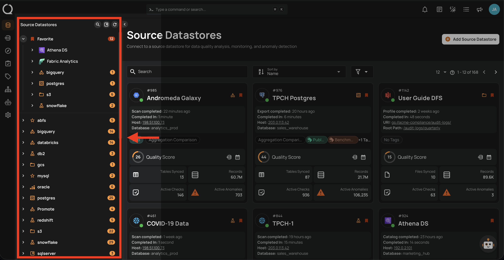

**Step 2**: Clicking on your preferred datastore will navigate you to the datastore details page. Within the overview tab (default view), click on the **Sync** button to initiate the sync operation.

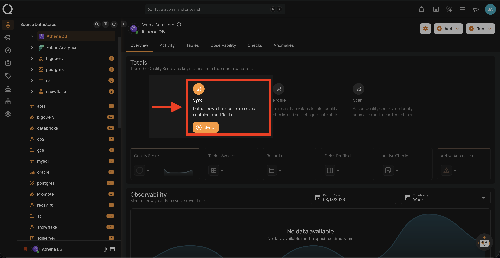

A modal window will display **Operation Triggered** and you will be notified once the sync operation is completed.

!!! note
    You will receive a notification when the sync operation is completed.

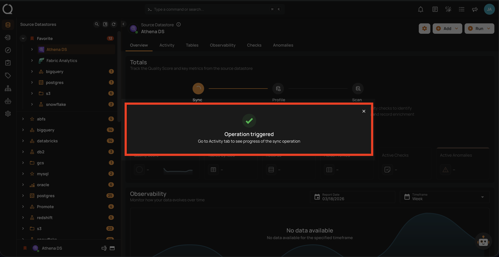

**Step 3**: Close the **Success** modal window and you will observe in the UI that the Sync operation has been completed and it has detected new, changed, or removed containers and fields from your configured datastore.

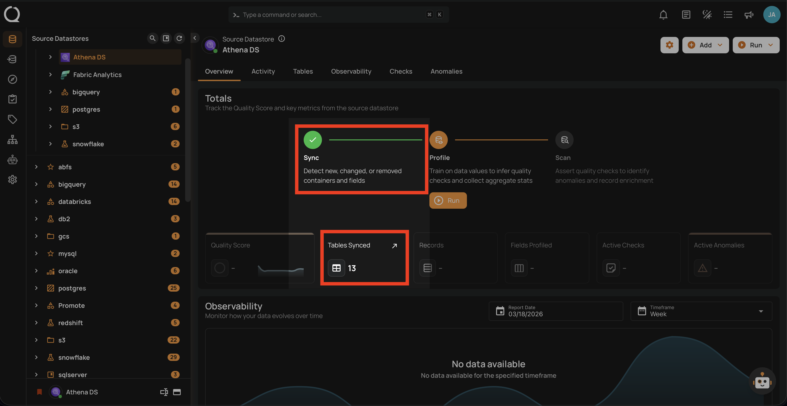

<!--
Users might encounter a error if the schema of the datastore is empty or if the specified user for logging does not have the necessary permissions to read the objects. This ensures that proper access controls are in place and that the data structure is correctly defined.

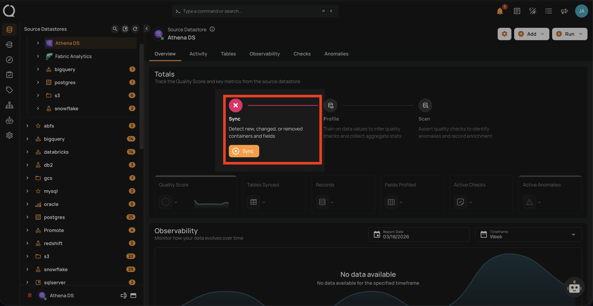
-->

#### Custom Sync Configuration

The sync operation can be custom-configured with the following options:

-   **Prune**: Remove any existing named collections that no longer appear in the datastore

-   **Recreate**: Restore any previously removed named collection that does currently appear in the database

-   **Include**: Include Tables and Views

**Step 1**: Click on the **Run** button from the datastore details page (top-right corner) and select **Sync** from the dropdown list.

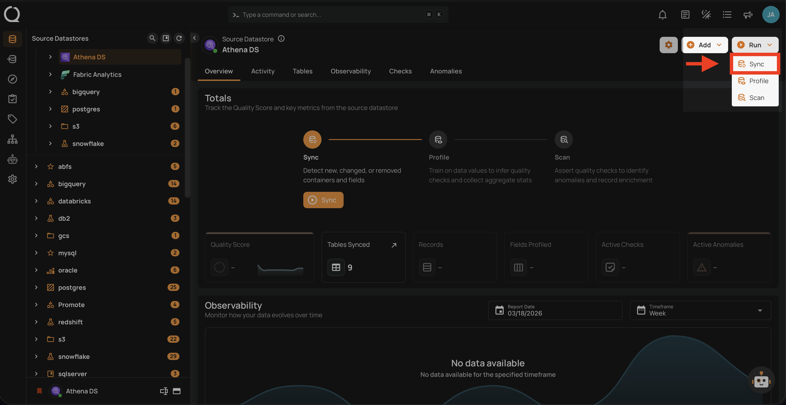

**Step 2:** When configuring the sync operation settings, you have two options to tune:

- **Prune:** This option allows the removal of any named collections (tables, views, files, etc.) that no longer exist in the datastore. This ensures that outdated or obsolete collections are not included in future operations, keeping the datastore clean and relevant.

- **Recreate**: This option enables the recreation of any named collections that have been previously deleted in Qualytics. It is useful for restoring collections that may have been removed accidentally or need to be brought back for analysis.

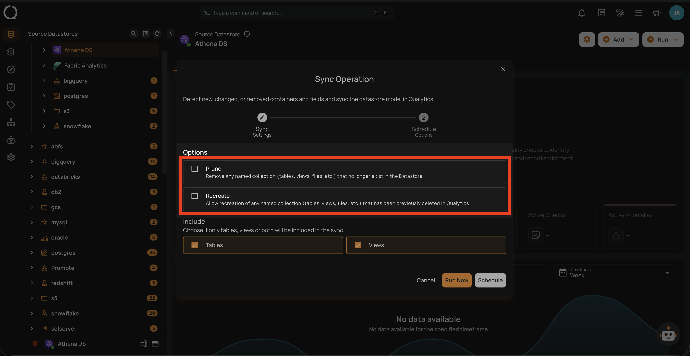

**Step 3:** The user can choose whether to include only tables, only views, or both in the sync operation. This flexibility allows for more targeted metadata analysis based on the specific needs of the data management task.

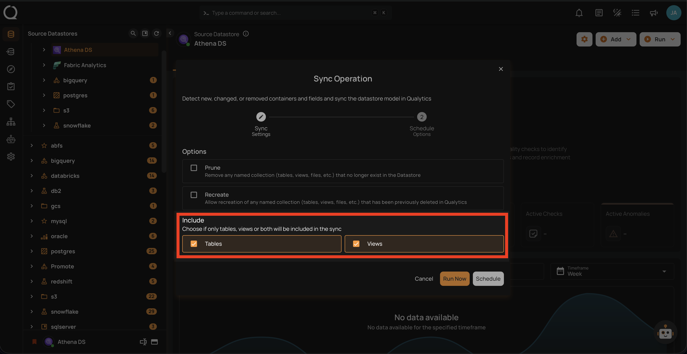

### Run Instantly

Click on the "**Run Now**" button to perform the sync operation immediately.

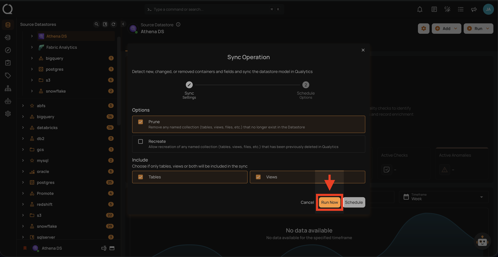

After clicking **Run Now**, a confirmation message appears stating **"Operation Triggered"**.


### Schedule

**Step 1:** Click on the **"Schedule"** button to configure the available schedule options in the sync operation.

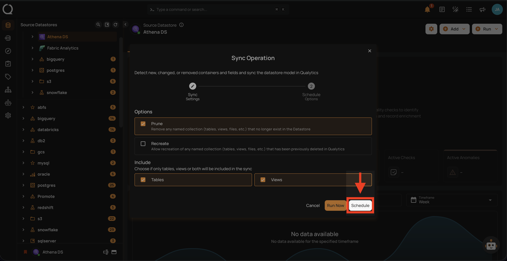

**Step 2:** Set the scheduling preferences for the sync operation.

**1. Hourly:** This option allows you to schedule the sync operation to run every hour at a specified minute. You can define the frequency in hours and the exact minute within the hour the sync should start. Example: If set to "Every 1 hour(s) on minute 0," the sync operation will run every hour at the top of the hour (e.g., 1:00, 2:00, 3:00).

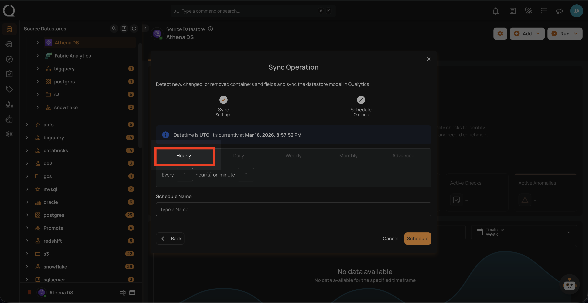

**2. Daily:** This option schedules the sync operation to run once every day at a specific time. You specify the number of days between operations and the exact time of day in UTC. Example: If set to "Every 1 day(s) at 00:00 UTC," the sync will run every day at midnight UTC.

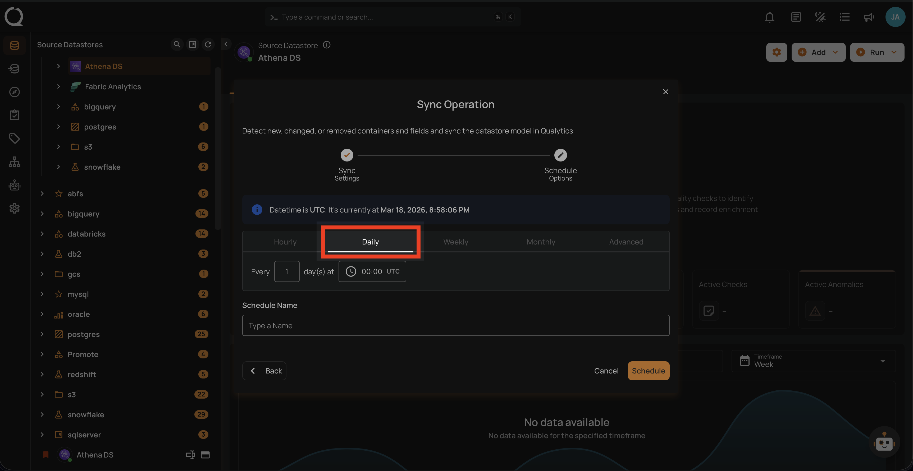

**3. Weekly:** This option schedules the sync operation to run on specific days of the week at a set time. You select the days of the week and the exact time of day in UTC for the sync operation to run. Example: If configured to run on "Sunday" and "Friday" at 00:00 UTC, the sync will execute at midnight UTC on these days.

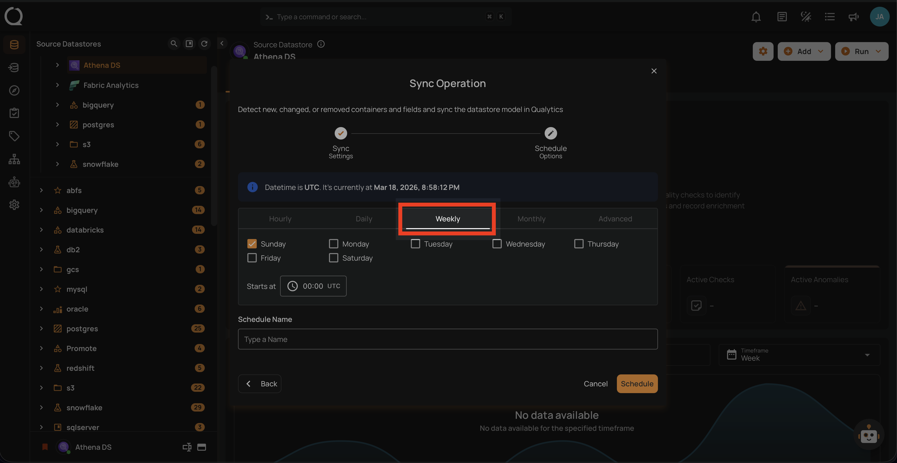

**4. Monthly:** This option schedules the sync operation to run once a month on a specific day at a set time. You specify the day of the month and the time of day in UTC. If set to "On the 1st day of every 1 month(s), at 00:00 UTC," the sync operation will run on the first day of each month at midnight UTC.

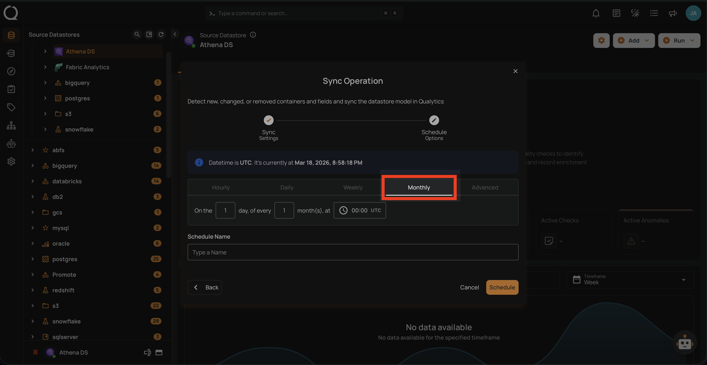

**5. Advanced:** The advanced section for scheduling operations allows users to set up more complex and custom scheduling using Cron expressions. This option is particularly useful for defining specific times and intervals for sync operations with precision.

Cron expressions are a powerful and flexible way to schedule tasks. They use a syntax that specifies the exact timing of the task based on five fields:

* Minute (0 - 59)
* Hour (0 - 23)
* Day of the month (1 - 31)
* Month (1 - 12)
* Day of the week (0 - 6) (Sunday to Saturday)

Each field can be defined using specific values, ranges, or special characters to create the desired schedule.

**Example:** For instance, the Cron expression `0 0 * * *` schedules the sync operation to run at midnight (00:00) every day. Here's a breakdown of this expression:

* 0 (Minute) - The task will run at the 0th minute.
* 0 (Hour) - The task will run at the 0th hour (midnight).
* *(Day of the month) - The task will run every day of the month.
* *(Month) - The task will run every month.
* *(Day of the week) - The task will run every day of the week.

Users can define other specific schedules by adjusting the Cron expression. For example:

* 0 12 * * 1-5 - Runs at 12:00 PM from Monday to Friday.
* 30 14 1 * * - Runs at 2:30 PM on the first day of every month.
* 0 22 * * 6 - Runs at 10:00 PM every Saturday.

To define a custom schedule, enter the appropriate Cron expression in the **"Custom Cron Schedule (UTC)"** field before specifying the schedule name. This will allow for precise control over the timing of the sync operation, ensuring it runs exactly when needed according to your specific requirements.

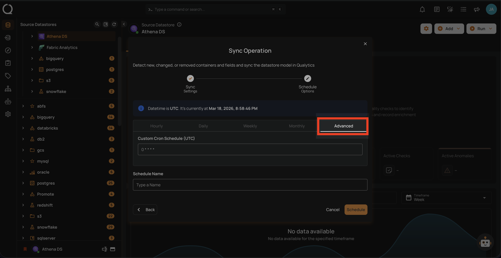

**Step 3**: Define the **"Schedule Name"** to identify the scheduled operation at run time.

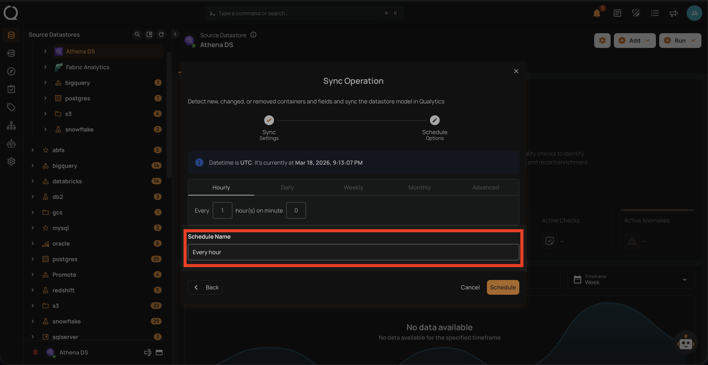

**Step 4:** Click on the **"Schedule"** button to activate your sync operation schedule.

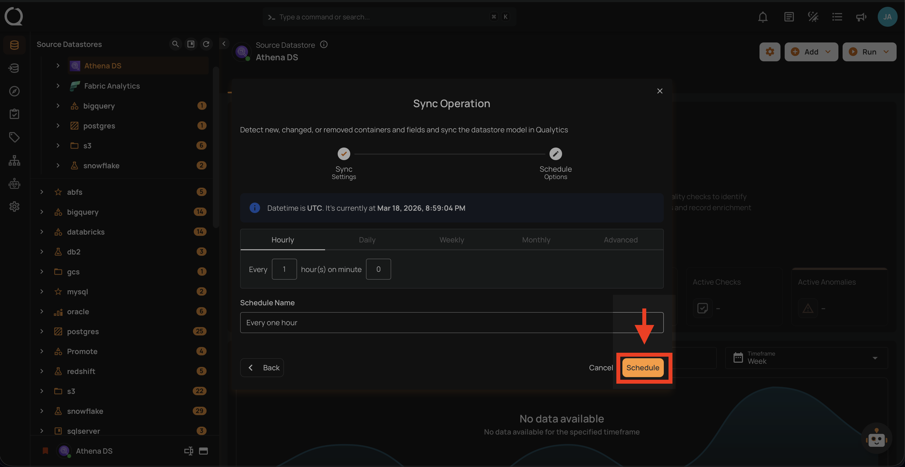

After clicking **Schedule**, a confirmation message appears stating **"Operation Scheduled"**.

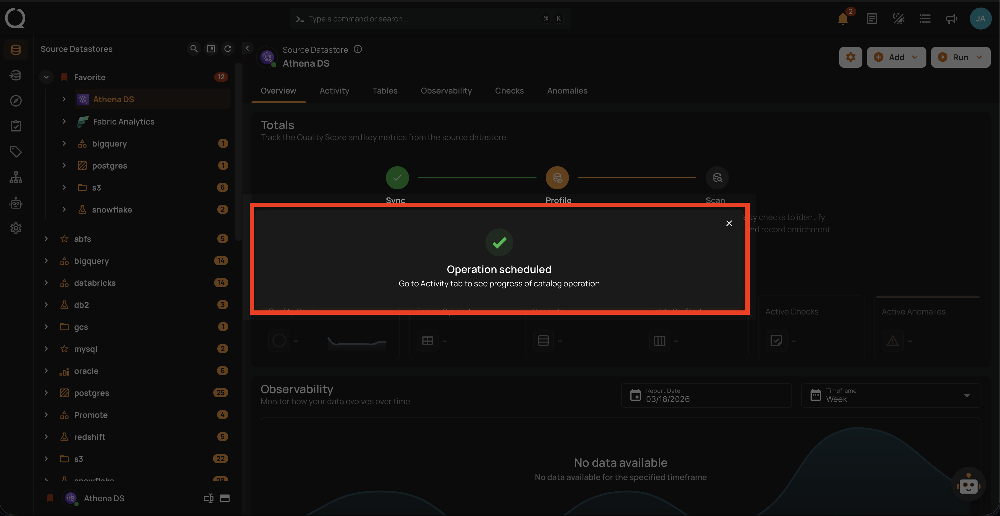

Once the sync operation is triggered, your view will be automatically switched to the Activity tab, allowing you to explore post-operation details on your ongoing/completed sync operation.

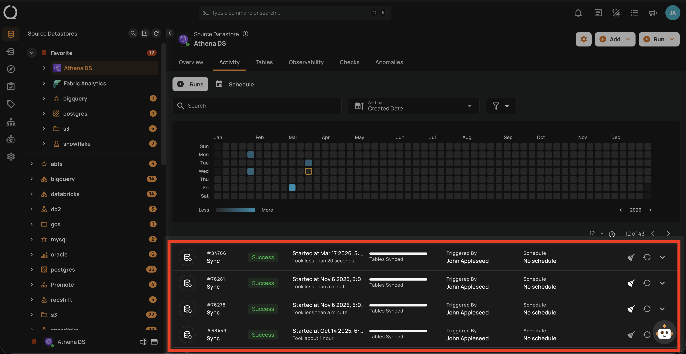

## Operations Insights

When the sync operation is completed, you will receive a notification and can navigate to the **Activity tab** for the datastore on which you triggered the Sync Operation and learn about the operation results.

### Top Panel

**1. Runs (Default View)**: Provides insights into the operations that have been performed.

**2. Search**: Search any operation (including sync) by entering the operation ID

**3. Sort by**: Organize the list of operations based on the **Created Date** or the **Duration**.

**4. Filter**: Narrow down the list of operations based on:

-   Operation Type

-   Operation Status

-   Table

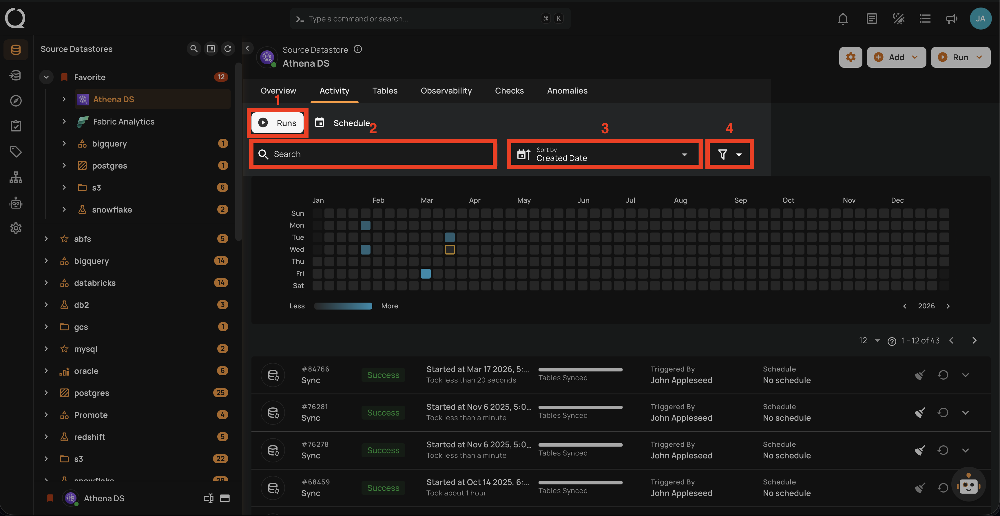

### Activity Heatmap

The activity heatmap shown in the snippet below represents activity levels over a period, with each square indicating a day and the color intensity representing the number of operations or activities on that day. It is useful for tracking the number of operations performed on each day within a specific timeframe.

!!! tip
    You can click on any of the squares from the Activity Heatmap to filter operations

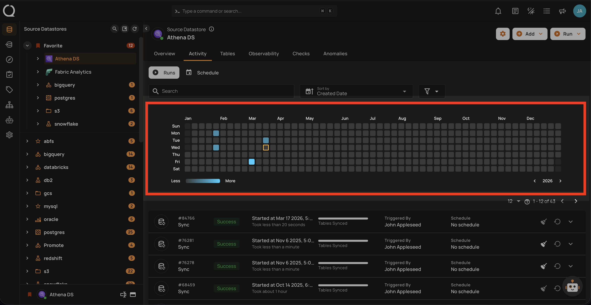

### Operation Detail

#### Running

This status indicates that the sync operation is still running at the moment and is yet to be completed. A sync operation having a **running** status reflects the following details and actions:

| Parameter      | Interpretation |
|----------------|---------------------------------------------------------------|
| Operation ID   | Unique identifier |
| Operation Type | Type of operation performed (sync, profile, or scan) |
| Timestamp      | Timestamp when the operation was started |
| Progress Bar   | The progress of the operation |
| Triggered By   | The author who triggered the operation |
| Schedule       | Whether the operation was scheduled or not |
| Prune          | Indicates whether Prune was enabled or disabled in the operation |
| Recreate       | Indicates whether Recreate was enabled or disabled in the operation |
| Table          | Indicates whether the **Table** was included in the operation or not |
| Views          | Indicates whether the **Views** was included in the operation or not |
| Abort          | Click on the **Abort** button to stop the sync operation |

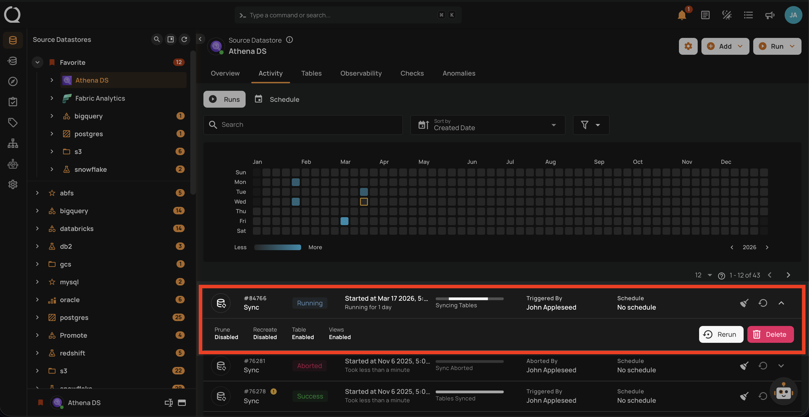

#### Aborted

This status indicates that the sync operation was manually stopped before it could be completed. A sync operation having an **aborted** status reflects the following details and actions:

| Parameter      | Interpretation |
|----------------|---------------------------------------------------------------------|
| Operation ID   | Unique identifier |
| Operation Type | Type of operation performed (sync, profile, or scan) |
| Timestamp      | Timestamp when the operation was started |
| Progress Bar   | The progress of the  operation |
| Triggered By   | The author who triggered the operation |
| Schedule       | Whether the operation was scheduled or not |
| Prune          | Indicates whether Prune was enabled or disabled in the operation |
| Recreate       | Indicates whether Recreate was enabled or disabled in the operation |
| Table          | Indicates whether the **Table** was included in the operation or not |
| Views          | Indicates whether the **Views** was included in the operation or not |
| Resume         | Click on the **Resume** button to continue a previously aborted sync operation from where it left off |
| Rerun          | Click on the **Rerun** button to initiate the sync operation from the beginning, ignoring any previous attempts |
| Delete         | Click on the **Delete** button to remove the record of the sync operation from the list |

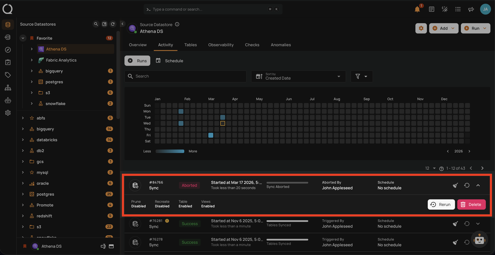

#### Warning

This status signals that the sync operation encountered some issues and displays the logs that facilitate improved tracking of blockers and issue resolution. A sync operation having a **warning** status reflects the following details and actions:

| Parameter      | Interpretation |
|----------------|-------------------------------------------------------------------------|
| Operation ID   | Unique identifier |
| Operation Type | Type of operation performed (sync, profile, or scan) |
| Timestamp      | Timestamp when the operation was started |
| Progress Bar   | The progress of the operation |
| Triggered By   | The author who triggered the operation |
| Schedule       | Whether the operation was scheduled or not |
| Prune          | Indicates whether Prune was enabled or disabled in the operation |
| Recreate       | Indicates whether Recreate was enabled or disabled in the operation |
| Table          | Indicates whether the **Table** was included in the operation or not |
| Views          | Indicates whether the **Views** was included in the operation or not |
| Rerun          | Click on the **Rerun** button to initiate the sync operation from the beginning, ignoring any previous attempts |
| Delete         | Click on the **Delete** button to remove the record of the sync operation from the list |
| Logs           | Logs include error messages, warnings, and other pertinent information generated during the execution of the Sync Operation |

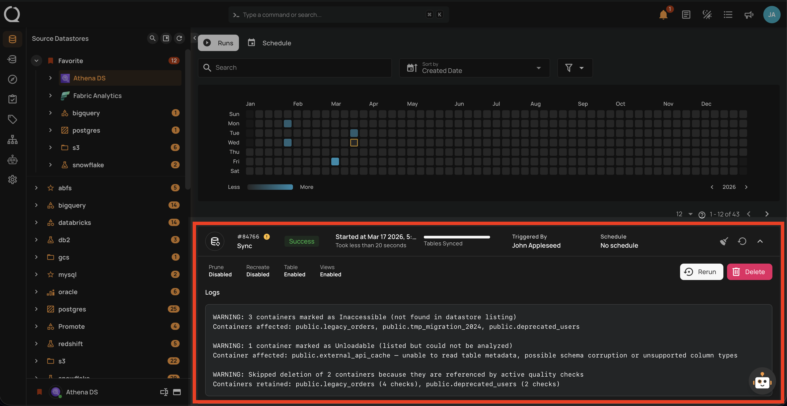

### Success

This status confirms that the sync operation was completed successfully without any issues. A sync operation having a **success** status reflects the following details and actions:

| Parameter      | Interpretation |
|----------------|-----------------------------------------------------------------------|
| Operation ID   | Unique identifier |
| Operation Type | Type of operation performed (sync, profile, or scan) |
| Timestamp      | Timestamp when the operation was started |
| Progress Bar   | The progress of the operation |
| Triggered By   | The author who triggered the operation |
| Schedule       | Whether the operation was scheduled or not |
| Prune          | Indicates whether Prune was enabled or disabled in the operation |
| Recreate       | Indicates whether Recreate was enabled or disabled in the operation |
| Table          | Indicates whether the **Table** was included in the operation or not |
| Views          | Indicates whether the **Views** was included in the operation or not |
| Rerun          | Click on the **Rerun** button to initiate the sync operation from the beginning, ignoring any previous attempts |
| Delete         | Click on the **Delete** button to remove the record of the sync operation from the list |

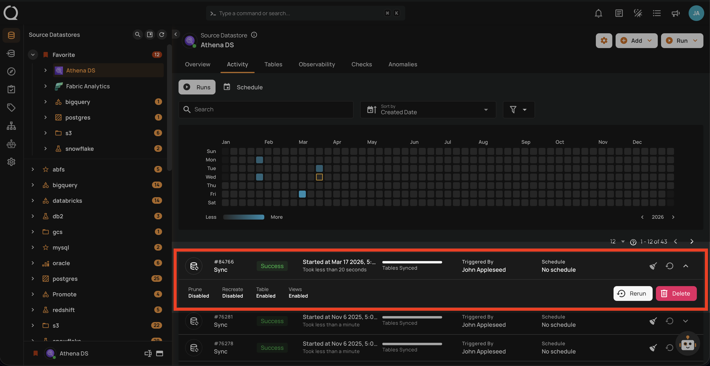

## Post-Operation Details

### For JDBC Source Datastores

After the sync operation is completed on a JDBC source datastore, users can view the following information:

**Container Names**: These are the names of the data collections (e.g., tables, views) identified during the sync operation.

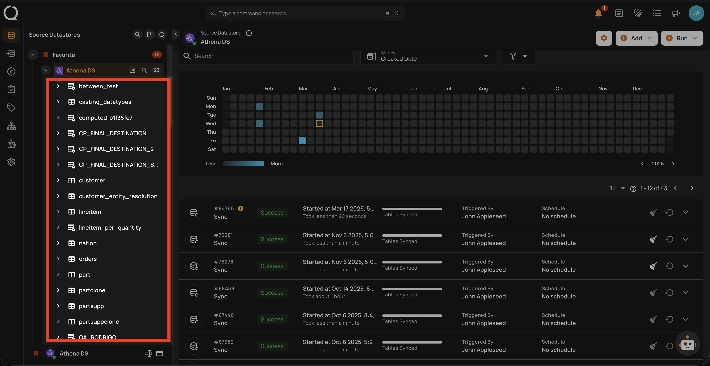

**Fields for Each Container**: Each container will display its fields or columns, which were detected during the sync operation.

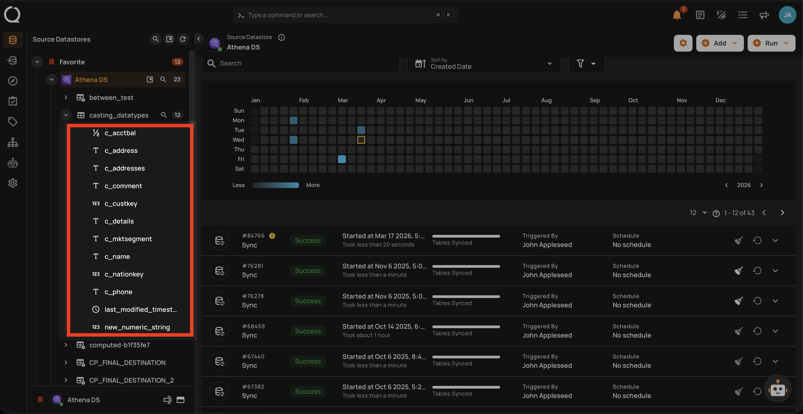

**Incremental Identifiers and Partition Fields**: These settings are automatically configured based on the sync operation. Incremental identifiers help in recognizing changes since the last scan, and partition fields aid in efficient data processing.

**Tree view > Container node > Gear icon > Settings option**

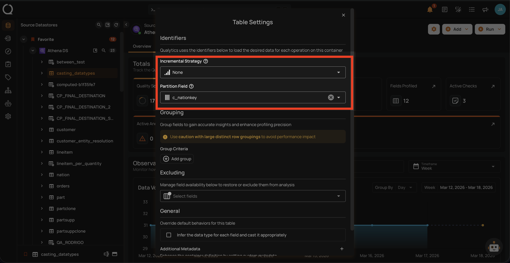

### For DFS Source Datastores

After the sync operation is completed on a DFS source datastore, users can view the following information:

-   **Container Names**: Similar to JDBC, these are the data collections identified during the sync operation.

-   **Fields for Each Container**: Each container will list its fields or metadata detected during the sync operation.

-   **Directory Tree Traversal**: The sync operation traverses the directory tree, treating each file with a supported extension as a single-partition container. It reveals metadata such as the relative path, filename, and extension.

-  **Incremental Identifier and Partition Field**: By default, both the incremental identifier and partition field are set to the last-modified timestamp. This ensures efficient incremental scans and data partitioning.

-   **"Globbed" Containers**: Files in the same folder with the same extensions and similar naming formats are grouped into a single container, where each file is treated as a partition. This helps in managing and querying large datasets effectively.

## API Payload Examples

This section provides API payload examples for initiating and checking the running status of a sync operation. Replace the placeholder values with data specific to your setup.

### Running a Sync Operation

To run a sync operation, use the API payload example below and replace the placeholder values with your specific values:

**Endpoint (Post)**:  ```/api/operations/run (post)```

```json
{
  "type": "sync",
  "datastore_id": "datastore-id",
  "prune": false,
  "recreate": false,
  "include": [
    "table",
    "view"
  ]
}
```

!!! note
    The legacy value `"catalog"` is still accepted for backwards compatibility but is deprecated. Use `"sync"` for all new integrations.

### Retrieving Sync Operation Status

To retrieve the sync operation status, use the API payload example below and replace the placeholder values with your specific values:

**Endpoint (Get)**:  ```/api/operations/{id} (get)```

```json
{
  "items": [
    {
      "id": 12345,
      "created": "YYYY-MM-DDTHH:MM:SS.ssssssZ",
      "type": "sync",
      "start_time": "YYYY-MM-DDTHH:MM:SS.ssssssZ",
      "end_time": "YYYY-MM-DDTHH:MM:SS.ssssssZ",
      "result": "success",
      "message": null,
      "triggered_by": "user@example.com",
      "datastore": {
        "id": 54321,
        "name": "Datastore-Sample",
        "store_type": "jdbc",
        "type": "db_type",
        "enrich_only": false,
        "enrich_container_prefix": "_data_prefix",
        "favorite": false
      },
      "schedule": null,
      "include": [
        "table",
        "view"
      ],
      "prune": false,
      "recreate": false
    }
  ],
  "total": 1,
  "page": 1,
  "size": 50,
  "pages": 1
}
```
