# Profile Operation

The Profile Operation is a comprehensive analysis conducted on every record within all available containers in a datastore. This process is aimed at understanding and improving data quality by generating metadata for each field within the collections of data (like tables or files).

By gathering detailed statistical data and interacting with the Qualytics Inference Engine, the operation not only identifies and evaluates data quality but also suggests and refines checks to ensure ongoing data integrity. Executing profile operations periodically helps maintain up-to-date and accurate data quality checks based on the latest data.

This guide explains how to configure the profile operation with available functionalities such as tables, tags, and schedule options.

Let's get started 🚀

## How Profiling Works

### Fields Identification

The initial step involves recognizing and identifying all the fields within each data container. This step is crucial as it lays the foundation for subsequent analysis and profiling.

### Statistical Data Gathering

After identifying the fields, the Profile Operation collects statistical data for each field based on its declared or inferred data type. This data includes essential metrics such as minimum and maximum values, mean, standard deviation, and other relevant statistics. These metrics provide valuable insights into the characteristics and distribution of the data, helping to understand its quality and consistency.

### Metadata Generation

The gathered statistical data is then submitted to the Qualytics Inference Engine. The engine utilizes this data to generate metadata that forms the basis for creating appropriate data quality checks. This metadata is essential for setting up robust quality control mechanisms within the data management system.

### Data Quality Checks

The inferred data quality checks are rigorously tested against the actual source data. This testing phase is critical to fine-tuning the checks to the desired sensitivity levels, ensuring they are neither too strict (causing false positives) nor too lenient (missing errors). By calibrating these checks accurately, the system can maintain high data integrity and reliability.

## Navigation to Profile Operation

**Step 1**: Select a source datastore from the side menu on which you would like to perform the profile operation.


  
**Step 2**: Clicking on your preferred datastore will navigate you to the datastore details page. Within the overview tab (default view), click on the **Run** button under **Profile** to initiate the profile operation.


## Configuration

**Step 1**: Click on the **Run** button to initiate the profile operation.

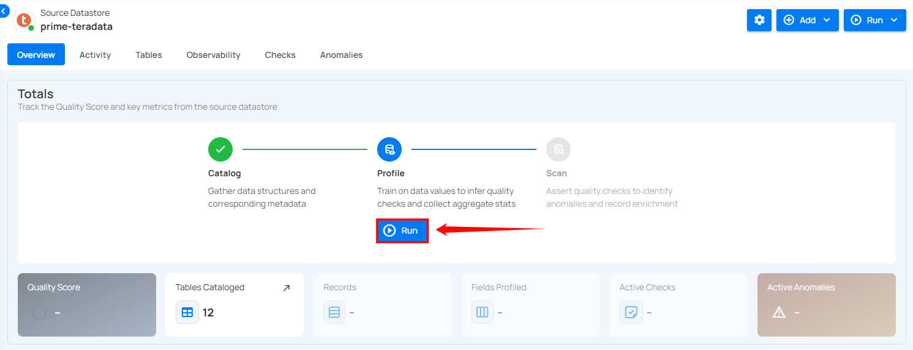
  
!!! note
    You can run Profile Operation anytime to update the inferred data quality checks, automatically based on new data in the datastore. It is recommended to schedule the profile operations periodically to update inferred rules. More details are discussed in the **Schedule** section below.

**Step 2**: Select tables (in your JDBC datastore) or file patterns (in your DFS datastore) and tags you would like to be profiled.

**1. All Tables/File Patterns**

This option includes all tables or files currently available in the datastore for profiling. Selecting this will profile every table within the source datastore without the need for further selection.


**2. Specific**

This option allows users to manually select individual tables or files for profiling. It provides the flexibility to focus on particular tables of interest, which can be useful if the user is only interested in a subset of the available data.


**3. Tag**

This option automatically profiles tables associated with selected tags. Tags are used to categorize tables, and by selecting a specific tag, all tables associated with that tag will be profiled. This option helps in managing and profiling grouped data efficiently.


  
**Step 3**: After making the relevant selections, click on the **Next** button to configure the **Operation Settings**.


  
**Step 4**: Configure the following two **Read Settings**:

- **Starting Threshold**
- **Record Limit**

### Starting Threshold 

This setting allows users to specify a minimum incremental identifier value to set a starting point for the profile operation. It helps in filtering data from a specific point in time or a particular batch value.  

- **Greater Than Time**: Users can select a timestamp in UTC to start profiling data from a specific time onwards. This is useful for focusing on recent data or data changes since a particular time.  

- **Greater Than Batch**: Users can enter a batch value to start profiling from a specific batch. This option is helpful for scenarios where data is processed in batches, allowing the user to profile data from a specific batch number onwards.

!!! note 
    The starting threshold i.e. **Greater Than Time** and **Greater Than Batch** are applicable only to the tables or files with an incremental timestamp strategy.


### Record Limit 

Define the number of records to be profiled per table: This feature allows users to manually enter a custom record limit value using a text field in the profile operation. This setting helps in controlling the scope of the profiling operation, particularly for large datasets, by capping the number of records to analyze.


You can also use a drop-down menu to quickly select from commonly used limits such as 1M, 10M, 100M, and All.


!!! note
    The number of records must be between **1** and **1,000,000,000**.

**Step 5:** After making the relevant selections, click on the **Next** button to configure the **Inference Settings**. 


**Step 6:** Configure the following two **Inference Settings**: 

- **Inference Threshold**
- **Inference State**

### **Inference Threshold**

The Inference Threshold allows you to customize the data quality checks that are automatically created and updated when your data is analyzed. This means you can adjust the data quality checks based on how complex the data rules are, giving you more control over how your data is checked and monitored.

**Default Configuration**

By default, the Inference Threshold is set to **2**, which provides a comprehensive range of checks designed to ensure data integrity across different scenarios. Users have the flexibility to adjust this threshold based on their specific needs, allowing for either basic or advanced checks as required.

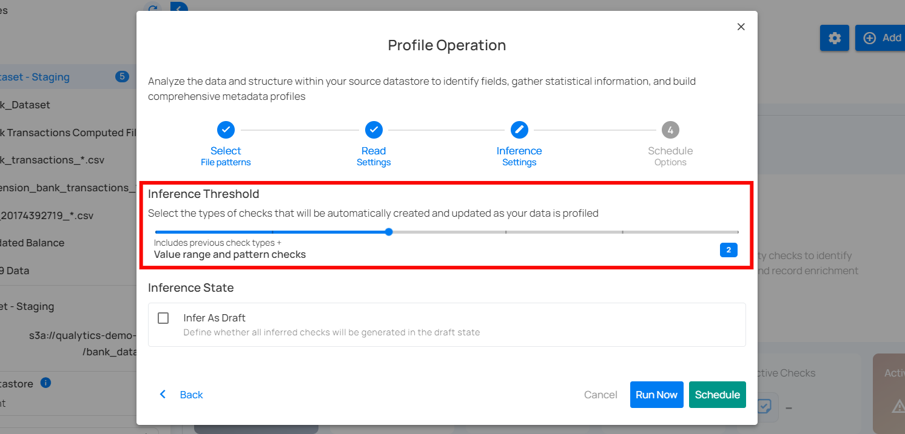

#### Levels of Check Inference

The Inference Threshold ranges from **0** to **5**, with each level including progressively more complex and comprehensive checks. Below is an explanation of each level:

!!! note 
    Each level includes all the checks from the previous levels and adds new checks specific to that level. For example, at Level 1, there are five basic checks. At Level 2, you get those five checks plus additional ones for Level 2. By the time you reach Level 5, it covers all the checks from Levels 1 to 4 and adds its own new checks for complete review. 

**Level 0: No Inference**

At this level, no checks are automatically inferred. This is suitable when users want complete control over which checks are applied, or if no checks are needed. Ideal for scenarios where profiling should not infer any constraints, and all checks will be manually defined.


**Level 1: Basic Data Integrity and Simple Value Threshold Checks**

This level includes fundamental rules for basic data integrity and simple validations. It ensures that basic constraints like completeness, non-negative numbers, and valid date ranges are applied. Included Checks:

- **Completeness Checks:** Ensure data fields are complete if previously complete.

- **Categorical Range Checks:** Validate if values fall within a predefined set of categories. 

- **Non-Negative Numbers:** Ensure numeric values are non-negative.  

- **Non-Future Date/Time:** Ensure datetime values are not set in the future.

**Use Case:** Suitable for datasets where basic integrity checks are sufficient.

The following table shows the inferred checks that the Analytics Engine can generate based on the user's data. At Level 1, five checks are created.

| Inferred Checks | Reference |
|--------|--------|
| Not Null (record) | [See more.](https://userguide.qualytics.io/checks/not-null-check/) |
| Any Not Null (record) | [See more.](https://userguide.qualytics.io/checks/any-not-null-check/) |
| Expected Values (record) | [See more.](https://userguide.qualytics.io/checks/expected-values-check/) |
| Not Negative | [See more.](https://userguide.qualytics.io/checks/not-negative-check/) |
| Not Future | [See more.](https://userguide.qualytics.io/checks/not-future-check/) |

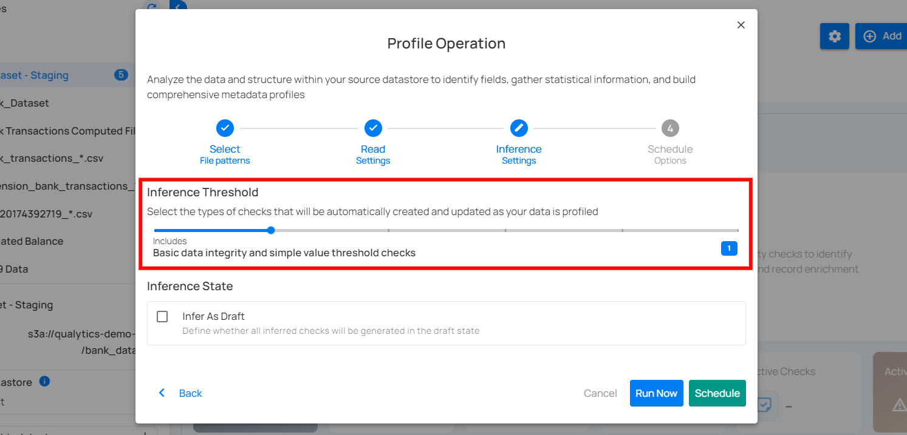

**Level 2: Value Range and Pattern Checks**

Builds upon Level 1 by adding more specific checks related to value ranges and patterns. This level is more detailed and begins to enforce rules related to the nature of the data itself. Included Checks:

- **Date Range Checks:** Ensure dates fall within a specified range. 

- **Numeric Range Checks:** Validate that numeric values are within acceptable ranges.  

- **String Pattern Checks:** Ensure strings match specific patterns (e.g., email formats).  

- **Approximate Uniqueness:** Validate uniqueness of values if they are approximately unique.

**Use Case:** Ideal for datasets where patterns and ranges are important for ensuring data quality.

The following table shows the inferred checks that the Analytics Engine can generate based on the user's data. At Level 2, four checks are created.

| Checks | Reference |
|------|------|
| Between Times | [See more.](https://userguide.qualytics.io/checks/between-times-check/) |
| Between | [See more.](https://userguide.qualytics.io/checks/between-check/) |
| Matches Pattern | [See more.](https://userguide.qualytics.io/checks/matches-pattern-check/) |
| Unique | [See more.](https://userguide.qualytics.io/checks/unique-check/) |

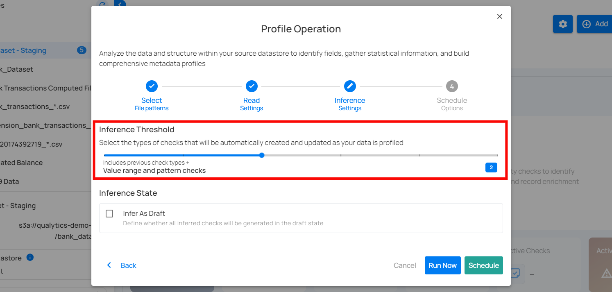

**Level 3: Time Series and Comparative Relationship Checks**

This level includes all checks from Level 2 and adds sophisticated checks for time series and comparative relationships between datasets. Included Checks:

- **Date Granularity Checks:** Ensure the granularity of date values is consistent (e.g., day, month, year).

- **Consistent Relationships:** Validate that relationships between overlapping datasets are consistent.

**Use Case:** Suitable for scenarios where data quality depends on time-series data or when comparing data across different datasets.

The following table shows the inferred checks that the Analytics Engine can generate based on the user's data. At Level 3, eight checks are created.

| Inferred checks | Reference |
|--------|-------|
| Time Distribution Size | [See more.](https://userguide.qualytics.io/checks/time-distribution-size-check/) |
| After Date Time | [See more.](https://userguide.qualytics.io/checks/after-date-check/) |
| Before Date Time | [See more.](https://userguide.qualytics.io/checks/before-date-time-check/) |
| Greater Than | [See more.](https://userguide.qualytics.io/checks/greater-than-check/) |
| Greater Than Field | [See more.](https://userguide.qualytics.io/checks/greater-than-field-check/) |
| Less Than | [See more.](https://userguide.qualytics.io/checks/less-than-check/) |
| Less Than Field | [See more.](https://userguide.qualytics.io/checks/less-than-field-check/) |
| Equal To Field | [See more.](https://userguide.qualytics.io/checks/equal-to-field-check/) |


**Level 4: Linear Regression and Cross-Datastore Relationship Checks**

This level includes all checks from Level 3 and adds even more advanced checks, including linear regression analysis and validation of relationships across different data stores. Included Checks:

- **Linear Regression Checks:** Validate data using regression models to identify trends and outliers.

- **Cross-Datastore Relationships:** Ensure that data relationships are maintained across different data sources.

**Use Case:** Best for complex datasets where advanced analytical checks are necessary.

The following table shows the inferred checks that the Analytics Engine can generate based on the user's data. At Level 4, four checks are created.

| Inferred Checks | Reference |
|-------|-------|
| Predicted By | [See more.](https://userguide.qualytics.io/checks/predicted-by-check/) |
| Exists In | [See more.](https://userguide.qualytics.io/checks/exists-in-check/) |
| Not Exists In | [See more.](https://userguide.qualytics.io/checks/not-exists-in-check/) |
| Is Replica Of | [See more.](https://userguide.qualytics.io/checks/is-replica-of-check/) |

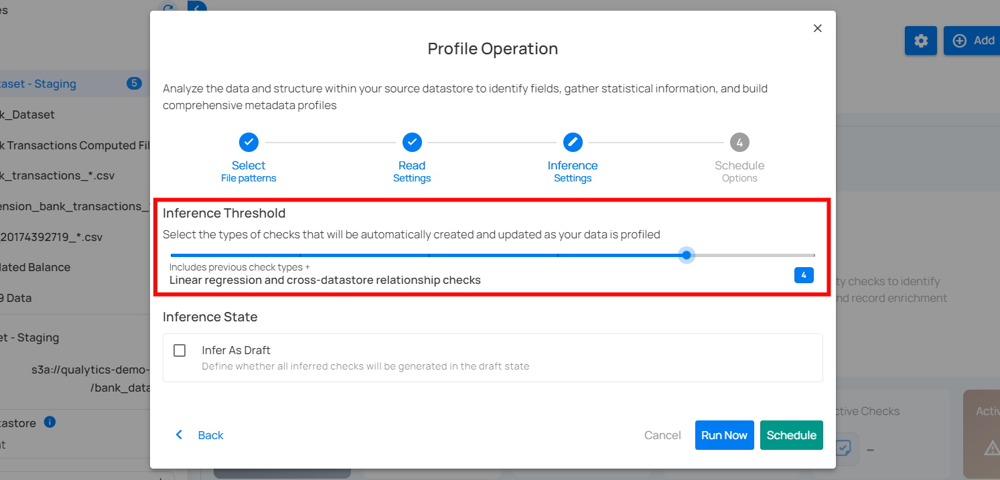

**Level 5: Shape Checks**

The most comprehensive level includes all previous checks plus checks that validate the shape of certain distribution patterns that can be identified in your data. Included Checks:

- **Shape Checks:** Checks that define an expectation for some percentage of your data less than 100%.  The property “coverage” holds the percentage of your data for which the expressed check should be true.

**Use Case:** Ideal for scenarios where each incremental set of scanned data should exhibit the same distributions of values as the training set.  For example, a transactions table is configured for a weekly incremental scan after each week’s data is loaded. A shape check could define that 80% of all transactions are expected to be performed using “cash” or “credit”.

This table shows the inferred checks that the Analytics Engine can generate based on the user's data. At Level 5, three checks are created.

| Inferred Checks | Reference |
|--------|--------|
| Expected Values (Shape) | [See more.](https://userguide.qualytics.io/checks/expected-values-check/) |
| Matches Pattern (Shape) | [See more.](https://userguide.qualytics.io/checks/matches-pattern-check/) |
| Not Null (Shape) | [See more.](https://userguide.qualytics.io/checks/not-null-check/) |


!!! warning 
    If the checks inferred during a profile operation do not detect any anomalies, and the check inference level decreases in the next profile operation, the checks that did not generate anomalies will be archived or discarded. However, if the checks detect any anomalies, they will be retained to continue monitoring the data and addressing potential issues.

### Inference State

Check the box labeled **"Infer As Draft"** to ensure that all inferred checks will be generated in a draft state. This allows for greater flexibility as you can review and refine these checks before they are finalized.


### Run Instantly

Click on the **Run Now** button, and perform the profile operation immediately.


  
### Schedule

**Step 1**: Click on the **Schedule** button to configure the available schedule options in the profile operation.


  
**Step 2**: Set the scheduling preferences for the profile operation.

**1. Hourly**: This option allows you to schedule the profile operation to run every hour at a specified minute. You can define the frequency in hours and the exact minute within the hour the profiling should start. Example: If set to "Every 1 hour(s) on minute 0," the profile operation will run every hour at the top of the hour (e.g., 1:00, 2:00, 3:00).


  
**2. Daily**: This option schedules the profile operation to run once every day at a specific time. You specify the number of days between scans and the exact time of day in UTC. Example: If set to "Every 1 day(s) at 00:00 UTC," the scan will run every day at midnight UTC.


  
**3. Weekly**: This option schedules the profile operation to run on specific days of the week at a set time. You select the days of the week and the exact time of day in UTC for the profile operation to run. Example: If configured to run on "Sunday" and "Friday" at 00:00 UTC, the scan will execute at midnight UTC on these days.

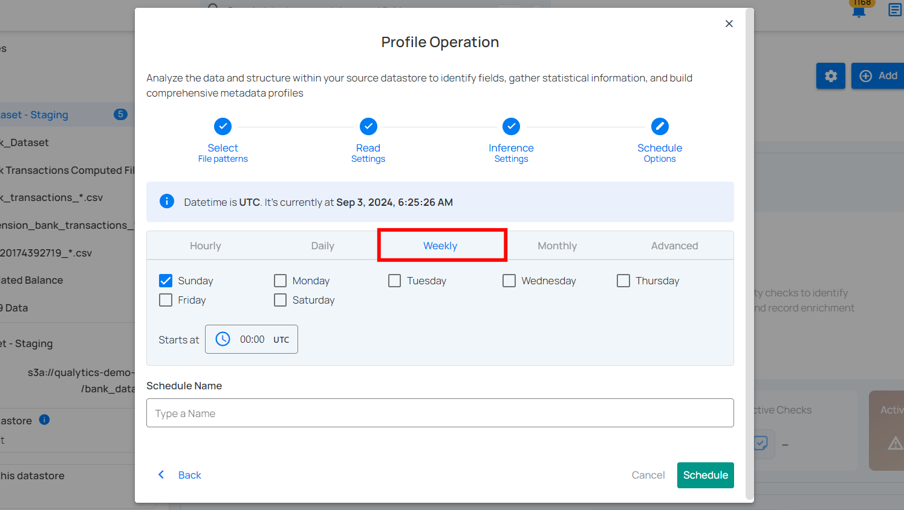
  
**4. Monthly**: This option schedules the profile operation to run once a month on a specific day at a set time. You specify the day of the month and the time of day in UTC. If set to "On the 1st day of every 1 month(s), at 00:00 UTC," the profile operation will run on the first day of each month at midnight UTC.


  
**5. Advanced**: The advanced section for scheduling operations allows users to set up more complex and custom scheduling using Cron expressions. This option is particularly useful for defining specific times and intervals for profile operations with precision.

Cron expressions are a powerful and flexible way to schedule tasks. They use a syntax that specifies the exact timing of the task based on five fields:

-   Minute (0 - 59)
-   Hour (0 - 23)
-   Day of the month (1 - 31)
-   Month (1 - 12)
-   Day of the week (0 - 6) (Sunday to Saturday)

Each field can be defined using specific values, ranges, or special characters to create the desired schedule.

**Example**: For instance, the Cron expression `0 0 * * *` schedules the profile operation to run at midnight (00:00) every day. Here’s a breakdown of this expression:

-   0 (Minute) - The task will run at the 0th minute.
-   0 (Hour) - The task will run at the 0th hour (midnight).
-   *(Day of the month) - The task will run every day of the month.
-   *(Month) - The task will run every month.
-   *(Day of the week) - The task will run every day of the week.  

Users can define other specific schedules by adjusting the Cron expression. For example:

-   0 12 * * 1-5 - Runs at 12:00 PM from Monday to Friday.
-   30 14 1 * * - Runs at 2:30 PM on the first day of every month.
-   0 22 * * 6 - Runs at 10:00 PM every Saturday.
    
To define a custom schedule, enter the appropriate Cron expression in the **Custom Cron Schedule (UTC)** field before specifying the schedule name. This will allow for precise control over the timing of the profile operation, ensuring it runs exactly when needed according to your specific requirements.

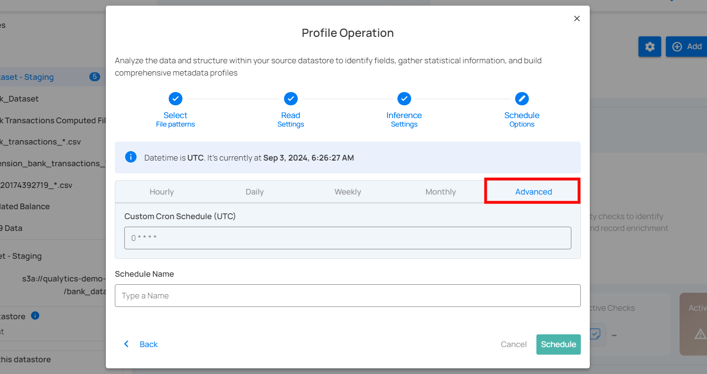
  
**Step 3**: Define the **Schedule Name** to identify the scheduled operation at the running time.


**Step 4**: Click on the **Schedule** button to activate your profile operation schedule.

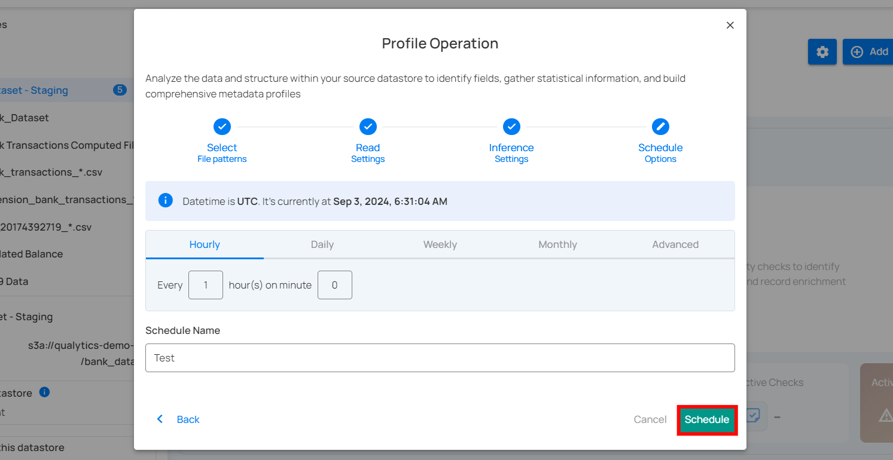
  
!!! note 
    You will receive a notification when the profile operation is completed.

## Operation Insights

When the profile operation is completed, you will receive the notification and can navigate to the Activity tab for the datastore on which you triggered the Profile Operation and learn about the operation results.

### Top Panel

1. **Runs (Default View)**: Provides insights into the operations that have been performed

2. **Schedule**: Provides insights into the scheduled operations.

3. **Search**: Search any operation (including profile) by entering the operation ID

4. **Sort by**: Organize the list of operations based on the **Created Date** or the **Duration**.

5. **Filter**: Narrow down the list of operations based on:

-   Operation Type
-   Operation Status
-   Table


  
### Activity Heatmap

The activity heatmap shown in the snippet below represents activity levels over a period, with each square indicating a day and the color intensity representing the number of operations or activities on that day. It is useful in tracking the number of operations performed on each day within a specific timeframe.

!!! tip
    You can click on any of the squares from the Activity Heatmap to filter operations


### Operation Detail

#### Running

This status indicates that the profile operation is still running at the moment and is yet to be completed. A profile operation having a **running** status reflects the following details and actions:

| **No.** | **Parameter**                   | **Interpretation**                                                                                   |
|--------|----------------------------------|-------------------------------------------------------------------------------------------------------|
| 1.     | Operation ID & Operation Type    | Unique identifier and type of operation performed (catalog, profile, or scan).                         |
| 2.     | Timestamp                        | Timestamp when the operation was started.                                                              |
| 3.     | Progress Bar                     | The progress of the operation.                                                                         |
| 4.     | Triggered By                     | The author who triggered the operation.                                                                |
| 5.     | Schedule                         | Whether the operation was scheduled or not.                                                            |
| 6.     | Inference Threshold              | Indicates how much control you have over automatic data quality checks, adjustable based on complexity. |
| 7.     | Checks Synchronized              | Indicates the count of Checks Synchronized in the operation.                                           |
| 8.     | Infer as Draft                   | Indicates whether Infer as Draft was enabled or disabled in the operation.                             |
| 9.     | Read Record Limit                | Defines the maximum number of records to be scanned per table after initial filtering.                 |
| 10.    | Results                          | Provides immediate insights into the profile operation conducted.                                      |
| 11.    | Abort                            | The "Abort" button enables you to stop the ongoing profile operation.                                  |
| 12.    |Summary                          | The "Summary" section provides a real-time overview of the profile operation's progress. It includes key metrics such as: <br><ul><li> **Tables Requested**: The total number of tables that were requested for profiling. Click on the adjacent magnifying glass icon to view the tables requested.</li><li> **Tables Profiled**: The number of tables that have been profiled so far. Click on the adjacent magnifying glass icon to view the tables profiled. </li><li> **Records Profiled**:  This represents the total number of records that were included in the profiling process. </li><li> **Field Profiles Updates**:  This number shows how many field profiles were updated as a result of the profiling operation. </li><li> **Inferred Checks Synchronized**:  This indicates the number of inferred checks that were synchronized based on the profile operation. </li></li> </li><li> **Added**: Shows the count of newly added inferred checks. </li><li> **Updated**: Indicates the count of checks that were updated in the operation.</li> |


  
#### Aborted

This status indicates that the profile operation was manually stopped before it could be completed. A profile operation having an **aborted** status reflects the following details and actions:

| **No.** | **Parameter**                   | **Interpretation**                                                                                   |
|--------|----------------------------------|-------------------------------------------------------------------------------------------------------|
| 1.     | Operation ID & Operation Type    | Unique identifier and type of operation performed (catalog, profile, or scan).                         |
| 2.     | Timestamp                        | Timestamp when the operation was started.                                                              |
| 3.     | Progress Bar                     | The progress of the operation.                                                                         |
| 4.     | Aborted By                     | The author who Aborted the operation.                                                                |
| 5.     | Schedule                         | Whether the operation was scheduled or not.                                                            |
| 6.     | Inference Threshold              | Indicates how much control you have over automatic data quality checks, adjustable based on complexity. |
| 7.     | Checks Synchronized              | Indicates the count of Checks Synchronized in the operation.                                           |
| 8.     | Infer as Draft                   | Indicates whether Infer as Draft was enabled or disabled in the operation.                             |
| 9.     | Read Record Limit                | Defines the maximum number of records to be scanned per table after initial filtering.                 |
| 10.    | Results                          | Provides immediate insights into the profile operation conducted.                                      |
| 11.    | Resume                           | Provides an option to continue the profile operation from where it left off.                            |
| 12.    | Rerun                            | Allows you to start a new profile operation using the same settings as the aborted scan.               |
| 13.    | Delete                           | Removes the record of the aborted profile operation from the system, permanently deleting results.      |
| 14.  |   Summary              | The "Summary" section provides a real-time overview of the profile operation's progress. It includes key metrics such as: <br><ul><li> **Tables Requested**: The total number of tables that were requested for profiling. Click on the adjacent magnifying glass icon to view the tables requested.</li><li> **Tables Profiled**: The number of tables that were profiled before the operation was aborted. Click on the adjacent magnifying glass icon to view the tables profiled. </li><li> **Records Profiled**: This represents the total number of records that were included before the profiling process was aborted. </li><li> **Field Profiles Updates**: This number shows how many field profiles were updated as a result of the profiling operation. </li><li> **Inferred Checks Synchronized**: This indicates the number of inferred checks that were synchronized based on the profile operation. </li></li> </li><li> **Added**: Shows the count of newly added inferred checks. </li><li> **Updated**: Indicates the count of checks that were updated in the operation.</li> |


  
#### Warning

This status signals that the profile operation encountered some issues and displays the logs that facilitate improved tracking of the blockers and issue resolution. A profile operation having a **completed with warning** status reflects the following details and actions:

| **No.** | **Parameter**                   | **Interpretation**                                                                                   |
|--------|----------------------------------|-------------------------------------------------------------------------------------------------------|
| 1.     | Operation ID & Operation Type    | Unique identifier and type of operation performed (catalog, profile, or scan).                         |
| 2.     | Timestamp                        | Timestamp when the operation was started.                                                              |
| 3.     | Progress Bar                     | The progress of the operation.                                                                         |
| 4.     | Triggered By                     | The author who triggered the operation.                                                               |
| 5.     | Schedule                         | Whether the operation was scheduled or not.                                                            |
| 6.     | Inference Threshold              | Indicates how much control you have over automatic data quality checks, adjustable based on complexity. |
| 7.     | Checks Synchronized              | Indicates the count of Checks Synchronized in the operation.                                           |
| 8.     | Infer as Draft                   | Indicates whether Infer as Draft was enabled or disabled in the operation.                             |
| 9.     | Read Record Limit                | Defines the maximum number of records to be scanned per table after initial filtering.                 |
| 10.     | Results                | Provides immediate insights into the profile operation conducted.                 |
| 11.    | Rerun                            | Allows you to start a new profile operation using the same settings as the warning scan.               |
| 12.    | Delete                           | Removes the record of the profile operation, permanently deleting all results.                         |
| 13.     | Summary                 | The "Summary" section provides a real-time overview of the profile operation's progress. It includes key metrics such as: <br><ul><li> **Tables Requested**: The total number of tables that were requested for profiling. Click on the adjacent magnifying glass icon to view the tables requested.</li><li> **Tables Profiled**: The number of tables that were profiled before the operation completed. Click on the adjacent magnifying glass icon to view the tables profiled. </li><li> **Records Profiled**: This represents the total number of records that were included before the profiling process was completed. </li><li> **Field Profiles Updates**: This number shows how many field profiles were updated as a result of the profiling operation.</li><li>  **Inferred Checks Synchronized**: This indicates the number of inferred checks that were synchronized based on the profile operation. </li></ul> |
| 14.    |   Logs                    | Logs include error messages, warnings, and other pertinent information that occurred during the execution of the Profile Operation. |


  
#### Success

This status confirms that the profile operation was completed successfully without any issues. A profile operation having a **success** status reflects the following details and actions:

| **No.** | **Parameter**                   | **Interpretation**                                                                                                    |
|---------|----------------------------------|------------------------------------------------------------------------------------------------------------------------|
| 1.      | Operation ID & Operation Type     | Unique identifier and type of operation performed (catalog, profile, or scan).                                         |
| 2.      | Timestamp                        | Timestamp when the operation was started.                                                                               |
| 3.      | Progress Bar                     | The progress of the operation.                                                                                            |
| 4.      | Triggered By                     | The author who triggered the operation.                                                                                 |
| 5.      | Schedule                         | Whether the operation was scheduled or not.                                                                             |
| 6.      | Inference Threshold              | Indicates how much control you have over automatic data quality checks, allowing adjustments based on data complexity.    |
| 7.      | Checks Synchronized              | Indicates the count of Checks Synchronized in the operation.                                                            |
| 8.      | Infer as Draft                   | Indicates whether Infer as Draft was enabled or disabled in the operation.                                              |
| 9.      | Read Record Limit                | Defines the maximum number of records to be scanned per table after initial filtering.                                   |
| 10.     | Results                          | Provides immediate insights into the profile operation conducted.                                                        |
| 11.     | Rerun                            | Allows you to start a new profile operation using the same settings as the warning scan, useful for restarting after errors. |
| 12.     | Delete                           | Removes the record of the profile operation from the system, permanently deleting all results; this action cannot be undone. |
| 13. |   Summary                 | The "Summary" section provides a real-time overview of the profile operation's progress. It includes key metrics such as: <br><ul><li> **Tables Requested**: The total number of tables that were requested for profiling. Click on the adjacent magnifying glass icon to view the tables requested. </li><li> **Tables Profiled**: The number of tables that were profiled before the operation was aborted. Click on the adjacent magnifying glass icon to view the tables profiled. </li><li> **Records Profiled**: This represents the total number of records that were included before the profiling process was aborted. </li><li> **Field Profiles Updates**: This number shows how many field profiles were updated as a result of the profiling operation. </li><li> **Inferred Checks Synchronized**: This indicates the number of inferred checks that were synchronized based on the profile operation. </li><li> **Added**: Shows the count of newly added inferred checks. </li><li> **Updated**: Indicates the count of checks that were updated in the operation.</li> |


#### Full View of Metrics in Operation Summary

Users can now hover over abbreviated metrics to see the full value for better clarity. For demonstration purposes, we are hovering over the **Records Profiled** field to display the full value.

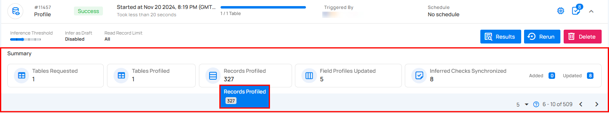

## Post Operation Details

**Step 1**: Click on any of the successful **Profile Operations** from the list and hit the Results button.


  
**Step 2:** The **Profile Results** modal displays a list of both profiled and non-profiled containers. You can filter the view to show only non-profiled containers by toggling on button, which will display the complete list of unprofiled containers.


 The **Profile Results** modal also provides two analysis options for you:

-   Details for a Specific Container (Container's Profile)
-   Details for a Specific Field of a Container (Field Profile)

Unwrap any of the containers from the **Profile Results** modal and click on the arrow icon.


  
### Details for a Specific Container (Container's Profile)

Based on your selection of container from the profile operation results, you will be automatically redirected to the container details on the source datastore details page.


  
The following details (metrics) will be visible for analyzing the specific container you selected:

1. **Quality Score (79)**: This represents an overall quality assessment of the field, likely on a scale of 0 to 100. A score of 79 suggests that the data quality is relatively good but may need further improvement.

2. **Sampling (100%)**: Indicates that 100% of the data in this field was sampled for analysis. This means the entire dataset for this field was reviewed.

3. **Completeness (100%)**: Suggests that all entries in this field are complete, with no missing or null values, signifying data integrity.

4. **Active Checks (2)**: This shows that 2 data quality checks are actively running on this field. These checks likely monitor aspects such as format, uniqueness, or consistency.

5. **Active Anomalies (0)**: Indicates that there are no active anomalies or issues detected in the field, meaning no irregularities have been found during the checks.

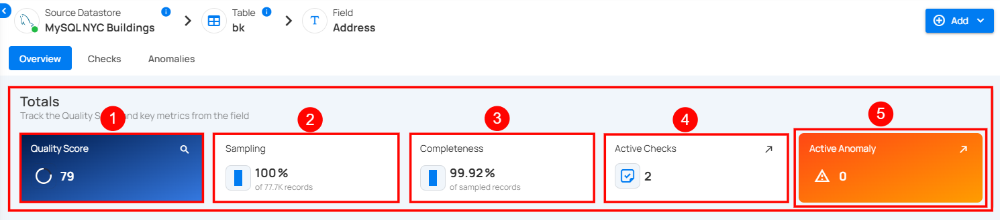

### Details for a Specific Field of a Container (Field Profile)

Unwrap the container to view the underlying fields. The following details (metrics) will be visible for analyzing a specific field of the container:

| **No** | **Profile**                     | **Description**                                                                 |
|-------|--------------------------------|---------------------------------------------------------------------------------|
| 1     | Declared Type                  | Indicates whether the type is declared by the source or inferred.               |
| 2     | Distinct Values                | Count of distinct values observed in the dataset.                               |
| 3     | Min Length                     | Shortest length of the observed string values or lowest value for numerics.     |
| 4     | Max Length                     | Greatest length of the observed string values or highest value for numerics.    |
| 5     | Mean                           | Mathematical average of the observed numeric values.                            |
| 6     | Median                         | The median of the observed numeric values.                                      |
| 7     | Standard Deviation             | Measure of the amount of variation in observed numeric values.                  |
| 8     | Kurtosis                       | Measure of the 'tailedness' of the distribution of observed numeric values.     |
| 9     | Skewness                       | Measure of the asymmetry of the distribution of observed numeric values.        |
| 10    | Q1                             | The first quartile; the central point between the minimum and the median.      |
| 11    | Q3                             | The third quartile; the central point between the median and the maximum.      |
| 12    | Sum                            | Total sum of all observed numeric values.                                       |

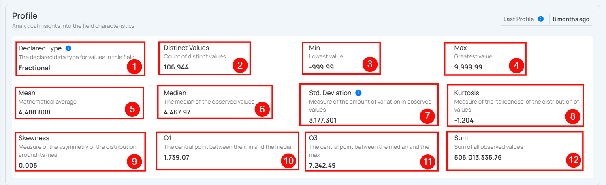

### Histogram

Shows how the values in the field are spread out. Each bar represents how many values fall within a certain range, making it easy to spot trends and outliers.


  
## API Payload Examples

This section provides payload examples for initiating and checking the running status of a profile operation. Replace the placeholder values with data specific to your setup.

### Running a Profile Operation

To run a profile operation, use the API payload example below and replace the placeholder values with your specific values:

**Endpoint (Post)**:  ```/api/operations/run (post)```

#### Option I: Running a profile operation of all containers

-   **container_names: [ ]**: This setting indicates that profiling will encompass all containers.

-   **max_records_analyzed_per_partition: null**: This setting implies that all records within all containers will be profiled.

-   **infer_threshold: 5:** This setting indicates that the engine will automatically infer quality checks of level 5 for you.
    
```json
{  
    "type":"profile",  
    "datastore_id": datastore-id,  
    "container_names":[],  
    "max_records_analyzed_per_partition":null,  
    "inference_threshold":5  
}
```
  
#### Option II: Running a profile operation of specific containers

-   **container_names**: ["table_name_1", "table_name_2"]: This setting indicates that profiling will only cover the tables named table_name_1 and table_name_2.

-   **max_records_analyzed_per_partition: 1000000:** This setting means that up to 1 million rows per container will be profiled.

-   **infer_threshold: 0:** This setting indicates that the engine will not automatically infer quality checks for you.

```json
{  
    "type":"profile",  
    "datastore_id":datastore-id,  
    "container_names":[  
        "table_name_1",  
        "table_name_2"  
    ],  
    "max_records_analyzed_per_partition":1000000,  
    "inference_threshold":0  
}
```

### Scheduling a Profile Operation

Below is a sample payload for scheduling a profile operation. Please substitute the placeholder values with the appropriate data relevant to your setup.

**Endpoint (Post)**: ```/api/operations/schedule (post)```

**INFO**: This payload is to run a scheduled profile operation every day at 00:00

#### Scheduling profile operation of all containers

```json
{  
    "type":"profile",  
    "name":"My scheduled Profile operation",  
    "datastore_id":"datastore-id",  
    "container_names":[],  
    "max_records_analyzed_per_partition":null,  
    "infer_constraints":5,  
    "crontab":"00 00 /1  *"  
}
```

### Retrieving Profile Operation Status

To retrieve the profile operation status, use the API payload example below and replace the placeholder values with your specific values:

**Endpoint (Get)**: ```/api/operations/{id} (get)```

```json
{
    "items": [
        {
            "id": 12345,
            "created": "YYYY-MM-DDTHH:MM:SS.ssssssZ",
            "type": "profile",
            "start_time": "YYYY-MM-DDTHH:MM:SS.ssssssZ",
            "end_time": "YYYY-MM-DDTHH:MM:SS.ssssssZ",
            "result": "success",
            "message": null,
            "triggered_by": "user@example.com",
            "datastore": {
                "id": 101,
                "name": "Sample-Store",
                "store_type": "jdbc",
                "type": "db_type",
                "enrich_only": false,
                "enrich_container_prefix": "data_prefix",
                "favorite": false
            },
            "schedule": null,
            "inference_threshold": 5,
            "max_records_analyzed_per_partition": -1,
            "max_count_testing_sample": 100000,
            "histogram_max_distinct_values": 100,
            "greater_than_time": null,
            "greater_than_batch": null,
            "percent_testing_threshold": 0.4,
            "high_correlation_threshold": 0.5,
            "status": {
                "total_containers": 2,
                "containers_analyzed": 2,
                "partitions_analyzed": 2,
                "records_processed": 1126,
                "fields_profiled": 9,
                "checks_synchronized": 26
            },
            "containers": [
                {
                    "id": 123,
                    "name": "Container1",
                    "container_type": "table",
                    "table_type": "table"
                },
                {
                    "id": 456,
                    "name": "Container2",
                    "container_type": "table",
                    "table_type": "table"
                }
            ],
            "container_profiles": [
                {
                    "id": 789,
                    "created": "YYYY-MM-DDTHH:MM:SS.ssssssZ",
                    "parent_profile_id": null,
                    "container": {
                        "id": 456,
                        "name": "Container2",
                        "container_type": "table",
                        "table_type": "table"
                    },
                    "records_count": 550,
                    "records_processed": 550,
                    "checks_synchronized": 11,
                    "field_profiles_count": 4,
                    "result": "success",
                    "message": null
                },
                {
                    "id": 790,
                    "created": "YYYY-MM-DDTHH:MM:SS.ssssssZ",
                    "parent_profile_id": null,
                    "container": {
                        "id": 123,
                        "name": "Container1",
                        "container_type": "table",
                        "table_type": "table"
                    },
                    "records_count": 576,
                    "records_processed": 576,
                    "checks_synchronized": 15,
                    "field_profiles_count": 5,
                    "result": "success",
                    "message": null
                }
            ],
            "tags": []
        }
    ],
    "total": 1,
    "page": 1,
    "size": 50,
    "pages": 1
}
``` 