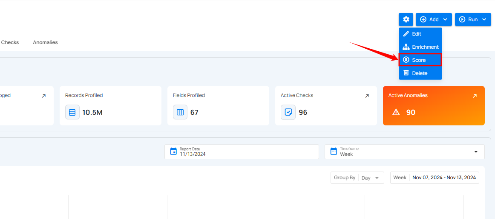
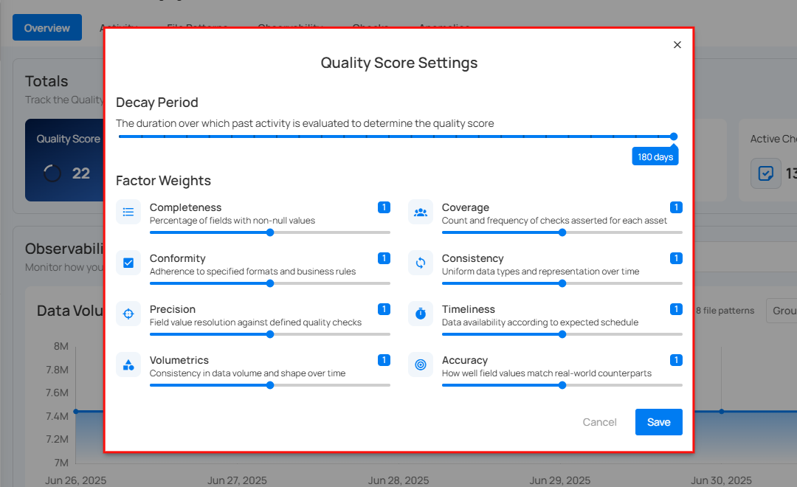
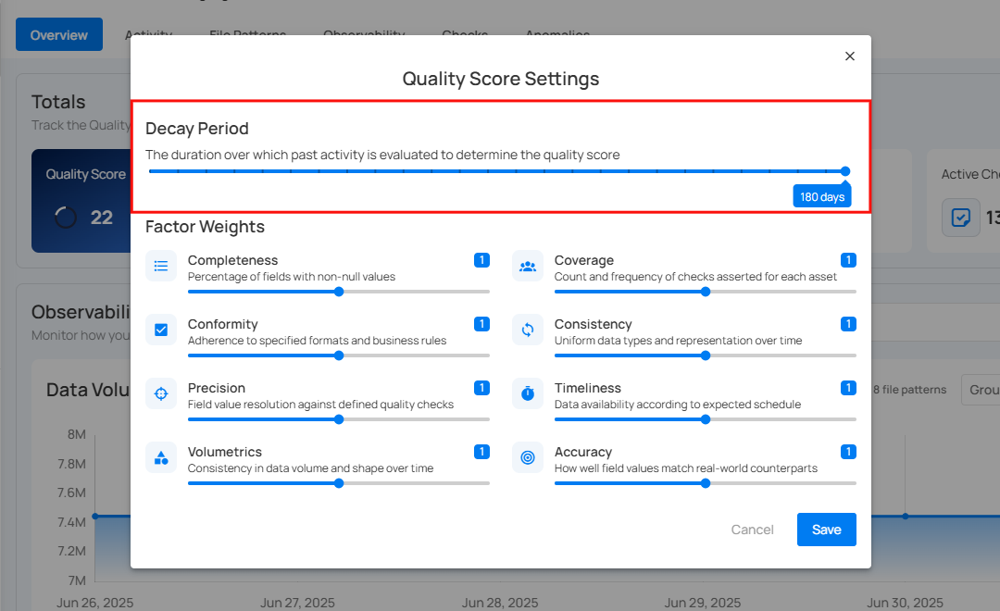
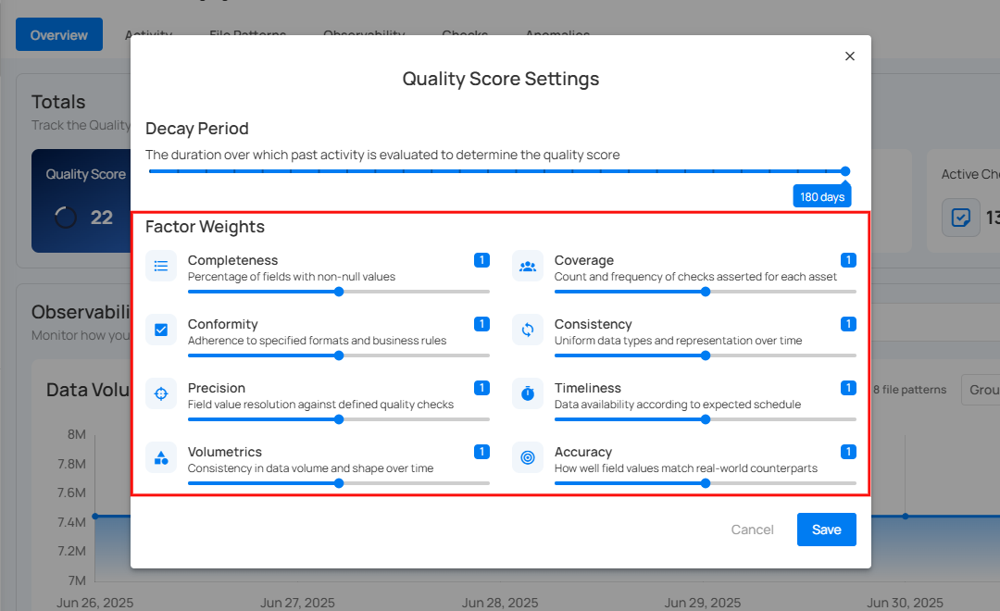
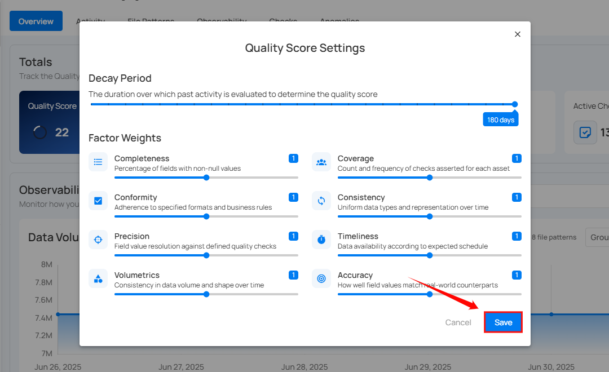

# Quality Score Settings

Quality Scores are quantified measures of data quality calculated at the field and container levels recorded as time series to enable tracking of changes over time. Scores range from 0-100, with higher values indicating superior quality. These scores integrate eight distinct factors, providing a granular analysis of the attributes that impact the overall data quality.

Each field receives a total quality score based on eight key factors, each evaluated on a 0-100 scale. The overall score is a composite reflecting the relative importance and configured weights of these factors:

* **Completeness**: Measures the average completeness of a field across all profiles.  
* **Coverage**: Assesses the adequacy of data quality checks for the field.  
* **Conformity**: Checks alignment with standards defined by quality checks.  
* **Consistency**: Ensures uniformity in type and scale across all data representations.  
* **Precision**: Evaluates the resolution of field values against defined quality checks.  
* **Timeliness**: Gauges data availability according to schedule, inheriting the container's timeliness.  
* **Volumetrics**: Analyzes consistency in data size and shape over time, inheriting the container's volumetrics.  
* **Accuracy**: Determines the fidelity of field values to their real-world counterparts.

The **Quality Score Settings** allow users to tailor the impact of each quality factor on the total score by adjusting their weights, allowing the scoring system to align with your organization’s data governance priorities.

**Step 1**: Click on the **Score** option in the settings icon.

**Step 2**: A modal window "**Quality Score Settings**" will appear.

**Step 3**: The **Decay Period** slider sets the time frame over which the system evaluates historical data to determine the quality score. The decay period for considering past data events defaults to 180 days, but can be customized to fit your operational needs, ensuring the scores reflect the most relevant data quality insights.

**Step 4**: Adjust the **Factor Weights** using the sliding bar. The factor weights determine the importance of different data quality aspects.

**Step 5**: Click on the **Save** button to save the quality score settings.

After clicking the **Save** button, a success notification appears on the screen showing the action was completed successfully.