# Scan Operation

The Scan Operation in Qualytics is performed on a datastore to enforce data quality checks for various data collections, such as tables, views, and files. It supports centralized configuration through the Datastore Enrichment Settings, where options like the Remediation Strategy, Source Record Limit, and Anomaly Rollup Threshold are defined. While these defaults are applied automatically during a scan, users retain the flexibility to adjust the Source Record Limit and Anomaly Rollup Threshold directly within the scan form. This operation has several key functions:

-   **Record Anomalies:** Identifies a single record (row) as anomalous and provides specific details regarding why it is considered anomalous. The simplest form of a record anomaly is a row that lacks an expected value for a field.  

-   **Shape Anomalies:** Identifies structural issues within a dataset at the column or schema level. It highlights broader patterns or distributions that deviate from expected norms. If a dataset is expected to have certain fields and one or more fields are missing or contain inconsistent patterns, this would be flagged as a shape anomaly.  

-   **Anomaly Data Recording:** All identified anomalies, along with related analytical data, are recorded in the associated Enrichment Datastore for further examination.

Additionally, the Scan Operation offers flexible options, including the ability to:

-   Perform checks on incremental loads versus full loads.
-   Limit the number of records scanned.
-   Run scans on a selected list of tables or files.
-   Schedule scans for future execution.

Let's get started! 🚀

## Navigation to Scan Operation

**Step 1:** Select a source datastore from the side menu on which you would like to perform the scan operation.


**Step 2:** Clicking on your preferred datastore will navigate you to the datastore details page. Within the overview tab (default view), click on the **Run** button under **Scan** to initiate the scan operation.


!!! note
    Scanning operation can be commenced once the catalog operation and profile operation are completed.

## Configuration

**Step 1:** Click on the **Run** button to initiate the scan operation.


**Step 2:** Select tables (in your JDBC datastore) or file patterns (in your DFS datastore) and tags you would like to be scanned.

!!! note
    Scan operation also supports .txt.gz and .csv.gz files in DFS datastores.

**1. All Tables/File Patterns**

This option includes all tables or file patterns currently available for scanning in the datastore. It means that every table or file pattern recognized in your datastore will be subjected to the defined data quality checks. Use this when you want to perform a comprehensive scan covering all the available data without any exclusions.

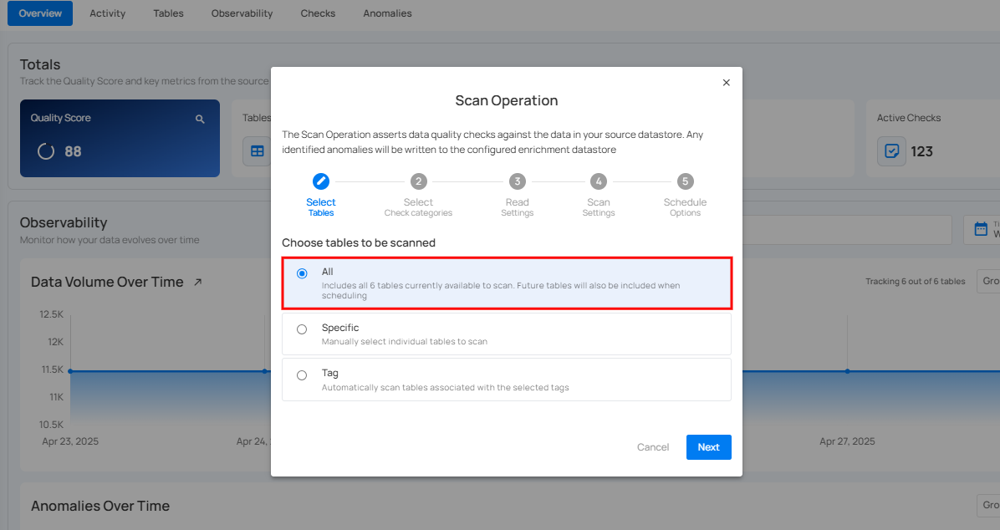

**2. Specific Tables/File Patterns**

This option allows you to manually select the individual table(s) or file pattern(s) in your datastore to scan. Upon selecting this option, all the tables or file patterns associated with your datastore will be automatically populated, allowing you to select the datasets you want to scan.

You can also search the tables/file patterns you want to scan directly using the search bar. Use this option when you need to target particular datasets or when you want to exclude certain files from the scan for focused analysis or testing purposes.

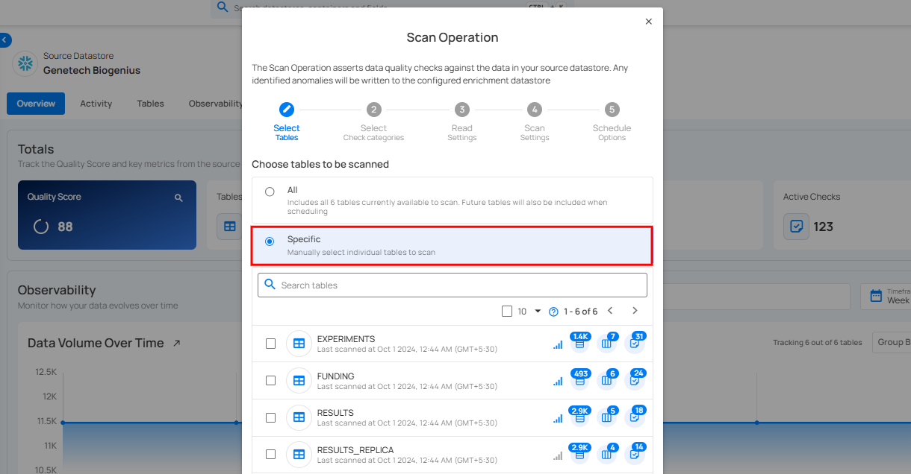

**3. Tag**

This option enables you to automatically scan file patterns associated with the selected tags. Tags can be predefined or created to categorize and manage file patterns effectively.

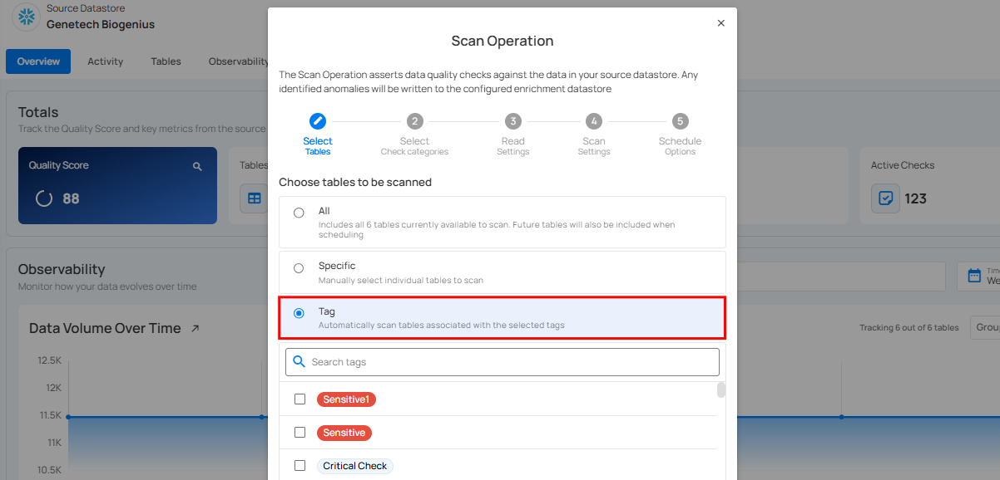

**Step 3:** Click on the **Next** button to Configure **Select Check Categories**.

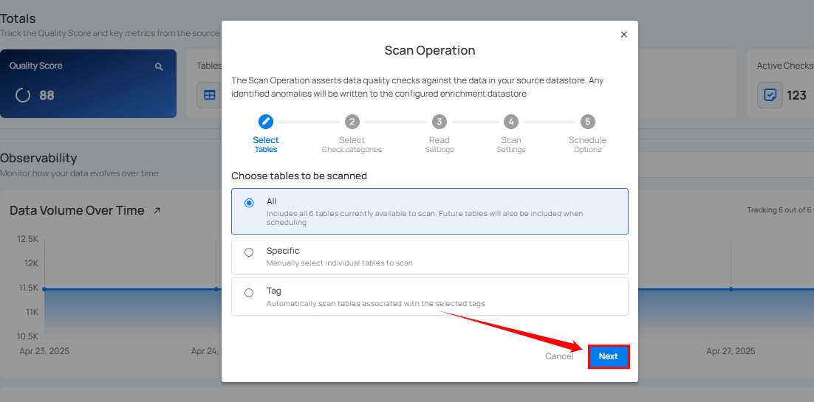

**Step 4:** Configure **Select Check Categories** Setting

Users can choose one or more check categories when initiating a scan. This allows for flexible selection based on the desired scope of the operation:

-  **Metadata**: Include checks that define the expected properties of the table, such as volume. It belongs to the Volumetric rule type.

- **Data Integrity**: Include checks that specify the expected values for the data stored in the table. It belongs to all rule types except volumetric.

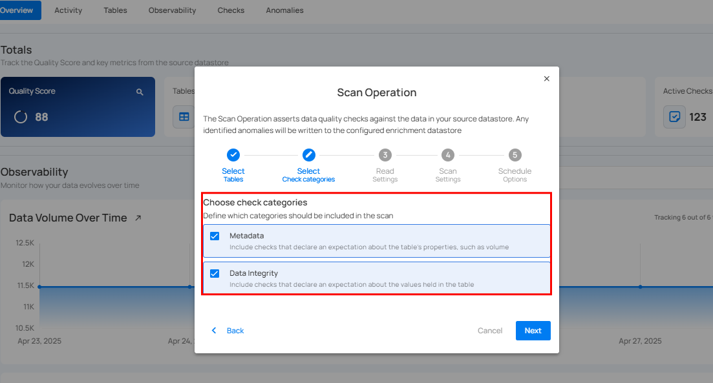

**Step 5:** Click on the **Next** button to Configure the **Read Settings**.


**Step 6:** Configure Read Settings, Starting Threshold (Optional), and the Record Limit.

 1. Select the **Read Strategy** for your scan operation.

- **Incremental:** This strategy is used to scan only the new or updated records since the last scan operation.  On the initial run, a full scan is conducted unless a specific starting threshold is set. For subsequent scans, only the records that have changed since the last scan are processed. If tables or views do not have a defined incremental key, a full scan will be performed. Ideal for regular scans where only changes need to be tracked, saving time and computational resources.

!!! note
    Incremental scans fully support Apache Iceberg table, significantly expanding the range of asset types eligible for incremental scanning operations.

- **Full**: This strategy performs a comprehensive scan of all records within the specified data collections, regardless of any previous changes or scans. Every scan operation will include all records, ensuring a complete check each time. Suitable for periodic comprehensive checks or when incremental scanning is not feasible due to the nature of the data.


!!! warning
    If any selected tables do not have an incremental identifier, a full scan will be performed for those tables.

!!! info
    When running an Incremental Scan for the first time, Qualytics automatically performs a full scan, saving the incremental field for subsequent runs.

    - This ensures that the system establishes a baseline and captures all relevant data.

    - Once the initial full scan is completed, the system intelligently uses the saved incremental field to execute    future Incremental Scans efficiently, focusing only on the new or updated data since the last scan.

    - This approach optimizes the scanning process while maintaining data quality and consistency.

 2. Define the Starting Threshold **(Optional)** i.e., specify a minimum incremental identifier value to set a starting point for the scan.

* **Greater Than Time:** This option applies only to tables with an incremental timestamp strategy. Users can specify a timestamp to scan records that were modified after this time.

* **Greater Than Batch:** This option applies to tables with an incremental batch strategy. Users can set a batch value, ensuring that only records with a batch identifier greater than the specified value are scanned.

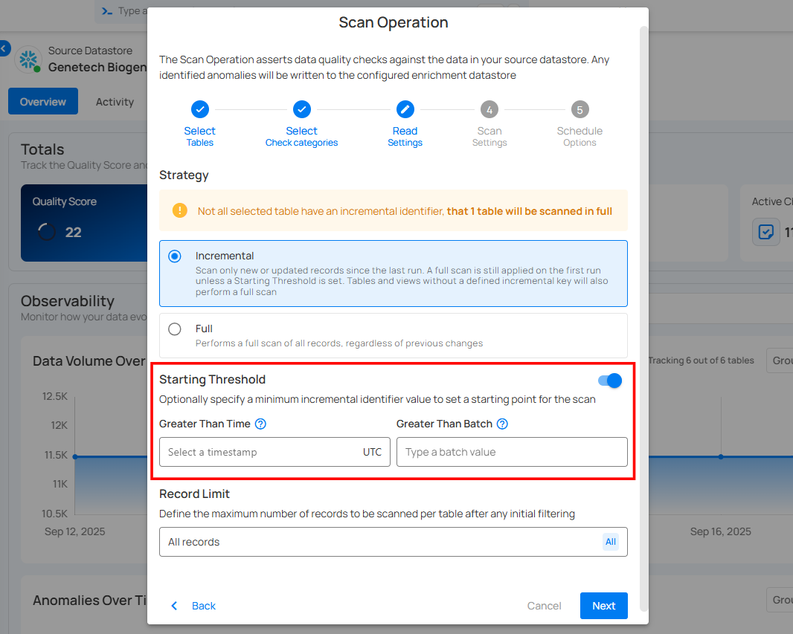

 3. Define the **Record Limit** - the maximum number of records to be scanned per table after any initial filtering. This is a crucial feature for managing large datasets.

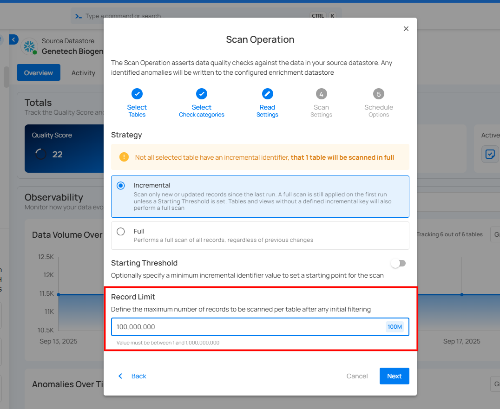

 You can manually enter a custom value in the text field or quickly select from a dropdown menu with commonly used limits such as 1M, 10M, 100M, and All.

 

!!! note
    The number of records must be between 1 and 1,000,000,000.

**Step 7:** Click on the **Next** button to Configure the **Scan Settings**.


**Step 8:** Configure the **Scan Settings**.

**1. Anomaly Options:** Manage duplicate anomalies efficiently by archiving duplicates or reactivating recurring ones. These settings help streamline anomaly tracking and maintain data accuracy.

- **Archive Duplicate Anomalies:** Automatically archive duplicate anomalies from previous scans that overlap with the current scan to enhance data management efficiency.

- **Reactivate Recurring Anomalies:** Enabling **Reactivate Recurring Anomalies** marks new anomalies as duplicates of archived ones, reactivates the original anomaly, and creates a [Fingerprint](../enrichment/overview-of-an-enrichment-datastore.md#_failed_checks-table) column in the Enrichment Datastore.


**2. Anomaly Rollup Threshold:** Set the maximum number of anomalies generated per check before they are merged into a single rolled-up anomaly. This helps manage anomaly volume and simplifies review.


**3. Source Record Limit:** Sets a maximum limit on the number of records written to the enrichment datastore for each detected anomaly. This helps manage storage and processing requirements effectively.

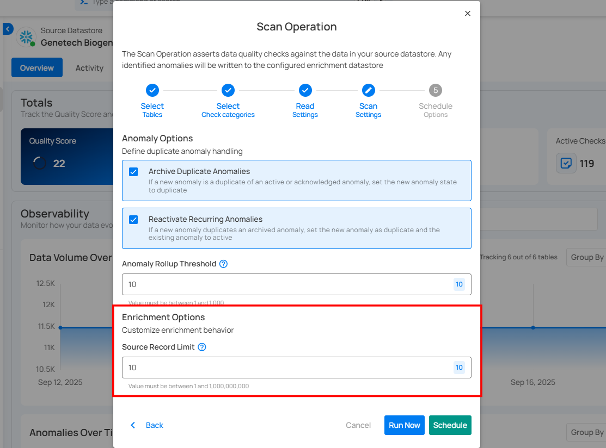

## Run Instantly

Click on the **Run Now** button to perform the scan operation immediately.


## Schedule

**Step 1:** Click on the **Schedule** button to configure the available schedule options for your scan operation.


**Step 2:** Set the scheduling preferences for the scan operation.

**1. Hourly:** This option allows you to schedule the scan to run every hour at a specified minute. You can define the frequency in hours and the exact minute within the hour the scan should start. Example: If set to **Every 1 hour(s) on minute 0,** the scan will run every hour at the top of the hour (e.g., 1:00, 2:00, 3:00).


**2. Daily:** This option schedules the scan to run once every day at a specific time. You specify the number of days between scans and the exact time of day in UTC. Example: If set to **Every 1 day(s) at 00:00 UTC,** the scan will run every day at midnight UTC.

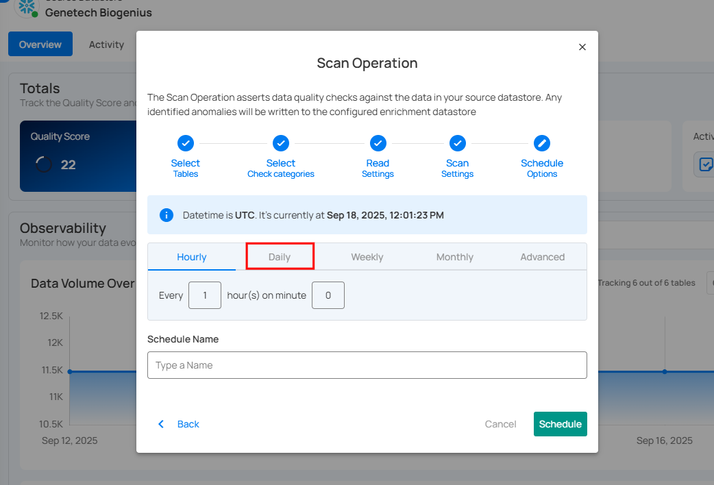

**3. Weekly:** This option schedules the scan to run on specific days of the week at a set time. You select the days of the week and the exact time of day in UTC for the scan to run. Example: If configured to run on "Sunday" and "Friday" at 00:00 UTC, the scan will execute at midnight UTC on these days.


**4. Monthly:** This option schedules the scan to run once a month on a specific day at a set time. You specify the day of the month and the time of day in UTC. If set to "On the 1st day of every 1 month(s), at 00:00 UTC," the scan will run on the first day of each month at midnight UTC.


**5. Advanced:** The advanced section for scheduling operations allows users to set up more complex and custom scheduling using Cron expressions. This option is particularly useful for defining specific times and intervals for scan operations with precision.

Cron expressions are a powerful and flexible way to schedule tasks. They use a syntax that specifies the exact timing of the task based on five fields:

-   Minute (0 - 59)
-   Hour (0 - 23)
-   Day of the month (1 - 31)
-   Month (1 - 12)  
-   Day of the week (0 - 6) (Sunday to Saturday)

Each field can be defined using specific values, ranges, or special characters to create the desired schedule.

**Example:** The Cron expression `0 0 * * *` schedules the scan operation to run at midnight (00:00) every day. Here’s a breakdown of this expression:

-   0 (Minute) - The task will run at the 0th minute.
-   0 (Hour) - The task will run at the 0th hour (midnight).
-   *(Day of the month) - The task will run every day of the month.
-   *(Month) - The task will run every month.
-   *(Day of the week) - The task will run every day of the week.

Users can define other specific schedules by adjusting the Cron expression. For example:

-   0 12 * * 1-5 - Runs at 12:00 PM from Monday to Friday.
-   30 14 1 * * - Runs at 2:30 PM on the first day of every month.
-   0 22 * * 6 - Runs at 10:00 PM every Saturday.

To define a custom schedule, enter the appropriate Cron expression in the "Custom Cron Schedule (UTC)" field before specifying the schedule name. This will allow for precise control over the timing of the scan operation, ensuring it runs exactly when needed according to your specific requirements.

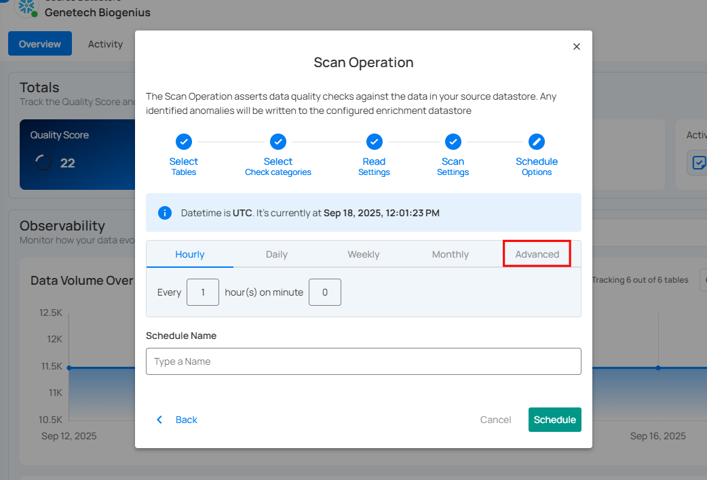

**Step 3:** Define the **Schedule Name** to identify the scheduled operation at the running time.


**Step 4:** Click on the **Schedule** button to schedule your scan operation.


!!! note
    You will receive a notification when the scan operation is completed.

## Advanced Options

The advanced use cases described below require options that are not yet exposed in our user interface but possible through interaction with Qualytics API.

### Runtime Variable Assignment

It is possible to reference a variable in a check definition (declared in double curly braces) and then assign that variable a value when a Scan operation is initiated. Variables are supported within any Spark SQL expression and are most commonly used in a check filter.

If a Scan is meant to assert a check with a variable, a value for that variable must be supplied as part of the Scan operation's `check_variables` property.

For example, a check might include a filter.- `transaction_date == {{ checked_date }}` which will be asserted against any records where transaction_date is equal to the value supplied when the Scan operation is initiated. In this case that value would be assigned by passing the following payload when calling ```/api/operations/run```

```json
{
    "type": "scan",
    "datastore_id": 42,
    "container_names": ["my_container"],
    "incremental": true,
    "remediation": "none",
    "max_records_analyzed_per_partition": 0,
    "check_variables": {
        "checked_date": "2023-10-15"
    },
    "high_count_rollup_threshold": 10
}
```
## Operations Insights

When the scan operation is completed, you will receive the notification and can navigate to the Activity tab for the datastore on which you triggered the Scan Operation and learn about the scan results.

### Top Panel

**1. Runs (Default View):** Provides insights into the operations that have been performed

**2. Schedule:** Provides insights into the [scheduled operations](../operation-automation/automated-tasks-with-cron.md).

**3. Search:** Search for any operation (including scan) by entering the operation ID

**4. Sort by:** Organize the list of operations based on the **Created Date** or the **Duration**.

**5. Filter:** Narrow down the list of operations based on:

-   Operation Type
-   Operation Status
-   Table


### Activity Heatmap

The activity heatmap shown in the snippet below represents activity levels over a period, with each square indicating a day and the color intensity representing the number of operations or activities on that day. It is useful in tracking the number of operations performed on each day within a specific timeframe.

!!! tip 
    You can click on any of the squares from the Activity Heatmap to filter operations.

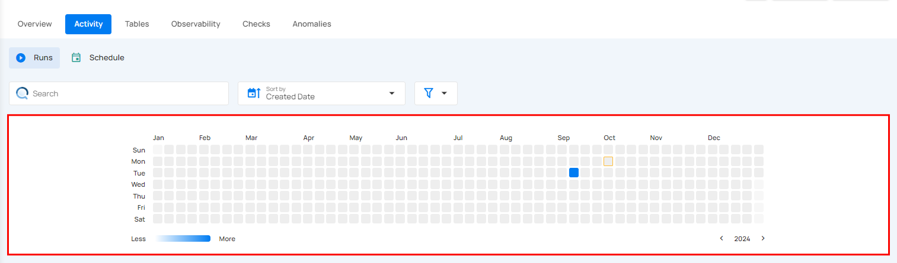

### Operation Detail

#### Running

This status indicates that the scan operation is still running at the moment and is yet to be completed. A scan operation having a **running** status reflects the following details and actions:

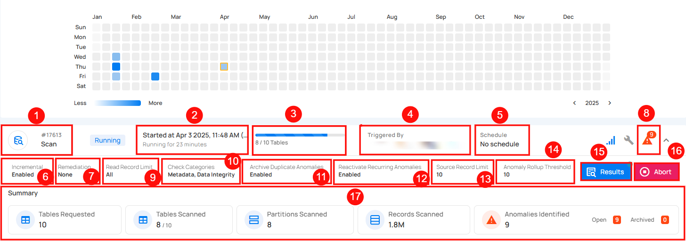

| No. | Parameter                  | Interpretation                                                                                               |
| --- | -------------------------- | ----------------------------------------------------------------------------------------------------------- |
| 1   | Operation ID and Type   | Unique identifier and type of operation performed (catalog, profile, or scan).                               |
| 2   | Timestamp              | Timestamp when the operation was started.                                                                    |
| 3   | Progress Bar            | The progress of the operation.                                                                               |
| 4   | Triggered By            | The author who triggered the operation.                                                                      |
| 5   | Schedule                | Indicates whether the operation was scheduled or not.                                                        |
| 6   | Incremental Field       | Indicates whether Incremental was enabled or disabled in the operation.                                      |
| 7   | Remediation             | Indicates whether Remediation was enabled or disabled in the operation.                                      |
| 8   | Anomalies Identified    | Provides a count of the number of anomalies detected during the running operation.|
| 9   | Read Record Limit        | Defines the maximum number of records to be scanned per table after initial filtering.|
| 10  | Check Categories        | Indicates which categories should be included in the scan (e.g., Metadata, Data Integrity).|
| 11  | Archive Duplicate Anomalies | Indicates whether Archive Duplicate Anomalies was enabled or disabled in the operation.
| 12  | Reactivate Recurring Anomalies | Indicates whether previously detected anomalies that reappear in subsequent scans will be reactivated. |
| 13  | Source Record Limit     | Indicates the limit on records stored in the enrichment datastore for each detected anomaly.|
| 14  | Anomaly Rollup Threshold | Number of anomalies grouped together for rollup reporting.|
| 15  | Results                 | View the details of the ongoing scan operation. This includes information on which tables are currently being scanned, the anomalies identified so far (if any), and other related data collected during the active scan.|
| 16  | Abort                   | The Abort button enables you to stop the ongoing scan operation.|
| 17  | Summary | The summary section provides an overview of the scan operation in progress. It includes: <br> <ul><li> **Tables Requested**: The total number of tables that were scheduled for scanning. Click on the adjacent magnifying glass icon to view the tables requested. </li><li> **Tables Scanned**: The number of tables that have been scanned so far. Click on the adjacent magnifying glass icon to view the tables scanned. </li><li> **Partitions Scanned**: The number of partitions scanned during the ongoing operation.</li><li> **Records Scanned**: The total number of records processed up to this point. </li><li> **Anomalies Identified**: The total number of detected anomalies, with a breakdown of open and archived ones. </li></ul>|

#### Aborted

This status indicates that the scan operation was manually stopped before it could be completed. A scan operation having an **aborted** status reflects the following details and actions:


| **No.** | **Parameter**             | **Interpretation**                                                                 |
|---------|---------------------------|------------------------------------------------------------------------------------|
| 1       | Operation ID and Type     | Unique identifier and type of operation performed (catalog, profile, or scan).     |
| 2       | Timestamp                 | Timestamp when the operation was started                                           |
| 3       | Progress Bar              | The progress of the operation                                                      |
| 4       | Aborted By              | The author who triggered the operation                                             |
| 5       | Schedule                  | Whether the operation was scheduled or not                                         |
| 6       | Incremental Field         | Indicates whether Incremental was enabled or disabled in the operation             |
| 7       | Remediation               | Indicates whether Remediation was enabled or disabled in the operation             |
| 8       | Anomalies Identified      | Provides a count on the number of anomalies detected before the operation was aborted|
| 9       | Read Record Limit          | Defines the maximum number of records to be scanned per table after initial filtering|
| 10      | Check Categories          | Indicates which categories should be included in the scan (Metadata, Data Integrity)|
| 11      | Archive Duplicate Anomalies| Indicates whether Archive Duplicate Anomalies was enabled or disabled in the operation|
| 12      | Reactivate Recurring Anomalies | Indicates whether previously detected anomalies that reappear in subsequent scans will be reactivated. |
| 13      | Source Record Limit       | Indicates the limit on records stored in the enrichment datastore for each detected anomaly|
| 14      | Anomaly Rollup Threshold | Number of anomalies grouped together for rollup reporting.|
| 15      | Results                   | View the details of the scan operation that was aborted, including tables scanned and anomalies identified|
| 16      | Resume                    | Provides an option to continue the scan operation from where it left off            |
| 17      | Rerun                     | The "Rerun" button allows you to start a new scan operation using the same settings as the aborted scan|
| 18      | Delete                    | Removes the record of the aborted scan operation from the system, permanently deleting scan results and anomalies|
| 19      |  Summary                  | The summary section provides an overview of the scan operation up to the point it was aborted. It includes: <br> <ul><li> **Tables Requested**: The total number of tables that were scheduled for scanning. Click on the adjacent magnifying glass icon to view the tables requested. </li><li> **Tables Scanned**: The number of tables that have been scanned so far. Click on the adjacent magnifying glass icon to view the tables scanned. </li><li> **Partitions Scanned**: The number of partitions scanned before the operation was aborted. </li><li> **Records Scanned**: The total number of records processed before the scan was stopped. </li><li> **Anomalies Identified**: The total number of detected anomalies, with a breakdown of open and archived ones. </li></ul> |

#### Warning

This status signals that the scan operation encountered some issues and displays the logs that facilitate improved tracking of the blockers and issue resolution. A scan operation having a **completed with warning** status reflects the following details and actions:

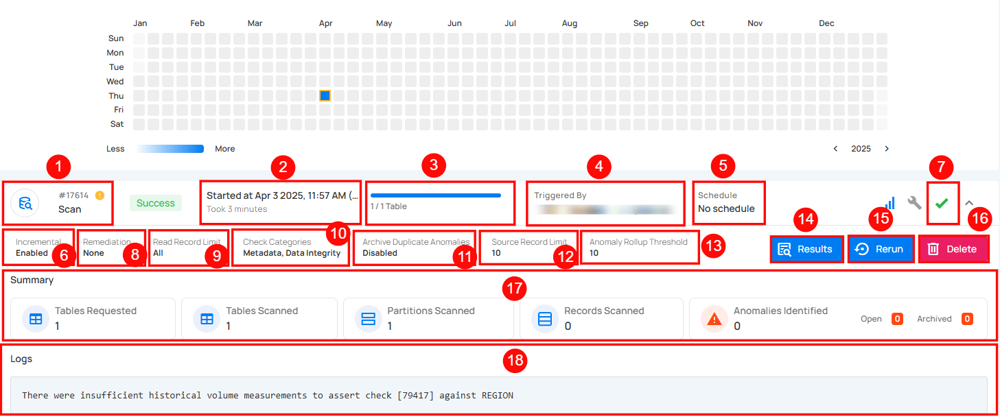

| **No.** | **Parameter**             | **Interpretation**                                                                 |
|---------|---------------------------|------------------------------------------------------------------------------------|
| 1       | Operation ID and Type     | Unique identifier and type of operation performed (catalog, profile, or scan).     |
| 2       | Timestamp                 | Timestamp when the operation was started                                           |
| 3       | Progress Bar              | The progress of the operation                                                      |
| 4       | Triggered By              | The author who triggered the operation                                             |
| 5       | Schedule                  | Whether the operation was scheduled or not                                         |
| 6       | Incremental Field         | Indicates whether Incremental was enabled or disabled in the operation             |
| 7       | Remediation               | Indicates whether Remediation was enabled or disabled in the operation             |
| 8       | Anomalies Identified      | Provides a count on the number of anomalies detected before the operation was warned.|
| 9       | Read Record Limit          | Defines the maximum number of records to be scanned per table after initial filtering|
| 10      | Check Categories          | Indicates which categories should be included in the scan (Metadata, Data Integrity)|
| 11      | Archive Duplicate Anomalies| Indicates whether Archive Duplicate Anomalies was enabled or disabled in the operation|
| 12      | Source Record Limit       | Indicates the limit on records stored in the enrichment datastore for each detected anomaly|
| 13      | Anomaly Rollup Threshold | Number of anomalies grouped together for rollup reporting.|
| 14      | Result                         | View the details of the scan operation that was completed with warning, including tables scanned and anomalies identified|
| 15      | Rerun                     | The "Rerun" button allows you to start a new scan operation using the same settings as the warning scan|
| 16      | Delete                    | Removes the record of the warning operation from the system, permanently deleting scan results and anomalies|
| 17      |Summary                    | The summary section provides an overview of the scan operation, highlighting any warnings encountered. It includes: <br><ul><li> **Tables Requested**: The total number of tables that were scheduled for scanning. Click on the adjacent magnifying glass icon to view the tables requested. </li><li> **Tables Scanned**: The number of tables that have been scanned so far. Click on the adjacent magnifying glass icon to view the tables scanned. </li><li> **Partitions Scanned**: The number of partitions scanned during the operation, including any partitions that triggered warnings. </li><li> **Records Scanned**: The total number of records processed during the scan, along with any records that raised warnings. </li><li> **Anomalies Identified**: The total number of detected anomalies, with a breakdown of open and archived ones. </li></ul>|
| 18       |Logs                      | Logs include error messages, warnings, and other pertinent information that occurred during the execution of the Scan Operation.|

#### Success

The summary section provides an overview of the **scan** operation upon successful completion. It includes:


| **No.** | **Parameter**             | **Interpretation**                                                                 |
|---------|---------------------------|------------------------------------------------------------------------------------|
| 1       | Operation ID and Type     | Unique identifier and type of operation performed (catalog, profile, or scan).     |
| 2       | Timestamp                 | Timestamp when the operation was started                                           |
| 3       | Progress Bar              | The progress of the operation                                                      |
| 4       | Triggered By              | The author who triggered the operation                                             |
| 5       | Schedule                  | Whether the operation was scheduled or not                                         |
| 6       | Incremental Field         | Indicates whether Incremental was enabled or disabled in the operation             |
| 7       | Remediation               | Indicates whether Remediation was enabled or disabled in the operation             |
| 8       | Anomalies Identified      | Provides a count of the number of anomalies detected during the successful completion of the operation.|
| 9      | Read Record Limit          | Defines the maximum number of records to be scanned per table after initial filtering|
| 10      | Check Categories          | Indicates which categories should be included in the scan (Metadata, Data Integrity)|
| 11      | Archive Duplicate Anomalies| Indicates whether Archive Duplicate Anomalies was enabled or disabled in the operation|
| 12      | Source Record Limit       | Indicates the limit on records stored in the enrichment datastore for each detected anomaly|
| 13      | Anomaly Rollup Threshold | Number of anomalies grouped together for rollup reporting.|
| 14      | Results                   | View the details of the completed scan operation. This includes information on which tables were scanned, the anomalies identified (if any), and other relevant data collected throughout the successful completion of the scan.|
| 15      | Rerun                     | The "Rerun" button allows you to start a new scan operation using the same settings as the success scan|
| 16      | Delete                    | Removes the record of the aborted scan operation from the system, permanently deleting scan results and anomalies|
| 17     | Summary | The summary section provides an overview of the scan operation upon successful completion. It includes: <br><ul><li> **Tables Requested**: The total number of tables that were scheduled for scanning. Click on the adjacent magnifying glass icon to view the tables requested. </li><li> **Tables Scanned**: The number of tables that have been scanned successfully. Click on the adjacent magnifying glass icon to view the tables scanned. </li><li> **Partitions Scanned**: The number of partitions scanned. </li><li> **Records Scanned**: The total number of records processed.</li><li> **Anomalies Identified**: The total number of detected anomalies, with a breakdown of open and archived ones. </li></ul>|

#### Full View of Metrics in Operation Summary

Users can now hover over abbreviated metrics to see the full value for better clarity. For demonstration purposes, we are hovering over the **Records Scanned** field to display the full value.


#### Post Operation Details

**Step 1:** Click on any of the successful **Scan Operations** from the list and hit the **Results** button.

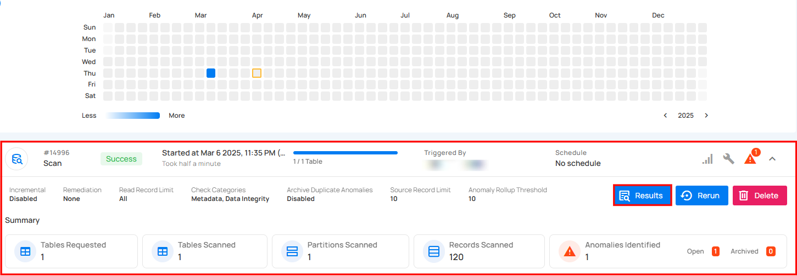

**Step 2:** The **Scan Results** modal demonstrates the highlighted anomalies (if any) identified in your datastore with the following properties:

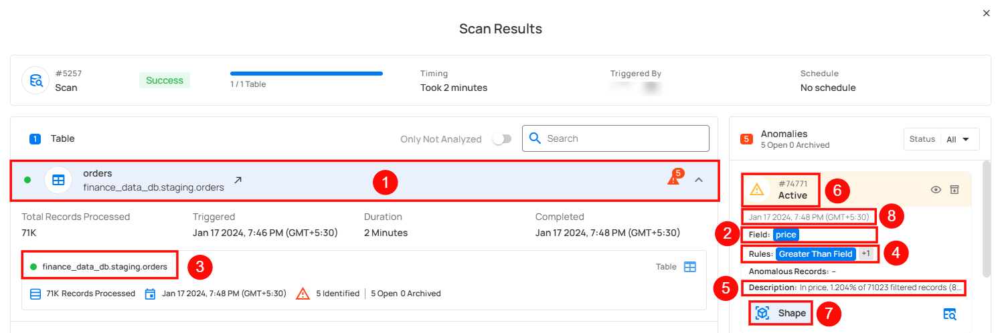

| Ref. | Scan Properties | Description |
|------|-----------------|------------------------|
| 1.   | Table/File | The table or file where the anomaly is found.|
| 2.   | Field | The field(s) where the anomaly is present. |
| 3.   | Location | Fully qualified location of the anomaly.|
| 4.   | Rule | Inferred and authored checks that failed assertions. |
| 5.   | Description | Human-readable, auto-generated description of the anomaly.|
| 6.   | Status | The status of the anomaly: Active, Acknowledged, Resolved, or Invalid. |
| 7.   | Type | The type of anomaly (e.g., Record or Shape) |
| 8.   | Date time | The date and time when the anomaly was found. |

**Step 3:** By clicking the **dropdown** button next to the **All** button, you can filter anomalies based on their status.


## API Payload Examples

This section provides payload examples for running, scheduling, and checking the status of scan operations. Replace the placeholder values with data specific to your setup.

### Running a Scan operation

To run a scan operation, use the API payload example below and replace the placeholder values with your specific values.

#### Endpoint (Post): 

```/api/operations/run (post)```

=== "Option I: Running a scan operation of all containers"
    *   **container_names:** `[]` means that it will scan all containers.
    *   **max_records_analyzed_per_partition:** `null` means that it will scan all records of all containers.
    *   **Remediation:** `append` replicates source containers using an append-first strategy.

    ```json
    {
        "type":"scan",
        "name":null,
        "datastore_id": datastore-id,
        "container_names":[],
        "remediation":"append",
        "incremental":false,
        "max_records_analyzed_per_partition":null,
        "enrichment_source_record_limit":10
    }
    ```
=== "Option II: Running a scan operation of specific containers"
    *   **container_names:** `["table_name_1", "table_name_2"]` means that it will scan only the tables table_name_1 and table_name_2.
    *   **max_records_analyzed_per_partition:** `1000000` means that it will scan a maximum of 1 million records per partition.  
    *   **Remediation:** `overwrite` replicates source containers using an overwrite strategy.

    ```json
    {
        "type":"scan",
        "name":null,
        "datastore_id":datastore-id,
        "container_names":[
          "table_name_1",
          "table_name_2"
        ],
        "max_records_analyzed_per_partition":1000000,
        "enrichment_source_record_limit":10
    }
    ```
### Scheduling scan operation of all containers

To schedule a scan operation, use the API payload example below and replace the placeholder values with your specific values.

#### Endpoint (Post):

```/api/operations/schedule (post)```

This payload is to run a scheduled scan operation every day at 00:00

=== "Scheduling scan operation of all containers"

    ```json
    {
        "type":"scan",
        "name":"My scheduled Scan operation",
        "datastore_id":"datastore-id",
        "container_names":[],
        "remediation": "overwrite"
        "incremental": false,
        "max_records_analyzed_per_partition":null,
        "enrichment_source_record_limit":10,
        "crontab":"00 00 */2 * *"
    }
    ```

### Retrieving Scan Operation Information

#### Endpoint (Get)

`/api/operations/{id} (get)`

=== "Example result response"
    ```json
    {
        "items": [
            {
                "id": 12345,
                "created": "YYYY-MM-DDTHH:MM:SS.ssssssZ",
                "type": "scan",
                "start_time": "YYYY-MM-DDTHH:MM:SS.ssssssZ",
                "end_time": "YYYY-MM-DDTHH:MM:SS.ssssssZ",
                "result": "success",
                "message": null,
                "triggered_by": "user@example.com",
                "datastore": {
                    "id": 101,
                    "name": "Datastore-Sample",
                    "store_type": "jdbc",
                    "type": "db_type",
                    "enrich_only": false,
                    "enrich_container_prefix": "data_prefix",
                    "favorite": false
                },
                "schedule": null,
                "incremental": false,
                "remediation": "none",
                "max_records_analyzed_per_partition": -1,
                "greater_than_time": null,
                "greater_than_batch": null,
                "high_count_rollup_threshold": 10,
                "enrichment_source_record_limit": 10,
                "status": {
                    "total_containers": 2,
                    "containers_analyzed": 2,
                    "partitions_scanned": 2,
                    "records_processed": 28,
                    "anomalies_identified": 2
                },
                "containers": [
                    {
                    "id": 234,
                    "name": "Container1",
                    "container_type": "table",
                    "table_type": "table"
                    },
                    {
                    "id": 235,
                    "name": "Container2",
                    "container_type": "table",
                    "table_type": "table"
                    }
                ],
                "container_scans": [
                    {
                    "id": 456,
                    "created": "YYYY-MM-DDTHH:MM:SS.ssssssZ",
                    "container": {
                        "id": 235,
                        "name": "Container2",
                        "container_type": "table",
                        "table_type": "table"
                    },
                    "start_time": "YYYY-MM-DDTHH:MM:SS.ssssssZ",
                    "end_time": "YYYY-MM-DDTHH:MM:SS.ssssssZ",
                    "records_processed": 8,
                    "anomaly_count": 1,
                    "result": "success",
                    "message": null
                    },
                    {
                    "id": 457,
                    "created": "YYYY-MM-DDTHH:MM:SS.ssssssZ",
                    "container": {
                        "id": 234,
                        "name": "Container1",
                        "container_type": "table",
                        "table_type": "table"
                    },
                    "start_time": "YYYY-MM-DDTHH:MM:SS.ssssssZ",
                    "end_time": "YYYY-MM-DDTHH:MM:SS.ssssssZ",
                    "records_processed": 20,
                    "anomaly_count": 1,
                    "result": "success",
                    "message": null
                    }
                ],
                "tags": []
            }
        ],
        "total": 1,
        "page": 1,
        "size": 50,
        "pages": 1
    }
    ```
