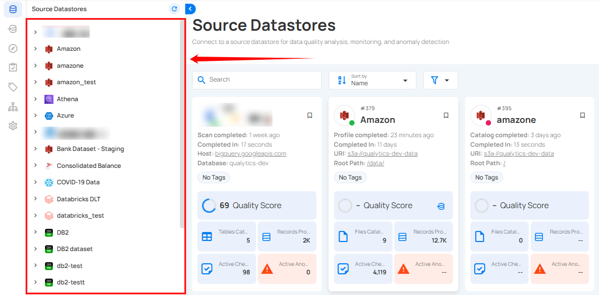
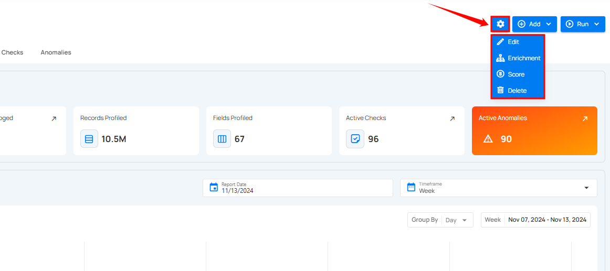

# Settings Overview

Qualytics allows you to manage your datastore efficiently by editing source datastore information, linking an enrichment datastore for enhanced insights, establishing new connections to expand data sources, choosing connectors to integrate diverse data, adjusting the quality score to ensure data accuracy, and deleting the store. This ensures flexibility and control over your data management processes within the platform.

Let's get started 🚀

## Navigation

**Step 1**: Select a source **datastore** from the side menu for which you would like to manage the settings.

**Step 2**: Click on the **Settings** icon from the top right window. A drop-down menu will appear with the following options:

1. Edit  
2. Enrichment  
3. Score  
4. Delete

## Edit Datastore

Use the **Edit Datastore** option to make changes to your datastore’s connection setup whenever updates are needed.

For more information on how to edit the datastore, please refer to the [Edit Datastore](../source-datastore/edit-datastore.md) documentation.

## Link Enrichment

An enrichment datastore is a database used to enhance your existing data by adding additional, relevant information. This helps you to provide more comprehensive insight into data and improve data accuracy.

You have the option to link an enrichment datastore to your existing source datastore. However, some datastores cannot be linked as enrichment datastores. For example, Oracle, Athena, and Timescale cannot be used for this purpose.

For more information on how to link an enrichment datastore, please refer to the [Link Enrichment](../source-datastore/link-enrichment.md) documentation.

## Quality Score Settings

Use the **Quality Score Settings** option to adjust factor weights and decay period, aligning data quality scoring with your organization’s needs.

For more information on the quality score, please refer to the [Quality Score](../source-datastore/quality-score-settings.md) documentation.

## Delete Datastore

Use the **Delete Datastore** option to remove outdated or unused datastores along with their related configurations, helping keep your workspace organized.

For more information on how to delete a datastore, please refer to the [Delete Datastore](../source-datastore/delete-datastore.md) documentation.