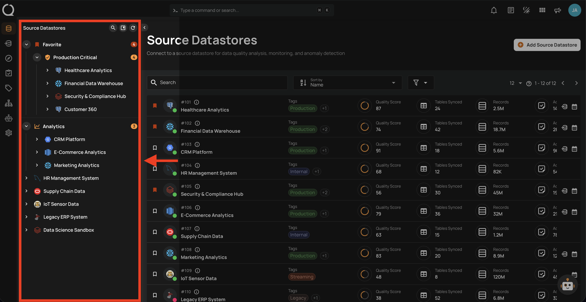
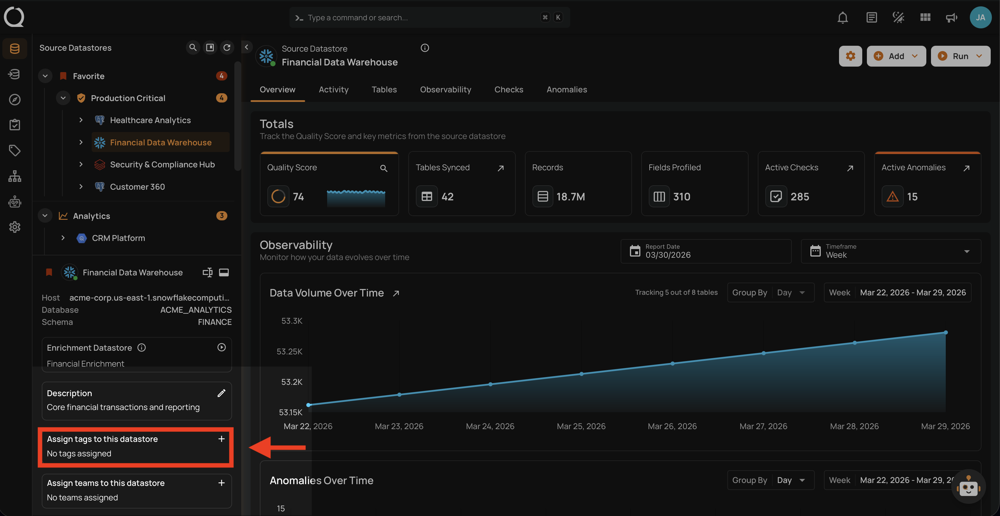
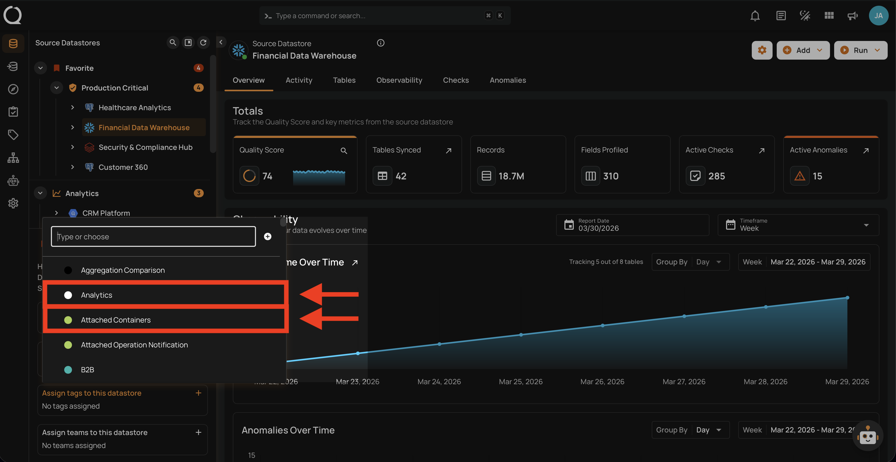
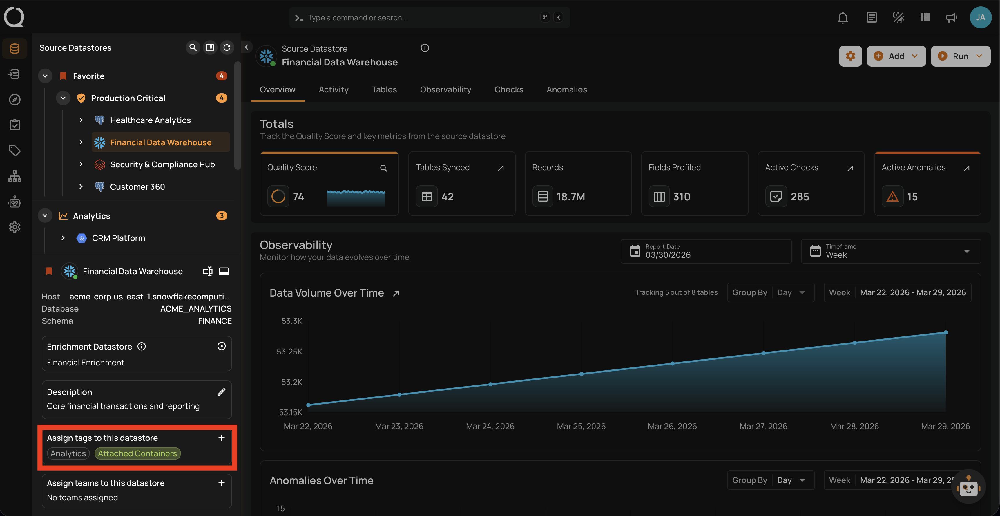

# Assign a Tag to a Datastore

Assigning tags to your datastore helps you categorize, organize, and filter your data sources. Tags serve as labels that cascade to all containers, fields, checks, and anomalies within the datastore — making it easier to monitor data quality, scope operations, and manage resources.

!!! warning "Side Effects"
    When you assign a tag to a datastore, the tag is **automatically inherited** by all containers, fields, checks, and anomalies within the datastore. If the tag has a **weight modifier** configured, quality scores for all containers in the datastore will be **recalculated** to reflect the new weighting.

!!! info "Prerequisites"
    You need to have at least one tag created before assigning it to a datastore. If you haven't created any tags yet, follow the [Add Tag](../../tags/add-tag.md){:target="_blank"} guide first.

## Steps

**Step 1**: Log in to your Qualytics account and select the **datastore** from the left menu on which you want to assign a tag.

**Step 2**: Click on **Assign tags to this datastore** located at the bottom-left corner of the interface.

**Step 3**: A drop-up menu will appear with a list of available tags. Select the **tags** you want to assign to the datastore.

**Step 4**: Once you have assigned the tags, they will be instantly labeled on your source datastore and automatically applied to all related containers, fields, checks, and anomalies.

!!! info "Unassign a Tag"
    To learn how to remove a tag from a datastore, see the [Unassign a Tag](unassign-tags.md) documentation.
