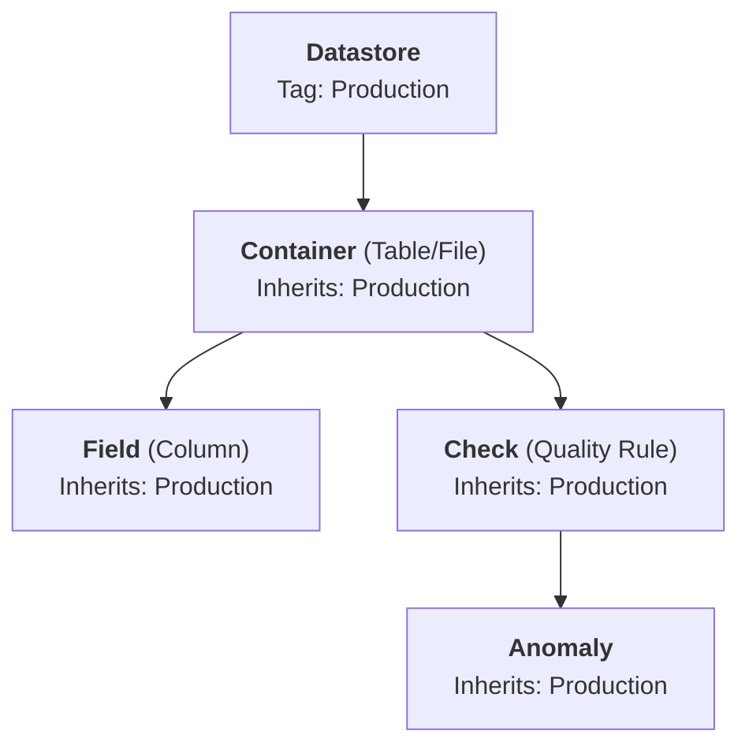

# Datastore Tags Introduction

## Overview

Tags on datastores allow you to categorize, organize, and filter your data sources. A single datastore can have multiple tags, and a single tag can be applied to many datastores — providing a flexible, multi-dimensional classification system.

When you assign a tag to a datastore, it **automatically inherits down** to all containers (tables/files), fields, checks, and anomalies within that datastore. This means you can tag at the datastore level and instantly have all related assets categorized.

<!-- TODO: Update link to tags/overview-of-a-tag.md when the dedicated Tags overview page is created -->
!!! info "Tags vs. Datastore Tags"
    This page covers how tags work **in the context of source datastores** — inheritance, operation filtering, and quality score impact. For the general concepts behind tags in Qualytics (tag types, properties, creating, editing, deleting), see the [Tags](../../tags/overview.md){:target="_blank"} documentation.

## Why Use Tags on Datastores?

Tags on datastores serve several purposes specific to the datastore context:

- **Categorization** — Classify datastores by environment (`Production`, `Staging`, `Development`), compliance (`HIPAA`, `PCI`, `SOX`), team (`Engineering`, `Finance`, `Marketing`), or any custom category.
- **Operation Filtering** — Use tags to scope Profile and Scan operations to specific containers. Instead of selecting containers individually, you can run an operation on all containers tagged with `Critical`.
- **Quality Score Weighting** — Tags have a **weight modifier** that influences how container quality scores are calculated. Higher-weighted tags make their containers more impactful in the overall datastore quality score.
- **Navigation** — Quickly find and access datastores using tag-based filtering in the navigation tree.

## Tag Inheritance

When you assign a tag to a datastore, the tag cascades **immediately and synchronously** to all child assets — there is no delay or background processing.

Tagging a datastore is a powerful way to classify your entire data lineage in one action. When tags change on a datastore, all child assets are updated in real time — containers, fields, and checks are re-tagged, and quality score weights are recalculated immediately.

## Using Tags in Operations

Tags can be used to filter which containers are included in Profile and Scan operations:

- When scheduling or running an operation, you can specify **container tags** instead of selecting individual containers.
- Only containers that have the specified tags will be included in the operation.
- This is especially useful for large datastores where you want to focus quality checks on specific subsets of data.

!!! tip "Configuring Tag Filters in Operations"
    When running a Profile or Scan operation, select the **Tag** option in the container selection step to filter by tags. See the [Scan Operation](../../source-datastore/operations/scan.md){:target="_blank"} or [Profile Operation](../../source-datastore/operations/profile.md){:target="_blank"} documentation for step-by-step instructions.

!!! note
    Tags and container selection are mutually exclusive in operations — you can filter by tags **or** by specific container names, but not both at the same time.

## Quality Score Impact

When tags with a **weight modifier** are assigned to a datastore, Qualytics recalculates the relative importance of each container in the quality score:

1. The weight modifiers of all tags on each container are summed.
2. The minimum sum across all containers is used as a baseline offset so that all weights are at least 1.
3. The final weight formula is: `weight = sum(tag modifiers) + abs(min_weight) + 1`.
4. Higher-weighted containers have more impact on the overall datastore quality score via weighted average.

Removing a tag with a weight modifier triggers an automatic recalculation of all container quality scores within the datastore.

??? example "Weight Modifier Example"

    Suppose a datastore has 3 containers and 2 tags:

    - **Tag: Critical** — weight modifier: `3`
    - **Tag: Standard** — weight modifier: `1`

    **Step 1 — Sum tag modifiers per container:**

    | Container | Tags | Sum of Modifiers |
    | :--- | :--- | :---: |
    | `orders` | Critical | 3 |
    | `customers` | Critical, Standard | 4 |
    | `logs` | Standard | 1 |

    **Step 2 — Apply formula** (`weight = sum + abs(min) + 1`, where min = 1):

    | Container | Sum | Weight (`sum + 1 + 1`) | Relative Impact |
    | :--- | :---: | :---: | :---: |
    | `orders` | 3 | 5 | Medium |
    | `customers` | 4 | 6 | Highest |
    | `logs` | 1 | 3 | Lowest |

    When calculating the datastore quality score, each container's score is multiplied by its weight and divided by the total weight (5 + 6 + 3 = 14). A quality issue in `customers` (weight 6) has twice the impact of the same issue in `logs` (weight 3).

!!! note
    Weight modifiers range from **-10 to +10** per tag. The formula guarantees all final weights are at least 1, even when negative modifiers are used. Weights are **not** normalized to sum to 100% — they are raw multipliers used in a weighted average calculation.

!!! info
    For more details on weight modifiers and how they affect scoring, see the [Weighting](../../weight/weighting.md){:target="_blank"} documentation.

## Next Steps

-   :material-tag-plus:{ .lg .middle } **Assign a Tag**

    ---

    Assign an existing tag to a source datastore.

    [:octicons-arrow-right-24: Assign a Tag](assign-tags.md)

-   :material-tag-off-outline:{ .lg .middle } **Unassign a Tag**

    ---

    Remove a tag from a source datastore.

    [:octicons-arrow-right-24: Unassign a Tag](unassign-tags.md)

