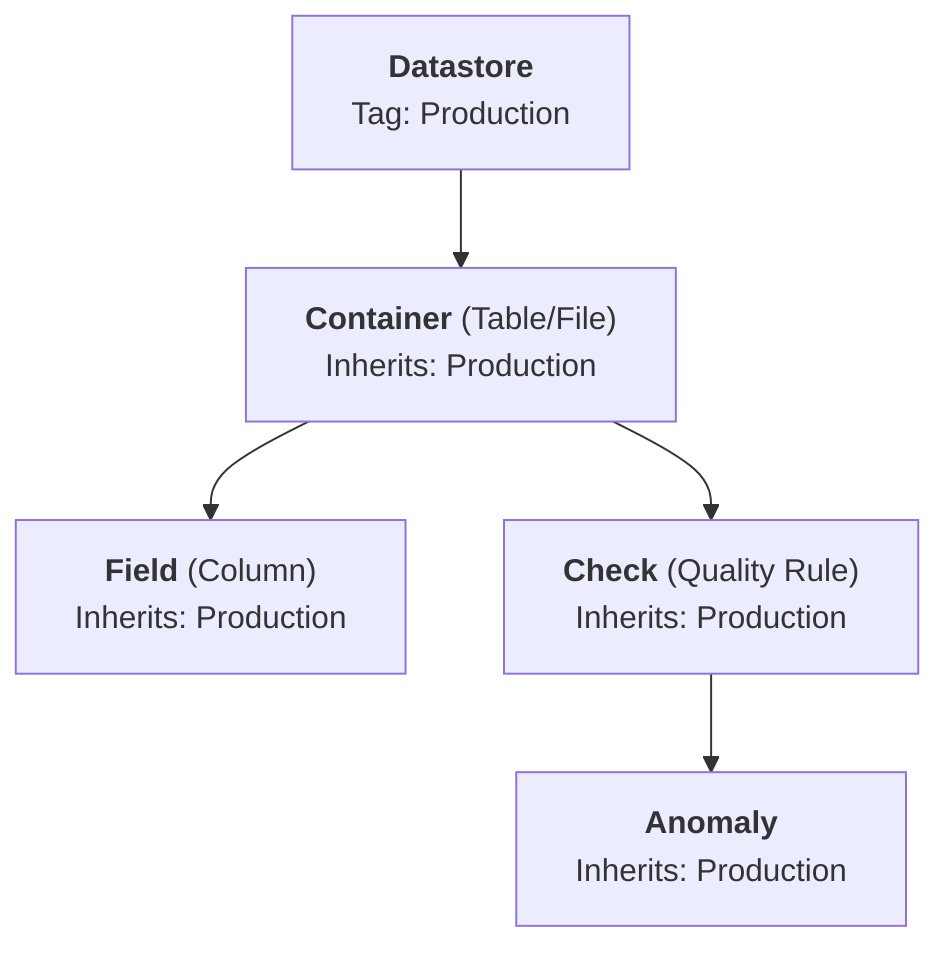

# Datastore Tags Introduction

## Overview

Tags on datastores allow you to categorize, organize, and filter your data sources. A single datastore can have multiple tags, and a single tag can be applied to many datastores — providing a flexible, multi-dimensional classification system.

When you assign a tag to a datastore, it **automatically inherits down** to all containers (tables/files), fields, checks, and anomalies within that datastore. This means you can tag at the datastore level and instantly have all related assets categorized.

!!! info "Tags Concepts"
    For a general overview of tags in Qualytics — including tag types (Global, External, Entity, Lineage, Personal), tag properties, visibility, and how to create or manage tags — see the [Tags Overview](../../tags/overview.md){:target="_blank"} documentation.

## Why Use Tags on Datastores?

Tags on datastores serve several purposes specific to the datastore context:

- **Categorization** — Classify datastores by environment (`Production`, `Staging`, `Development`), compliance (`HIPAA`, `PCI`, `SOX`), team (`Engineering`, `Finance`, `Marketing`), or any custom category.
- **Operation Filtering** — Use tags to scope Profile and Scan operations to specific containers. Instead of selecting containers individually, you can run an operation on all containers tagged with `Critical`.
- **Quality Score Weighting** — Tags have a **weight modifier** that influences how container quality scores are calculated. Higher-weighted tags make their containers more impactful in the overall datastore quality score.
- **Navigation** — Quickly find and access datastores using tag-based filtering in the navigation tree.

## Tag Inheritance

When you assign a tag to a datastore, the tag cascades to all child assets:

This means tagging a datastore is a powerful way to classify your entire data lineage in one action. When tags change on a datastore, all child assets are automatically updated.

## Using Tags in Operations

Tags can be used to filter which containers are included in Profile and Scan operations:

- When scheduling or running an operation, you can specify **container tags** instead of selecting individual containers.
- Only containers that have the specified tags will be included in the operation.
- This is especially useful for large datastores where you want to focus quality checks on specific subsets of data.

!!! tip
    Tags and container selection are mutually exclusive in operations — you can filter by tags **or** by specific container names, but not both at the same time.

## Quality Score Impact

When tags with a **weight modifier** are assigned to a datastore, Qualytics recalculates the relative importance of each container in the quality score:

1. The weight modifiers of all tags on each container are summed.
2. Container weights are normalized relative to each other.
3. Higher-weighted containers have more impact on the overall datastore quality score.

Removing a tag with a weight modifier triggers an automatic recalculation of all container quality scores within the datastore.
