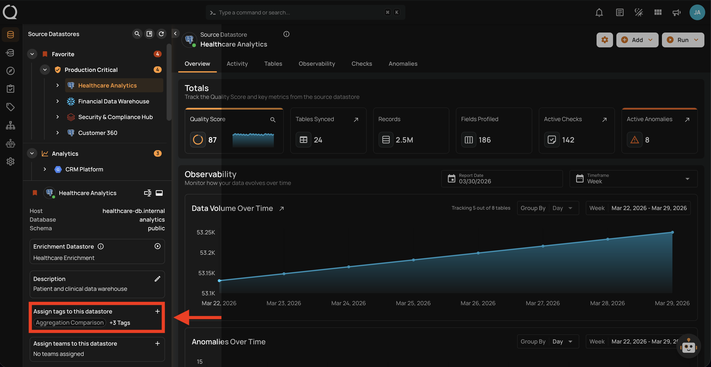
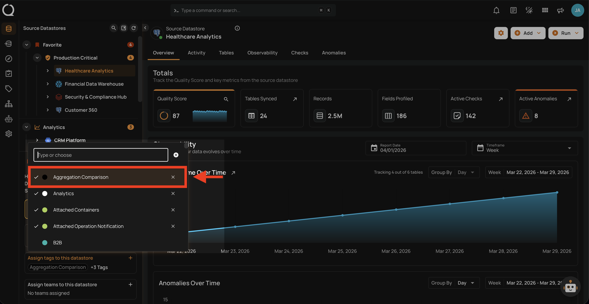
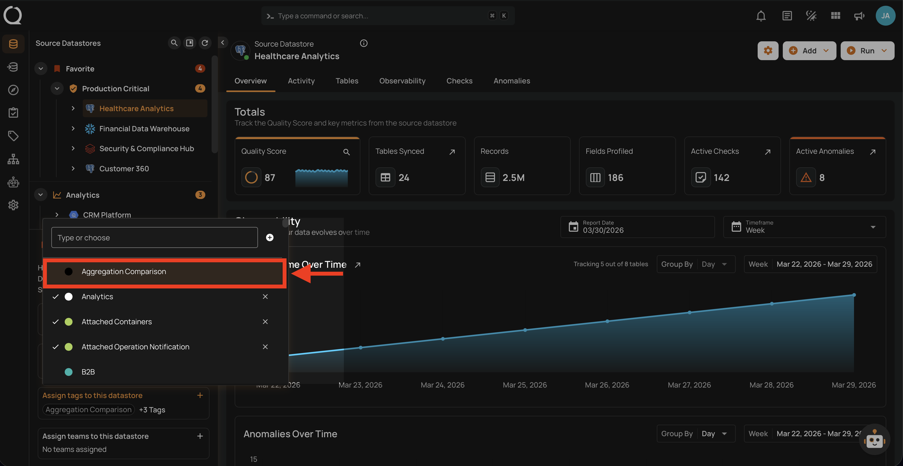

# Unassign a Tag from a Datastore

Removing a tag from a datastore is useful when a datastore no longer belongs to a particular category, compliance scope, or environment. When you unassign a tag, it is automatically removed from all child assets (containers, fields, checks, and anomalies) within the datastore.

!!! note "Permission Required"
    You need the **Editor** role or above in at least one of the datastore's teams to unassign tags. See the [Permissions](permissions.md){:target="_blank"} page for details.

!!! warning "Side Effects"
    When you unassign a tag from a datastore, the tag is **automatically removed** from all containers, fields, checks, and anomalies within the datastore. If the tag has a **weight modifier** configured, quality scores for all containers in the datastore will be **recalculated** to reflect the new weighting.

!!! note
    Unassigning a tag from a datastore does **not** delete the tag itself — it only removes the association. The tag remains available for use on other datastores.

## Steps

**Step 1**: Select a source datastore from the tree view to open its detail page.

**Step 2**: In the datastore details panel below the tree view, locate the **Assign tags to this datastore** section and click the **:material-plus:** button to open the tag selector.

**Step 3**: A menu will appear showing all available tags. Currently assigned tags are marked as selected. Use the search field to filter tags by name, then click on a selected tag to deselect it. The tag is removed immediately — no confirmation is required.

**Step 4**: The tag is instantly removed from the datastore and all related containers, fields, checks, and anomalies are updated.

!!! info "Assign a Tag"
    To learn how to assign a tag to a datastore, see the [Assign a Tag](assign-tags.md){:target="_blank"} documentation.
